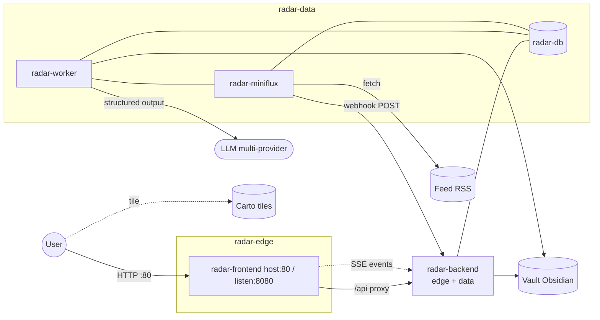

# Radar Informativo Globale

> **Intelligence Dashboard** — Applicazione web self-hosted e containerizzata: aggrega feed RSS (Miniflux), li arricchisce via LLM multi-provider (Gemini SDK e/o OpenAI-compat httpx) con deduplicazione semantica pre-LLM (`pgvector` + SentenceTransformers `all-MiniLM-L6-v2`) e li visualizza su una mappa **MapLibre** 3D-primary (globo; mercator+pitch in contingency).  
> Leaflet resta **dormiente** (LEGACY FREEZE) dietro token `MAP_RENDERER` — non è il default. Host: `radar-map/maplibre/` + `radar-map/leaflet/`.  
> UI: `http://localhost/` (porta **80** → Nginx container **8080**). Miniflux admin **non** è pubblicato di default — usare overlay [`docker-compose.lan.yml`](radar/docker-compose.lan.yml) (`0.0.0.0:8080`) o [`docker-compose.hardened.yml`](radar/docker-compose.hardened.yml) (`127.0.0.1:8080`), oppure `./ops/bootstrap-miniflux.sh`.  
> Dipendenze esterne: feed RSS, API LLM (Gemini / DeepSeek / OpenAI / GLM / Grok), tile Carto / style MapLibre.

[](https://www.python.org/)
[](https://fastapi.tiangolo.com/)
[](https://angular.dev/)
[](https://www.postgresql.org/)
[](https://github.com/pgvector/pgvector)
[](https://www.docker.com/)


---

## Avvio rapido

```bash
cd radar
cp .env.example .env   # lane keys LLM (Profili A–F) + password DB/Miniflux (no `$` nelle password)
# Miniflux admin: crea API key (Settings → API Keys) → MINIFLUX_API_KEY in .env
./ops/bootstrap-miniflux.sh   # compose + lan :8080 + import seed feed (config/)
```

Apri **http://localhost/** (mappa) e **http://localhost:8080** (Miniflux).  
Alternativa senza bootstrap: `docker compose up --build -d` poi `./ops/import-miniflux-feeds.sh` (serve già `MINIFLUX_API_KEY` + overlay lan/hardened).

Knobs LLM / Profili A–F: [`radar/.env.example`](radar/.env.example) + SoT [`sot_llm_multi_model_fallback.md`](plan-audit/complete/sot_llm_multi_model_fallback.md).  
**Profilo F (Local-Hybrid):** Ollama host + overlay [`radar/docker-compose.ollama-host.yml`](radar/docker-compose.ollama-host.yml) — runbook [`radar/docs/runbook.md`](radar/docs/runbook.md) § Local-Hybrid (VRAM: unload a idle via `OLLAMA_*` / `ops/verify-ollama-vram.sh`).  
**Limiti lane:** RPM/TPM pieni → attesa stessa lane; RPD/cooldown → residual cross-lane (es. Flash Lite → DeepSeek). Topbar FinOps: **STATUS** (sinistra, live `/api/metrics/status`) e **COSTI** (destra, giorno `/api/metrics/summary`) — costi per tupla `(modello, reasoning_effort)`. Dettaglio: SoT §0 + skill `radar-quota-ledger` / `radar-api-contract` + [`docs/03_frontend_and_ui.md`](docs/03_frontend_and_ui.md).

**Routing LLM:** `.env.example` ops tipico = **Profilo B** + `LLM_ROUTING_MODE=complexity`. Effort BORDERLINE configurabile via `LLM_BORDERLINE_REASONING_EFFORT` (default safe `high`, target ops `none` con escalate `high` su `ValidationError`). Default codice boot-safe (senza env) = `LLM_ROUTING_MODE=off` + `LLM_ROUTING_SHADOW=true` — non confondere i due. Local-Hybrid = **Profilo F** (SIMPLE Ollama / COMPLEX cloud).

**Miniflux / PC nuovo / backup:** seed in [`radar/config/`](radar/config/); dettaglio §6 [docs/01_getting_started.md](docs/01_getting_started.md) + [radar/ops/README.md](radar/ops/README.md). Backup config-first: `./ops/backup-postgres.sh` (senza vault di default).

Dettagli env e health: [docs/01_getting_started.md](docs/01_getting_started.md).  
Requeue (re-ingest distruttivo): [radar/docs/runbook.md](radar/docs/runbook.md) — preview `… requeue_articles 50 --dry-run`; reale senza `--dry-run`; **prova da zero** `… --purge-all` poi `docker compose restart radar-worker`.  
Volume notizie ≈ feed Miniflux (seed / [RSS.txt](RSS.txt)); pochi feed → poche card in mappa.

La build frontend richiede l’asset GeoJSON `radar/frontend/src/assets/data/countries.geo.json` (gitignored). Provisioning: [`ASSET_LICENSE.md`](radar/frontend/src/assets/data/ASSET_LICENSE.md) + `npm run verify-geojson:fetch` (Docker lo esegue in build).

### Verifica locale (allineata a CI)

SoT: [`.github/workflows/ci.yml`](.github/workflows/ci.yml) (Node 22 / Python 3.12 in CI). Il job `secret-scan` gira solo in CI (best-effort).

```bash
# Backend — da radar/
# PowerShell: $env:PYTHONPATH="backend"
PYTHONPATH=backend python -m pytest -m "not live" -q

# Frontend — da radar/frontend/ (dopo npm ci --legacy-peer-deps)
npm run verify-geojson:fetch && npm run verify-map-renderer && npm run typecheck && npm run test:ci && npm run build:ci
```

---

## Architettura

Cinque servizi Compose su due reti: **`radar-edge`** (browser ↔ Nginx ↔ API) e **`radar-data`** (API + worker + PostgreSQL + Miniflux). L’ingest vive solo in **`radar-worker`**; `main.py` è API-only. Il vault Obsidian è un bind-mount su disco, non un servizio di rete.



LLM (API esterna, non un servizio Compose): `gemini` (`google-genai`) e/o OpenAI-compat httpx (`deepseek`/`openai`/`glm`/`grok`); `claude` = stub. Ops tipico: Profilo B in `.env.example` (`complexity`); Local-Hybrid = Profilo F (Ollama host via `BASE_URL` + overlay `ollama-host`); default codice senza env = `off` / shadow.

| Servizio | Ruolo | Porta host (base) |
|----------|--------|-------------------|
| `radar-frontend` | Nginx + Angular SPA (listen **8080** in container, SSE proxying) | **80** |
| `radar-backend` | FastAPI (API + health + webhook + SSE) | nessuna (raggiungibile via Nginx su edge; anche su `radar-data`) |
| `radar-worker` | Ingest (Miniflux polling + wake trigger + LLM + commit) | nessuna |
| `radar-db` | PostgreSQL 15 (LISTEN/NOTIFY bus) | nessuna |
| `radar-miniflux` | Aggregatore RSS (webhook dispatch on new_entries) | nessuna (usa overlay lan/hardened) |

### Variabili d'ambiente Webhook (Fase B)

| Variabile | Descrizione |
|-----------|-------------|
| `MINIFLUX_WEBHOOK_SECRET` | Secret HMAC-SHA256 per validare le richieste push inviate da Miniflux a `POST /api/webhooks/miniflux`. Se vuoto o non impostato, l'endpoint risponde con `401 Unauthorized` per sicurezza. |

---

## Stack

| Componente | Tag / versione | Fonte |
|---|---|---|
| Python | `3.12-slim` | `radar/backend/Dockerfile` |
| Node (build) | `22` | `radar/frontend/Dockerfile` |
| Angular | `21.2` | `radar/frontend/package.json` |
| MapLibre GL | `5.24.0` (default) | `radar/frontend/package.json` — facade `radar-map/`; host `maplibre/` |
| Leaflet | `1.9.x` (legacy dormiente) | solo se `MAP_RENDERER=leaflet`; host `radar-map/leaflet/` |
| Nginx | `1.27-alpine` | `radar/frontend/Dockerfile` |
| PostgreSQL | `15` | `radar/docker-compose.yml` |
| Miniflux | `2.3.2` | `radar/docker-compose.yml` |

Build FE Docker: `npm ci --legacy-peer-deps` (peer matrix Angular/PrimeNG).

---

## Documentazione

### Manuali operatori (`docs/`)

| # | Documento | Contenuto |
|---|-----------|-----------|
| 01 | [docs/01_getting_started.md](docs/01_getting_started.md) | Installazione, `.env`, Docker, health, Miniflux feed/backup |
| 02 | [docs/02_architecture_and_backend.md](docs/02_architecture_and_backend.md) | Worker, migrazioni, API, quote, outbox |
| 03 | [docs/03_frontend_and_ui.md](docs/03_frontend_and_ui.md) | Mappa MapLibre (hatching isole/anti-bleed, pin, spiderfy), map-summary, archi relazioni (hover/click bilaterale), `MOCK_MODE`, stato UI |
| 04 | [docs/04_ecc_framework.md](docs/04_ecc_framework.md) | Harness ECC: `.agents` + `.ecc` + wiring Cursor |

**Percorso per ruolo (non è una sequenza unica 01→04):** day-1 ops → `docs/01` + [ops](radar/ops/README.md) + [runbook](radar/docs/runbook.md); backend/API → `docs/02`; FE prodotto → `docs/03` + [frontend README](radar/frontend/README.md); agenti Cursor → `docs/04` + AGENTS/CLAUDE.

### Ops e frontend

| Documento | Contenuto |
|-----------|-----------|
| [radar/ops/README.md](radar/ops/README.md) | Live/ready, overlay Miniflux, backup/restore |
| [radar/docs/runbook.md](radar/docs/runbook.md) | Runbook ops / incident |
| [radar/frontend/README.md](radar/frontend/README.md) | Dev/test/build frontend |
| [RSS.txt](RSS.txt) | Feed RSS suggeriti |
| [LICENSE](LICENSE) | Licenza del repository |

### Piani (plan-audit)

| Documento | Ruolo |
|-----------|--------|
| [STATUS.md](plan-audit/STATUS.md) | **Quadro** fatto vs residui post-gate |
| [plan_release_final_gate.md](plan-audit/complete/plan_release_final_gate.md) | Piano Final Release (**F1–F4 PASS**; PR + Fase 5 deferred — **≠** Phase 6 GATE) |
| [sot_llm_multi_model_fallback.md](plan-audit/complete/sot_llm_multi_model_fallback.md) | SoT LLM multi-provider + Profili A–F |
| [complete/](plan-audit/complete/) | Phase 0–6, Fase B/H, archi UI, W1 filtri, hatching isole/anti-bleed, playbook, ticket status, checklist docs (**chiusi**) |
| [remediation/](plan-audit/remediation/) | Report ticket + Final Release F1–F4 |

### Governance agenti (ECC)

| Documento / path | Ruolo |
|------------------|--------|
| [.agents/AGENTS.md](.agents/AGENTS.md) | Guardrail globali (Magna Carta) |
| [.agents/skills/](.agents/skills/) | **SoT** playbook Cursor (incl. `radar-*`) |
| [radar/.ecc/CLAUDE.md](radar/.ecc/CLAUDE.md) | Entry-point locale + skill map |
| [radar/.ecc/rules/](radar/.ecc/rules/) | Rules path-scoped (SoT testo) |
| [radar/.ecc/hooks/](radar/.ecc/hooks/) | Logica security/lint (pre/post) |
| [radar/.ecc/agents/](radar/.ecc/agents/) | Profili Task (prompt manuale) |
| [radar/.ecc/skills/](radar/.ecc/skills/) | Mirror flat delle skill |
| [.cursor/hooks.json](.cursor/hooks.json) | Auto-wiring Cursor → adapters → `.ecc/hooks` |
| [.cursor/rules/](.cursor/rules/) | Globs nativi → puntano a `.ecc/rules` |
| [.cursor/commands/](.cursor/commands/) | Shortcut verify / smoke / lint |

Panoramica: [docs/04_ecc_framework.md](docs/04_ecc_framework.md).  
Manuale descrittivo: [`ecc_deep_dive_analysis_v2.md`](ecc_deep_dive_analysis_v2.md).  
Handoff expansion (eseguito): [`handoff_ecc_expansion.md`](plan-audit/archive/ecc/handoff_ecc_expansion.md).

### Archivio storico (non eseguire)

Non sono checklist di implementazione: [`plan_ecc_early_root.md`](plan-audit/archive/plans/plan_ecc_early_root.md), [`plan_backend_ecc.md`](plan-audit/archive/plans/plan_backend_ecc.md), [`plan_frontend_ecc.md`](plan-audit/archive/plans/plan_frontend_ecc.md).  
`Fase2_Implementation_Plan.md` e `ecc_deep_dive_analysis.md` (V1) **non** sono in questo monorepo — usare solo [`ecc_deep_dive_analysis_v2.md`](ecc_deep_dive_analysis_v2.md) come manuale descrittivo (può essere stale su skill map).  
In Execution, la sezione **A (pre-restore)** è solo storico — usare **§ B/C**.

---

## Piani e restore points

Restore SHA sotto (Phase 0–6). Il branch di lavoro corrente può differire — verificare con `git branch --show-current`.

| Tag | Commit | Contenuto |
|-----|--------|-----------|
| Phase 0 | `0189359` | pytest markers / frontend CI baseline |
| Phase 1 | `bff8abe` | migrations 001–002, outbox, Pydantic strict, vault atomico |
| Phase 2 | `72851d7` | `radar-worker`, coda bounded, `llm_request_ledger` |
| Phase 3 | `19c67f0` | edge/data, live/ready, CSP, ops (+ schema sanitize Gemini) |
| Phase 4 | `de9bd2f` | `MOCK_MODE`, XSS-safe markers, read-unread senza rebuild cluster |
| Phase 5 | `1dfdf60` | map-summary + articles cursor; nation markers; spiderfy categoria |
| Phase 6 | `56c2eff` | GATE VERDE: docs, GeoJSON fetch+verify, CI, runbook, hooks |
| Phase B | `885628f` | Real-time webhook + SSE soft-refresh (GATE VERDE) |
| Fase H | `d9508a5` | Grafo geospaziale: `related_countries`, `/api/map-relations`, archi + chip |
| Archi UI | `5c74e57` (`feature/upgrades`) | Multicolore &lt;5, tratteggio geometrico ≥5, `relationsPane`, click → sidebar bilaterale — **restore point** Leaflet-era |
| Archi MapLibre solidi | `0d942ed` (`feature/upgrades`) | Macro multicolore solida a **tutti** gli zoom (path MapLibre) |
| Relazioni Wave 1 (filtro nazioni) | `ec771b1` (`feature/upgrades`) | Toolbar **RELAZIONI ATTIVE** → `visibleMapRelations` (OR stella, default OFF); paint invariato — piano [`plan_impl_map_relations_nation_filter.md`](plan-audit/complete/plan_impl_map_relations_nation_filter.md) — **restore point** |
| Hatching isole + anti-bleed MapLibre | `32203c9` (`feature/upgrades`) | `extractPaintPolygons` + `polygon-clipping` terra∩strip; isole ≥0.5% largest; US/RU mainland — piano [`plan_impl_map_category_fills_islands.md`](plan-audit/complete/plan_impl_map_category_fills_islands.md) — **restore point** |
| Fase C — dedup semantica (`pgvector`) | `f1e1de0` (`feature/upgrades`) | Migrazione `012`, embedder CPU MiniLM, soglia sim **0.80**, `quality:compare` COMPLEX, replace in-place — piano [`plan_impl_fase_C_semantic_dedup.md`](plan-audit/complete/plan_impl_fase_C_semantic_dedup.md) — **restore point** |

Esempio restore tip archi UI Leaflet-era: `git checkout 5c74e57` (branch `feature/upgrades`).  
Esempio restore pre-filtro-nazioni (archi sempre tutti visibili): `git checkout 0d942ed`.  
Esempio restore W1 filtri: `git checkout ec771b1` — dettaglio: [plan_impl_map_relations_nation_filter.md](plan-audit/complete/plan_impl_map_relations_nation_filter.md) + [STATUS.md](plan-audit/STATUS.md).  
Esempio restore hatching isole/anti-bleed: `git checkout 32203c9` — [plan_impl_map_category_fills_islands.md](plan-audit/complete/plan_impl_map_category_fills_islands.md).

Esempio Phase 6: `git checkout 56c2eff`. Dettaglio gate Phase 0–6: [plan_impl_phase_0_6_execution.md](plan-audit/complete/plan_impl_phase_0_6_execution.md).

---

## Mappa piani → codice

| Tema | Path |
|------|------|
| Worker ingest / quota | `radar/backend/app/worker.py`, `radar/backend/app/classification/quota.py` |
| LLM lanes / dialect | `radar/backend/app/core/llm_lanes.py` |
| Complexity v2.2 | `radar/backend/app/classification/complexity.py` |
| Cooldown modelli | `radar/backend/app/classification/cooldown.py` |
| Requeue ops | `radar/backend/app/scripts/requeue_articles.py` |
| API FastAPI (no ingest) | `radar/backend/app/main.py` |
| Migrazioni / outbox | `radar/backend/migrations/` (001–011), `radar/backend/app/core/migrations.py`, `radar/backend/app/commit/outbox.py` |
| Query articles / map-summary / map-relations / saved | `radar/backend/app/api/articles_query.py` |
| Compose + overlay | `radar/docker-compose.yml`, `radar/docker-compose.hardened.yml`, `radar/docker-compose.lan.yml` |
| Ops backup/restore | `radar/ops/` |
| Runbook | `radar/docs/runbook.md` |
| Mappa / state / read-unread / archi / hatching | `radar/frontend/src/app/components/radar-map/` (facade + `maplibre/` / `leaflet/`), `maplibre/country-category-fills.ts` (`polygon-clipping`), `map-renderer.token.ts` (`MAP_RENDERER`), `state.service.ts` (`loadRelationArticles`, `visibleMapRelations`), `radar-toolbar` (**RELAZIONI ATTIVE**) |
| `MOCK_MODE` | `radar/frontend/src/app/services/mock-mode.token.ts` |
| GeoJSON pin / verify | `radar/frontend/src/assets/data/ASSET_LICENSE.md`, `radar/frontend/scripts/verify-geojson.mjs` |
| Sidebar (**frozen**) | `radar/frontend/src/app/components/radar-sidebar/` |
| ECC (SoT + wiring) | `.agents/`, `radar/.ecc/`, `.cursor/hooks.json`, `.cursor/rules/`, `.cursor/commands/` |
| Env template | `radar/.env.example` |
| CI | `.github/workflows/ci.yml` (FE+BE+secret-scan best-effort) |

---

## Contratto API (sintesi)

| Metodo | Path | Note |
|--------|------|------|
| GET | `/health/live` | Liveness API (Compose healthcheck backend; in-container `:8000`) |
| GET | `/health/ready` | Pool + migrazioni + heartbeat worker (ops; può 503 al boot; in-container `:8000`) |
| GET | `/health` (API `:8000`) | Alias di live sull’API |
| GET | `/health` (host `:80`) | Healthcheck **Nginx FE** — risposta statica `ok`; **non** è l’API |
| GET | `/api/articles` | Envelope `{items,next_cursor,total}` — `date` obbligatorio salvo `saved=true` (cross-day), `limit` ≤ 100 |
| GET | `/api/map-summary` | Righe `country_code × primary_category` + count/lat/lon (day) |
| GET | `/api/map-relations` | Righe undirected `source_country ↔ target_country` per categoria + volume + `article_ids`. FE: archi MapLibre (great-circle macro multicolore solida; hover evidenzia tutte le linee collegate alla medesima notizia multi-paese; legacy Leaflet `relationsPane` dash+fan su latch pin); **filtro nazioni toolbar RELAZIONI ATTIVE** → solo `visibleMapRelations` (default 0 archi); click → carosello bilaterale |
| GET | `/api/saved-summary` | Stessa shape; solo `is_saved`; **senza date** |
| GET | `/api/countries` | Rollup paese (compat) |
| PATCH | `/api/articles/{id}/read_status` | Body `{is_read}`; unread ⇒ `is_saved=false` |
| PATCH | `/api/articles/{id}/saved_status` | Body `{is_saved}`; save ⇒ `is_read=true` |

Dettaglio: [docs/02_architecture_and_backend.md](docs/02_architecture_and_backend.md).

---

## Struttura repository

```text
Dashboard finance/
├── docs/                              # Manuali operatori 01–04
├── plan-audit/                        # vedi plan-audit/STATUS.md (fatto vs da fare)
│   ├── STATUS.md
│   ├── active/                        # Wave 2 elevate, Phase I map, §3.J, …
│   ├── complete/                      # Phase 0–6, W1 filtri Relazioni, B/H, Fase A, …
│   ├── remediation/ + prompts/
│   └── archive/
├── ecc_deep_dive_analysis_v2.md       # Manuale ECC (descrizione; skill map può essere stale → SoT LLM)
├── RSS.txt
├── LICENSE
├── .github/workflows/ci.yml
├── .agents/                           # AGENTS.md + skills SoT (incl. radar-*)
├── .cursor/                           # hooks.json + adapters, rules/*.mdc, commands
└── radar/
    ├── docker-compose.yml             # 5 servizi, edge + data
    ├── docker-compose.hardened.yml
    ├── docker-compose.lan.yml
    ├── .env.example
    ├── ops/                           # backup/restore + README ops
    ├── docs/runbook.md
    ├── backend/
    │   ├── migrations/                # 001–016
    │   └── app/
    │       ├── main.py                # API-only
    │       ├── worker.py              # ingest
    │       ├── api/                   # articles_query (Phase 5+)
    │       ├── core/                  # incl. llm_lanes.py, heartbeat
    │       ├── extraction/ classification/ commit/
    │       ├── scripts/               # requeue_articles.py
    │       └── tests/
    ├── frontend/
    │   ├── nginx.conf                 # listen 8080, resolver DNS, CSP
    │   ├── scripts/verify-geojson.mjs
    │   ├── src/app/components/        # radar-map (facade + maplibre/ + leaflet/), toolbar, radar-sidebar (frozen)
    │   ├── src/app/services/          # StateService, ArticleService, MOCK_MODE
    │   └── src/assets/data/           # GeoJSON locale + ASSET_LICENSE.md
    ├── vault/                         # Markdown generati (gitignored)
    └── .ecc/                          # CLAUDE, settings, rules, agents, hooks, skills mirror
```
