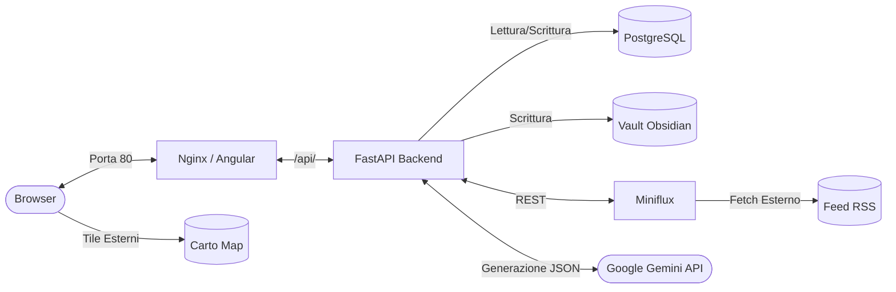

# Radar Informativo Globale

> **Intelligence Dashboard** — Un'applicazione web self-hosted e containerizzata per l'aggregazione di feed RSS e il loro arricchimento semantico via LLM. Il sistema espone localmente il frontend sulla porta `80` e l'interfaccia Miniflux sulla porta `8080`. Sebbene l'infrastruttura sia eseguita in locale tramite Docker, il funzionamento richiede l'accesso a servizi esterni: fonti RSS, Google Gemini API per il reasoning e Carto per il rendering delle tile geografiche.

[](https://www.python.org/)
[](https://fastapi.tiangolo.com/)
[](https://angular.dev/)
[](https://www.postgresql.org/)
[](https://www.docker.com/)

---

## ⚡ Zero-Config & 100% Plug and Play
Questo progetto è stato ingegnerizzato per essere **completamente indipendente** dall'host. Grazie a un'avanzata architettura Docker Multi-Stage, l'utente finale necessita **esclusivamente di Docker** installato. Nessun requisito per Node.js, Python o database locali. Basta un solo comando (`docker compose up --build -d`) e il sistema si auto-assembla, installando le dipendenze, pre-compilando il frontend Angular e servendolo tramite Nginx.

---

## 🏗️ Architettura a Colpo d'Occhio



---

## 🛠️ Stack Tecnologico

| Componente | Versione / Tag | Fonte di Verità |
|---|---|---|
| **Python** | `3.12-slim` | `radar/backend/Dockerfile` |
| **Node (Build)** | `22` | `radar/frontend/Dockerfile` |
| **Angular** | `21.2` | `radar/frontend/package.json` |
| **Nginx** | `1.27-alpine` | `radar/frontend/Dockerfile` |
| **PostgreSQL** | `15` | `docker-compose.yml` |
| **Miniflux** | `2.3.2` | `docker-compose.yml` |

*Nota: Le versioni dell'ambiente Node utilizzano ora `npm ci` garantendo build immutabili bit-a-bit basate sul package-lock.*

---

## 📚 Documentazione del Progetto

La documentazione è stata suddivisa per aree tematiche. 
* 🚀 **[Guida all'Avvio (Getting Started)](docs/01_getting_started.md)** 
* ⚙️ **[Architettura e Backend](docs/02_architecture_and_backend.md)**
* 🎨 **[Frontend e UI (Interfaccia)](docs/03_frontend_and_ui.md)**
* 🧠 **[Il Framework ECC (Everything Claude Code)](docs/04_ecc_framework.md)**
* 📰 **[Fonti RSS Suggerite](RSS.txt)**: Lista dei feed testati per l'importazione.

---

## 🗂️ Struttura delle Directory

```text
Dashboard finance/                           
├── docs/                                    # Manuali architetturali e di setup
│   ├── 01_getting_started.md
│   ├── 02_architecture_and_backend.md
│   ├── 03_frontend_and_ui.md
│   └── 04_ecc_framework.md
├── RSS.txt                                  # Catalogo feed RSS consigliati
├── .agents/                                 # ECC Global Guardrails
│   ├── AGENTS.md                            # Magna Carta del progetto
│   └── skills/                              # Competenze globali
├── README.md                                # ← Questo file
│
└── radar/                                   # Repository Monorepo
    ├── backend/                             
    │   ├── app/
    │   │   ├── core/                        # Configurazione, DB, Logging
    │   │   ├── extraction/                  # Miniflux client, Parser
    │   │   ├── classification/              # Gemini client, Prompts
    │   │   └── commit/                      # DB Commit, Vault Factory
    │   └── Dockerfile
    ├── frontend/                            
    │   ├── src/app/
    │   │   ├── components/                  # RadarMap, Sidebar, Toolbar
    │   │   ├── services/                    # StateService, ArticleService
    │   │   ├── models/                      # Interfacce TypeScript
    │   │   └── shared/                      # Direttive (es. hatching)
    │   ├── angular.json                     # Configurazione build Angular
    │   └── Dockerfile
    ├── vault/                               # Dati Markdown generati (ignorato da Git)
    ├── .ecc/                                # ECC Local Workspace
    │   ├── rules/                           # Regole frontend/backend/docker
    │   ├── hooks/                           # Script pre/post esecuzione
    │   └── skills/
    └── docker-compose.yml                   # Topologia dei 4 container
```
