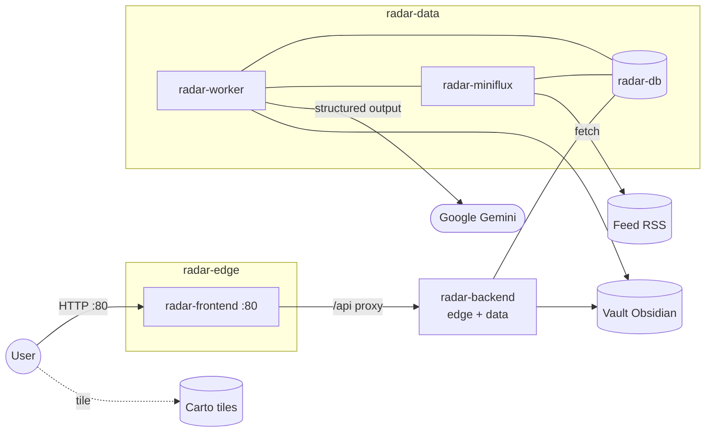

# Radar Informativo Globale

> **Intelligence Dashboard** — Applicazione web self-hosted e containerizzata: aggrega feed RSS (Miniflux), li arricchisce via Google Gemini e li visualizza su una mappa Leaflet.  
> UI: `http://localhost/` (porta **80**). Miniflux admin **non** è pubblicato di default (overlay hardened/lan).  
> Dipendenze esterne: feed RSS, Gemini API, tile Carto.

[](https://www.python.org/)
[](https://fastapi.tiangolo.com/)
[](https://angular.dev/)
[](https://www.postgresql.org/)
[](https://www.docker.com/)

**Stato piani (2026-07-15):** Phase **0–5 DONE**. Phase **6 DONE / GATE VERDE**.  
**ECC expansion wiring DONE** (hooks/rules Cursor + skill dominio Radar) — working tree da commit su richiesta.  
Sorgente di verità avanzamento: [`Implementation_Plan.md`](Implementation_Plan.md) + [`Implementation_Plan_Execution.md`](Implementation_Plan_Execution.md).  
**Sidebar freeze:** non modificare `radar/frontend/src/app/components/radar-sidebar/`.

---

## Avvio rapido

```bash
cd radar
cp .env.example .env   # GEMINI_API_KEY, password DB/Miniflux (no `$` nelle password)
docker compose up --build -d
```

Apri **http://localhost/**. Dettagli env, health e Miniflux: [docs/01_getting_started.md](docs/01_getting_started.md) e [radar/ops/README.md](radar/ops/README.md).

La build frontend richiede l’asset GeoJSON `radar/frontend/src/assets/data/countries.geo.json` (gitignored). Provisioning: [`ASSET_LICENSE.md`](radar/frontend/src/assets/data/ASSET_LICENSE.md) + `npm run verify-geojson:fetch` (Docker lo esegue in build).

### Verifica locale (allineata a CI)

SoT: [`.github/workflows/ci.yml`](.github/workflows/ci.yml) (Node 22 / Python 3.12 in CI). Il job `secret-scan` gira solo in CI (best-effort).

```bash
# Backend — da radar/
# PowerShell: $env:PYTHONPATH="backend"
PYTHONPATH=backend python -m pytest -m "not live" -q

# Frontend — da radar/frontend/ (dopo npm ci --legacy-peer-deps)
npm run verify-geojson:fetch && npm run typecheck && npm run test:ci && npm run build:ci
```

---

## Architettura

Cinque servizi Compose su due reti: **`radar-edge`** (browser ↔ Nginx ↔ API) e **`radar-data`** (API + worker + PostgreSQL + Miniflux). L’ingest vive solo in **`radar-worker`**; `main.py` è API-only. Il vault Obsidian è un bind-mount su disco, non un servizio di rete.



| Servizio | Ruolo | Porta host (base) |
|----------|--------|-------------------|
| `radar-frontend` | Nginx + SPA Angular | **80** |
| `radar-backend` | FastAPI (API + health) | nessuna (raggiungibile via Nginx su edge; anche su `radar-data`) |
| `radar-worker` | Polling Miniflux + LLM + commit/outbox | nessuna |
| `radar-db` | PostgreSQL 15 | nessuna |
| `radar-miniflux` | Aggregatore RSS | nessuna (usa overlay lan/hardened) |

---

## Stack

| Componente | Tag / versione | Fonte |
|---|---|---|
| Python | `3.12-slim` | `radar/backend/Dockerfile` |
| Node (build) | `22` | `radar/frontend/Dockerfile` |
| Angular | `21.2` | `radar/frontend/package.json` |
| Nginx | `1.27-alpine` | `radar/frontend/Dockerfile` |
| PostgreSQL | `15` | `radar/docker-compose.yml` |
| Miniflux | `2.3.2` | `radar/docker-compose.yml` |

Build FE Docker: `npm ci --legacy-peer-deps` (peer matrix Angular/PrimeNG).

---

## Documentazione

### Manuali operatori (`docs/`)

| # | Documento | Contenuto |
|---|-----------|-----------|
| 01 | [docs/01_getting_started.md](docs/01_getting_started.md) | Installazione, `.env`, Docker, health, Miniflux |
| 02 | [docs/02_architecture_and_backend.md](docs/02_architecture_and_backend.md) | Worker, migrazioni, API, quote, outbox |
| 03 | [docs/03_frontend_and_ui.md](docs/03_frontend_and_ui.md) | Mappa, map-summary, `MOCK_MODE`, stato UI |
| 04 | [docs/04_ecc_framework.md](docs/04_ecc_framework.md) | Harness ECC: `.agents` + `.ecc` + wiring Cursor |

### Ops e frontend

| Documento | Contenuto |
|-----------|-----------|
| [radar/ops/README.md](radar/ops/README.md) | Live/ready, overlay Miniflux, backup/restore |
| [radar/docs/runbook.md](radar/docs/runbook.md) | Runbook ops / incident |
| [radar/frontend/README.md](radar/frontend/README.md) | Dev/test/build frontend |
| [RSS.txt](RSS.txt) | Feed RSS suggeriti |
| [LICENSE](LICENSE) | Licenza del repository |

### Piani attivi (enterprise consolidation)

| Documento | Ruolo |
|-----------|--------|
| [Implementation_Plan.md](Implementation_Plan.md) | Piano master Phase 0–6 + restore SHA |
| [Implementation_Plan_Execution.md](Implementation_Plan_Execution.md) | Scoreboard post-restore (avanzamento reale) |

### Governance agenti (ECC)

| Documento / path | Ruolo |
|------------------|--------|
| [.agents/AGENTS.md](.agents/AGENTS.md) | Guardrail globali (Magna Carta) |
| [.agents/skills/](.agents/skills/) | **SoT** playbook Cursor (incl. `radar-*`) |
| [radar/.ecc/CLAUDE.md](radar/.ecc/CLAUDE.md) | Entry-point locale + skill map |
| [radar/.ecc/rules/](radar/.ecc/rules/) | Rules path-scoped (SoT testo) |
| [radar/.ecc/hooks/](radar/.ecc/hooks/) | Logica security/lint (pre/post) |
| [radar/.ecc/agents/](radar/.ecc/agents/) | Profili Task (prompt manuale) |
| [radar/.ecc/skills/](radar/.ecc/skills/) | Mirror flat delle skill |
| [.cursor/hooks.json](.cursor/hooks.json) | Auto-wiring Cursor → adapters → `.ecc/hooks` |
| [.cursor/rules/](.cursor/rules/) | Globs nativi → puntano a `.ecc/rules` |
| [.cursor/commands/](.cursor/commands/) | Shortcut verify / smoke / lint |

Panoramica: [docs/04_ecc_framework.md](docs/04_ecc_framework.md).  
Manuale descrittivo: [`ecc_deep_dive_analysis_v2.md`](ecc_deep_dive_analysis_v2.md).  
Handoff expansion (eseguito): [`ECC_Expansion_Handoff.md`](ECC_Expansion_Handoff.md).

### Archivio storico (non eseguire)

Non sono checklist di implementazione: [`Fase2_Implementation_Plan.md`](Fase2_Implementation_Plan.md), [`plan.md`](plan.md), [`plan_backend_ecc.md`](plan_backend_ecc.md), [`plan_frontend_ecc.md`](plan_frontend_ecc.md), [`ecc_deep_dive_analysis.md`](ecc_deep_dive_analysis.md) (V1 archivio).  
In Execution, la sezione **A (pre-restore)** è solo storico — usare **§ B/C**.

---

## Piani e restore points

Branch: `refactor/enterprise-consolidation`

| Tag | Commit | Contenuto |
|-----|--------|-----------|
| Phase 0 | `0189359` | pytest markers / frontend CI baseline |
| Phase 1 | `bff8abe` | migrations 001–002, outbox, Pydantic strict, vault atomico |
| Phase 2 | `72851d7` | `radar-worker`, coda bounded, `llm_request_ledger` |
| Phase 3 | `19c67f0` | edge/data, live/ready, CSP, ops (+ schema sanitize Gemini) |
| Phase 4 | `de9bd2f` | `MOCK_MODE`, XSS-safe markers, read-unread senza rebuild cluster |
| Phase 5 | `1dfdf60` | map-summary + articles cursor; nation markers; spiderfy categoria |
| Phase 6 | `56c2eff` | GATE VERDE: docs, GeoJSON fetch+verify, CI, runbook, hooks |

Esempio: `git checkout 56c2eff` (tip Phase 6 / GATE VERDE; tip successivo = ECC remediation). Dettaglio gate: [Implementation_Plan_Execution.md](Implementation_Plan_Execution.md).

---

## Mappa piani → codice

| Tema | Path |
|------|------|
| Worker ingest / quota | `radar/backend/app/worker.py`, `radar/backend/app/classification/quota.py` |
| API FastAPI (no ingest) | `radar/backend/app/main.py` |
| Migrazioni / outbox | `radar/backend/migrations/`, `radar/backend/app/core/migrations.py`, `radar/backend/app/commit/outbox.py` |
| Query articles / map-summary | `radar/backend/app/api/articles_query.py` |
| Compose + overlay | `radar/docker-compose.yml`, `radar/docker-compose.hardened.yml`, `radar/docker-compose.lan.yml` |
| Ops backup/restore | `radar/ops/` |
| Runbook | `radar/docs/runbook.md` |
| Mappa / state / read-unread | `radar/frontend/src/app/components/radar-map/`, `radar/frontend/src/app/services/state.service.ts` |
| `MOCK_MODE` | `radar/frontend/src/app/services/mock-mode.token.ts` |
| GeoJSON pin / verify | `radar/frontend/src/assets/data/ASSET_LICENSE.md`, `radar/frontend/scripts/verify-geojson.mjs` |
| Sidebar (**frozen**) | `radar/frontend/src/app/components/radar-sidebar/` |
| ECC (SoT + wiring) | `.agents/`, `radar/.ecc/`, `.cursor/hooks.json`, `.cursor/rules/`, `.cursor/commands/` |
| Env template | `radar/.env.example` |
| CI | `.github/workflows/ci.yml` |

---

## Contratto API (sintesi)

| Metodo | Path | Note |
|--------|------|------|
| GET | `/health/live` | Liveness (Compose healthcheck) |
| GET | `/health/ready` | Pool + migrazioni + heartbeat worker (ops; può 503 al boot) |
| GET | `/health` | Alias di live (API); anche healthcheck Nginx FE su `:80` |
| GET | `/api/articles` | Envelope `{items,next_cursor,total}` — `date` obbligatorio, `limit` ≤ 100 |
| GET | `/api/map-summary` | Righe `country_code × primary_category` + count/lat/lon |
| GET | `/api/countries` | Rollup paese (compat) |
| PATCH | `/api/articles/{id}/read_status` | Body `{is_read}`; risposta `{status,is_read}` |

Dettaglio: [docs/02_architecture_and_backend.md](docs/02_architecture_and_backend.md).

---

## Struttura repository

```text
Dashboard finance/
├── docs/                              # Manuali operatori 01–04
├── Implementation_Plan.md             # Piano master Phase 0–6
├── Implementation_Plan_Execution.md
├── ecc_deep_dive_analysis_v2.md       # Manuale ECC (descrizione)
├── ECC_Expansion_Handoff.md           # Handoff wiring/skills (eseguito)
├── RSS.txt
├── LICENSE
├── .github/workflows/ci.yml
├── .agents/                           # AGENTS.md + skills SoT (incl. radar-*)
├── .cursor/                           # hooks.json + adapters, rules/*.mdc, commands
└── radar/
    ├── docker-compose.yml             # 5 servizi, edge + data
    ├── docker-compose.hardened.yml
    ├── docker-compose.lan.yml
    ├── .env.example
    ├── ops/                           # backup/restore + README ops
    ├── docs/runbook.md
    ├── backend/
    │   ├── migrations/                # 001–007
    │   └── app/
    │       ├── main.py                # API-only
    │       ├── worker.py              # ingest
    │       ├── api/                   # articles_query (Phase 5)
    │       ├── core/ extraction/ classification/ commit/
    │       └── tests/
    ├── frontend/
    │   ├── scripts/verify-geojson.mjs
    │   ├── src/app/components/        # radar-map, toolbar, radar-sidebar (frozen)
    │   ├── src/app/services/          # StateService, ArticleService, MOCK_MODE
    │   └── src/assets/data/           # GeoJSON locale + ASSET_LICENSE.md
    ├── vault/                         # Markdown generati (gitignored)
    └── .ecc/                          # CLAUDE, settings, rules, agents, hooks, skills mirror
```
