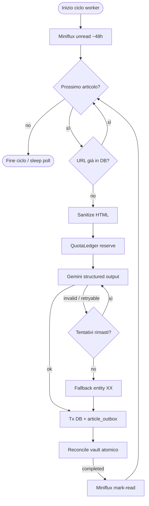

# Architettura e backend

Stack post Phase 0–5 (governance Phase 6). Piano master: [`Implementation_Plan.md`](../Implementation_Plan.md). Codice: `radar/backend/`.

---

## Separazione API / worker

| Processo | Entry | Ruolo |
|----------|-------|--------|
| API | `python -m uvicorn` / `main.py` | FastAPI: pool, migrazioni, REST, health |
| Ingest | `python -m app.worker` (`radar-worker`) | Polling Miniflux, coda bounded, Gemini, commit/outbox, heartbeat |

Non avviare due worker leader: advisory lock session-level. L’API non esegue ingest nel lifespan.

Moduli sotto `radar/backend/app/`:

1. **`core/`** — config bounded, pool asyncpg, `migrations.py`, logging, heartbeat
2. **`extraction/`** — client Miniflux (httpx, byte limits, retry), parser HTML, dedup
3. **`classification/`** — client Gemini (`google-genai`), `quota.py`, prompts (no CoT), validator Pydantic strict
4. **`commit/`** — commit atomico, outbox, vault `yaml.safe_dump` + write atomica
5. **`api/`** — query helpers Phase 5 (`articles_query.py`)

---

## Classification (Gemini)

- Schema: `GeopoliticalArticleSchema` — `ConfigDict(strict=True, extra="forbid")`
- Campi multi-valore **`str` CSV** (`companies_involved`, `tags`, `infrastructural_entities`) — non `List[str]`
- Nessun campo `reasoning` / Chain-of-Thought
- `build_gemini_response_schema()` sanitizza lo schema per l’API Google
- 10 categorie: Nucleare, Energia, Infrastrutture, Geopolitica, Economia, Tecnologia, Spazio, Ambiente, Salute, Sicurezza
- Fallback geografico su fallimento irreversibile: paese `XX`, categoria `Infrastrutture` (vedi `validator.py`)
- Quote: `llm_request_ledger` via `QuotaLedger` (RPM/TPM/RPD) — **non** `COUNT(*)` su `articles` per RPD

---

## Persistenza e migrazioni

Schema applicato da `core/migrations.py` + SQL ordinati in `radar/backend/migrations/`:

| File | Ruolo |
|------|--------|
| `001_initial.sql` | Tabelle base articles/companies/tags |
| `002_pipeline_outbox_and_quotas.sql` | outbox (+ quote legacy shape) |
| `003_quota_ledger.sql` | `llm_request_ledger` |
| `004_worker_heartbeat.sql` | heartbeat readiness |
| `005_quota_ledger_align.sql` | allineamento ledger |
| `006_quota_ledger_legacy_nulls.sql` | null legacy ledger |
| `007_articles_query_indexes.sql` | indici query Phase 5 |

Commit: transazione DB + riga outbox → reconcile vault → mark-read Miniflux **solo** se outbox `completed`.

---

## Health

| Path | Semantica |
|------|-----------|
| `/health/live` | Processo su — healthcheck Compose |
| `/health` | Alias live |
| `/health/ready` | Pool + migrazione heartbeat + freshness leader; 503 non deve restartare l’API |

---

## API REST

CORS: middleware solo se `CORS_ALLOW_ORIGINS` non vuoto; metodi `GET`, `PATCH`, `OPTIONS`. Dietro Nginx same-origin: **lasciare vuoto**. Nessuna auth applicativa.

| Metodo | Endpoint | Parametri | Risposta |
|--------|----------|-----------|----------|
| GET | `/api/articles` | `date` (obbl.), `country`, `category`, `sentiment`, `relevance_level`, `cursor`, `limit` ≤ 100 | `{ items, next_cursor, total }` |
| GET | `/api/map-summary` | `date`, `sentiment?`, `relevance_level?` | Array `country_code × primary_category` + count/read + lat/lon finite |
| GET | `/api/countries` | `date`, filtri opzionali | Rollup paese (`categories`, `article_count`) |
| PATCH | `/api/articles/{id}/read_status` | `{ "is_read": bool }` | `{ "status": "success", "is_read": bool }` |

Companies/tags sugli articoli: join **LATERAL** (no Cartesian `array_agg` classico). UI giorno: preferire **map-summary**; lista piena solo in nation-open (FE pagina fino a `next_cursor` null).

---

## Reti Compose

Vedi `radar/docker-compose.yml`:

- **`radar-edge`**: frontend ↔ backend
- **`radar-data`**: backend, worker, db, miniflux (frontend mai qui)

Ops/backup: [`radar/ops/README.md`](../radar/ops/README.md). Runbook: [`radar/docs/runbook.md`](../radar/docs/runbook.md).
