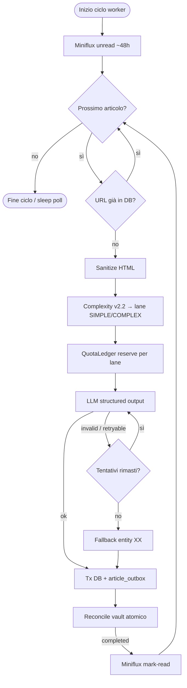

# Architettura e backend

Stack Phase **0–6 DONE / GATE VERDE**. Piano master: [`plan_impl_phase_0_6.md`](../plan-audit/complete/plan_impl_phase_0_6.md). Scoreboard: [`plan_impl_phase_0_6_execution.md`](../plan-audit/complete/plan_impl_phase_0_6_execution.md). SoT LLM: [`sot_llm_multi_model_fallback.md`](../plan-audit/complete/sot_llm_multi_model_fallback.md). Codice: `radar/backend/`.

---

## Separazione API / worker

| Processo | Entry | Ruolo |
|----------|-------|--------|
| API | `python -m uvicorn` / `main.py` | FastAPI: pool, migrazioni, REST, health |
| Ingest | `python -m app.worker` (`radar-worker`) | Polling Miniflux, coda bounded, LLM multi-provider, commit/outbox, heartbeat |

Non avviare due worker leader: advisory lock session-level. L’API non esegue ingest nel lifespan.



Moduli sotto `radar/backend/app/`:

1. **`core/`** — config bounded, pool asyncpg, `migrations.py` (012 pgvector), logging, heartbeat, **`llm_lanes.py`** (provider/dialect/lane)
2. **`extraction/`** — client Miniflux, parser HTML, dedup URL + semantica pre-LLM, **`embedder.py`** (`all-MiniLM-L6-v2`), **`semantic_dedup.py`** (`pgvector` `<=>`, sim ≥ **0.80**)
3. **`classification/`** — client Gemini + OpenAI-compat httpx; **`quality_compare.py`** (1x scontro di qualità lane COMPLEX); `complexity.py` v2.2; `cooldown.py`; `quota.py` (tetti per-lane + contatori durable **per-model**); prompts; validator Pydantic strict
4. **`commit/`** — commit atomico, **`replace_article_in_place`**, outbox (`force_reopen_outbox_row`), vault `yaml.safe_dump` + write atomica
5. **`api/`** — query helpers Phase 5 (`articles_query.py`)
6. **`scripts/`** — ops `requeue_articles.py`, **`verify_semantic_dedup.py`** — dettaglio [runbook](../radar/docs/runbook.md)

---

## Classification (LLM)

- Schema: `GeopoliticalArticleSchema` — `ConfigDict(strict=True, extra="forbid")`
- Campi multi-valore **`str` CSV** (`companies_involved`, `tags`, `infrastructural_entities`, `related_countries`) — non `List[str]`
- Nessun campo `reasoning` / Chain-of-Thought
- `build_gemini_response_schema()` sanitizza lo schema per l’API Google
- 10 categorie: Nucleare, Energia, Infrastrutture, Geopolitica, Economia, Tecnologia, Spazio, Ambiente, Salute, Sicurezza
- Prompt SoT: `classification/prompts.py` — fallback `Tecnologia`+`XX` **ristretto** (solo assenza di fatti geo/industriali/politici); albero decisionale anti-`XX`; multilaterali = 1 primary + `related_countries` CSV
- Fallback geografico su fallimento irreversibile: paese `XX`, categoria `Infrastrutture` (vedi `validator.py`)
- Provider: `gemini` \| `deepseek` \| `openai` \| `glm` \| `grok` \| `claude` (**stub**; Messages API non implementata)
- Dialect OpenAI-compat: deepseek=`thinking`; openai/glm/grok=`stock`; reasoner Ollama (`gemma4*`/…) → `think=true` via `openai_compat_*`; via httpx (**no** package `openai`)
- Quote: `llm_request_ledger` via `QuotaLedger` — tetti default **per lane** `LLM_SIMPLE_*` / `LLM_COMPLEX_*` (`0` = unmanaged); contatori RPM/TPM/RPD **per model** (primary + `*_FALLBACKS` = pool separati); override CSV `*_MODEL_LIMITS=model:rpm:tpm:rpd`; soft-trim worker = residuo **catena** SIMPLE (hibernate solo se tutti i managed sono esausti); free=RPM/RPD(+TPM), paid=BUDGET (budget resta per-lane); legacy fill-gap — **non** `COUNT(*)` su `articles` per RPD
- **Limiti e cambio modello (Profilo A hybrid):** RPM/TPM pieni → **attesa** sulla stessa lane (spacing in-process per-lane; ledger per-model). **RPD esaurita su un modello** / cooldown / 429 daily → `QuotaDailyExceeded` + cooldown quel model → failover L1 stesso provider, poi residual **cross-lane** (es. Gemini SIMPLE → DeepSeek COMPLEX). Soft-trim: se tutta la catena SIMPLE managed è piena ma residual COMPLEX distinto, il ciclo **non** iberna. Caps Studio tipici Flash Lite: RPM≤12, TPM=250K, RPD=500 **per modello** (VERIFY_IN_STUDIO). Default `LLM_SIMPLE_RPD` si applica a ciascun model della catena come tetto, ma i pool ledger restano separati.
- Routing: SIMPLE → `LLM_SIMPLE_*`; BORDERLINE+COMPLEX → `LLM_COMPLEX_*`; BORDERLINE reasoning effort da `LLM_BORDERLINE_REASONING_EFFORT` (default safe `high`, target ops `none` con escalate `high` su `ValidationError`); residual SIMPLE↔COMPLEX se identity diversa; Profili A–F in `.env.example` + SoT (F = Local-Hybrid: `PROVIDER=openai` + Ollama `BASE_URL` host; VRAM unload `ollama_lifecycle`/`OLLAMA_*`; no SDK `ollama`)
- Periodicità ingest: wake da webhook NOTIFY (primario); eager drain-until-empty all’avvio (con sosta settle `WORKER_REFRESH_SETTLE_SECONDS`, default 15s) e post-wake; safety net poll `WORKER_POLL_INTERVAL_SECONDS` (default 900) a coda vuota

### Cooldown modelli

Hard-fail prolungati: tabella `llm_model_cooldown` (migrazione `009_llm_model_cooldown.sql`), codice `classification/cooldown.py`, knob `LLM_MODEL_COOLDOWN_HOURS`. Non confondere con `429` + `Retry-After` brevi. Clear cooldown + re-ingest: [runbook](../radar/docs/runbook.md) (`docker compose exec -T radar-worker python -m app.scripts.requeue_articles N`).

---

## Persistenza e migrazioni

Schema applicato da `core/migrations.py` + SQL ordinati in `radar/backend/migrations/`:

| File | Ruolo |
|------|--------|
| `001_initial.sql` | Schema base articles/companies/tags |
| `002_pipeline_outbox_and_quotas.sql` | article_outbox |
| `003_quota_ledger.sql` | `llm_request_ledger` |
| `004_worker_heartbeat.sql` | heartbeat leader |
| `005_quota_ledger_align.sql` | allinea ledger legacy |
| `006_quota_ledger_legacy_nulls.sql` | null legacy + request_type |
| `007_articles_query_indexes.sql` | indici Phase 5 |
| `008_outbox_miniflux_marked_at.sql` | mark-read retry / `miniflux_marked_at` |
| `009_llm_model_cooldown.sql` | cooldown durable (provider, model) |
| `010_articles_is_saved.sql` | `articles.is_saved` + indice parziale (vault Notizie Salvate) |
| `011_articles_related_countries.sql` | Aggiunta campo related_countries per grafo geospaziale |
| `012_pgvector_article_embeddings.sql` | Estensione pgvector + embeddings 384d per dedup semantica |
| `013_metrics_and_feed_tracking.sql` | Metriche denormalizzate articles, FinOps llm_request_ledger, tracciamento feed e dedup_events |
| `014_articles_content_sha256.sql` | `articles.content_sha256` + indice lookback (FinOps Wave A / M6 content-hash dedup) |
| `015_llm_ledger_reasoning_effort.sql` | `llm_request_ledger.reasoning_effort` + indice per-effort (FinOps breakdown per tupla modello+effort) |

Commit: transazione DB + riga outbox → reconcile vault → mark-read Miniflux **solo** se outbox `completed`.

### Ops scripts

Solo `app/scripts/requeue_articles.py` e `verify_metrics_013.py`. Comando canonico (da `radar/`, stack up):

```bash
docker compose exec -T radar-worker python -m app.scripts.requeue_articles 20 --dry-run
docker compose exec -T radar-worker python -m app.scripts.requeue_articles 20
docker compose restart radar-worker

# Verification script GATE 013
docker compose exec -T radar-worker python -m app.scripts.verify_metrics_013
```

Effetti collaterali e prerequisiti: [runbook](../radar/docs/runbook.md).

---

## Health

| Path | Semantica |
|------|-----------|
| `/health/live` | Processo su — healthcheck Compose |
| `/health` | Alias live |
| `/health/ready` | Pool + migrazione heartbeat + freshness leader; 503 non deve restartare l’API |

---

## API REST

CORS: middleware solo se `CORS_ALLOW_ORIGINS` non vuoto; metodi `GET`, `PATCH`, `OPTIONS`. Dietro Nginx same-origin: **lasciare vuoto**. Nessuna auth applicativa.

| Metodo | Endpoint | Parametri | Risposta |
|--------|----------|-----------|----------|
| GET | `/api/articles` | `date` (obbl. salvo `saved=true`), `country`, `category`, `sentiment`, `relevance_level`, `cursor`, `limit` ≤ 100, `saved?` | `{ items, next_cursor, total }` — con `saved=true` ignora `date`, filtra `is_saved` |
| GET | `/api/map-summary` | `date`, `sentiment?`, `relevance_level?` | Array `country_code × primary_category` + count/read + lat/lon finite |
| GET | `/api/map-relations` | `date`, `sentiment?`, `relevance_level?` | Righe undirected `source_country ↔ target_country` per categoria (+ volume). Semantica **star** v1: un arco per ogni coppia `(country_code, related)` via `LEAST/GREATEST` — **non** clique tra soli `related_countries` (es. US+IT+FR → US–IT e US–FR, non IT–FR). `XX` escluso. |
| GET | `/api/saved-summary` | `sentiment?`, `relevance_level?` | Stessa shape di map-summary; solo `is_saved=true`; **senza date** |
| GET | `/api/countries` | `date`, filtri opzionali | Rollup paese (`categories`, `article_count`) |
| GET | `/api/metrics/summary` | `from?`, `to?` | FinOps giorno: latenze; `llm` (`total_estimated_cost_usd`, `cache_hit_rate_pct`, token aggregates, `models_breakdown[]` per tupla `(model, reasoning_effort)` con `requests_count`, `prompt_tokens`, `completion_tokens`, `cached_tokens`, `total_tokens`, `estimated_cost_usd`, `articles_count` — **senza `provider`**); `dedup`; **`overall`** all-time (`total_estimated_cost_usd`, `total_articles`, `total_requests`, `total_tokens`, `total_dedup_events`) |
| GET | `/api/metrics/status` | — | Snapshot live: `level`, `estimated_cost_usd_today`, `l1_likely_active`, `l1_reason`, `models[]` (`role`, `lane`, `provider`, `model`, `rpd_used`, `rpd_limit`, `cooling_down`, `cooldown_until`, `reasoning_effort`), **`borderline`** (`model`, `provider`, `reasoning_effort`, `articles_today`, `rpd_used`, `rpd_limit`), `llm` summary odierno |
| GET | `/api/metrics/by-feed` | `from?`, `to?` | Aggregazione per feed Miniflux (`feed_id`, `feed_domain`, `feed_title`, `clean_chars`, latenze) |
| GET | `/api/metrics/dedup` | `from?`, `to?` | Aggregazione per tipo evento dedup (`dedup_kind`, `action_taken`, count, avg_cosine, avg_confidence) |
| PATCH | `/api/articles/{id}/read_status` | `{ "is_read": bool }` | `{ "status", "is_read", "is_saved"? }` — unread ⇒ `is_saved=false` |
| PATCH | `/api/articles/{id}/saved_status` | `{ "is_saved": bool }` | `{ "status", "is_saved", "is_read"? }` — save ⇒ `is_read=true` |

Companies/tags sugli articoli: join **LATERAL** (no Cartesian `array_agg` classico). UI giorno: preferire **map-summary**; lista piena in nation-open day **o** vault salvati (`saved=true`, FE pagina fino a `next_cursor` null).

Nota metriche FinOps: `summary.total_articles` usa `created_at` nella finestra giorno, mentre `map-summary` filtra su `published_at`. `total_estimated_cost_usd` (e costi/`articles_count` nel breakdown) sommano sole chiamate di classificazione completate (`purpose LIKE 'classify:%' OR purpose='classify_article'`), escludendo `quality:compare`. Su RPD esaurita il cooldown modello punta a **`day_end`** della finestra giornaliera (non +24h); altri cooldown (es. 5xx) restano a ore (`LLM_MODEL_COOLDOWN_HOURS`). **Caveat STATUS `borderline`:** `articles_today` / `rpd_used` contano le row ledger `lane='complex' AND status='completed'` senza filtro purpose/effort (può includere COMPLEX puro e `quality:compare`); il `rpd_used` del modello COMPLEX viene ridotto di quel conteggio. Commit articolo: backfill `llm_request_ledger.article_id` da `miniflux_entry_id` quando ancora NULL.

---

## Reti Compose

Vedi `radar/docker-compose.yml`:

- **`radar-edge`**: frontend ↔ backend
- **`radar-data`**: backend, worker, db, miniflux (frontend mai qui)

Ops/backup: [`radar/ops/README.md`](../radar/ops/README.md). Runbook: [`radar/docs/runbook.md`](../radar/docs/runbook.md).
