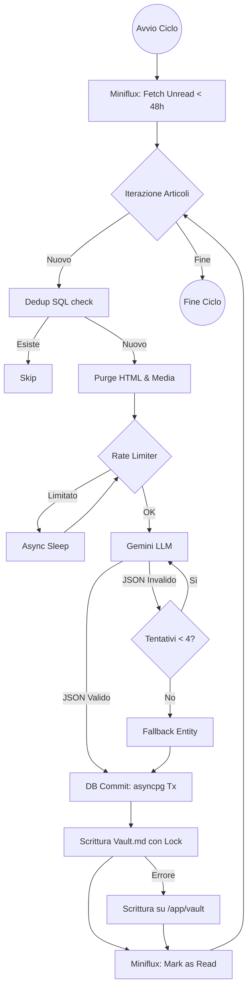

# ⚙️ Architettura e Backend

## Panoramica della Pipeline

Il backend di **Radar Informativo Globale** (FastAPI) esegue un loop continuo in background progettato per l'estrazione, elaborazione semantica e storicizzazione dei feed RSS.



L'architettura è suddivisa in 4 moduli logici all'interno di `backend/app/`:
1. **`core`**: Configurazioni, Logging, inizializzazione PostgreSQL.
2. **`extraction`**: Interfacciamento Miniflux, Parser HTML e deduplicazione.
3. **`classification`**: Interazione Google Gemini, gestione rate limit e prompt CoT.
4. **`commit`**: Transazioni DB pure, Vault factory, file lock.

---

## Modulo `extraction`: Estrazione e Sanitizzazione

All'avvio, il sistema esegue un "refresh best effort" dei feed su Miniflux. Successivamente inizia il polling:
- **Timeframe**: Interroga Miniflux solo per articoli `unread` e non più vecchi di 48 ore.
- **Dedup Pre-LLM**: Esegue una query SQL `SELECT EXISTS(...)` sull'URL. Qualsiasi URL già presente in DB viene scartato, risparmiando token API.
- **Sanitizzazione Purgativa**: Il Parser HTML elimina categoricamente e purga l'intero contenuto dei tag multimediali e invisibili (``, `<video>`, `<audio>`, `<script>`, `<style>`, `<noscript>`, `<iframe>`, `<meta>`). Sugli altri tag esegue uno strip rimuovendo gli attributi HTML, decodificando le entità e normalizzando gli spazi bianchi.

---

## Modulo `classification`: Reasoning e Resilienza

Gli articoli puliti vengono sottoposti a `gemma-4-31b-it` chiedendo uno *Structured Output JSON*.
Il System Prompt esegue il ragionamento (CoT - `reasoning`), che **non viene persistito** a database.

### Contratto CSV e Fallback
Nello schema Pydantic, i campi multi-valore come `companies_involved`, `tags` e `infrastructural_entities` sono richiesti come stringhe CSV (es. `"Azienda1, Azienda2"`) per non saturare la generazione JSON del modello. Vengono convertiti in liste Python solo nel livello `commit`.
In caso di fallimento LLM irreversibile, viene generato un **Fallback** geografico (Stato: `XX`, Lat/Lon: `0.0`, Categoria: `Tecnologia`) per garantire continuità.

### Rate Limiting a Doppio Binario (RPM / TPM) e RPD
L'algoritmo di Rate Limiting gestisce i limiti del tier gratuito (15 RPM / 1M TPM):
- **Finestra Temporale**: Implementa una *rolling window* asincrona di 60 secondi.
- **Limiti Concorrenti**: Un `TaskGroup` elabora in parallelo, ma ogni chiamata LLM aggiorna i token stimati (e poi reali) tramite lock `asyncio`.
- **4 Tentativi con Backoff**: Se l'API restituisce 429 o un JSON malformato, il client ritenta fino a 4 volte con history injection (passando l'errore al LLM per auto-correzione) e backoff esponenziale.
- **Ritardo Costante**: Tra una chiamata e l'altra viene imposto uno `await asyncio.sleep(4)` fisso per prevenire spike.
- **Requests Per Day (RPD)**: Prima di ogni ciclo, verifica sul DB `SELECT count(*) WHERE date(created_at) = CURRENT_DATE`. Se supera l'RPD, il ciclo va in ibernazione.

---

## Modulo `commit`: Persistenza Dati

Il modulo si interfaccia con il driver `asyncpg` puramente asincrono e senza ORM.

### Data Dictionary PostgreSQL

| Tabella | Colonna | Tipo | PK/FK | Vincoli | Default |
|---|---|---|---|---|---|
| `articles` | `id` | `SERIAL` | **PK** | — | — |
| | `title` | `TEXT` | — | `NOT NULL` | — |
| | `summary` | `TEXT` | — | `NOT NULL` | — |
| | `published_at` | `DATE` | — | `NOT NULL` | — |
| | `source_url` | `TEXT` | — | `UNIQUE`, `NOT NULL` | — |
| | `country_code` | `CHAR(2)` | — | `NOT NULL` | `'XX'` |
| | `latitude` | `FLOAT` | — | `NOT NULL` | `0.0` |
| | `longitude` | `FLOAT` | — | `NOT NULL` | `0.0` |
| | `primary_category`| `VARCHAR(50)`| — | `CHECK (IN ('Nucleare', ...))` | — |
| | `sentiment` | `VARCHAR(20)`| — | `CHECK (IN ('Positivo', ...))` | — |
| | `relevance_level` | `INTEGER` | — | `CHECK (BETWEEN 1 AND 5)` | — |
| | `is_read` | `BOOLEAN` | — | `NOT NULL` | `FALSE` |
| | `infrastructural_entities` | `TEXT[]` | — | Array nativo PostgreSQL | `'{ }'` |
| | `feed_title` | `TEXT` | — | `NOT NULL` | `'RSS Feed'` |
| `companies` | `id`, `name` | `SERIAL`, `TEXT`| **PK**, — | `name` è `UNIQUE` | — |
| `tags` | `id`, `name` | `SERIAL`, `TEXT`| **PK**, — | `name` è `UNIQUE` | — |
| `article_companies`| `article_id`, `company_id` | `INT`, `INT`| **PK(composita)**, **FK**| `ON DELETE CASCADE` | — |
| `article_tags` | `article_id`, `tag_id` | `INT`, `INT`| **PK(composita)**, **FK**| `ON DELETE CASCADE` | — |

**Indici Configurati:**
1. `idx_articles_published_at` (`published_at DESC`)
2. `idx_articles_geo_date` (`published_at`, `latitude`, `longitude`)
3. `idx_articles_country_date` (`country_code`, `published_at DESC`)
4. `idx_articles_category` (`primary_category`, `published_at DESC`)

*Nota*: L'inizializzazione DB usa comandi `IF NOT EXISTS` idempotenti, ed esegue un `ALTER TABLE` gestito in eccezione per retrocompatibilità. Le relazioni `companies` e `tags` usano un pattern *Upsert*.

### Transazione e Vault Obsidian

L'intero commit DB avviene in transazione. *Successivamente* i dati vengono scritti nel Vault:
- La directory viene creata dinamicamente (`vault/{category}/{country}/...`).
- Il file system è protetto da un File Lock di 10s per evitare race conditions I/O.
- Fallback: in assenza di mount in `radar/vault`, usa `/app/vault`.

**Esempio File Generato:**
```yaml
---
title: "Il governo americano approva fondi infrastrutture"
location: "Washington"
country: "US"
category: "Infrastrutture"
tags: ["fondi", "investimenti"]
companies: ["Governo US"]
sentiment: "Positivo"
relevance: 4
published: "2026-07-13"
source: "http://news..."
---

Il testo dell'articolo...
```

---

## Resilienza a Tre Livelli
1. **Livello 1**: Demone principale (`while True`). Gestisce le eccezioni fatali, garantendo che non muoia mai.
2. **Livello 2**: Ciclo della Pipeline. Gestisce i Rate Limits RPD; se fallisce un ciclo intero, riparte dal successivo.
3. **Livello 3**: Singolo Articolo. Elaborazione autonoma; se il parse o il DB falliscono, viene loggato un errore e si passa al record successivo senza impattare gli altri.

---

## API Reference REST (FastAPI)

Il backend non richiede autenticazione applicativa. Il proxy inverso `same-origin` evita problemi CORS in produzione, sebbene `CORSMiddleware` consenta localmente `GET`, `PATCH` e `OPTIONS`. L'egress verso l'esterno è autorizzato.

| Metodo | Endpoint | Query Parametri | Risposta |
|---|---|---|---|
| `GET` | `/health` | — | `{"status": "ok"}` |
| `GET` | `/api/articles` | `date` (Obbligatorio: `YYYY-MM-DD`)<br>`sentiment` (Opzionale)<br>`relevance_level` (Opzionale) | Array di oggetti Articolo (+ JOIN company/tag). |
| `GET` | `/api/countries`| *(Stessi parametri di articles)* | Array aggregato per ISO-Code, numero articoli. |
| `PATCH`| `/api/articles/{id}/read_status` | JSON Body: `{"is_read": boolean}` | `{"status": "success", "id": 123}` |

*Attenzione*: I filtri avanzati per array multipli di categoria non sono eseguiti a livello API ma tramite elaborazione client-side in Angular usando i signal. L'endpoint `/api/countries` popola metriche base, ma la UI attuale calcola i focus direttamente dai geo-dati client-side.
