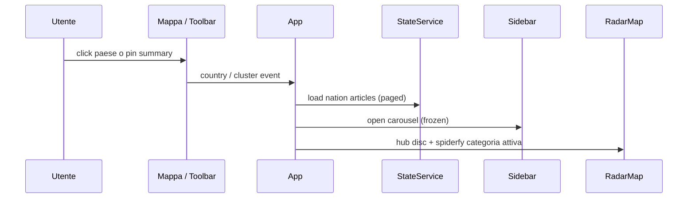

# Frontend e UI

SPA Angular 21 (standalone + signals). Codice: `radar/frontend/`.  
Stack allineato a Phase **6 DONE / GATE VERDE**.  
**Freeze:** non modificare `radar/frontend/src/app/components/radar-sidebar/**` (niente `article-list` / infinite scroll / restyle carousel).

---

## Stack

| Layer | Scelta |
|-------|--------|
| Core | Angular 21.2 standalone, Signals, ESBuild |
| Mappa | Leaflet 1.9.4 + markercluster 1.5.3 via `angular.json` `scripts[]` → `window.L` |
| UI | PrimeNG 17 + Angular CDK 17 (peer mismatch → `npm ci --legacy-peer-deps`) |
| Stile | SCSS (design system in `styles.scss`) |

Script utili (`package.json`): `start`, `verify-geojson`, `verify-geojson:fetch`, `typecheck`, `test:ci`, `build:ci`, `lint`. **Non esiste** runner `ng e2e` in questo repo.

---

## Albero componenti

```text
App
├── RadarToolbarComponent     # data, filtri, country
├── RadarMapComponent         # GeoJSON, hatching, cluster, pallini, spiderfy
└── RadarSidebarComponent     # p-carousel (FROZEN)

Servizi:
├── StateService              # SoT signals + map-summary + nation pages
├── ArticleService            # HTTP / mock gated
├── MOCK_MODE token           # default false — no silent fallback
└── ArticleMockService        # solo se MOCK_MODE=true
```

Hatching SVG: owner in `radar-map.component.ts` (`getOrCreateComboPattern`) — non una directive separata obbligatoria.

---

## Contratto dati (Phase 5)

**Day open**

1. `GET /api/map-summary?date=…` → hatching per paese + a zoom ≥ 5 **un pin grande per nazione** (conteggio + anello conic colori categorie)
2. Niente `Article[]` globale del giorno in memoria mappa

**Nation open**

1. `GET /api/articles?date&country` con envelope `{items,next_cursor,total}`; FE concatena pagine (`limit` ≤ 100) finché `next_cursor` è null
2. Carosello = tutte le notizie della nazione (sort categoria; pill `findIndex` invariato in sidebar)
3. Marker: **hub compatto** (`radar-spider-root`, stesso stile del root spiderfy — non il pin alto day-view) + spiderfy a **icone emoji** della sola categoria attiva
4. Fan spiderfy: **tutte** le icone della categoria (niente hard cap 24 / park extras); dimensione icone e `spiderfyDistanceMultiplier` **adattivi** al conteggio; se spiderfy fallisce → restore hub nazione
5. Spiderfy allineato alla **categoria attiva** (pill / slide carosello). Stessa categoria allo scroll → solo highlight (`lastSpiderfyKey`). Cambio categoria: non cancellare il root su `unspiderfied` asincrono (`restoreDetailHubOnUnspiderfy === false` → no-op)
6. **Dezoom:** spider + sidebar restano aperti a zoom ≥ 5; a zoom &lt; 5 (hatching) → collapse spiderfy / chiusura grafo dettaglio
7. Focus camera: pin summary → `preserveZoom` + `armSkipCountryFit`; poligono/toolbar → `fitBounds` (`maxZoom: 4`); ri-click stessa nazione → `refocusCountry`

**Close / cambio paese:** clear detail markers; tornano i pin summary.

---

## MOCK_MODE

```typescript
// app.config.ts
{ provide: MOCK_MODE, useValue: false }
```

Offline: `{ provide: MOCK_MODE, useValue: true }`. Errori API restano visibili — **vietato** fallback silenzioso a mock.

### Errori nation-fetch (T-P1-04)

- `StateService.detailError` + `error = mapSummaryResource.error() ?? detailError()`
- Wiring toolbar: `[apiError]="!!state.error()"`
- Fallimento `loadCountryArticles` → set `detailError` → `closeSidebar(false)` (UI chiusa, banner visibile)
- Close intenzionale → `closeSidebar()` / `clearError: true` azzera l’errore
- Test: `app.spec.ts` + `state.service.spec.ts`

---

## Leaflet + ESBuild

1. JS Leaflet e MarkerCluster in `angular.json` `scripts[]` → `window.L`
2. CSS Leaflet/MarkerCluster via `@import` in `src/styles.scss` (incluso da `angular.json` `styles[]`)
3. Nel componente: `const L = (window as any).L`
4. Vietato `import 'leaflet.markercluster'` nei componenti
5. Test: stub `src/app/testing/leaflet.stub.ts`

---

## Clustering

Un `markerClusterGroup` **per ciascuna delle 10 categorie** (nation detail):

- `maxClusterRadius: 40`
- `spiderfyOnMaxZoom: false` (espansione custom / flyTo)
- `iconCreateFunction` → icona nascosta (0×0): day-view usa pin summary; nation open usa hub disco + fan emoji
- Non ripristinare raggio 200 o spiderfy automatico legacy

Read/unread: fingerprint geometria + `syncMarkerReadState` — toggle `is_read` **non** deve `clearLayers` (icone spiderfy restano). Logica in `state.service.ts` + `radar-map.component.ts`, non nella sidebar. Auto-mark come letta: in `app.ts` su `activeArticleChanged` (scroll carosello / card attiva) se `!is_read`; il toggle manuale in sidebar resta invariato.

---

## Interazione split-screen



PATCH read status: update ottimistico + rollback su errore; risposta API `{status, is_read}`.

GeoJSON locale: `assets/data/countries.geo.json` (no CDN in produzione; pin in `ASSET_LICENSE.md`). Bounding box speciali US/RU; `minZoom` ~2.2.

Dettaglio ops FE: [`radar/frontend/README.md`](../radar/frontend/README.md).
