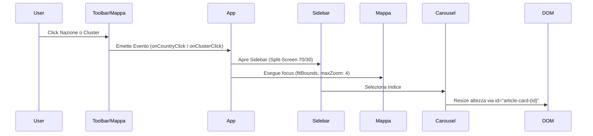

# 🎨 Frontend e Interfaccia Utente (UI)

Il frontend di **Radar Informativo Globale** è una Single Page Application (SPA) costruita con **Angular 21 (Standalone)**, progettata per offrire un'esperienza in tempo reale in stile Palantir.

---

## 1. Stack e Compatibilità

L'ecosistema miscela versioni *cutting-edge* e dipendenze storiche stabili. A causa del rapido ciclo di rilascio di Angular, esiste un disallineamento volontario tra core e UI library:

- **Core**: Angular `21.2.x` (Standalone Components, Signals, ESBuild).
- **Mappa**: Leaflet `1.9.4` + `leaflet.markercluster 1.5.3`.
- **UI Kit**: PrimeNG `17.18.x` + Angular CDK `17.3.x`. (Il mismatch di major version con Angular 21 è gestito installando in modalità non restrittiva).
- **Styling**: SCSS puro. Nessun framework utility-first (es. Tailwind).

---

## 2. Component Tree e Architettura Reattiva

Il frontend adotta un'architettura rigorosamente basata sui **Signals** di Angular.

```text
App (app.component.ts)
├── RadarToolbarComponent (filtri, date picker, country select)
├── RadarMapComponent (Leaflet, GeoJSON, clustering, hatching)
│   └── leaflet-hatch.directive.ts (SVG pattern injection)
└── RadarSidebarComponent (carosello PrimeNG, article cards)

Servizi e Dati:
├── StateService (Single Source of Truth, gestisce i Signal)
├── ArticleService (Chiamate HTTP reali a FastAPI)
└── ArticleMockService (Dati spaziali fittizi di fallback)
```

### Gestione dello Stato (State Management)
L'intera UI è guidata dal `StateService`:
- **`rxResource`**: Effettua chiamate asincrone all'API per recuperare i dati. Reagisce ai cambi di parametro (data).
- **`computed`**: Crea proiezioni istantanee. I filtri selezionati dall'utente (Sentiment, Categorie multiple) vengono applicati sul client, rigenerando la lista articoli e i totali per paese senza ricaricare l'API.
- **Signals UI**: Proprietà come l'articolo attualmente selezionato o lo stato di espansione della sidebar risiedono come segnali nel componente genitore `App`.
- **Mock Fallback**: In assenza del backend, è possibile iniettare dati offline tramite `ArticleMockService` per operare e testare UI/Mappa spaziale in isolamento.

---

## 3. Workaround Critico Leaflet + ESBuild

> [!WARNING]
> Angular 21 utilizza **ESBuild** di default. La libreria `leaflet.markercluster` è un modulo UMD progettato per iniettare i suoi metodi nel namespace globale `window.L`. Eseguire `import 'leaflet.markercluster'` in un componente Typescript causa la rottura del collegamento: Leaflet e il plugin vivono in due context separati.

**Soluzione Architetturale adottata:**
1. I file `.js` e `.css` di Leaflet e MarkerCluster sono caricati staticamente nell'array `scripts[]` e `styles[]` del file `angular.json`.
2. All'interno di `RadarMapComponent`, la libreria viene intercettata globalmente con:
   `const L = (window as any).L;`
Nessun `import * as L from 'leaflet'` è consentito nel codice.

---

## 4. Motore Geografico e Clustering

L'engine mappa fonde poligoni (Nazioni) e punti spaziali (Articoli). Il comportamento di default di MarkerCluster è stato disabilitato per lasciare spazio a un'implementazione UX custom:

### Bounding Box e GeoJSON (Zoom < 5)
I confini mondiali (GeoJSON in batch) vengono disegnati all'avvio. 
Se una nazione possiede articoli, subisce l'effetto **Hatching SVG** (strisce diagonali) applicato dinamicamente.
*Nota Trans-Antimeridiano*: Per stati come `US` e `RU` i cui territori attraversano la linea di cambio data (creando bounding box larghi quanto l'intero globo), la telecamera utilizza coordinate *Mainland* pre-calcolate staticamente per evitare glitch visivi nel `fitBounds`. I limiti zoom bloccano la mappa: `minZoom: 2.2`.

### Clustering Custom e Dummy Markers (Zoom > 5)
Il sistema instanzia **10 MarkerClusterGroup separati**, uno per ogni macro-categoria geopolitica.
- **Raggio compatto**: Il cluster è stretto (`maxClusterRadius: 40`).
- **Ancoraggio**: Avviene sulle coordinate mediate per la nazione, per evitare sovrapposizioni.
- **Dummy Marker**: Per non appesantire la mappa, la logica inietta coordinate invisibili (`isDummy: true`) costringendo il cluster a posizionarsi dove desiderato spazialmente.
- **Spiderfy Manuale**: Lo spiderfy automatico al max zoom è disabilitato (`spiderfyOnMaxZoom: false`). Al click, la mappa zooma dinamicamente al livello 6 (`flyTo`) ed esegue l'espansione ad albero spaziale.
- **Root Marker**: Anche dopo lo spiderfy o per notizie singole (count=1), viene sempre generato e mantenuto un "pallino" cluster visibile, garantendo coerenza estetica (mai usare icone "nude").

---

## 5. UI e Interazione (Split-Screen)



### Carosello PrimeNG
Il componente laterale mostra le schede. Per prevenire race conditions del DOM all'avvio (tipiche di PrimeNG con i Signal), il dimensionamento dinamico in altezza ricerca esattamente l'ID `article-card-{id}` anziché usare la classe generica `.p-carousel-item-active`.

### Troncamento Testi e Metadati
Titoli di testate lunghi sono vincolati via layout **Flexbox** rigido:
`flex: 1`, `min-width: 0` per il contenitore testo, `flex-shrink: 0`, `white-space: nowrap` per il link sorgente laterale.
I feed in arrivo da Miniflux subiscono un cleanup Regex nel component (`.replace(/^Feed:\s*/i, '')`) per pulizia visiva.

### PATCH Ottimistico (Read Status)
Il click sul toggle Letto/Non Letto implementa un pattern **Optimistic Update**:
1. Il Signal UI viene istantaneamente aggiornato (per feedback immediato).
2. Viene lanciata la chiamata asincrona `PATCH /api/articles/...`.
3. In caso di errore API (es. offline), interviene un Rollback automatico.
*Nota:* L'attuale UI è priva di debounce; richieste ripetute e asincrone possono fallire in caso di risposte server fuori ordine.

### Legenda Interattiva
Una legenda orizzontale in assoluto posizionata al centro del footer (`bottom: 20px; left: 50%`) decodifica le 10 categorie geopolitiche. Sfoggia effetti Glassmorphism con cerchi luminosi dettati da un `box-shadow` del colore associato.
