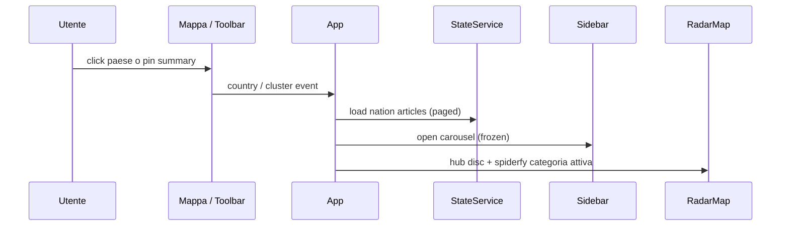

# Frontend e UI

SPA Angular 21 (standalone + signals). Codice: `radar/frontend/`.  
Stack allineato a Phase **6 DONE / GATE VERDE**.  
**Freeze:** non modificare `radar/frontend/src/app/components/radar-sidebar/**` (niente `article-list` / infinite scroll / restyle carousel) tranne per le due eccezioni mirate: il toggle Salva/Rimuovi e la sezione chip dei paesi correlati (`related_countries`).

---

## Stack

| Layer | Scelta |
|-------|--------|
| Core | Angular 21.2 standalone, Signals, ESBuild |
| Mappa | **MapLibre GL 5.24** (default, 3D-primary / globe; mercator+pitch contingency) — facade `radar-map.component.ts` monta `maplibre/` o `leaflet/` via token `MAP_RENDERER` |
| Mappa legacy | Leaflet 1.9.4 + markercluster 1.5.3 via `angular.json` `scripts[]` → `window.L` — **LEGACY FREEZE**, non default (`MAP_RENDERER=leaflet`) |
| UI | PrimeNG 17 + Angular CDK 17 (peer mismatch → `npm ci --legacy-peer-deps`) |
| Stile | SCSS (design system in `styles.scss`) |

Script utili (`package.json`): `start`, `verify-geojson`, `verify-geojson:fetch`, `verify-map-renderer`, `typecheck`, `test:ci`, `build:ci`, `lint`. **Non esiste** runner `ng e2e` in questo repo.

Proiezione MapLibre: `localStorage` key `radar.mapProjection` = `globe` \| `mercator`. Resize overlay: path MapLibre chiama `map.resize()` (equivalente legacy `invalidateSize()`).

---

## Albero componenti

```text
App
├── RadarToolbarComponent     # data, filtri, LETTE/TROVATE, NOTIZIE SALVATE
├── RadarMapComponent         # facade → MapLibre (default) o Leaflet legacy
│   ├── maplibre/             # host 3D-primary (hatching, pin, spiderfy custom, archi)
│   └── leaflet/              # LEGACY FREEZE (MarkerCluster + relationsPane)
└── RadarSidebarComponent     # p-carousel (FROZEN; eccezione toggle Salva)

Servizi:
├── StateService              # SoT signals + map-summary + saved-summary + nation/saved pages
├── ArticleService            # HTTP / mock gated
├── MAP_RENDERER token        # default maplibre — window/localStorage override
├── MOCK_MODE token           # default false — no silent fallback
└── ArticleMockService        # solo se MOCK_MODE=true
```

Hatching: owner nel host attivo (`maplibre/` = fasce soft per tipologia; `leaflet/` = SVG combo pattern) — non una directive separata obbligatoria.

---

## Contratto dati (Phase 5+)

**Day open**

1. `GET /api/map-summary?date=…` → hatching per paese + a zoom ≥ `MAP_ZOOM_PIN_THRESHOLD` (4) **un pin grande per nazione** (conteggio + anello conic colori categorie)
2. Niente `Article[]` globale del giorno in memoria mappa

**Nation open (day)**

1. `GET /api/articles?date&country` con envelope `{items,next_cursor,total}`; FE concatena pagine (`limit` ≤ 100) finché `next_cursor` è null
2. Carosello = tutte le notizie della nazione (sort categoria; pill `findIndex` invariato in sidebar)
3. Marker: **hub compatto** (`radar-spider-root`, stesso stile del root spiderfy — non il pin alto day-view) + spiderfy a **icone emoji** della sola categoria attiva
4. Fan spiderfy: **tutte** le icone della categoria (niente hard cap 24 / park extras); dimensione icone e `spiderfyDistanceMultiplier` **adattivi** al conteggio; se spiderfy fallisce → restore hub nazione
5. Spiderfy allineato alla **categoria attiva** (pill / slide carosello). Stessa categoria allo scroll → solo highlight (`lastSpiderfyKey`). Cambio categoria: non cancellare il root su `unspiderfied` asincrono (`restoreDetailHubOnUnspiderfy === false` → no-op)
6. **Dezoom:** spider + sidebar restano aperti finché **`pinModeActive`** (enter zoom ≥ 4, exit &lt; 3.6 via isteresi `resolvePinMode` — evita flicker pan globo); latch hatching → collapse spiderfy / chiusura grafo dettaglio
7. Focus camera: pin summary → `preserveZoom` + `armSkipCountryFit`; poligono/toolbar → `fitBounds` (`maxZoom: 4`); ri-click stessa nazione → `refocusCountry`

**Saved vault (Notizie Salvate)**

1. Contatore toolbar date-agnostic da `GET /api/saved-summary` (no date) + tooltip **Nazioni Salvate**
2. Click nazione → `loadSavedCountryArticles` → `GET /api/articles?saved=true&country=` (ignora date; carosello multi-day)
3. **Stesso path mappa di LETTE/TROVATE:** `fitBounds` + `flyTo` zoom 6 + spiderfy categoria (`App.onToolbarSavedCountrySelect` → `scheduleCategorySpiderfy`)
4. Card: **Salva notizia** / **Rimuovi dai salvati** (delega a `StateService`)
5. Coupling: save ⇒ `is_read=true`; unread ⇒ `is_saved=false`

**Close / cambio paese:** clear detail markers; tornano i pin summary.

---

## MOCK_MODE

```typescript
// app.config.ts
{ provide: MOCK_MODE, useValue: false }
```

Offline: `{ provide: MOCK_MODE, useValue: true }`. Errori API restano visibili — **vietato** fallback silenzioso a mock.

### Errori nation/saved-fetch (T-P1-04)

- `StateService.detailError` + `error = mapSummaryResource.error() ?? savedSummaryResource.error() ?? detailError()`
- Wiring toolbar: `[apiError]="!!state.error()"`
- Fallimento `loadCountryArticles` / `loadSavedCountryArticles` → set `detailError` → `closeSidebar(false)` (UI chiusa, banner visibile)
- Close intenzionale → `closeSidebar()` / `clearError: true` azzera l’errore
- Test: `app.spec.ts` + `state.service.spec.ts`

---

## MapLibre (default) + Leaflet legacy

**Default:** MapLibre GL via host `radar-map/maplibre/`. Token `MAP_RENDERER` in `services/map-renderer.token.ts` (override `window.__RADAR_MAP_RENDERER__` o `localStorage`; default `maplibre`). Gate CI: `npm run verify-map-renderer`.

**Path 3D (MapLibre):** spiderfy hub+fan è **custom** (HTML markers) — **senza** `leaflet.markercluster`. Layout gambe: cerchio se n &lt; 9, **spirale MarkerCluster** se n ≥ 9 (raggio/leg in **pixel** via `project`/`unproject`, non gradi geografici). Overlay full-bleed: dopo open/close sidebar chiamare `map.resize()` (non `invalidateSize`). Hatching day-view: fasce longitudinali soft (1 colore × tipologia da `map-summary`; mainland US/RU; isole significative ≥0.5% area largest; clip terra∩strip via `polygon-clipping`; opacità ~0.34; helper `country-category-fills.ts`) — **non** `fill-pattern` ripetuto. Archi hover: tooltip sticky + thicken via paint `arcKey`. Globe: **niente** `maxBounds` (blocca rotate); `minZoom: 2.2`, `clickTolerance: 12`, ignore click dopo drag/rotate/pitch.

**Path legacy (Leaflet):** solo se `MAP_RENDERER=leaflet`. Regole ESBuild sotto restano valide **solo** per quel host.

### Leaflet + ESBuild (solo host legacy)

1. JS Leaflet e MarkerCluster in `angular.json` `scripts[]` → `window.L` (necessari al path legacy)
2. CSS Leaflet/MarkerCluster via `@import` in `src/styles.scss` (incluso da `angular.json` `styles[]`)
3. Nel componente legacy: `const L = (window as any).L`
4. Vietato `import 'leaflet.markercluster'` nei componenti
5. Test: stub `src/app/testing/leaflet.stub.ts`

---

## Clustering / spiderfy

**MapLibre (default):** nessun MarkerCluster — hub nazione + fan emoji custom per categoria attiva (stessa UX: keep su latch pin / collapse su latch hatching; soglia enter 4 + isteresi 0.4).

**Leaflet legacy:** un `markerClusterGroup` **per ciascuna delle 10 categorie** (nation detail):

- `maxClusterRadius: 40`
- `spiderfyOnMaxZoom: false` (espansione custom / flyTo)
- `iconCreateFunction` → icona nascosta (0×0): day-view usa pin summary; nation open usa hub disco + fan emoji
- Non ripristinare raggio 200 o spiderfy automatico legacy

Read/unread/save: fingerprint geometria + sync marker read — toggle `is_read` **non** deve ricostruire i layer (icone spiderfy restano). Logica in `state.service.ts` + host mappa, non nella sidebar (sidebar solo delega click). Auto-mark come letta: in `app.ts` su `activeArticleChanged` se `!is_read`. Card **Salva notizia** / **Rimuovi dai salvati**. Coupling: save ⇒ read; unread ⇒ unsave.

PATCH read status: update ottimistico + rollback; risposta `{status, is_read, is_saved?}`.
PATCH saved status: update ottimistico + rollback; risposta `{status, is_saved, is_read?}`.

---

## Interazione split-screen



PATCH read status: update ottimistico + rollback su errore; risposta API `{status, is_read, is_saved?}`.
PATCH saved status: update ottimistico + rollback; risposta `{status, is_saved, is_read?}`.

GeoJSON locale: `assets/data/countries.geo.json` (no CDN in produzione; pin in `ASSET_LICENSE.md`). Bounding box speciali US/RU; `minZoom` ~2.2.

---

## Relazioni Geospaziali (Grafo — Fase H)

Per collegare le notizie multilaterali, la mappa disegna archi curvi bidirezionali tra i centroidi dei paesi.

- **MapLibre (default):** great-circle / LineString multi-segment (source layer o layer dedicato); hit-buffer per hover/click; stessa semantica star e stessi output (`relationClicked` → `loadRelationArticles`).
- **Leaflet legacy:** interpolazione Bézier + `L.polyline` sul pane **`relationsPane`** (z-index **550**).

**Semantica v1 (star, non clique):** ogni articolo con `country_code` primario e `related_countries` genera archi **solo** primary↔ciascun related (undirected `LEAST/GREATEST`). Un accordo USA–Italia–Francia (`US` + `IT,FR`) produce gli archi US–IT e US–FR, **non** IT–FR, a meno che un altro articolo non colleghi direttamente IT e FR. Il click su un arco apre il carosello bilaterale della sola coppia cliccata.

1. **Gestione dello Stato**: `StateService` espone `mapRelationsResource` sincronizzato con la data attiva e i filtri della toolbar. Pipeline FE: `filteredMapRelations` (Tipologia) → `visibleMapRelations` (filtro nazioni OR, default enabled vuoto → 0 archi) → binding mappa. UI toolbar: **Sentiment**, **Tipologia** e **RELAZIONI ATTIVE** condividono lo stesso tooltip (titolo mono uppercase, un bottone Seleziona/Deseleziona tutto, filtro testo, toggle iOS a destra; niente `p-multiSelect`). Filtro nazione anche su Nazioni Coinvolte / Salvate. Piano W1: [`plan-audit/complete/plan_impl_map_relations_nation_filter.md`](../plan-audit/complete/plan_impl_map_relations_nation_filter.md). Al riceversi del segnale SSE `article_processed`, viene scatenato il reload atomico sia per il summary che per le relazioni.
2. **Visualizzazione e Zoom**:
   - **MapLibre (default, tutti gli zoom):** una sola linea aggregata per coppia di paesi, **multicolore continua** (segmenti proporzionali al volume per categoria, ordinati per volume decrescente). Stile soft (`Math.min(3, 1 + totalVolume * 0.3)`, opacity ~0.45); tooltip con breakdown (es. `Sicurezza 5 · Economia 2 · n=7`). **Niente** fan per-categoria né geometric dash.
   - **Leaflet legacy — Zoom ≥ 4 (vista pin):** archi divisi per categoria (1 linea per categoria per coppia), spessore `Math.min(6, 1 + volume * 0.5)`, opacity 0.8, tratteggio **geometric dash** (segmenti lat/lng + gap — **non** `line-dasharray` / CSS `stroke-dasharray`). Multi-cat → **offset di curvatura** (fan parallelo).
   - **Leaflet legacy — Zoom < 4 (vista hatching):** stessa macro multicolore aggregata di MapLibre (stile soft).
   - Vengono nascosti se viene aperta la vista di dettaglio di una specifica nazione (per evitare sovrapposizioni visive con il ventaglio di spiderfy).
3. **Calcolo Centroidi**:
   - I centroidi vengono estratti dinamicamente dai confini GeoJSON caricati in cache.
   - Per gli Stati Uniti (`US`) e la Russia (`RU`), data la loro estensione trans-antimeridiana, si utilizzano coordinate statiche hardcoded per posizionare l'arco al centro della terraferma principale (mainland).
4. **Stile Visivo**:
   - Colore dell'arco allineato alle variabili di stile della categoria geopolitica (`CATEGORY_CSS_VARS`).
   - Spessore proporzionale al volume aggregato di notizie.
   - **MapLibre:** sempre linea continua soft aggregata. **Leaflet:** zoom ≥ 4 tratteggio denso per-cat; zoom &lt; 4 linea continua soft.
5. **Hover / click**: hit-area affidabile anche in Europa densa; click emette `relationClicked` → `StateService.loadRelationArticles` apre il carosello con le notizie bilaterali A↔B (MapLibre e macro Leaflet: tutte le categorie; pin Leaflet: sola tipologia dell’arco; entrambi i verso via `related_countries`).

---

## FinOps UI: Pulsanti & Popover COSTI e STATUS (Topbar)

1. **Separazione Topbar (`.toolbar-left`)**:
   - Gruppo di sinistra (`.toolbar-left`): Calendario date picker, filtro **Sentiment**, filtro **Tipologia**, pulsante **`COSTI`** e pulsante **`STATUS`**.
   - Gruppo di destra (`.toolbar-right`): NOTIZIE LETTE/TROVATE, NOTIZIE SALVATE, RELAZIONI ATTIVE.
   - I due pulsanti costituiscono popover distinti con ripristino ed esclusione reciproca all'apertura.

2. **Popover `COSTI` (Filtrato per Data Selezionata)**:
   - Pulsante `COSTI: $X.XXXX` con costo stimato per le chiamate LLM di classificazione nel giorno attivo.
   - Popover glassmorphic contenente 4 sezioni analitiche:
     - **Grid Summary:** Costo stimato giorno, Articoli ingestiti, Richieste LLM, Latenza media pipeline.
     - **Consumo Token & Cache:** Prompt, Completion, Cached % (filtrati per data).
     - **Richieste LLM per Singolo Modello:** Breakdown per modello (`model`, `provider`, `requests_count`, `total_tokens`) per il giorno selezionato (`metricsSummary()?.llm?.models_breakdown`).
     - **Eventi Deduplicazione:** Totale, URL, Vettoriale, Hash.

3. **Popover `STATUS` (Operativo & Real-Time / Oggi ops)**:
   - Pulsante `STATUS 🟢` (🟡 `fallback_or_escalation`, 🔴 `degraded`) indicante lo stato di salute live del sistema.
   - Popover glassmorphic contenente 2 sezioni operative:
     - **Banner Stato Sistema:** Indicatore visuale, livello operativo (`OPERATIVO (Catena Simple OK)`, etc.) e badge L1 Fallback attivo con causa (`primary_cooldown`, `primary_rpd_exhausted`, `recent_articles`).
     - **Modelli & Quote RPD (Oggi ops):** Barre di avanzamento RPD live per modello (`primary`, `fallback`, `complex`), quote limite, indicatore di cooldown e rate-limiting in tempo reale (`metricsStatus()`).

4. **Analisi FinOps & Fonte RSS (Sidebar Card - Freeze Carve-Out)**:
   - Sezione informativa *ANALISI FINOPS & FONTE RSS* collocata sotto i chip dei Tag sia in modalità carta singola che nel carosello nazione/cluster.
   - Espone: Modello LLM e lane, flag Escalation (`Sì (COMPLEX)` / `No`), dettaglio Token (prompt, completion, cached), Latenza distinta (LLM / Pipeline), Costo stimato ($ / gratis), e link diretto XML del feed RSS risolto dal seed Miniflux.
   - Preserva l'identità del DOM del carosello PrimeNG tramite mutazione in-place su riferimenti `Article` esistenti in `mergeDetailArticlesFromServer`.

Dettaglio ops FE: [`radar/frontend/README.md`](../radar/frontend/README.md).

