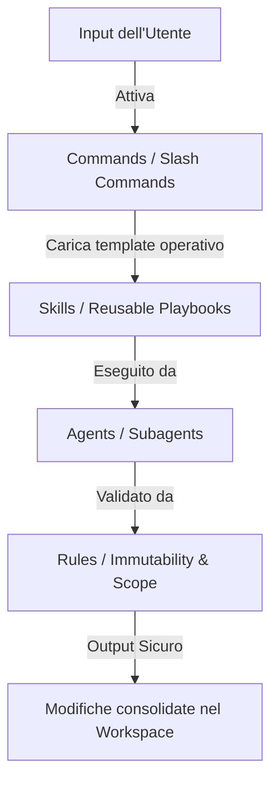

# Documentazione Tecnica di Analisi: Everything Claude Code (ECC) & Radar Informativo Globale
> **Autore:** Senior AI Reverse Engineer & Software Architect  
> **Destinazione Workspace:** `c:/Users/lucag/Documents/Dashboard finance/ecc_deep_dive_analysis.md`  
> **Stato:** Versione Finale - Documentazione Completa  

---

## INTRODUZIONE

Il presente documento fornisce uno studio architetturale esaustivo su **Everything Claude Code (ECC)** e sulla sua **CodeWiki** ufficiale, analizzando come questo framework replichi un ambiente operativo deterministico, sicuro e ad altissime prestazioni per lo sviluppo guidato da agenti di intelligenza artificiale (LLM).

Nella seconda parte del documento, i concetti e le soluzioni ingegneristiche di ECC vengono tradotti in pattern strutturali pronti per essere applicati direttamente al progetto **Radar Informativo Globale (Intelligence Dashboard)**, che prevede un backend Python (integrato con Google Gemini API) e un frontend Angular 21 + PrimeNG.

---

## 1. MAPPATURA DELL'ALBERO DEI FILE (Infrastructure Layout)

Il layout di ECC è progettato per separare le responsabilità esecutive, le regole immutabili, le competenze specialistiche e i flussi di automazione del ciclo di vita. Di seguito viene mappata l'esatta gerarchia delle cartelle del repository.

```
📁 Repository Root (o .claude/)
│
├── 📄 CLAUDE.md                    # Linee guida principali del progetto (struttura, build, test, stile)
├── 📄 CLAUDE.local.md              # Override personali dello sviluppatore (ignorato da Git)
├── 📄 settings.json                # Configurazione di sicurezza, limiti token e permessi tool
├── 📄 settings.local.json          # Override locali delle impostazioni di sicurezza
│
├── 📂 commands/                    # Slash Commands definiti come schemi Markdown
│   ├── 📄 learn.md                 # Estrazione di pattern e bug fix a fine sessione
│   ├── 📄 tdd.md                   # Flusso strutturato Test-Driven Development
│   └── 📄 review.md                # Audit statico del codice per sicurezza/qualità
│
├── 📂 skills/                      # Playbook specialistici ("How-To")
│   ├── 📄 database-migrations.md   # Skill per la gestione delle migrazioni DB
│   └── 📄 gemini-genai-sdk.md      # Istruzioni sull'integrazione di Google GenAI
│
├── 📂 rules/                       # Regole dichiarative e Path-Scoped
│   ├── 📄 coding-style.md          # Standard di formattazione, naming e pattern
│   ├── 📄 security.md              # Restrizioni di rete, whitelist tool e protezione secret
│   └── 📄 testing.md               # Criteri di accettazione e copertura dei test
│
├── 📂 agents/                      # Definizioni dei Subagenti e degli Orchestratori
│   ├── 📄 orch-main.md             # Orchestratore di sessione principale
│   └── 📄 agent-coder.md           # Agente esecutore di basso livello
│
└── 📂 hooks/                       # Automazioni agganciate ad eventi dell'Harness
    ├── 📄 pre-tool-use.sh          # Esegui controlli prima dell'invocazione di un tool
    └── 📄 post-tool-use.sh         # Formatta e controlla la sintassi dopo la modifica
```

### I File di Configurazione Core e il Frontmatter YAML

Ciascun file all'interno di `commands/` e `skills/` è strutturato come un file Markdown arricchito da un blocco iniziale di metadati in formato **YAML Frontmatter**. Questo consente al motore di esecuzione dell'harness di analizzare e registrare i comandi e le abilità in modo deterministico.

#### Esempio di Frontmatter in `commands/learn.md`:
```yaml
---
name: learn
description: Rileva ed estrae pattern di bug-fixing e decisioni architetturali per memorizzarli
trigger: manual
scope:
  directories:
    - "src/"
    - "tests/"
  extensions:
    - ".py"
    - ".ts"
tools:
  - view_file
  - write_to_file
  - grep_search
version: 2.1.0
author: ECC Core Team
---
```

#### Dettaglio dei Metadati:
*   `name`: Registra la parola chiave che attiva il comando (es. `/learn` digitato nel terminale).
*   `description`: Fornisce il testo informativo visualizzato nel menu contestuale dell'autocompletamento dell'harness.
*   `trigger`: Può essere `manual` (invocato esplicitamente dall'utente) o `auto` (attivato dall'agente quando rileva determinate risposte o condizioni).
*   `scope`: Definisce i vincoli di attivazione per file system, limitando l'uso del comando a cartelle o estensioni specifiche, per evitare che l'agente esegua azioni fuori contesto.
*   `tools`: Dichiara la whitelist ristretta di strumenti abilitati per quel comando. Ad esempio, `/learn` non ha bisogno di eseguire comandi bash arbitrari, limitando la superficie d'attacco.

---

## 2. IL MECCANISMO OPERATIVO (How It Works)

### Interazione tra Agents, Skills, Commands e Rules

Il framework ECC funziona grazie a un loop di coordinamento in cui ogni componente ha un ruolo definito per impedire deviazioni comportamentali (drift) dell'agente:



1.  **Commands (L'Intento)**: L'utente o l'orchestratore dichiara *cosa* fare. Ad esempio, l'invocazione di `/tdd` carica l'ambiente di sviluppo guidato dai test.
2.  **Skills (Il Metodo)**: L'agente carica le istruzioni procedurali (*come fare*). Se il compito richiede di scrivere codice Python, l'agente carica la skill per usare `google-genai` minimizzando i token.
3.  **Agents (L'Esecutore)**: I subagenti coordinano l'esecuzione materiale, lavorando in sessioni isolate per non contaminare la finestra principale.
4.  **Rules (I Vincoli)**: Fungono da "guardrail" statici. Ad esempio, se l'agente tenta di salvare il file ma la regola `rules/coding-style.md` vieta i commenti TODO, l'azione viene bloccata e l'agente è costretto a completare il codice.

### Intercettazione dall'Imbracatura (Harness) e Ciclo degli Hooks

L'harness di ECC è l'interfaccia a basso livello che esegue il parsing del prompt e gestisce le chiamate di sistema.

*   **Intercettazione degli Slash Commands**: L'harness legge l'input dell'utente in tempo reale. Se rileva un prefisso `/`, esegue una ricerca nel registro delle cartelle `commands/`. Se il comando esiste, sospende il loop di chat principale, inizializza un sotto-contesto isolato e applica il prompt di sistema definito nel file di comando.
*   **Ciclo degli Hooks**: Gli hooks si agganciano a punti specifici del ciclo di esecuzione:
    ```
    Prompt Utente -> [Hook: UserPromptSubmit] -> Parsing Harness 
                  -> [Hook: PreToolUse] -> Esecuzione Tool 
                  -> Risultato Tool -> [Hook: PostToolUse] -> Risposta LLM
    ```
    *   `UserPromptSubmit`: Modifica il prompt inserendo automaticamente contesti utili (es. caricando la struttura del database).
    *   `PreToolUse`: Esegue script di validazione. Ad esempio, prima di eseguire un comando di shell, controlla se contiene comandi maligni o se tenta di accedere a cartelle protette.
    *   `PostToolUse`: Avvia formattatori automatici di codice (es. `black` per Python, `prettier` per Angular) per garantire che l'agente scriva codice formattato correttamente prima ancora che l'utente lo veda.

### Context Window Management (Gestione della Memoria del Contesto)

Il degrado cognitivo dell'agente è causato dalla **"Context Rot"**: l'accumulo di cronologia, tentativi di compilazione falliti e letture massive di file che saturano la finestra di contesto. ECC gestisce questo problema attraverso tecniche avanzate di ingegneria del contesto:

*   **La Regola dell'80/20**:
    
    > [!IMPORTANT]
    > **La Regola d'Oro di ECC sul Budget dei Token**
    > Gli agenti monitorano costantemente la dimensione del contesto attivo. Al raggiungimento dell'**80% del limite massimo di token**, l'agente consolida lo stato delle attività in corso in un file di riepilogo nel workspace e arresta la sessione invitando l'utente a eseguire `/clear`. Questo resetta la cronologia ed elimina la "memoria stanca", ripartendo con una finestra pulita al 100% per evitare allucinazioni e costi di inferenza eccessivi.

*   **Path-Scoped Rules (Limitazione Spaziale)**: Anziché caricare tutte le istruzioni del progetto, le regole in `rules/` contengono definizioni di scope. Se l'agente sta lavorando su un file in `/frontend`, l'harness esclude dal contesto le regole del backend e del database.
*   **Compattazione Progressiva (Lossy Compaction)**: L'harness riassume periodicamente i messaggi più vecchi della chat, mantenendo solo i dettagli salienti in un blocco compatto ed eliminando le risposte intermedie dei tool.
*   **Delegazione a Subagenti Isolati**: Le sotto-attività ad alta densità di token (es. la risoluzione di un errore di compilazione o la scrittura di unit test) vengono delegate a subagenti con finestre di contesto dedicate. Il risultato finale (il codice corretto) viene poi riassorbito dal contesto principale, risparmiando migliaia di token di cronologia di debug.

---

## 3. ANALISI DEI COMPONENTI CHIAVE (Deep Dive dei File)

### Session Adapters e MCP Inventory

Per gestire la frammentazione degli IDE e delle piattaforme (Claude Code, Cursor, Codex, ecc.), ECC v2.0 introduce uno strato di astrazione denominato **Control Plane Substrate**.

```
┌─────────────────────────────────────────────────────────┐
│                    IDE / HARNESSES                      │
│        (Claude Code, Cursor, OpenCode, Codex)           │
└────────────────────────────┬────────────────────────────┘
                             │
                             ▼
┌─────────────────────────────────────────────────────────┐
│         Session Adapters (ecc.session.v1)               │
│  - Normalizzazione metriche sessione                    │
│  - Tracciamento attività agenti                         │
└────────────────────────────┬────────────────────────────┘
                             │
                             ▼
┌─────────────────────────────────────────────────────────┐
│          MCP Inventory (ecc.mcp.v1)                     │
│  - Rilevamento drift configurazioni server              │
│  - Secret Redaction (Prevenzione leak API key)          │
└─────────────────────────────────────────────────────────┘
```

#### 1. Session Adapters (`ecc.session.v1`)
Forniscono un'interfaccia comune per serializzare lo stato delle sessioni degli agenti. Normalizzano le risposte, la telemetria e i log indipendentemente dal fatto che l'agente stia girando all'interno di Claude Code o Cursor. Questo permette di implementare pannelli di controllo centralizzati per monitorare l'attività degli agenti a livello aziendale.

#### 2. MCP Inventory (`ecc.mcp.v1`)
Il Model Context Protocol (MCP) consente agli LLM di connettersi a sorgenti dati e tool esterni. L'MCP Inventory di ECC gestisce questo protocollo con due scopi principali:
*   *Drift Detection*: Rileva se le configurazioni dei server MCP differiscono tra l'ambiente locale dello sviluppatore e l'ambiente di produzione/CI.
*   *Secret Redaction (Sicurezza Attiva)*: Esegue una scansione dei parametri passati ai server MCP. Se un parametro contiene pattern riconducibili a chiavi private, token o password (es. `AIzaSy...` per Google Cloud, credenziali PostgreSQL), l'inventario li sostituisce con stringhe oscurate prima che vengano scritti nei log o trasmessi all'LLM.

### Workflow del "worktree-lifecycle"

Nello sviluppo collaborativo guidato da agenti, più IA possono lavorare in parallelo sullo stesso repository. Se operano sulla stessa cartella di lavoro, si verificano conflitti irreparabili sull'index di Git. Il servizio `worktree-lifecycle` risolve questo problema.

1.  **Git Worktrees Isolate**: Quando viene avviata una sessione per un agente parallelo, il servizio esegue:
    ```bash
    git worktree add ../worktrees/agent-session-xyz -b feature/agent-task-xyz
    ```
    Questo crea una directory fisica separata sul disco, collegata allo stesso repository locale ma con un index e un branch Git indipendenti.
2.  **Deterministic Conflict Prediction**: Prima di autorizzare la scrittura nel worktree, il modulo analizza il piano dell'agente (i file contrassegnati come `[MODIFY]`). Se un altro agente attivo ha pianificato modifiche sugli stessi file o su moduli strettamente accoppiati, il pianificatore genera una priorità di blocco o rischedula l'esecuzione per evitare conflitti di merge complessi.
3.  **Garbage Collection (GC) Sicuro**: Quando una sessione viene contrassegnata come completata o interrotta, il servizio rimuove il worktree:
    ```bash
    git worktree prune
    ```
    Inoltre, elimina il branch temporaneo se le modifiche sono state integrate con successo nel branch principale, garantendo che lo spazio su disco non si saturi.

### Regole di Sicurezza e Immutabilità in `rules/`

Le regole memorizzate in `rules/` sono direttive scritte per essere interpretate come vincoli "immutabili" che sovrascrivono qualsiasi comportamento appreso o istruzione del prompt di sistema dell'agente.

*   **`security.md`**:
    *   *Credential Sanitization*: Definisce espressioni regolari per intercettare pattern di token e chiavi SSH, bloccando preventivamente la scrittura su file system se viene rilevato un match.
    *   *Path Restrictions*: Impedisce all'agente di leggere cartelle esterne al workspace (come `/etc/` o `C:\Users\...\.ssh\`) anche se l'LLM genera un comando per farlo.
    *   *Tool Execution Whitelist*: Impedisce l'esecuzione di tool generici come `bash` o `powershell` per fare chiamate di rete libere (es. `curl` verso server sconosciuti), limitandole a chiamate API strutturate e monitorate.
*   **`coding-style.md`**:
    *   *Code Completeness*: Vieta l'inserimento di commenti descrittivi al posto del codice reale. Le modifiche devono contenere implementazioni funzionanti e complete.
    *   *Naming Conventions*: Definisce rigidamente l'uso di standard di nomenclatura (es. camelCase per variabili Angular, snake_case per funzioni Python).
*   **`testing.md`**:
    *   *TDD Enforcement*: Stabilisce che ogni funzione aggiunta o modificata debba avere una suite di test unitari corrispondente.
    *   *Pre-commit Validation*: Definisce il comando esatto per l'esecuzione dei test prima di considerare concluso un task.

---

## 4. PATTERN DA ESTRARRE PER IL "RADAR GEOPOLITICO"

Per fare in modo che la pipeline Python (con Gemini) e il frontend Angular 21 del nostro **Radar Informativo Globale** siano modulari, testabili e privi di debito tecnico fin dal primo giorno, ereditiamo i seguenti tre pattern strutturali tratti dall'architettura di ECC.

### Pattern 1: Path-Scoped Rules & Sandbox Architetturale (Workspace Isolation)

Per prevenire la sovrapposizione di contesti nello sviluppo del Radar (che comprende Docker, Python e Angular), implementiamo regole di workspace scoperte a livello di file.

```
📁 Workspace (.claude/rules/)
├── 📄 backend.md   --> Attivo solo per modifiche su /radar-backend/**
├── 📄 frontend.md  --> Attivo solo per modifiche su /radar-frontend/**
└── 📄 docker.md    --> Attivo solo per docker-compose.yml e Dockerfiles
```

#### Dettaglio delle Regole Scoperte:
*   **`rules/backend.md`**: Si attiva solo quando si lavora in `radar-backend/`. Istruisce l'agente a usare l'SDK ufficiale di Google (`google-genai`), a strutturare la validazione con Pydantic, a implementare il polling asincrono ogni 15 minuti con `asyncio.sleep(900)` e a eseguire query preventive in PostgreSQL sull'URL sorgente per prevenire duplicazioni.
*   **`rules/frontend.md`**: Si attiva solo quando si lavora in `radar-frontend/`. Impone le linee guida per Angular 21, i componenti PrimeNG (`p-sidebar`, `p-carousel`), l'estetica Palantir (tile scure Leaflet desaturate) e la gestione locale del file statico `countries.geo.json` in `src/assets/data/` per generare i poligoni SVG offline.
*   **`rules/docker.md`**: Definisce i vincoli per la containerizzazione "plug-and-play" dei tre servizi (`radar-db`, `radar-backend`, `radar-frontend`) e la persistenza dei volumi PostgreSQL.

*   *Vantaggi*: Massima efficienza del contesto (minore consumo di token), eliminazione delle allucinazioni cross-tecnologia (es. evitare che l'agente suggerisca codice TypeScript nel backend Python) e separazione netta delle responsabilità.

---

### Pattern 2: Strict Output Contract & Verification Loop (Schema Immutability)

Nel backend del Radar, la comunicazione con Gemini per l'arricchimento semantico delle notizie geopolitiche deve essere governata da un contratto rigido, ereditando il concetto di validazione deterministica e "Verification Loop" di ECC.

```
                  ┌────────────────────────────────────────┐
                  │          Inizio Ingestione             │
                  └──────────────────┬─────────────────────┘
                                     │ (Preleva articolo RSS)
                                     ▼
                  ┌────────────────────────────────────────┐
                  │    Invia Articolo a Gemini API         │
                  │   (Chiede JSON con Schema Rigido)     │
                  └──────────────────┬─────────────────────┘
                                     │
                                     ▼
                  ┌────────────────────────────────────────┐
                  │    Parsing Risposta con Pydantic       │
                  └──────────────────┬─────────────────────┘
                                     │
                  ┌──────────────────┴──────────────────┐
                  ▼                                     ▼
         [Validazione OK]                       [Validazione Fallita]
                  │                                     │
                  ▼                                     ▼
┌───────────────────────────────────┐       ┌───────────────────────────────────┐
│ Verifiche DB ed Inserimento       │       │ Applica Coordinate di Fallback    │
│ (Previene duplicati su URL)       │       │ Neutrale ed esegui Logging Errore │
└───────────────────────────────────┘       └───────────────────────────────────┘
```

#### Implementazione Tecnica:
1.  **Contratto dello Schema Pydantic**:
    Definiamo la struttura del JSON di output atteso da Gemini tramite l'SDK ufficiale `google-genai`:
    ```python
    from pydantic import BaseModel, Field, HttpUrl
    from typing import List, Literal

    class GeopoliticalArticleSchema(BaseModel):
        title: str = Field(description="Titolo ottimizzato e ripulito")
        summary: str = Field(description="Riassunto esecutivo essenziale di massimo 2 frasi")
        published_at: str = Field(description="Data normalizzata ISO8601 YYYY-MM-DD")
        source_url: HttpUrl = Field(description="URL originale dell'articolo")
        country_code: str = Field(description="Codice nazione standard ISO Alpha-2 (es. IT, CN, US)")
        latitude: float = Field(description="Latitudine del punto preciso o del centro geografico dello stato")
        longitude: float = Field(description="Longitudine del punto preciso o del centro geografico dello stato")
        companies_involved: List[str] = Field(description="Lista delle aziende coinvolte")
        tags: List[str] = Field(description="Tag tematici (es. Chip, Nucleare, Elettronica, Energia)")
        primary_category: Literal["Nucleare", "Elettronica", "Chip", "Acqua", "Energia", "Infrastrutture"] = Field(
            description="Una sola categoria principale per determinare la grafica"
        )
    ```
2.  **Verification Loop**:
    Il codice Python deve avvolgere la chiamata in un blocco di cattura degli errori (`try-except`). Se l'LLM restituisce un JSON malformato o che viola lo schema (es. un codice nazione non ISO Alpha-2 o una categoria non presente nell'enum), lo script backend deve intercettare l'eccezione, applicare coordinate neutre di sicurezza (es. coordinate oceaniche o dello stato centrale) e registrare l'errore per evitare il crash del demone asincrono.

*   *Vantaggi*: Garanzia assoluta di integrità dei dati nel database PostgreSQL, prevenzione di allucinazioni grafiche sulla mappa del frontend e stabilità del servizio di polling continuo di 15 minuti.

---

### Pattern 3: Decoupled Service-Driven Architecture & Offline Mocking (Deterministic Testing)

Il frontend Angular 21 del Radar deve essere sviluppato in modo completamente disaccoppiato dal backend, permettendo di testare e rifinire l'estetica della mappa in modo offline e deterministico, simile al mocking degli MCP Server in ECC.

#### Implementazione Tecnica:
1.  **Offline GeoJSON Map Initialization**:
    Invece di scaricare i confini geografici in tempo reale da API esterne, il file `countries.geo.json` viene salvato localmente in `src/assets/data/`. La mappa Leaflet del frontend inizializzerà i poligoni delle nazioni leggendo direttamente questo file statico locale, garantendo il caricamento immediato e offline dei poligoni SVG nel DOM.
2.  **Mock Service per le Notizie (Mocking Substrate)**:
    Si deve implementare un servizio Angular (`ArticleMockService`) che simuli le API del backend Python. Questo servizio restituisce un array statico di articoli pre-compilati secondo lo schema Pydantic, includendo coordinate e categorie differenti:
    ```typescript
    // Esempio di Mock Data nel Frontend per test offline
    export const MOCK_ARTICLES = [
      {
        title: "Nuovo impianto di microchip in Sassonia",
        summary: "Inaugurato un centro di produzione semiconduttori da 5 miliardi.",
        published_at: "2026-06-23",
        source_url: "https://example.com/news1",
        country_code: "DE",
        latitude: 51.1657,
        longitude: 10.4515,
        companies_involved: ["TSMC", "Infineon"],
        tags: ["Chip", "Semiconduttori", "Sassonia"],
        primary_category: "Chip"
      },
      {
        title: "Sviluppi nucleari a Zaporizhzhia",
        summary: "Monitoraggio della sicurezza della centrale dopo gli ultimi aggiornamenti.",
        published_at: "2026-06-23",
        source_url: "https://example.com/news2",
        country_code: "UA",
        latitude: 47.5083,
        longitude: 34.3981,
        companies_involved: ["Rosatom", "IAEA"],
        tags: ["Nucleare", "Centrale", "Sicurezza"],
        primary_category: "Nucleare"
      }
    ];
    ```
3.  **Verifica Estetica Deterministica**:
    Grazie a questo set di dati mockati, lo sviluppatore (o l'agente) può testare e validare visivamente le funzionalità grafiche complesse:
    *   *Pattern Hatching SVG*: Verifica del riempimento a righe colorate sulle nazioni in zoom-out (es. Germania con righe associate alla categoria "Chip", Ucraina a "Nucleare").
    *   *Zoom-In Fading*: Sfumatura CSS dei poligoni SVG e transizione fluida verso i marker puntuali con icone tematiche (il chip per la Germania, il reattore per l'Ucraina).
    *   *Split-Screen & Carousel*: Cliccando sui marker singoli o sui cluster (es. se posizionati vicino), verifica del corretto ridimensionamento della mappa al 70% e dell'apertura della sidebar sinistra al 30% contenente il carosello PrimeNG.

*   *Vantaggi*: Sviluppo del frontend indipendente dal backend, testing deterministico dell'interfaccia "stile Palantir" e facilità di deploy del frontend compilato tramite Nginx senza dipendenze operative attive durante le fasi di test UI.

---

## CONCLUSIONE E PROSSIMI PASSI

Questo studio architetturale dimostra come ECC non sia solo una collezione di file di configurazione, ma un vero e proprio framework per lo sviluppo sicuro e controllato tramite agenti IA. L'applicazione dei suoi pattern (regole scoperte, contratti Pydantic rigidi e disaccoppiamento offline) al progetto **Radar Informativo Globale** ci permetterà di costruire un'applicazione priva di debito tecnico e facilmente manutenibile.

Una volta analizzato e validato questo documento, potremo procedere a:
1.  Creare la struttura delle cartelle del workspace.
2.  Definire il piano di implementazione dettagliato (`implementation_plan.md`) ed eseguire il setup dei file di configurazione e delle regole.
