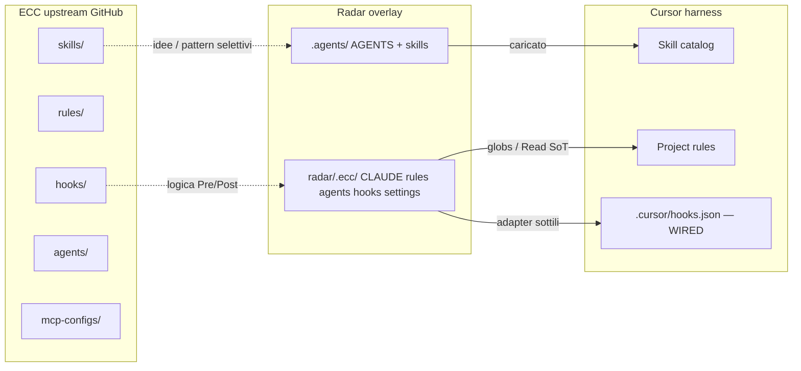
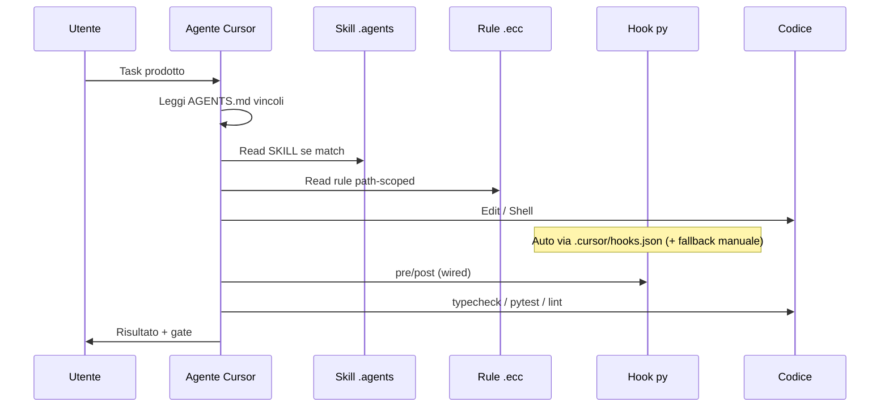

# Manuale ECC Radar — Deep Dive V2

> **Versione:** 2.1 (2026-07-27) — allineamento post-`feature/upgrades`  
> **SoT operativa:** [`docs/04_ecc_framework.md`](docs/04_ecc_framework.md) (preferire sempre questo file per inventory/wiring)  
> **V1:** `ecc_deep_dive_analysis.md` **non** è in questo monorepo (rimosso/assente)  
> **Workspace:** monorepo `Intelligence-Dashboard` (Linux)  
> **Branch tip allineato:** `feature/upgrades` (migrazioni `001`–`017`, 15 categorie, MapLibre primary)  
> **Upstream ECC:** [github.com/affaan-m/ECC](https://github.com/affaan-m/ECC) · [ecc.tools](https://ecc.tools) · docs [Mintlify Architecture](https://affaan-m-everything-claude-code.mintlify.app/concepts/overview)  
> **CodeWiki:** [codewiki.google/github.com/affaan-m/ecc](https://codewiki.google/github.com/affaan-m/ecc) — al momento della stesura **shell vuota**; non usarla come SoT.

Questo file è un **manuale di descrizione** dell’architettura ECC: cosa è ECC upstream, cosa c’è nel progetto Radar, cosa è *realmente* attivo in Cursor, e come espandere l’overlay **senza** reinventare l’OS ECC e **senza** contraddire i vincoli di prodotto (sidebar freeze, worker vs API, **15** categorie, MapLibre primary, ecc.).

---

## 0. Executive summary

| Domanda | Risposta corta |
|---------|----------------|
| ECC upstream cos’è? | Un **harness OS** multi-IDE (skills, agents, hooks, rules, MCP, commands) — non un singolo file di config |
| Cosa abbiamo in Radar? | Un **overlay di prodotto** a due namespace: `.agents/` (vivo in Cursor) + `radar/.ecc/` (policy, rules, agents, hooks, mirror) |
| È allineato al codice? | **Parziale** — usare `docs/04` + skill SoT come verità; questo deep-dive può restare descrittivo |
| È “pienamente” in uso? | **Hooks/rules wiring DONE** (`.cursor/hooks.json` + `.cursor/rules` globs); skill dominio Radar in espansione selettiva; profili agent = ancora prompt/Task manuale |
| Si può espandere? | **Sì**, seguendo la regola d’oro ECC: comportamento durevole in skill/rules/hooks; adapter harness sottili |
| Piano eseguibile? | Expansion **DONE** — vedi [`plan_impl_phase_0_6_execution.md`](plan-audit/complete/plan_impl_phase_0_6_execution.md); handoff [`handoff_ecc_expansion.md`](plan-audit/archive/ecc/handoff_ecc_expansion.md) resta come audit trail |
| Cosa non fare? | Non clonare i ~67 agent / ~278 skill upstream nel monorepo; non installare tutto ECC raw |



---

## 1. Identità ECC upstream (sistema “base”)

### 1.1 Cos’è

**Everything Claude Code (ECC)** è un *agent harness performance optimization system*: skill, security, continuous learning, workflow research-first, riusabile su Claude Code, Cursor, Codex, OpenCode, Gemini, Zed, Copilot, ecc.

Fonti canoniche:

| Risorsa | URL |
|---------|-----|
| Repo | https://github.com/affaan-m/ECC |
| Alias | https://github.com/affaan-m/ecc |
| Cross-harness | https://raw.githubusercontent.com/affaan-m/ECC/main/docs/architecture/cross-harness.md |
| Hooks README | https://raw.githubusercontent.com/affaan-m/ECC/main/hooks/README.md |
| Rules README | https://raw.githubusercontent.com/affaan-m/ECC/main/rules/README.md |
| CONTRIBUTING | https://raw.githubusercontent.com/affaan-m/ECC/main/CONTRIBUTING.md |
| MCP catalog | https://raw.githubusercontent.com/affaan-m/ECC/main/mcp-configs/mcp-servers.json |
| Architecture (Mintlify) | https://affaan-m-everything-claude-code.mintlify.app/concepts/overview |

### 1.2 Filosofia (5 principi + regola d’oro)

1. **Agent-First** — orchestrazione e specializzazione  
2. **Test-Driven** — verifica prima/accanto al codice  
3. **Security-First** — PreToolUse, secret scan, allowlist  
4. **Immutability** — rules come vincoli, non suggerimenti  
5. **Plan Before Execute** — planner / plan skill prima del big bang  

**Regola d’oro cross-harness** ([cross-harness.md](https://raw.githubusercontent.com/affaan-m/ECC/main/docs/architecture/cross-harness.md)):

> Il comportamento durevole vive in `skills/`, `rules/`, `hooks/`, `mcp-configs/`.  
> Gli adapter (`.claude/`, `.cursor/`, `.agents/`) restano **sottili**.  
> Se per cambiare un workflow editi tre copie harness, la source è nel posto sbagliato.

**Skills-first:** `skills/*/SKILL.md` è la superficie primaria; `commands/` è compatibilità slash/legacy.

### 1.3 Albero tipico upstream

```
ECC/
├── agents/                 # ~67 profili specializzati
├── skills/                 # ~278 skill — SKILL.md + origin: ECC
├── commands/               # slash /plan /tdd /review …
├── hooks/                  # hooks.json + memory-persistence/
├── rules/                  # common/ + typescript|python|angular|…
├── mcp-configs/            # catalogo MCP (abilitare <10)
├── scripts/                # implementazioni hook (Node)
├── manifests/              # install selettivo
├── AGENTS.md               # contratto cross-harness
├── CLAUDE.md               # entry Claude Code
├── .claude/ .cursor/ .agents/   # adapter sottili
└── docs/architecture/
```

### 1.4 Componenti e responsabilità

| Componente | Ruolo | Enforcement |
|------------|-------|-------------|
| **Skills** | Playbook *come fare* (when_to_use, esempi, anti-pattern) | Soft: agente le carica quando matchano |
| **Rules** | Vincoli *cosa non violare* (path/lang scoped) | Soft o path-load harness |
| **Agents** | Profili specialisti (tools, model, scope) | Dispatch harness / orchestrazione |
| **Hooks** | Pre/Post tool, SessionStart/End, PreCompact, Stop | **Hard** se registrati (exit 2 = block PreToolUse) |
| **Commands** | Intent slash (`/tdd`) | Trigger utente / menu |
| **MCP** | Tool esterni (GitHub, Context7, Playwright, …) | Config harness |
| **Settings** | Allowlist, domains, budget | Harness-specific |

Hook lifecycle tipico (upstream):

```
User → [SessionStart] → pick tool → [PreToolUse] → tool → [PostToolUse] → …
                                                      ↑ exit 2 = BLOCK
```

Profili runtime upstream: `ECC_HOOK_PROFILE=minimal|standard|strict`, `ECC_DISABLED_HOOKS=…`.

### 1.5 Come si espande upstream (playbook ufficiale)

1. **Nuova skill** → `skills/<name>/SKILL.md` (frontmatter `name`, `description`, `origin: ECC`; &lt;500–800 linee; When to Activate; anti-patterns). Sync opzionale verso adapter.  
2. **Nuova rule** → `rules/<lang>/` che *estende* `common/`, non la duplica.  
3. **Nuovo agent** → `agents/<name>.md` con tools minimi e description specifica.  
4. **Nuovo hook** → entry in `hooks.json` + script; matcher stretto; exit 0 warn / 2 block. Install via installer, **non** paste raw in settings.  
5. **Nuovo command** → solo se serve slash; preferire skill.  
6. **MCP** → opt-in selettivo da `mcp-configs/`; non abilitare tutto.

Install selettivo (v1.9+): `manifests/` + `install-plan` / `install-apply`.

### 1.6 Cosa NON reinventare da upstream

| Area | Perché riusare idea / modulo selettivo |
|------|----------------------------------------|
| TDD / verify / eval | Skill+agent maturi |
| Security-review, secret scan | PreToolUse + checklist |
| Format/typecheck PostToolUse | Pattern già cross-platform |
| Rules generiche TS/Python/Angular | `rules/common` + lang packs |
| Memory / strategic compact / instincts | Sistema complesso; Radar non è fork ECC |
| Catalogo MCP generico | Copia selettiva |
| I ~67 agent generici | Solo specializzare dove Radar diverge |

**Va specializzato localmente:** sidebar freeze, `worker.py` vs `main.py`, Pydantic CSV `str`, reti `radar-edge`/`radar-data`, `MOCK_MODE`, 15 categorie, cluster 40/spiderfy false, GeoJSON verify.

---

## 2. Architettura Radar — due namespace (as-is)

Radar **non** è un clone di ECC. È un **overlay di prodotto** (`radar-ecc-bootstrap`) che eredita filosofia (80/20, no placeholder, prompt defense, path-scope) e la applica a un monorepo concreto.

Documentazione operatore sintetica: [`docs/04_ecc_framework.md`](docs/04_ecc_framework.md).

### 2.1 Mappa path

```
Dashboard finance/
├── .agents/                              ← NAMESPACE GLOBALE (Cursor-vivo)
│   ├── AGENTS.md                         ← Magna Carta (project rule)
│   └── skills/
│       ├── angular-developer/            ← + references/
│       ├── llm-json-extraction/
│       ├── spatial-data-mocking/
│       ├── radar-sidebar-freeze/
│       ├── radar-api-contract/
│       ├── radar-docker-ops/
│       ├── radar-geojson-assets/
│       ├── radar-quota-ledger/
│       └── radar-requeue-ops/            ← ops re-ingest (se presente)
│
├── radar/.ecc/                           ← NAMESPACE LOCALE (policy + mirror)
│   ├── CLAUDE.md                         ← entry sessione + skill map
│   ├── settings.json                     ← allowlist, domains, pathScope, profiles
│   ├── rules/                            ← backend, frontend, docker (+ testing se presente)
│   ├── agents/                           ← 3 profili Task
│   ├── skills/                           ← mirror flat (sync da .agents)
│   ├── scripts/sync_skills.py            ← --check / --write
│   └── hooks/                            ← pre/post-tool-use.py
│
├── .cursor/
│   ├── hooks.json + hooks/*-adapter.py   ← WIRED → .ecc/hooks
│   ├── rules/radar-*.mdc                 ← globs → .ecc/rules
│   └── commands/                         ← radar-verify, radar-smoke, radar-lint
├── docs/04_ecc_framework.md              ← manuale operativo SoT
├── plan-audit/archive/ecc/               ← handoff expansion (DONE)
├── ecc_deep_dive_analysis.md             ← V1 archivio
└── ecc_deep_dive_analysis_v2.md          ← QUESTO FILE (descrittivo)
```

### 2.2 Mapping upstream → Radar

| Ruolo ECC upstream | Radar | Note |
|--------------------|-------|------|
| `AGENTS.md` cross-harness | `.agents/AGENTS.md` | Freeze, Docker, cluster, health, hook auto + fallback |
| `skills/*/SKILL.md` | `.agents/skills/*/SKILL.md` | **SoT playbook** per Cursor (8+ dominio) |
| Mirror progetto | `radar/.ecc/skills/*.md` | Flat; sync via `radar/.ecc/scripts/sync_skills.py` |
| `CLAUDE.md` | `radar/.ecc/CLAUDE.md` | Skill map + comandi + Phase status |
| `rules/common`+lang | `radar/.ecc/rules/{backend,frontend,docker}.md` (+ testing) | Domain-scoped, non lang-pack completo |
| `agents/*.md` | 3 profili Radar | Non i 67 generici; Task esplicito |
| `hooks/hooks.json` + Node | `radar/.ecc/hooks/*.py` + `.cursor/hooks.json` adapters | Logica in `.ecc`; **registrazione Cursor WIRED** |
| Settings / allowlist | `radar/.ecc/settings.json` | Policy dichiarativa, non Cursor nativa |
| `mcp-configs/` | (IDE MCP utente) | Non in `.ecc` |
| `commands/` | `.cursor/commands/radar-{verify,smoke,lint}.md` | Shortcut minimi; non sostituiscono skill |

### 2.3 Inventario dettagliato componenti Radar

#### A. `.agents/AGENTS.md` (Magna Carta)

- Stack ufficiale, sidebar freeze, asyncpg, Docker edge/data, cluster 40 / spiderfy false  
- Phase 0–6 DONE / GATE VERDE; deferred digest / legacy-peer-deps  
- §6: **hook Cursor auto** (`.cursor/hooks.json`) + fallback manuale documentato  
- **Stato Cursor:** caricato come project rule → **attivo**

#### B. Skills (SoT = `.agents/skills/`)

| Skill | Quando | SoT codice |
|-------|--------|------------|
| `angular-developer` | FE Angular 21 generico + references | Pattern Angular; non Radar-specific |
| `llm-json-extraction` | `worker.py` / classification / commit (Gemini + OpenAI-compat) | Pydantic strict, CSV `str`, complexity v2.2 |
| `spatial-data-mocking` | UI offline / MOCK_MODE | **15** categorie, overlay, map-summary + articles page |
| `radar-sidebar-freeze` | UI laterale / carousel / read-unread | **BLOCCA** `radar-sidebar/**` |
| `radar-api-contract` | `main.py`, articles query, FE services | map-summary + envelope cursor |
| `radar-docker-ops` | Compose, Dockerfile, health, ops | edge/data, live vs ready, verify-geojson |
| `radar-geojson-assets` | `assets/data`, FE Dockerfile GeoJSON | ASSET_LICENSE, `--fetch`, gitignore |
| `radar-quota-ledger` | `quota.py`, ledger SQL | reserve/complete/fail; lane SIMPLE/COMPLEX |
| `radar-requeue-ops` | Re-ingest Miniflux incident | dry-run → exec → restart worker |

**Stato Cursor:** catalogo `available_skills` = directory sotto `.agents/skills/` → l’agente deve **Read** `SKILL.md` al match. I mirror `radar/.ecc/skills/*.md` **non** sono nel catalogo.

#### C. `radar/.ecc/CLAUDE.md`

Entry-point: tree repo, Regola 80/20, comandi (verify-geojson, runbook, CI), skill map, prompt defense.  
**Stato:** contestuale se si lavora sotto `radar/.ecc/`; non system prompt globale di ogni chat.

#### D. Rules path-scoped

| Rule | Scope dichiarato | Contenuto chiave |
|------|------------------|------------------|
| `backend.md` | `backend/**` | Worker loop, no sleep in finally, quote ledger, API Phase 5 map-summary |
| `frontend.md` | `frontend/**` | Freeze sidebar, MapLibre primary + Leaflet legacy, cluster, MOCK_MODE, map-summary |
| `docker.md` | Compose/Dockerfile | edge/data, `./data/postgres`, uvicorn `app.main:app`, verify-geojson, nginx 1.27 |
| `testing.md` | tests / `*.spec.ts` | `not live`, MOCK_MODE TestBed, no tocco sidebar |

`settings.json` → `contextScope` **documenta** il path-scoping; Cursor **esegue** i globs via `.cursor/rules/radar-*.mdc` (pointer al SoT).

#### E. Agent profiles

| Agent | Dominio | Exclude |
|-------|---------|---------|
| `pipeline-engineer` | ingest / worker / classification | — |
| `angular-map-expert` | mappa MapLibre (Leaflet legacy) / FE | `radar-sidebar/**` |
| `geo-data-architect` | migrations / commit / DB | — |

Dichiarati in `settings.agentProfiles`. **Non** dispatchano automaticamente i Task Cursor.

#### F. Hooks Python (Phase 6 ready)

| Hook | Comportamento |
|------|----------------|
| `pre-tool-use.py` | Path vietati, secret (Gemini/Google/Postgres/Miniflux), comandi pericolosi, domains `==` o `.endswith('.'+allowed)` |
| `post-tool-use.py` | ruff su `.py`, prettier su FE; **fail-closed** se linter assente; TODO = soft warn; tool ECC+Cursor |

**Registrazione:** `.cursor/hooks.json` → adapters → `radar/.ecc/hooks/*.py` (**WIRED**).  
`settings.hooks.notes` + `docs/04` + `AGENTS.md` documentano auto + **fallback manuale**.  
Rules native: `.cursor/rules/radar-*.mdc` globs → SoT `radar/.ecc/rules/*`.

#### G. `settings.json` (policy)

- Tool allowlist dual ECC↔Cursor  
- Domains sync con hook (incluso `raw.githubusercontent.com`, `registry.npmjs.org`, `opendatacommons.org`)  
- Secret redaction allineata agli hook  
- `contextBudget` 80% + `CHECKPOINT.md` (policy testuale)  
- `codeQuality.forbiddenPatterns` (TODO/FIXME/…)  
- Opzionale prodotto non ancora in allowlist: `*.basemaps.cartocdn.com`

---

## 3. Cosa è effettivamente in uso nel sistema (Cursor)

| Componente | Attivo? | Meccanismo |
|------------|---------|------------|
| `.agents/AGENTS.md` | **Sì** | Project rule iniettata |
| `.agents/skills/*/SKILL.md` | **Sì** | Catalogo skill; Read on trigger |
| `angular-developer/references/*` | **On-demand** | Solo se skill Angular le apre |
| `radar/.ecc/CLAUDE.md` | **Parziale** | Rule contestuale path `.ecc` |
| `radar/.ecc/rules/*` | **No auto** | Solo se l’agente le legge / citate |
| `radar/.ecc/agents/*` | **No auto-dispatch** | Prompt/profilo manuale o Task esplicito |
| `radar/.ecc/skills/*` | **Mirror** | Non nel catalogo Cursor |
| `radar/.ecc/settings.json` | **Policy-only** | Nessun enforcement runtime Cursor |
| `radar/.ecc/hooks/*.py` | **Auto via Cursor** | `.cursor/hooks.json` + adapters; fallback manuale OK |
| MCP ECC progetto | **No** | Nessun `mcp.json` Radar in repo |
| Commands Radar | **Sì** | `.cursor/commands/radar-{verify,smoke,lint}.md` |

### Implicazione operativa

L’ECC Radar **guida** (AGENTS.md + skill) e **enforce** security/lint a ogni tool call rilevante via `.cursor/hooks.json` → adapters → `radar/.ecc/hooks/*.py`. Rules path-scoped arrivano via `.cursor/rules/radar-*.mdc` (pointer al SoT). Il gap wiring P0 è **DONE**; espansione restante = selettiva (sync mirror, skill ops, rule testing) — vedi [`docs/04_ecc_framework.md`](docs/04_ecc_framework.md).

---

## 4. Confronto V1 → V2 (cosa è cambiato)

La V1 (`ecc_deep_dive_analysis.md`) era un’analisi teorica precoce. Molti esempi sono **stale** rispetto al codice attuale. Usarli come SoT è pericoloso.

| Tema | V1 (stale) | Realtà V2 (2026-07-15) |
|------|------------|-------------------------|
| Categorie Pydantic | Chip, Acqua, Elettronica | 10: Nucleare…Sicurezza |
| Multi-valore schema | `List[str]` | `str` CSV in Pydantic; `string[]` solo FE post-API |
| Ingest | spesso implicito in `main.py` | Solo `worker.py` / `radar-worker` |
| Layout FE | split 70/30 | Overlay full-bleed Phase 4 |
| Mock | fallback / getArticles only | `MOCK_MODE` + `getMapSummary` / `getArticlesPage` |
| Reti | 3 servizi / `radar-network` | 5 servizi, `radar-edge` + `radar-data` |
| Cluster | valori legacy variabili | `maxClusterRadius: 40`, `spiderfyOnMaxZoom: false` |
| Hooks FE lint | eslint | prettier (`npm run lint`) |
| ECC locale | ipotesi `.claude/` | Due namespace `.agents/` + `radar/.ecc/` |
| Phase | pre-consolidation | Phase 0–6 GATE VERDE + remediation |

**Regola:** per vincoli prodotto → `AGENTS.md`, `radar/.ecc/rules/*`, codice.  
Per comprensione ECC generica → questo V2 + upstream GitHub.  
V1 = archivio storico.

---

## 5. Gap rispetto a ECC “completo” (espandibilità)

### 5.1 Matrice gap

| Capacità ECC | Upstream | Radar oggi | Espandibile? |
|--------------|----------|------------|--------------|
| Skills dominio | Centinaia | **8+** (core + radar-*) | Solo se gap ripetuto reale |
| Rules path/lang | common+lang | 3 domain (+ testing) + `.cursor/rules` globs | Estendere selettivo |
| Hooks auto | hooks.json + installer | **P0 DONE** — `.cursor/hooks.json` + adapters → `.ecc/hooks/*.py` | Solo matcher HARD nuovi |
| Agents dispatch | nativo Claude / orchestrazione | 3 markdown; Task esplicito | Non auto-dispatch di massa |
| Commands slash | `/plan` `/tdd` … | **3** Radar (`verify`/`smoke`/`lint`) | Solo shortcut, non catalogo |
| MCP | catalogo | Solo IDE utente | Opzionale selettivo |
| Memory / instincts / compact | maturo | Solo Regola 80/20 testuale | **Bassa priorità** (non reinventare) |
| Sync skill multi-copia | manifest/installer | `radar/.ecc/scripts/sync_skills.py` | Tenere `--check` verde |
| Path-scope enforcement | harness | `.cursor/rules/*.mdc` + settings dichiarativo | Allineare globs se serve |

### 5.2 Espansione — stato AS-IS (non backlog wiring)

Espandere **finché utile**, non fino a clonare ECC.

#### P0 — Enforcement — **DONE** (storico)

- `.cursor/hooks.json` → `preToolUse` / `postToolUse` / `afterFileEdit` → adapters → `radar/.ecc/hooks/*.py`
- `.cursor/rules/radar-*.mdc` globs → SoT `radar/.ecc/rules/*`
- **Non** ricreare wiring; **non** paste raw `hooks.json` upstream

#### P1 — Skills dominio — **DONE** (selettivo)

Skill Radar presenti sotto `.agents/skills/radar-*/` (freeze, api-contract, docker-ops, geojson, quota-ledger, + requeue-ops).  
Nuove skill **solo** con gate: workflow ≥2–3×, anti-pattern costosi, `when_to_use` chiaro.  
Formato: SoT `.agents/skills/<name>/SKILL.md` → `python radar/.ecc/scripts/sync_skills.py --write` → riga in skill map `CLAUDE.md`.

#### P1 — Sync SoT — **tooling**

```text
python radar/.ecc/scripts/sync_skills.py --check   # exit 0 se allineati
python radar/.ecc/scripts/sync_skills.py --write   # copia SoT → mirror flat
```

#### P2 — Agents / commands — **minimo DONE**

- Profili Task documentati in `CLAUDE.md` (angular-map-expert / pipeline-engineer / geo-data-architect)
- Commands: `.cursor/commands/radar-verify.md`, `radar-smoke.md`, `radar-lint.md`

Preferire skill se il workflow è lungo; command solo come shortcut.

#### P2 — Rules aggiuntive

| Rule | Scope | Stato |
|------|-------|--------|
| `testing.md` | tests / `*.spec.ts` | **DONE** — presente + wired via `.cursor/rules` |
| `security.md` | shared | Opzionale — secret già negli hook |
| `migrations.md` | `backend/migrations/**` | Opzionale — già in geo-data-architect / backend rule |

#### P3 — MCP / domini opzionali

- Abilitare MCP solo se usati (es. Context7) — &lt;10 attivi.  
- Valutare `*.basemaps.cartocdn.com` in allowlist se tool agente fetchano tile.  
- Non portare AgentShield / ecc2 / memory-persistence.

#### Fuori scope (non espandere così)

- Clonare intero repo ECC nel tree Radar  
- Memory-persistence / continuous-learning / Plan Canvas  
- 67 agent generici  
- Riaprire vincoli prodotto (sidebar, categorie, worker-only) via “nuove skill”

---

## 6. Playbook operativo: come aggiungere un pezzo ECC in Radar

### 6.1 Nuova skill (canonica)

```text
1. Creare .agents/skills/<name>/SKILL.md
   - frontmatter: name, description, when_to_use, version
   - sezione "Quando Usare", SoT codice (path file reali), anti-pattern
2. Aggiornare skill map in radar/.ecc/CLAUDE.md
3. Mirror: `python radar/.ecc/scripts/sync_skills.py --write` (o copia flat `radar/.ecc/skills/<name>.md`)
4. Se serve in Cursor subito: verificare che appaia in available_skills
5. Non contraddire AGENTS.md / rules
```

### 6.2 Nuova rule path-scoped

```text
1. Scrivere radar/.ecc/rules/<area>.md (OBBLIGATORIO / VIETATO / criteri accettazione)
2. Aggiungere entry in settings.json → contextScope.rules
3. Idealmente: .cursor/rules con globs che caricano la stessa truth
4. Se vincolo globale: 1 bullet in .agents/AGENTS.md
```

### 6.3 Nuovo / esteso hook

```text
1. Estendere pre-tool-use.py o post-tool-use.py (matcher stretto) — SoT logica
2. Tenere settings.json domains/secrets in sync con SECRET_PATTERNS / ALLOWED_DOMAINS
3. Cursor già cablato via .cursor/hooks.json + adapters; aggiornare adapter solo se cambia il contratto JSON
4. Test: echo JSON | python .cursor/hooks/pre-tool-use-adapter.py  → permission allow/deny
   (fallback: echo JSON | python radar/.ecc/hooks/pre-tool-use.py → exit 0/1)
```

### 6.4 Nuovo agent profile

```text
1. radar/.ecc/agents/<name>.md (frontmatter tools/model/scope/exclude)
2. settings.json → agentProfiles
3. Documentare in CLAUDE.md quando spawnarlo
4. Non usare per sostituire AGENTS.md
```

### 6.5 Checklist anti-drift (da handoff §9, da tenere viva)

```text
rg -n "primary_category: '(Chip|Acqua|Elettronica)'" .agents/skills radar/.ecc
rg -n "eslint" radar/.ecc/agents/angular-map-expert.md
rg -n "raw.githubusercontent.com" radar/.ecc/settings.json radar/.ecc/hooks/pre-tool-use.py
git diff --stat -- radar/frontend/src/app/components/radar-sidebar
# → vuoto
```

---

## 7. Ciclo di vita consigliato in sessione (Radar + ECC)

Allineato allo spirito ECC (plan → skill → execute → hook → verify), adattato a Cursor:



Comandi già documentati in `CLAUDE.md`:

- FE: `npm run typecheck|test:ci|lint|build:ci`  
- BE: `pytest -m "not live"`  
- GeoJSON: `node scripts/verify-geojson.mjs`  
- Ops: `radar/docs/runbook.md`  
- CI: `.github/workflows/ci.yml`

---

## 8. Restore points ECC / prodotto (git)

| Punto | SHA | Note |
|-------|-----|------|
| Phase 5 | `1dfdf60` | map-summary + articles paged |
| Phase 6 GATE VERDE | `56c2eff` | docs/CI/GeoJSON/runbook/hooks |
| ECC remediation (storico) | `526c856` | snapshot early overlay; verità corrente = `docs/04` + skill SoT su `feature/upgrades` |
| Phase 4 | `de9bd2f` | MOCK_MODE, XSS markers, read/unread |

Sidebar freeze: **sempre** zero touch `radar/frontend/src/app/components/radar-sidebar/**`.

---

## 9. Riferimenti interni e archivio

| Path | Uso |
|------|-----|
| `.agents/AGENTS.md` | Vincoli immutabili prodotto |
| `radar/.ecc/CLAUDE.md` | Entry sessione |
| `docs/04_ecc_framework.md` | Panoramica operatori |
| `plan-audit/archive/ecc/handoff_ecc_architecture_audit.md` | Audit + checklist remediation |
| `plan-audit/complete/plan_impl_phase_0_6.md` / `_execution.md` | Fasi prodotto |
| `ecc_deep_dive_analysis.md` | **V1 archivio** — non SoT (rimosso) |
| `plan-audit/archive/plans/plan_backend_ecc.md` / `plan_frontend_ecc.md` | Archivi — claim stale |
| `Fase2_Implementation_Plan.md` | Archivio |

---

## 10. Conclusioni

1. **ECC upstream** è un OS multi-harness; Radar ne usa correttamente la *filosofia* come overlay sottile.  
2. **Contenuti ECC Radar** — preferire `docs/04_ecc_framework.md` + `.agents/skills/*/SKILL.md`; questo deep-dive è descrittivo (allineato 2026-07-27 su 15 cat / migrazioni 001–017 / MapLibre).  
3. **Uso reale in Cursor** = Magna Carta + skill + **hooks/rules wiring** (P0 DONE) + commands minimi.  
4. **Espansione restante:** sync SoT, skill ops selettive, rule testing — non clonare catalogo.  
5. **Manuale operativo SoT** = [`docs/04_ecc_framework.md`](docs/04_ecc_framework.md); questo V2 resta descrittivo.  
6. Aggiornare V2 quando cambiano inventario skill/rules/hooks o stato wiring.

---

*Analisi supportata da sottoagenti: inventario locale Radar + baseline GitHub/Mintlify (CodeWiki non utilizzabile come SoT).*
