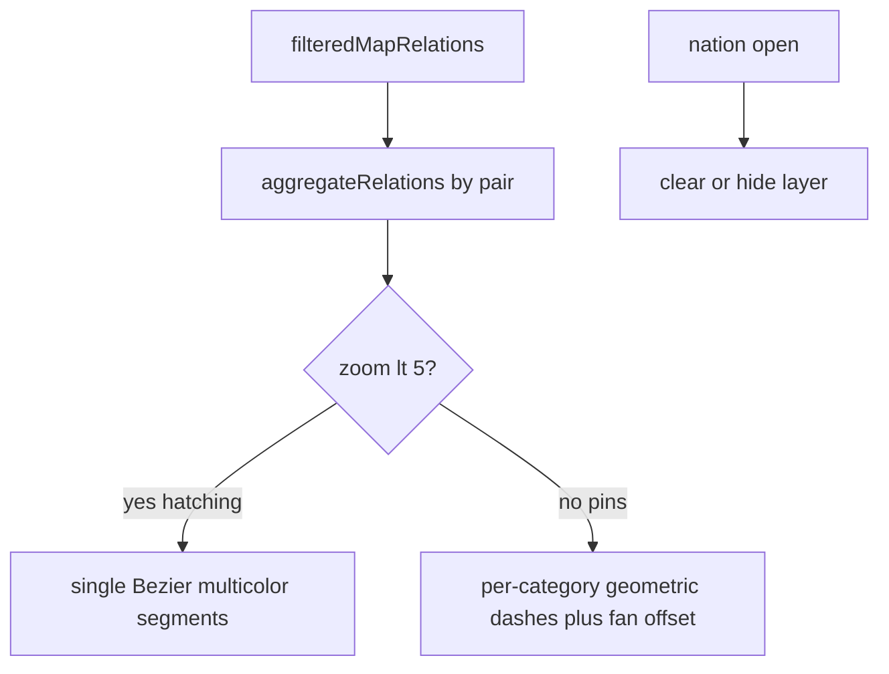

# Piano — Archi hatching multicolore (zoom &lt; 5)

**Progetto:** Radar Informativo Globale  
**Documento:** `plan-audit/active/plan_archi_hatching_multicolor.md`  
**Stato:** Attivo — v1 implementata in FE; piano tenuto in `active/` per follow-up  
**Data:** 2026-07-18  
**Contesto:** follow-up Fase H ([`../complete/master_plan_impl_phase_H_geospatial_graph.md`](../complete/master_plan_impl_phase_H_geospatial_graph.md))

**Overview:** Archi in hatching (zoom &lt; 5) come 1 linea aggregata **multicolore** per coppia paese↔paese; a zoom ≥ 5 linee **per-categoria** con tratteggio geometrico (no `dashArray`).

---

## Stato implementazione (2026-07-18)

| Zoom | Vista | Archi (AS-IS codice) |
|------|--------|----------------------|
| **&lt; 5** | Hatching | **1 Bézier multicolore** per coppia (`drawMacroRelations` + `aggregateRelations`), soft, `.relational-arc-flow--macro` |
| **≥ 5** | Pin | **1 linea per** `(pair × primary_category)`, fan con **offset di curvatura**, tratteggio **geometrico** (`addGeometricDashedPolyline`, sampling 60, dash/gap 1/1) — niente `dashArray`/animazione CSS |
| Nation open | Detail | Layer relazioni nascosto |

**Bugfixati in questa iterazione**

1. Sovrapposizione totale di categorie sulla stessa Bézier a zoom ≥ 5 → solo una linea visibile → **fan offset**.
2. “Scorrimento” del tratteggio a ogni pan → causato da `dashArray`/CSS su ridisegno Leaflet → **tratteggio geometrico** lat/lng.

**File toccati:** `radar-map.component.ts` / `.scss` / `.spec.ts`, `leaflet.stub.ts`, `docs/03_frontend_and_ui.md`, `radar/.ecc/rules/frontend.md`, `radar/.ecc/agents/angular-map-expert.md`.

---

## Decisione v1 (confermata)

1. **Zoom &lt; 5 (hatching):** aggregazione FE per `source|target`; segmenti colorati proporzionali al volume; tooltip breakdown.
2. **Zoom ≥ 5 (pin):** linee per-categoria (non multicolore aggregato); tratteggio geometrico denso; fan parallelo se multi-categoria sulla stessa coppia.
3. **Nation-open:** hide.
4. **No** nuove dipendenze npm / `leaflet-curve`.

---

## Fuori scope / deferred (piano resta attivo)

- Linea **multicolore aggregata** anche a **zoom ≥ 5** (da decidere).
- Click arco → navigazione; frecce direzionali; cambi API.
- Ulteriori tuning densità tratteggio / peso / opacity su feedback UI.

---

## Test manuali (checklist)

1. Seed `2026-07-18`, day-view, **zoom 3**: archi sottili multicolore sopra hatching.
2. Hover macro: tooltip con breakdown tipologie.
3. **Zoom ≥ 5**: N linee per N categorie sulla stessa coppia (es. IT↔CN Economia + Energia), tratteggio corto e fermo al pan.
4. Apri nazione: archi spariscono.
5. Filtro categoria toolbar: in hatching solo pair con volume residuo post-filtro.
