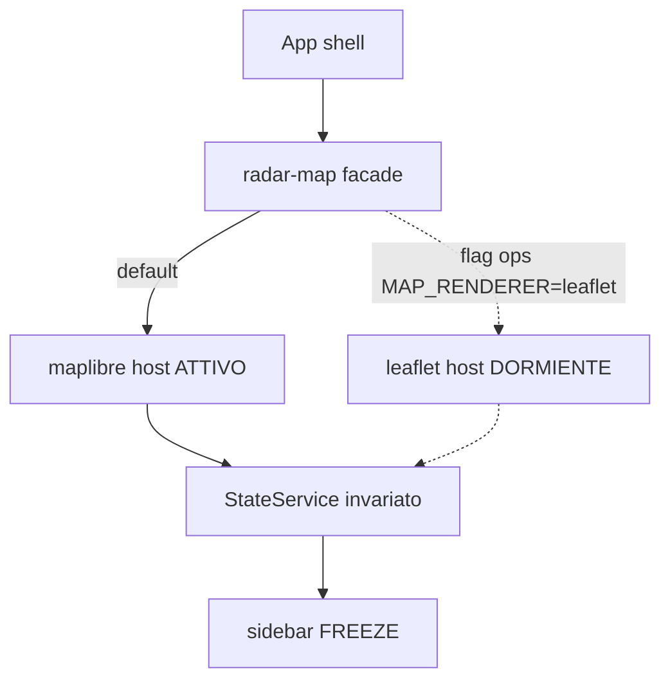
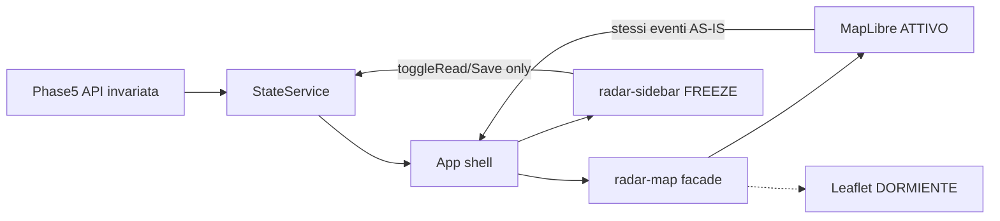

# plan_impl_map_3d_globe — Fase I (MapLibre 3D-primary)

> **Stato:** ACTIVE — codice Fase I shipped (MapLibre primary); docs/ECC allineati 2026-07-20. GATE formale / move a `complete/` su ok utente.  
> **Data:** 2026-07-20  
> **Follow-up globo (sempre):** [`plan_impl_map_globe_projection.md`](plan_impl_map_globe_projection.md) / overview §3.J  

# Mappa 3D / Globe — AS-IS vs TO-BE + decisione vincolante

## 1) Executive summary

**Raccomandazione vincolante: 3D-primary (MapLibre)** come unico path *sviluppato e usato*; **Leaflet AS-IS conservato congelato** (compilabile, raggiungibile solo via flag ops), **non eliminato**, così un giorno si può riprendere uno switch 2D↔3D senza riesumare da git. Cesium resta runner-up solo se lo spike W1 fallisce su archi/picking.

**Vincolo prodotto (chiuso dal PO):** tutte le procedure già presenti restano **invariate graficamente e comportamentalmente** — zoom/focus nazione, hatching, pin conic, archi H (macro/dash/fan), hub/spiderfy, marker-read, Notizie Salvate, sidebar/carosello, overlay full-bleed. Si cambia il *motore mappa*; si *portano* le feature, non si ridisegna il prodotto.

**Perché non switch utente ora:** dual-parity *attiva* (sviluppare entrambe) costa ×2 su ~2.2k LOC. Il PO vuole però **tenere** il 2D funzionante senza svilupparlo → modello **dormant legacy**, non delete e non comment-out.

**Perché MapLibre:** allinea a §3.D, bundle snello, HTML markers (riuso CSS pin/spider), API Phase 5+ e sidebar freeze intatti.

**Organizzazione codice (chiusa):** **file nuovi per MapLibre** + spostare l’AS-IS Leaflet in modulo legacy; facade comune. **Vietato** commentare metodi nel file monolitico attuale.

**Chiusura qualità (nuova §8):** ogni wave include test scripting CI, verifiche interne, rebuild Docker mirato, e a GATE aggiornamento README/docs + plan-audit + architettura ECC (`sync_skills`). Requeue Miniflux/vault solo se servono articoli freschi in mappa.

**Documentazione a due livelli:** piano base I + **sempre** riferimento a [`plan_impl_map_globe_projection.md`](plan-audit/active/plan_impl_map_globe_projection.md) / overview **§3.J** per l’ampliamento globo; overview aggiorna anche **§3.D** (tile offline) per le fasi successive.

---

## 2) Matrice parity AS-IS → 3D


| Feature AS-IS                                 | Gap 3D                                         | Mitigation                                                                                                                                     |
| --------------------------------------------- | ---------------------------------------------- | ---------------------------------------------------------------------------------------------------------------------------------------------- |
| Day hatching zoom &lt; `MAP_ZOOM_PIN_THRESHOLD` (4) + isteresi 0.4 | No SVG overlay Leaflet                         | **AS-IS MapLibre:** fasce soft O→E (1 colore × tipologia; mainland US/RU). Spike storico: `fill-pattern` / canvas — **superseded** post-ship (leggibilità globo). Leaflet legacy: SVG combo. Latch: `resolvePinMode` / `pinModeActive` |
| Pin nazione conic-gradient (DivIcon)          | CSS conic non nativo WebGL                     | **HTML Marker** overlay (stesso DOM/CSS di oggi) ancorato al centroide                                                                         |
| Hub `radar-spider-root` + spiderfy emoji MC   | `leaflet.markercluster` non esiste in MapLibre | Riscrittura fan custom (HTML markers su cerchio) + policy latch pin keep / latch hatching collapse; **niente** MC                                     |
| Dummy markers + `maxClusterRadius: 40`        | N/A in 3D                                      | Eliminare dummy; un hub per nazione + fan per categoria attiva                                                                                 |
| Archi macro multicolore zoom basso            | Pane canvas Leaflet                            | Great-circle LineString multi-segment colorati (source layer). **AS-IS MapLibre (post-ship):** stesso stile a **tutti** gli zoom (no fan/dash) |
| Archi dashed per-cat + fan zoom alto          | `addGeometricDashedPolyline` Leaflet-specific  | **Solo Leaflet legacy.** MapLibre: **superseded** — macro multicolore solida anche a zoom ≥ 5 (UX intenzionale, non parity dash). Hit-buffer + hover paint restano |
| Hover/click → `loadRelationArticles`          | Event model diverso                            | Click layer → stessi output App (`relationClicked`) → State invariato                                                                          |
| Nation open nasconde archi                    | —                                              | Stesso gate su `detailArticles.length`                                                                                                         |
| `.marker-read` senza rebuild                  | Fingerprint geometry                           | Stesso: mutare class su HTML marker; fingerprint resta in State/App                                                                            |
| US/RU mainland centroid + bounds              | —                                              | Portare costanti; in globe usare stesso lat/lng hardcoded                                                                                      |
| Full-bleed + `invalidateSize`                 | `map.resize()`                                 | Chiamare su open/close sidebar / window resize                                                                                                 |
| Saved parity fitBounds+flyTo6+spiderfy        | Camera 3D                                      | `fitBounds`/`flyTo` MapLibre + stesso path State                                                                                               |
| Carto dark tiles                              | CDN vs air-gap                                 | Online: style URL Carto/MapLibre demotiles; offline: §3.D vector/raster via `/tiles/`                                                          |
| `window.L` scripts[]                          | UMD MC                                         | **Conservare** `angular.json` `scripts[]` per path Leaflet dormiente post-GATE; **non** rimuovere. Lazy dual-host = residual futuro (oggi facade eager-importa entrambi) |
| GeoJSON ~14MB incremental rAF                 | Stesso asset                                   | Conservare parse batched; preferire source MapLibre nativo + simplify se spike lo richiede                                                     |


**Non portabile 1:1 (accettare rewrite):** spiderfy MC privato, geometric-dash polylines, `pickCountryCodeAt` + `_containsPoint`, SVG hatch defs in overlay pane.

**Resta invariato (non toccare):** `[state.service.ts](radar/frontend/src/app/services/state.service.ts)` contratti API; `[radar-sidebar/**](radar/frontend/src/app/components/radar-sidebar/)` (freeze); MOCK_MODE esplicito.

**Parity grafica = GATE non negoziabile:** se una procedura AS-IS manca o “si sente diversa” (es. click arco non apre lo stesso carosello bilaterale), la wave non chiude. Motore diverso sotto; UX sopra uguale.

---

## 2.b) Conservare Leaflet dormiente — come strutturare il codice

**Obiettivo PO:** non buttare il sistema 2D che oggi funziona; non svilupparlo; poterlo riprendere un giorno per uno switch.


| Approccio                                                 | Verdetto              | Perché                                                                                    |
| --------------------------------------------------------- | --------------------- | ----------------------------------------------------------------------------------------- |
| Commentare metodi nel `radar-map.component.ts` monolitico | **No**                | Codice morto illeggibile; merge hell; test confusi; non è un path ripristinabile pulito   |
| Cancellare Leaflet dopo W4                                | **No** (revisione PO) | Perde l’asset funzionante; switch futuro = riesumare da git                               |
| Sviluppare switch UX ora (toolbar 2D/3D)                  | **No ora**            | Dual-parity attiva = ×2 effort su ogni fix                                                |
| **Due host + facade + flag**                              | **Sì**                | 3D attivo; 2D congelato intero e leggibile; un giorno lo switch è “accendere UI + policy” |


**Struttura target (vincolante per l’impl):**

```text
radar-map/
  radar-map.component.ts          ← facade sottile: stessi @Input/@Output di oggi;
                                     monta UN solo host via MAP_RENDERER
  maplibre/
    radar-map-maplibre.component.*  ← NUOVO: tutta la logica 3D (day/archi/spider)
  leaflet/
    radar-map-leaflet.component.* ← AS-IS spostato quasi 1:1 (freeze LEGACY);
                                     nessuna nuova feature salvo bug critici di sicurezza
```

- **App / State / sidebar:** invariati; parlano solo con la facade (stessi eventi `countryClicked`, `relationClicked`, `focusAndSpiderfyCategory`, …).
- **Default runtime:** `MAP_RENDERER=maplibre` (o equivalente build-time / injection token).
- **Leaflet path:** resta nel repo, resta in `package.json` + `angular.json` `scripts[]`, ma **non** nel bundle critico se lazy: caricare Leaflet **solo** se il flag è `leaflet` (dynamic import / ng component lazy), così il path 3D non paga il peso 2D.
- **Policy freeze Leaflet:** vietato aggiungere hatching/archi/spider “nuovi” sul path 2D mentre si lavora al 3D. Un giorno, per lo switch prodotto, si scongela e si allinea — non prima.
- **Test:** suite attiva = MapLibre (parity Tests 1–7). Suite Leaflet = smoke/compilazione o skip esplicito “legacy”; non obbligo di dual-test ogni PR.




---

## 3) Tabella stack 3D candidati + scelta


| Criterio             | **MapLibre GL JS** (scelta)                       | **CesiumJS** (runner-up)                                                       | **globe.gl / three-globe** (scartato)       |
| -------------------- | ------------------------------------------------- | ------------------------------------------------------------------------------ | ------------------------------------------- |
| Licenza              | BSD                                               | Apache-2.0                                                                     | MIT                                         |
| Offline / §3.D       | Nativo con `tileserver-gl` + style JSON / MBTiles | Possibile (`UrlTemplateImageryProvider`) ma Ion-centric; terrain DEM opzionale | Texture statiche; debole per GIS tiles ops  |
| Bundle (ordine)      | ~200–400 KB gz core                               | Multi-MB (Worker+Assets)                                                       | three + globe ~medio                        |
| Maturità archi       | Line layers + dash; great-circle via precompute   | `PolylineGeometry` geodesic / tube maturo                                      | Archi “wow” out-of-box, hit-test/ops scarsi |
| Pin / DOM overlay    | Marker HTML / Popup ottimi                        | Entity + HTML overlay ok ma pesante                                            | HTML elements ok, picking nazioni debole    |
| Effort FE Angular 21 | Medio: nuovo host, no `window.L`                  | Alto: asset Cesium, workers, CSS isolation                                     | Medio-basso demo, alto per parity H+spider  |
| Estetica ops dark    | Style dark-matter / custom                        | Globe “NASA” — overkill                                                        | Demo globe, meno Palantir-ops               |


**Scelta:** MapLibre GL JS. Opzionale in W3: `deck.gl` ArcLayer **solo se** LineString non regge densità; non aggiungere deck di default.

**Archi + pin per stack scelto:**

- Archi: precompute great-circle (n punti) → GeoJSON LineString; **MapLibre AS-IS:** sempre macro = segmenti colorati ∝ volume (linea continua, tutti gli zoom). **Leaflet legacy:** pin-zoom = **geometric dash** (segmenti + gap; **non** `line-dasharray` pixel) + fan offset. Click su hit layer largo + hover thicken/tooltip.
- Pin/hub/spider: HTML overlay (riuso CSS conic in `[styles.scss](radar/frontend/src/styles.scss)`); fan emoji = markers su angoli equispaziati.

**Air-gap (§3.D):** MapLibre **non** richiede terrain/imagery Cesium Ion. Fallback online→offline = cambio `style` URL a `/tiles/...` (aggiornare blueprint D: non solo PNG Leaflet). Terrain DEM = **out of scope** v1 (globe ellipsoid / flat-mercator+globe projection basta).

---

## 4) Decisione Switch vs 3D-only (vincolante, aggiornata)


| Dimensione    | Switch UX attivo ora        | 3D-primary + Leaflet dormiente     | Soft hybrid auto        |
| ------------- | --------------------------- | ---------------------------------- | ----------------------- |
| Engineering   | 2 path *sviluppati* forever | 1 path sviluppato; 1 congelato     | Quasi 2 path da testare |
| Runtime       | Due engine o lazy-switch    | Solo MapLibre in sessione tipica   | Entrambi possibili      |
| Asset 2D      | Vivo                        | **Conservato intero, non evoluto** | Conservato + usato      |
| Switch futuro | Già fatto                   | Possibile: scongelare + UI         | Parziale                |


**Decisione: 3D-primary + Leaflet dormiente (freeze legacy).**

- Prodotto oggi: esperienza unica 3D con **parity grafica completa**.
- Codice oggi: Leaflet non cancellato, non commentato — modulo legacy dietro flag.
- Switch 2D↔3D: **BACKLOG futuro esplicito**, non in scope wave I; quando arriverà, riparte dal modulo `leaflet/` già presente.




---

## 5) Overview `radar_overview_and_upgrades.md` — estensione obbligatoria

A W5 (o su richiesta esplicita) aggiornare l’overview **non solo** con lo scope di Fase I, ma con **tutte le considerazioni fuori-fase** già decise, così le fasi successive non ripartono da zero.

### 5.1 Tabella stati §3 — righe da aggiungere / aggiornare

```markdown
| **I** | Mappa 3D-primary MapLibre (parity day-view; Leaflet dormiente) | **BACKLOG** → **DONE** a GATE I |
| **I-bis / J** | Upgrade proiezione globo vero (se v1 = 2.5D) | **Futuro** — SoT dettaglio: `plan-audit/.../plan_impl_map_globe_projection.md` |
| **D** | Mappe offline air-gapped | **Futuro** — target FE aggiornato a MapLibre `style` → `/tiles/` (non più solo Leaflet PNG) |
```

Nota numerazione: usare **`### J.`** se si preferisce lettera nuova dopo I; in tabella si può etichettare **I-bis / J** per chiarire che è il follow-up di I. Switch UX 2D↔3D: **non** nuova lettera finché non c’è piano dedicato — solo bullet “Futuro” dentro §3.I.

### 5.2 Draft `### I. Mappa 3D-primary (MapLibre)` — contenuto minimo

- **Stato / SoT:** BACKLOG→DONE; piano base [`plan_impl_map_3d_globe.md`](plan-audit/active/plan_impl_map_3d_globe.md).
- **Decisione prodotto:** 3D-primary; Leaflet congelato (`MAP_RENDERER`); parity grafica obbligatoria; API Phase 5+ invariata; sidebar freeze.
- **Esito W1 (da compilare a spike):** `projection=globe` **oppure** `projection=mercator+pitch` (2.5D).
- **Riferimento futuro obbligatorio (sempre presente, anche se W1 sceglie già globe):**  
  > Se v1 è 2.5D (o se si vuole raffinare il globo): ampliamento in **§3.J** / piano [`plan_impl_map_globe_projection.md`](plan-audit/active/plan_impl_map_globe_projection.md). **Non** ripartire da zero: riusare facade MapLibre + parity I.
- **Fuori scope I (elencati esplicitamente nell’overview):** switch UX toolbar 2D↔3D; terrain DEM / cesium-like; §3.D tileserver in questa fase; Fase C pgvector; evolvere feature sul path Leaflet.
- Mermaid + knobs come già nel piano (§4–§5 precedenti).

### 5.3 Draft `### J. Upgrade globo vero (follow-up di I)` — stub overview

Solo stub corto in overview (dettaglio nel **secondo** documento plan-audit):

- **Stato: Futuro.** Precondizione: Fase I GATE VERDE; tipicamente v1 in 2.5D *oppure* globe v1 da raffinare (performance / visuale).
- **Obiettivo:** `projection: globe` (o equivalente MapLibre) con parity invariata (pin/archi/spider/sidebar).
- **SoT dettaglio:** `plan-audit/active/plan_impl_map_globe_projection.md` (poi `complete/` a gate J).
- **Non fare in J:** riscrivere State/API; toccare sidebar; implementare §3.D (può essere parallelo o prima — vedi §5.4).

### 5.4 Aggiornamento `### D. Mappe offline` — impatto fasi successive

Riscrivere/estendere §3.D (resta **Futuro**, ma **allineato a MapLibre**):

| Punto | Contenuto da inserire in overview |
|-------|-----------------------------------|
| Target FE | Non più solo diff Leaflet PNG: **MapLibre** `map.setStyle` / style JSON → `/tiles/styles/...` (vector o raster MBTiles via tileserver-gl) |
| Path Leaflet dormiente | Se un giorno `MAP_RENDERER=leaflet`, URL tile `/tiles/...` PNG come blueprint storico; **non** è il path primario |
| Ordine rispetto a I / J | **D non è in wave I.** Può partire **dopo I** (CDN→locale su 2.5D o globe) **oppure in parallelo a J**; evitare D+J+rewrite insieme |
| Impatto su J (globo) | Style offline + globe aumenta GPU/IO: in air-gap validare budget **dopo** o **insieme** a J con checklist dedicata nel piano J |
| Impatto su switch 2D futuro | Tileserver deve servire sia style MapLibre sia, se serve, raster per Leaflet legacy |
| Compose/Nginx | Invariato come sketch attuale (`radar-tileserver`, `location /tiles/`); aggiornare solo il *consumatore* FE documentato |
| Dipendenze | Volume `./data/tiles` ~3GB; rete `radar-data` o edge secondo docker-ops |

### 5.5 Altre considerazioni fuori-fase da scrivere in overview (sezione I o tabella)

- **Switch UX 2D↔3D:** Futuro; prerequisito = modulo `leaflet/` ancora presente + parity non driftata troppo; piano dedicato TBD (non J).
- **Fase C `pgvector`:** indipendente; nessun cambio overview C richiesto da I salvo nota “non bloccata da I”.
- **Terrain / DEM / photogrammetry:** esplicitamente fuori I e J v1.
- **deck.gl:** solo se densità archi lo richiede (nota opzionale in I).

---

## 5.b) Secondo documento plan-audit — upgrade 2.5D → globo

**Nome file:** [`plan-audit/active/plan_impl_map_globe_projection.md`](plan-audit/active/plan_impl_map_globe_projection.md)  
(alias accettabile: `plan_impl_map_3d_globe_followup.md` — preferire nome `globe_projection` per chiarezza.)

**Quando crearlo:** in **W0** insieme al piano base (anche se W1 potrebbe già scegliere globe: il doc resta come runbook di raffinamento / ripresa).

**Relazione documenti:**

```text
plan_impl_map_3d_globe.md          ← Fase I (parity + MapLibre primary + Leaflet dormiente)
        │
        ├── riferimento fisso → plan_impl_map_globe_projection.md  (§3.J)
        └── overview §3.I punta sempre a entrambi

plan_impl_map_globe_projection.md  ← Fase J: dettaglio solo se/quando si estende al globo vero
```

### Contenuto obbligatorio del secondo documento (dettaglio fase J)

1. **Precondizioni:** I GATE VERDE; esito W1 = 2.5D *oppure* globe da migliorare; machine di riferimento iGPU/dGPU.
2. **Obiettivo:** abilitare / stabilizzare **globe projection** senza regressione parity (checklist Tests 1–7).
3. **Non obiettivi:** switch 2D; §3.D completo (solo nota di interazione); Cesium rewrite.
4. **Spike J0:** confrontare globe on/off su stessa build; metriche TTI, FPS pan/rotate, memoria GPU; soglia go/no-go.
5. **Wave corte J1–J3:** (J1) projection + camera defaults; (J2) regressione archi great-circle / hit-test su sfera; (J3) HTML markers pin/spider ancoraggio + docs/ECC stub §3.J DONE.
6. **Interazione con §3.D:** se D già attivo, ritestare style locale su globe; se D non attivo, restare CDN e documentare “retest obbligatorio a D”.
7. **Rollback:** feature flag `MAP_PROJECTION=mercator|globe` (o equivalente) — default mercator se J non verde.
8. **GATE J:** parity invariata; budget perf; overview §3.J → DONE; piano → `complete/`.

Il **piano base I** deve contenere sempre (executive summary + § accettazione):  
*“Follow-up globo: vedi `plan_impl_map_globe_projection.md` / overview §3.J.”*

---

## 6) Piano wave + accettazione + fuori scope

### E1 — Wave

Vedi tabella completa **§8.8** (W0 docs → W1 spike → W2–W4 parity → W5 docs/ECC → W6 GATE). Sintesi:


| Wave      | Focus                                                           |
| --------- | --------------------------------------------------------------- |
| **W0**    | Due piani in `plan-audit/active/` (I + globe_projection / §3.J) |
| **W1**    | Spike MapLibre + pin major + Go/No-Go globe vs 2.5D             |
| **W2–W4** | Parity day-view → archi → spider/saved + `test:ci` + rebuild FE |
| **W5–W6** | Overview §3.I+§3.J stub+§3.D + ECC + GATE VERDE I               |


Ops ingest (§8.4) solo se servono dati freschi in UI, non come sostituto dei test unitari.

### E2 — File previsti / non toccare

**Tocchi previsti:** split sotto `[radar-map/](radar/frontend/src/app/components/radar-map/)`; `[app.ts](radar/frontend/src/app/app.ts)`/html; `angular.json` / `package.json` (aggiungere maplibre; **tenere** leaflet); `styles.scss` (riuso CSS marker); docs/ECC.

**Non toccare:** `radar-sidebar/`** (freeze); backend API; worker; Fase C.

**Anti-pattern vietati:** commentare a blocchi il TS Leaflet; riscrivere in-place lo stesso file mescolando `if (maplibre)… else …` su 2k righe (diventa ingestibile).

### E3 — Rollback / ripresa 2D

- Ops: `MAP_RENDERER=leaflet` → facade monta host legacy (stesso AS-IS).
- Futuro switch prodotto: UI toggle + lazy load dell’altro engine; allineare feature solo allora.
- Git restore (`a240b3c`, `5c74e57`) resta rete di sicurezza, non il piano A.

### E4 — Fase C

Indipendente.

### Criteri accettazione testabili

1. **Parity grafica:** hatching/pin/archi/spider/saved/sidebar indistinguibili a livello procedura da AS-IS (motore a parte).
2. Click nazione / arco / hub → stessi flussi State + carosello.
3. Default sessione = MapLibre only (Leaflet non in memoria).
4. Flag leaflet ripristina day-view AS-IS senza riesumare da git.
5. Perf budget W1; sidebar freeze diff-stat; MOCK_MODE esplicito.

### Fuori scope

Switch UX toolbar ora; evolvere feature sul path Leaflet; comment-out; delete Leaflet; pgvector; sidebar refactor; STATUS.md finché non richiesto (salvo dopo GATE docs esplicito).

---

## 8) Precisazioni operative — test, Docker, ingest, docs, plan-audit, ECC

Allineato al pattern GATE Fase H (`[master_plan_impl_phase_H_geospatial_graph.md](plan-audit/complete/master_plan_impl_phase_H_geospatial_graph.md)` §6 / §9) e skill `[radar-requeue-ops](.agents/skills/radar-requeue-ops/SKILL.md)`. **Niente feature “solo codice”:** ogni wave chiude con script/verifiche + docs/ECC dove tocca il contratto FE mappa.

### 8.1 Test scripting (obbligatorio per wave)


| Layer                     | Comando / artefatto                                                                                    | Cosa copre                                                                                                                                                                               |
| ------------------------- | ------------------------------------------------------------------------------------------------------ | ---------------------------------------------------------------------------------------------------------------------------------------------------------------------------------------- |
| FE unit/CI                | `cd radar/frontend && npm run typecheck && npm run test:ci && npm run build:ci`                        | Spec facade + MapLibre (great-circle, soglia hatch/pin, relation click emit, spider policy, fingerprint `.marker-read`); stub WebGL/MapLibre in Vitest/Karma come oggi `leaflet.stub.ts` |
| GeoJSON                   | `node scripts/verify-geojson.mjs` (+ `--fetch` in Docker/CI)                                           | Asset countries invariato                                                                                                                                                                |
| BE regressione            | `cd radar && python -m pytest -m "not live" -q`                                                        | API Phase 5+ invariata (map-summary / map-relations / articles / saved) — smoke che I non abbia rotto il contratto                                                                       |
| Legacy Leaflet            | Spec smoke “host leaflet compila + flag monta” **oppure** suite skippata con marker `legacy` esplicito | Non dual-test parity ogni PR                                                                                                                                                             |
| Visivo / MOCK             | Skill `spatial-data-mocking` Tests 1–7 **adattati a MapLibre** (stessa checklist UX)                   | Parity grafica GATE                                                                                                                                                                      |
| Opzionale script smoke FE | Nuovo es. `radar/frontend/scripts/verify-map-renderer.mjs` (o step in `radar-verify`)                  | Assert: default renderer = maplibre; `MAP_RENDERER=leaflet` risolvibile; no import ESM markercluster nei componenti attivi                                                               |


**Policy:** i test MapLibre sono la suite *verde* di merge. I test Leaflet legacy non bloccano feature 3D salvo regressione del flag di montaggio.

### 8.2 Verifiche interne per wave (checklist agente)

Dopo ogni wave di codice (W2–W4), prima del commit richiesto:

1. `typecheck` + `test:ci` green sul path MapLibre.
2. Diff sidebar: `git diff --stat -- radar/frontend/src/app/components/radar-sidebar` → solo eccezioni freeze se toccato.
3. Facade: App continua a bindare gli stessi `@Input`/`@Output` (nessun leak MapLibre types in State).
4. `MOCK_MODE=true`: day-view mock senza chiamate rete; `MOCK_MODE=false`: errori API restano in toolbar (no silent mock).
5. Overlay: mappa 100vw; sidebar sopra; `map.resize()` (ex `invalidateSize`) su open/close.
6. Se toccati skill/rules: `python radar/.ecc/scripts/sync_skills.py --check` exit 0.

### 8.3 Docker — rebuild / riavvio (ordine corretto)

Skill `radar-docker-ops`: preferire `up -d` / rebuild mirato; **evitare** `docker compose restart` su tutto lo stack (rompe `depends_on` healthy).

```bash
# Dopo cambi Angular mappa (path tipico)
cd radar/frontend && npm run build:ci   # o typecheck+test:ci in CI locale
cd radar && docker compose build radar-frontend && docker compose up -d radar-frontend

# Health
docker compose ps
curl -sf http://localhost/api/health/live   # via Nginx proxy, o backend diretto se esposto

# Logs FE/Nginx (errori asset MapLibre / worker CSS)
docker compose logs --tail=100 radar-frontend
```

- **W1–W4:** tipicamente solo `radar-frontend` (API invariata).
- **Worker/DB:** riavviare solo se si esegue requeue/ingest di verifica (§8.4), non per il solo cambio mappa.
- Tile §3.D: fuori scope finché D non parte; online resta Carto/style CDN.

### 8.4 Log + elaborazione articoli (quando serve dati freschi sulla mappa)

Il cambio mappa **non** richiede re-ingest di per sé. Serve requeue solo se: vault/DB vuoti, si vuole validare archi/pin su notizie reali post-deploy, o si sospetta stale summary.

**Protocollo obbligatorio** (skill `radar-requeue-ops` — non inventare DELETE ad-hoc):

```bash
cd radar
# 1) Anteprima (nessuna mutazione)
docker compose exec -T radar-worker python -m app.scripts.requeue_articles 20 --dry-run

# 2a) Requeue mirato (unread Miniflux ultime N + delete DB/vault correlati)
docker compose exec -T radar-worker python -m app.scripts.requeue_articles 20

# 2b) Se non ci sono articoli da elaborare / serve prova da zero:
docker compose exec -T radar-worker python -m app.scripts.requeue_articles 100 --purge-all --dry-run
docker compose exec -T radar-worker python -m app.scripts.requeue_articles 100 --purge-all
# (wipe vault + DELETE articles + unread ultime N; worker processa unread ~48h)

# 3) Ciclo immediato (poll default 900s)
docker compose restart radar-worker

# 4) Log elaborazione
docker compose logs -f --tail=200 radar-worker
# Attesi: route lane SIMPLE/COMPLEX, commit DB, vault write, mark-read Miniflux; no loop crash

# 5) API day-view / archi (stesso contratto)
curl -sf "http://localhost/api/map-summary?date=$(date -u +%F)" | head
curl -sf "http://localhost/api/map-relations?date=$(date -u +%F)" | head
```

**UI post-ingest:** aprire [http://localhost/](http://localhost/) → day-view MapLibre → hatch/pin/archi → nation open → spider → click arco → carosello (sidebar freeze). Confrontare mentalmente con checklist spatial-mocking 1–7.

**Anti-pattern:** requeue senza dry-run; script sull’host fuori container; N enormi senza conferma; usare requeue come “test unitario” della mappa (è ops, non CI).

### 8.5 Aggiornamento README e documenti prodotto


| Documento                                                                    | Cosa aggiornare a GATE I                                                                                                          |
| ---------------------------------------------------------------------------- | --------------------------------------------------------------------------------------------------------------------------------- |
| `[README.md](README.md)`                                                     | “mappa Leaflet” → **MapLibre 3D-primary**; nota Leaflet dormiente + flag; tabella stack FE; path `radar-map/maplibre` + `leaflet` |
| `[docs/03_frontend_and_ui.md](docs/03_frontend_and_ui.md)`                   | Motore MapLibre; facade; parity H/spider; `map.resize`; flag `MAP_RENDERER`; legacy Leaflet non path default                      |
| `[docs/01_getting_started.md](docs/01_getting_started.md)`                   | Solo se smoke onboarding citano Leaflet/tile URL                                                                                  |
| `[docs/02_architecture_and_backend.md](docs/02_architecture_and_backend.md)` | Leave-as-is salvo nota “FE renderer indipendente dall’API”                                                                        |
| `[docs/04_ecc_framework.md](docs/04_ecc_framework.md)`                       | Skill/agent map aggiornati; reminder `sync_skills.py`                                                                             |
| `[radar/docs/runbook.md](radar/docs/runbook.md)`                             | Smoke post-deploy mappa 3D; flag renderer; link requeue se serve dati                                                             |
| `[radar/frontend/README.md](radar/frontend/README.md)`                       | Dev MapLibre; stub test; come attivare legacy Leaflet                                                                             |
| `[radar_overview_and_upgrades.md](radar_overview_and_upgrades.md)` | **§3.I** completo (§5.2); **§3.J** stub (§5.3); **§3.D** riscritto target MapLibre + ordine vs I/J (§5.4); tabella stati I / I-bis·J / D; §2.D stack FE; bullet fuori-fase (switch 2D, DEM, C indipendente) |


### 8.6 plan-audit


| Azione | Quando |
|--------|--------|
| Scrivere [`plan_impl_map_3d_globe.md`](plan-audit/active/plan_impl_map_3d_globe.md) | W0 — piano base Fase I (con **riferimento fisso** a globe follow-up) |
| Scrivere [`plan_impl_map_globe_projection.md`](plan-audit/active/plan_impl_map_globe_projection.md) | W0 — **secondo** documento (dettaglio Fase J 2.5D→globo); anche se W1 sceglie già globe |
| Aggiornare [`plan-audit/active/README.md`](plan-audit/active/README.md) | W0 — elencare **entrambi** i piani |
| [`STATUS.md`](plan-audit/STATUS.md) | Su richiesta / GATE: I in corso→complete; J resta Futuro/BACKLOG finché non si apre |
| Prompt map 3D → `prompts/done/` | A GATE I |
| Piano I → `complete/` | GATE VERDE I |
| Piano J → resta `active/` o `complete/` solo a GATE J | Non archiviare J come “fatto” insieme a I |


### 8.7 Architettura ECC (allineamento obbligatorio a GATE)

SoT Cursor = `.agents/` + `AGENTS.md`; mirror `radar/.ecc/` via `sync_skills.py`. Pattern Fase H §9.


| Path                                                                                           | Aggiornamento                                                                                                                                     |
| ---------------------------------------------------------------------------------------------- | ------------------------------------------------------------------------------------------------------------------------------------------------- |
| `[.agents/AGENTS.md](.agents/AGENTS.md)` §1/§5                                                 | Mappa MapLibre primary; Leaflet dormiente; lazy import; policy freeze path `leaflet/`; spiderfy **senza** MarkerCluster sul path 3D; `map.resize` |
| `[.agents/skills/spatial-data-mocking/SKILL.md](.agents/skills/spatial-data-mocking/SKILL.md)` | Checklist 1–7 su MapLibre; nota MOCK_MODE                                                                                                         |
| `[.agents/skills/radar-api-contract/SKILL.md](.agents/skills/radar-api-contract/SKILL.md)`     | FE: archi su MapLibre (non solo “Leaflet relationsPane”); contratto HTTP invariato                                                                |
| `[.agents/skills/radar-geojson-assets/SKILL.md](.agents/skills/radar-geojson-assets/SKILL.md)` | Source MapLibre + stesso asset                                                                                                                    |
| Nuova skill leggera (opz.) `radar-map-renderer`                                                | Flag `MAP_RENDERER`, facade, freeze Leaflet — solo se AGENTS diventa troppo denso                                                                 |
| `[radar/.ecc/rules/frontend.md](radar/.ecc/rules/frontend.md)`                                 | Tabella stack: MapLibre; Regola Leaflet `scripts[]` resta **solo** per host legacy; nuova regola MapLibre dynamic import / no dual-load           |
| `[radar/.ecc/rules/testing.md](radar/.ecc/rules/testing.md)`                                   | Spec MapLibre + stub; legacy leaflet opzionale                                                                                                    |
| `[radar/.ecc/agents/angular-map-expert.md](radar/.ecc/agents/angular-map-expert.md)`           | Dominio MapLibre + facade; Leaflet = legacy freeze; stack table                                                                                   |
| `[radar/.ecc/agents/geo-data-architect.md](radar/.ecc/agents/geo-data-architect.md)`           | Se parla solo Leaflet tiles, aggiungere style MapLibre / §3.D                                                                                     |
| `[radar/.ecc/CLAUDE.md](radar/.ecc/CLAUDE.md)`                                                 | Stack mappa; comandi verify; nota flag renderer                                                                                                   |
| `[radar/.ecc/skills/*.md](radar/.ecc/skills/)`                                                 | Mirror dopo edit SoT: `python radar/.ecc/scripts/sync_skills.py` poi `--check`                                                                    |
| `[.cursor/commands/radar-verify.md](.cursor/commands/radar-verify.md)`                         | Opz.: step renderer default + `sync_skills --check`                                                                                               |


**Anti-pattern ECC:** aggiornare solo CLAUDE e non AGENTS/rules; skill SoT senza sync mirror; documentare “rimuovere Leaflet” in contraddizione col freeze dormiente.

### 8.8 Wave aggiornate (test/docs integrati)


| Wave        | Codice                                | Verifica / ops                                                                | Docs/ECC                                                                                         |
| ----------- | ------------------------------------- | ----------------------------------------------------------------------------- | ------------------------------------------------------------------------------------------------ |
| **W0**      | —                                     | —                                                                             | **Due** piani in `plan-audit/active/` (I + J/globe_projection) + README active; STATUS solo se chiesto |
| **W5**      | —                                     | Suite piena §8.1 + Docker FE healthy + log clean                              | README, docs/0x, **overview §3.I + §3.J stub + §3.D MapLibre**, runbook, AGENTS, ECC + `sync_skills` |
| **W6 GATE** | —                                     | Checklist parity grafica completa; rollback flag leaflet                      | STATUS→complete; prompt→done; restore SHA                                                        |


### 8.9 GATE VERDE I (chiusura)

1. Parity grafica procedure AS-IS su MapLibre (Tests 1–7).
2. Default renderer MapLibre; Leaflet host montabile via flag; nessun dual-load in sessione tipica.
3. `pytest -m "not live"` + `npm run typecheck|test:ci|build:ci` green.
4. `docker compose ps` frontend healthy; smoke UI localhost.
5. Docs §8.5 + ECC §8.7 spuntati; `sync_skills.py --check` = 0.
6. plan-audit: piano in `complete/`; STATUS aggiornato **su richiesta / a gate esplicito**.
7. Sidebar freeze rispettato; API invariata; Fase C non bloccata.

---

## 7) Domande aperte — **CHIUSE** (decisioni vincolanti)

| # | Domanda | Decisione | Motivazione breve |
|---|---------|-----------|-------------------|
| 1 | Soglia device / Leaflet | **Chiusa (PO):** Leaflet dormiente + flag; default MapLibre; no auto-fallback silenzioso | Asset 2D conservato; runtime tipico = un solo engine |
| 2 | Globe vs mercator+pitch | **Globe target v1.** Se W1 sfora budget → ship **2.5D** e aprire ampliamento via **§3.J** + [`plan_impl_map_globe_projection.md`](plan-audit/active/plan_impl_map_globe_projection.md) (dettaglio solo lì). Piano I **cita sempre** quel follow-up. | Non bloccare parity; globo = fase dedicata se serve |
| 3 | Priorità vs §3.C `pgvector` | **I e C sono indipendenti e possono procedere in parallelo.** Nessuno blocca l’altro. Se c’è un solo operatore: preferire **una wave I alla volta** senza mischiare commit C+I | FE renderer vs BE embeddings; overlap zero su API day-view |
| 4 | §3.D tileserver timing | **D resta Futuro.** W1–W4 usano **tile/style CDN** (come oggi Carto). Blueprint §3.D si aggiorna a “MapLibre `style` → `/tiles/`” ma **nessun** `radar-tileserver` in wave I | Non accoppiare air-gap a un rewrite mappa già grosso |
| 5 | Versione `maplibre-gl` | **Fissare major in W1** (exit criterion spike): scegliere la major stabile con API globe utilizzabile + import ESM ok su Angular 21; pinnare in `package.json` (`^x` coerente monorepo). Se globe manca nella major scelta → attiva contingency #2 | Non indovinare v4 vs v5 a priori; lo spike decide con evidenza |

**Nessuna domanda bloccante residua** per W0 (salvataggio piano) / avvio W1.

---

## Deliverable post-approvazione (ordine)

1. **W0 docs-only (due file plan-audit):**
   - [`plan_impl_map_3d_globe.md`](plan-audit/active/plan_impl_map_3d_globe.md) — Fase I + riferimento fisso a J
   - [`plan_impl_map_globe_projection.md`](plan-audit/active/plan_impl_map_globe_projection.md) — dettaglio ampliamento 2.5D→globo (§3.J)
   - Aggiornare [`plan-audit/active/README.md`](plan-audit/active/README.md)
2. **Overview** (W5 o su richiesta): §3.I + stub §3.J + §3.D allineato MapLibre e ordine fasi (§5.1–§5.5). STATUS solo su ok utente.
3. Codice W1→W4; GATE W5–W6. Fase J: solo dopo I verde e decisione esplicita di aprire il follow-up.

---

## W1 spike esito

- **maplibre-gl@5.24.0** pinnato in `radar/frontend/package.json` (ESM ok su Angular 21).
- **projection:** `globe` default via `map.setProjection({ type: 'globe' })` on load; contingency `mercator` + pitch 45 / maxPitch 60 se globe non disponibile o flag `localStorage radar.mapProjection=mercator`.
- **Flags:** `MAP_RENDERER` InjectionToken (`window.__RADAR_MAP_RENDERER__` / `localStorage radar.mapRenderer`, default **maplibre**); `radar.mapProjection` = `mercator|globe`.
- Facade `app-radar-map` + host MapLibre attivo; Leaflet legacy dormiente sotto `leaflet/`.

## Post-ship parity hardening (2026-07-20)

Correzioni dopo primo deploy Docker (non invalidano W1; aggiornano il SoT operativo):

| Area | Decisione / fix |
|------|----------------|
| CSP Nginx | Apex `basemaps.cartocdn.com` **obbligatorio** oltre `*.basemaps…`; `blob:` worker/child |
| Globe navigation | **Niente** `maxBounds` su globe; `clickTolerance: 12`; ignore click post drag/rotate/pitch |
| Hatching | Fasce soft O→E (1 colore × tipologia da `map-summary`; mainland US/RU / largest-polygon; helper `country-category-fills.ts`; **non** `fill-pattern` barcode; **non** fill solo `categories[0]`); fingerprint evita `setData` paesi inutili |
| Archi MapLibre | **Macro multicolore solida a tutti gli zoom** (no fan/dash; Leaflet legacy conserva geometric dash ≥5); hover = paint `arcKey` + Popup. **W1 DONE:** filtro nazioni [`../complete/plan_impl_map_relations_nation_filter.md`](../complete/plan_impl_map_relations_nation_filter.md); **W2 spike:** elevate 3D [`plan_impl_map_relations_arcs_3d.md`](plan_impl_map_relations_arcs_3d.md) |
| Centroidi | Largest-polygon + hardcode US/RU/**NL** |
| Spiderfy | Pixel layout; n≥9 **spirale** MC; **no** `clusterClicked.emit(arts)` in spiderfy |
| Budget FE | `angular.json` warn 2MB / error 3MB + `allowedCommonJsDependencies: maplibre-gl` |

**Residui accettati (non bloccanti GATE I):** mid-zoom category clusters Leaflet MC non replicati 1:1; §3.J globo raffinato resta Futuro; dash+fan relazioni solo su path Leaflet (MapLibre = macro solida intenzionale). Follow-up relazioni: W1 filtri nazioni **COMPLETE**; W2 archi elevati in `plan-audit/active/plan_impl_map_relations_arcs_3d.md`.
