# Piano Operativo — LLM Limits, Periodicità, Docs & ECC (DONE)

> **Stato:** SoT piano (2026-07-16). **Esecuzione docs/ECC: DONE** (allineamento per-lane).  
> **Prompt orchestratore:** [`../../prompts/done/audit_prompt_llm_limits_docs_ecc.md`](../../prompts/done/audit_prompt_llm_limits_docs_ecc.md)  
> **SoT design LLM:** [`../../active/sot_llm_multi_model_fallback.md`](../../active/sot_llm_multi_model_fallback.md)  
> **Skills:** `llm-json-extraction`, `radar-quota-ledger`  
> **Profilo ops documentato:** **B (DeepSeek-only)** attivo in `.env.example`; **A (hybrid)** commentato. Live coerente con B (non commit `.env`).

---

## Verdetto in sintesi

Il sistema **ha già** l’architettura giusta per gestire free (rate-limited) e paid (budget-limited) con due lane e fallback reciproco. Non serve reinventare il routing: serve **usarlo correttamente via ENV**, scegliere un **profilo ops** chiaro (hybrid A o DeepSeek-only B), e **allineare obbligatoriamente** plan-audit / docs prodotto / ECC / AGENTS / skills alla semantica per-lane.

### Todo esecuzione

| ID | Task | Stato |
|----|------|-------|
| confirm-ops-profile | Confermare Profilo A vs B | DONE — B attivo (live + example) |
| env-align | Allineare `.env.example` (+ `.env` live solo se richiesto) | DONE — example B+A; live non toccato |
| docs-plan-audit | Phase_AB §5–§6, remediation, README plan-audit | DONE |
| docs-product | `docs/01–02`, `radar/docs/runbook.md` | DONE |
| ecc-architecture | `CLAUDE.md`, `rules/backend.md` 9/9b, `pipeline-engineer`, skills `.ecc` + `.agents` | DONE |
| agents-md | `.agents/AGENTS.md` | DONE |

---

## 1. Periodicità elaborazione articoli

### Come funziona (AS-IS)

Nessun cron. Loop infinito in `radar/backend/app/worker.py`:

```text
refresh_all_feeds() una volta all’avvio
while True:
  run_pipeline_cycle()   # reconcile → soft-trim RPD → fetch unread → classify
  sleep(WORKER_POLL_INTERVAL_SECONDS)
```

| Parametro | Dove | Default | Ruolo |
|-----------|------|---------|-------|
| `WORKER_POLL_INTERVAL_SECONDS` | **ENV** | **900 (15 min)** | Cadenza ciclo Miniflux→classify |
| `MINIFLUX_LIMIT` | ENV | 50 | Max entry per ciclo |
| Finestra unread | **hardcoded** | ultime **48h** | `extraction/client.py` |
| Heartbeat | ENV | 30s | Leadership `/health/ready` |
| Refresh feed Miniflux | **hardcoded** | solo all’avvio worker | Tra un poll e l’altro dipende dal poll interno Miniflux |

### Throughput effettivo

Non è “1 articolo / 15 min”. Ogni ciclo può elaborare fino a `MINIFLUX_LIMIT` articoli in parallelo (`WORKER_ENTRY_CONCURRENCY=4`). Collo di bottiglia: quote lane, concorrenza provider, cooldown 24h.

### ENV vs hardcoded

| In ENV (già ok) | Hardcoded (ok) |
|-----------------|----------------|
| Poll, concurrency, queue depth | `content[:4000]`, `_MAX_ATTEMPTS=4`, lock keys |
| Lane model/provider/limits | Finestra 48h |
| Routing mode / shadow / cooldown hours | Temperature / max tokens Gemma |

**Raccomandazione:** non hardcodare 900; tenere `WORKER_POLL_INTERVAL_SECONDS` in ENV.

---

## 2. ENV vs default codice — gap critico

| Knob | Default **codice** | `.env.example` (ops tipico) |
|------|--------------------|-----------------------------|
| `LLM_ROUTING_MODE` | `off` | `complexity` |
| `LLM_ROUTING_SHADOW` | `true` | `false` |
| SIMPLE provider | `gemini` | `deepseek` |
| COMPLEX provider | `deepseek` | `deepseek` |
| `LLM_SIMPLE_REASONING_EFFORT` | `high` se unset | `none` |
| Quote lane | legacy `LLM_RPM=10`, `LLM_RPD=1400` | lane `*_RPM/RPD=0` |

Senza `.env` allineato: routing off + soft-trim RPD Gemini legacy. Boot sicuro intenzionale.

---

## 3. Architettura limiti e fallback (già implementata)

```mermaid
flowchart TD
  sanitize[Sanitize] --> H[Families_G_E_L_X]
  H -->|0_or_L_only| S[SIMPLE]
  H -->|1_of_G_E_X| B[BORDERLINE]
  H -->|ge_2_families| C[COMPLEX]
  S --> CS[Chain_SIMPLE_then_COMPLEX_residual]
  B --> CC[Chain_COMPLEX_then_SIMPLE_residual]
  C --> CC
  CS --> R[QuotaLedger_reserve_per_lane]
  CC --> R
  R --> Call[Provider_call]
  Call -->|short_429| Wait[Retry_After_same_model]
  Call -->|hard_fail_RPD_402_5xx| CD[Cooldown_24h_SQL]
  CD --> Next[Next_in_chain]
  Call -->|exhausted| FB[fallback_article]
```



### Tre livelli di fallback

1. **Same-lane CSV** — `LLM_*_FALLBACKS`
2. **Cross-lane residual** — `_simple_chain` / `_complex_chain` se identity diversa
3. **Escalate validation** — SIMPLE → 1× COMPLEX

### QuotaLedger (verità = skill + codice)

- Limiti **per lane**: `LLM_SIMPLE_RPM/TPM/RPD` e `LLM_COMPLEX_*`
- `0` = dimensione non enforced
- Legacy `LLM_RPM` / `DEEPSEEK_RPM` = fill gap
- Soft-trim worker = solo `LLM_SIMPLE.rpd` se `> 0`
- Residual fattura `ref.quota_lane`

---

## 4. Free vs paid — soluzione ottimale

| Tipo | Vincolo | Semantica Radar |
|------|---------|-----------------|
| Free Gemini | RPM + RPD | `RPM/RPD > 0` |
| Paid DeepSeek | Credito | `RPM/RPD = 0` + `BUDGET_USD_DAY` |

### Profilo A — Hybrid (consigliato se si usa Gemini free)

```text
LLM_SIMPLE_PROVIDER=gemini + RPM/RPD VERIFY_IN_STUDIO
LLM_COMPLEX_PROVIDER=deepseek + RPM/RPD=0 + BUDGET_USD_DAY
```

### Profilo B — DeepSeek-only (ops tipico attuale)

```text
LLM_SIMPLE_* = deepseek effort=none, RPM/RPD=0
LLM_COMPLEX_* = deepseek effort=high, RPM/RPD=0
```

### Profilo C — Gemini-only free cascade — solo budget $0 e volume ≤ RPD Studio

---

## 5–7. Residual, flusso, fonti

Vedi analisi completa: residual bidirezionale già in `classification/client.py`; non reimplementare motore; allineare SoT §6 a per-lane.

Fonti: Phase_AB, remediation LLM, ECC backend/skills, `.agents/skills/*`.

---

## 8. Allineamento documentazione `.md` e architettura ECC (obbligatorio)

### 8.1 Principi unici

1. Limiti = `LLM_SIMPLE_*` / `LLM_COMPLEX_*` (`0` = unmanaged)
2. Legacy = alias fill-gap, non tetto globale
3. Soft-trim = `LLM_SIMPLE.rpd` se > 0
4. Free → RPM/RPD; paid → budget + 402
5. Residual SIMPLE↔COMPLEX se identity diversa
6. Periodicità = `WORKER_POLL_INTERVAL_SECONDS` (default 900)
7. Stack = Gemini + DeepSeek (httpx); no package `openai`
8. Complexity v2.2: L sola → SIMPLE; BORDERLINE+COMPLEX → `LLM_COMPLEX`

### 8.2 File allowlist (edit)

**plan-audit**

- `plan-audit/active/sot_llm_multi_model_fallback.md` (§5–§6)
- `plan-audit/remediation/audit_remediation_llm_multi_model_fallback.md`
- `plan-audit/README.md`
- `plan-audit/prompts/active/audit_prompt_llm_multi_model_fallback.md` (nota SoT)

**docs / ops**

- `docs/01_getting_started.md`
- `docs/02_architecture_and_backend.md`
- `docs/04_ecc_framework.md` (se stale)
- `radar/docs/runbook.md`
- `radar/.env.example`

**ECC**

- `radar/.ecc/CLAUDE.md`
- `radar/.ecc/rules/backend.md` (Regola 9 / 9b)
- `radar/.ecc/agents/pipeline-engineer.md`
- `radar/.ecc/skills/radar-quota-ledger.md`
- `radar/.ecc/skills/llm-json-extraction.md`

**Cursor mirror**

- `.agents/skills/radar-quota-ledger/SKILL.md`
- `.agents/skills/llm-json-extraction/SKILL.md`
- `.agents/AGENTS.md`

### 8.3 Vietato

- Sidebar FE, schema Pydantic campi, SYSTEM_PROMPT CoT, package `openai`
- Commit `.env` con segreti
- Stub `archive/llm-stubs/*.SUPERSEDED.md`
- Riscrivere motore quota/routing (solo docs salvo bug scoperto in verifica)
- Hardcodare RPD DeepSeek “per simmetria”

### 8.4 Ordine edit + gate

```text
1. Phase_AB §5–§6
2. ECC rules/backend.md + CLAUDE.md + pipeline-engineer
3. Skills .agents → mirror .ecc
4. AGENTS.md
5. docs/01, docs/02, runbook, .env.example
6. remediation + plan-audit README
```

**Gate grep anti-regressione:** non devono restare come unica verità senza menzione lane/legacy:

- `soft-trim worker: solo Gemini RPD`
- `Limiti per provider: Gemini LLM_*`

**Gate test (se toccato codice — default no):**

```powershell
cd radar
$env:PYTHONPATH = "backend"
python -m pytest app/tests/test_complexity.py app/tests/test_classification.py app/tests/test_quota_concurrency.py -q
```

---

## 9. Raccomandazione finale

1. Non riscrivere il motore.
2. Documentare Profilo A e B; attivare via ENV.
3. Eseguire interamente §8 (docs + ECC).
4. Periodicità resta ENV `WORKER_POLL_INTERVAL_SECONDS=900`.
