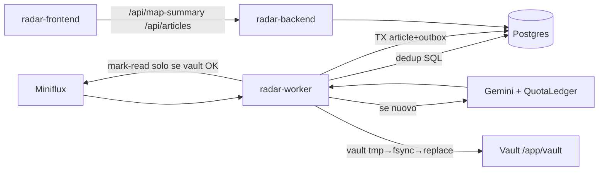
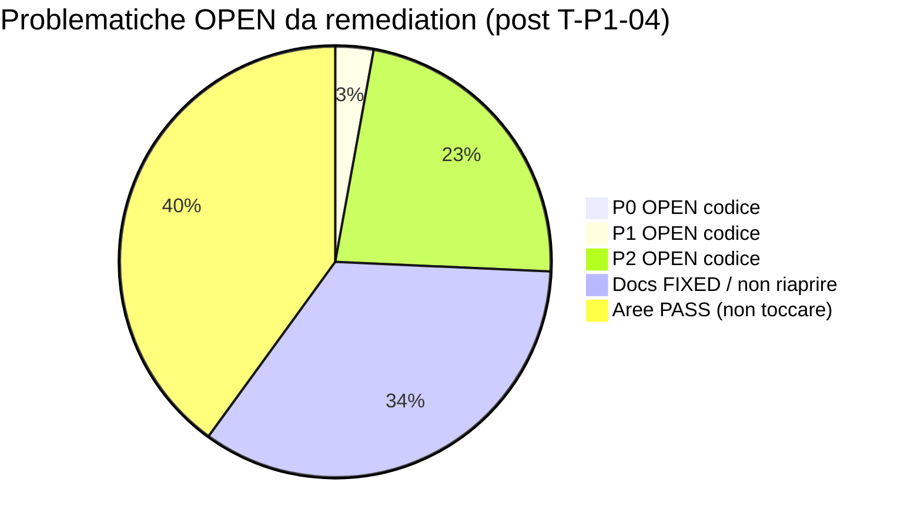

# Manuale Operativo Audit & Remediation — Radar Informativo Globale

> **Versione:** 2.2 (manuale a fasi + check definitivo scratch + chiusura T-DOC-01 in FASE 0) · **Data riverifica:** 2026-07-15 · **Gate progetto:** Phase 6 / Gate Verde  
> **Audience:** operatore umano **e** agente LLM  
> **Root repo:** `c:\Users\lucag\Documents\Dashboard finance` · **App:** `radar/`  
> **Check definitivo:** vedi **APPENDICE F** (riconciliazione vs `scratch/*`, divergenze priorità).  
> **Stato ticket operativo:** `audit_problemi_documentazione_risoluzione.md` §3 (FASE 0 DONE DEFINITIVA).

Questo file **non** è solo un elenco di bug. È un **manuale operativo** per:

1. capire cosa è SoT (source of truth) e cosa non toccare;
2. riprodurre e diagnosticare ogni problematica;
3. applicare fix con diff, file, criteri di accettazione;
4. verificare con CLI / test / checklist;
5. far lavorare un LLM in modo sicuro e ripetibile.

---

# FASE 0 — Come usare questo manuale

## 0.1 Contratto per l’operatore umano

| Passo | Azione |
|------:|--------|
| 1 | Leggi **FASE 1** (mappa + invarianti). Non saltare Sidebar Freeze. |
| 2 | Guarda **FASE 2** (matrice stato OPEN/FIXED/PASS). Lavora solo su **OPEN**. |
| 3 | Per ogni ticket OPEN: **FASE 3** (riprodurre) → **FASE 4** (fix) → **FASE 5** (gate). |
| 4 | Se un finding docs risulta FIXED in FASE 2, **non** riaprire il ticket: aggiorna solo se il codice regredisce. |

## 0.2 Contratto per l’agente LLM (prompt di avvio)

Copia/incolla all’inizio di una chat di remediation:

```text
Sei un agente di remediation sul repo Radar Informativo Globale.
Leggi e segui: audit_problemi_documentazione.md v2.2 (incluso APPENDICE F).
Stato ticket operativo: audit_problemi_documentazione_risoluzione.md §3.
Preferisci .agents/AGENTS.md + radar/.ecc/rules/*.md come guardrail (T-DOC-01 CLOSED — CLAUDE.md allineato Gate Verde).
Vincoli non negoziabili:
- Non modificare radar/frontend/src/app/components/radar-sidebar/**
- main.py = API-only; ingest solo in worker.py
- asyncpg puro, no ORM
- Leaflet solo via window.L / getLeaflet(); no import npm leaflet nei componenti
- Allinea docs al codice Gate Verde, non il contrario (salvo bug runtime P0/P1)
Lavora UN ticket alla volta (ordine FASE 4; rispettare T-P0-01 → T-P1-03).
Per ogni ticket: riproduci (FASE 3) → applica fix (FASE 4) → esegui gate (FASE 5).
Non commitare senza richiesta esplicita dell’utente.
```

## 0.3 Priorità (definizioni operative)

| Pri | Significato | Quando blocca il merge |
|-----|-------------|------------------------|
| **P0** | Perdita dati, sicurezza, crash operativo, script CI inutilizzabili critici | Sì |
| **P1** | Race, config fragile, UX errore silenzioso, privilegio container | Sì se in path produzione |
| **P2** | Igiene, difesa in profondità, allineamento cosmetico docs | No (backlog) |

## 0.4 Artefatti correlati (non cancellare)

| Path | Ruolo |
|------|--------|
| `scratch/backend_rules.md` | Checklist governance BE (81 item) |
| `scratch/frontend_rules.md` | Checklist governance FE (88 item) |
| `scratch/infra_rules.md` | Checklist Docker/DB (83 item) |
| `scratch/backend_audit.md` | Audit codice BE grezzo |
| `scratch/frontend_audit.md` | Audit codice FE grezzo |
| `scratch/infra_audit.md` | Audit infra grezzo |
| `.agents/AGENTS.md` | Guardrail globali |
| `radar/.ecc/rules/{backend,frontend,docker}.md` | SoT path-scoped |
| `radar/docs/runbook.md` | Deploy / health / incident |

---

# FASE 1 — Mappa del sistema e invarianti

## 1.1 Stack e servizi

| Servizio Compose | Ruolo | Rete | Note |
|------------------|-------|------|------|
| `radar-db` | PostgreSQL 15 | `radar-data` | Bind `./data/postgres`; **no** porta host |
| `radar-backend` | FastAPI / uvicorn `app.main:app` | `radar-edge` + `radar-data` | API-only; HC `/health/live` |
| `radar-worker` | `python -m app.worker` | `radar-data` | Unico ingest Miniflux→Gemini→DB→Vault |
| `radar-frontend` | Nginx + Angular dist | `radar-edge` | UI `:80`; proxy `/api/` |
| `radar-miniflux` | Feed RSS | `radar-data` | No porte host (default) |

## 1.2 Flusso dati (happy path)



**Ordine obbligatorio per entry:**  
`dedup` → `sanitize HTML` → `classify (reserve→Gemini→complete/fail)` → `commit+outbox TX` → `write vault` → `outbox completed` → `mark_as_read Miniflux`.

## 1.3 Invarianti NON negoziabili (hard stop)

1. **Sidebar freeze:** vietato modificare `radar/frontend/src/app/components/radar-sidebar/**`. Conservare `p-carousel` e `updateCarouselHeight` via `article-card-{id}`. Vietato `app-article-list`.
2. **Read/unread:** fix solo in `state.service.ts` + `radar-map.component.ts`.
3. **API vs Worker:** nessun polling ingest in `main.py`.
4. **asyncpg:** SQL `$n`, no SQLAlchemy/ORM.
5. **Leaflet:** `scripts[]` in `angular.json` + `window.L` / `getLeaflet()`; solo `import type`.
6. **XSS marker:** titoli untrusted → `textContent` / DOM API, mai `innerHTML`.
7. **Categorie primary (10):** `Nucleare`, `Energia`, `Infrastrutture`, `Geopolitica`, `Economia`, `Tecnologia`, `Spazio`, `Ambiente`, `Salute`, `Sicurezza`.
8. **Reti:** FE mai su `radar-data`; nomi servizio immutabili.
9. **Vault default:** `/app/vault`.
10. **CancelledError:** sempre re-raise; sleep polling **mai** in `finally` di shutdown.

## 1.4 Contratto API Phase 5 (FE ↔ BE)

| Endpoint | Uso FE | Envelope / shape |
|----------|--------|------------------|
| `GET /api/map-summary` | Day view | `MapSummaryRow[]` (aggregato paese×categoria) |
| `GET /api/articles` | Nation open | `{ items, next_cursor, total }` · `limit ≤ 100` |
| FE concat | `getAllArticlesForCountry` | Loop finché `next_cursor == null` |

`MOCK_MODE` deve essere **esplicito** (stesse firme). Nessun fallback silenzioso mock↔live.

## 1.5 Dove leggere le regole (ordine di autorità)

1. Codice Gate Verde in `radar/` (comportamento runtime)
2. `.agents/AGENTS.md` + skill `.agents/skills/**`
3. `radar/.ecc/rules/*.md` + `radar/.ecc/agents/*.md`
4. Mirror `radar/.ecc/skills/*.md` (devono coincidere con `.agents`)
5. Questo manuale (procedura remediation) + `scratch/*_audit.md` (evidenza)

> Se docs e codice divergono sul **comportamento già deployato e testato**, aggiorna i docs.  
> Se il codice ha un **bug runtime** (P0/P1 OPEN sotto), fixa il codice.

---

# FASE 2 — Matrice di stato (riverifica 2026-07-15)

## 2.1 Sintesi conteggi OPEN



> **v2.1→v2.2 (FASE 0):** `T-DOC-01` CLOSED — `radar/.ecc/CLAUDE.md` allineato Gate Verde (grep legacy = 0).  
> **Post-remediation 2026-07-16:** T-P0-01 + T-P1-03 + T-P1-01 + T-P1-02 + T-P0-02 + T-P1-04 **DONE** → restano **9 ticket codice OPEN** (P0=0, P1=1, P2=8). Snapshot FASE 0 era 15. Dettaglio → **APPENDICE F** + `audit_problemi_documentazione_risoluzione.md` §3.

## 2.2 P0 — (tutti DONE; nessun P0 OPEN)

| ID | Titolo | File chiave | Finding audit |
|----|--------|-------------|----------------|
| **T-P0-01** | ~~Mark-read su duplicato senza gate~~ → **DONE** (gate outbox + vault-check NULL) | `backend/app/worker.py` ramo `is_dup` | BE-AUD-001 |
| **T-P0-02** | ~~Script diagnostici: `ClassificationClient()` + `_wait_for_rate_limit`~~ → **DONE** (delete orfani + mock quota smoke + skip live stress) | `backend/scripts/**` | BE-AUD-005/006 *(scratch=P1; elevato a P0 — vedi App. F §F.2)* |

## 2.3 P1 — OPEN

| ID | Titolo | File chiave | Finding |
|----|--------|-------------|---------|
| **T-P1-01** | ~~`DATABASE_URL` senza `quote_plus`~~ → **DONE** (`quote_plus` + Compose `POSTGRES_HOST`) | `core/config.py`, Compose `POSTGRES_HOST` | BE-AUD-002, INF-AUD-01 |
| **T-P1-02** | ~~Race TOCTOU dedup multi-consumer~~ → **DONE** (`pg_advisory_lock` per-URL) | `worker.py` | BE-AUD-003 |
| **T-P1-03** | ~~Mark-read post-`completed` non ritentabile~~ → **DONE** (miniflux_marked_at + retry) | `commit/outbox.py` (`reconcile` + `_update_miniflux_marked_at`) | BE-AUD-004 |
| **T-P1-04** | ~~Errore nation-fetch senza banner toolbar~~ → **DONE** (`detailError` + non-silent catch) | `state.service.ts#L99-L127`, `app.ts#L122-L125` | FE-AUD-001 |
| **T-P1-05** | Nginx frontend come root | `frontend/Dockerfile`, `nginx.conf` | INF-AUD-02 *(scratch=P2; elevato a P1 — vedi App. F §F.2; alternativa: documentare eccezione SoT)* |

## 2.4 P2 — OPEN (backlog)

| ID | Titolo | File |
|----|--------|------|
| **T-P2-01** | Fallback `'Nessuna'` vs `'Nessuno'` | `classification/validator.py#L227-L231` |
| **T-P2-02** | `img` assente da `content_ignored_tags` | `extraction/parser.py#L22-L25` |
| **T-P2-03** | No `@model_validator` primo tag == primary | `validator.py` |
| **T-P2-04** | Bare `except:` script diagnostici | `scripts/diagnostics/test_500_*.py` |
| **T-P2-05** | `UI_OFFSETS` dead code | `radar-map.component.ts#L148+` |
| **T-P2-06** | `clusterclick` senza filtro esplicito category | `radar-map.component.ts#L456-L494` |
| **T-P2-07** | Stroke GeoJSON `rgba` hardcoded | `radar-map.component.ts` style |
| **T-P2-08** | Dir vuota `shared/directives/` | path FE |

## 2.5 Docs — FIXED (non riaprire salvo regressione)

Riverifica + check definitivo 2026-07-15: finding del report docs originale **già allineati**.

| Ex-ID | Cosa diceva l’audit docs | Stato attuale |
|-------|--------------------------|---------------|
| 1.1 spatial-data-mocking | Chip come primary, layout 70/30, API vecchie | **FIXED** — full-bleed, MapSummary/ArticlesPage, Chip solo come tag |
| 1.2 angular-map-expert | Chip primary + eslint | **FIXED** — `primary_category: 'Tecnologia'`; lint = prettier |
| 1.3 backend.md sleep in finally | Snippet obbligava sleep in finally | **FIXED** — “NO sleep in finally” + anti-pattern esplicito |
| 2.1 rules/docker.md | CMD `main:app`, no verify-geojson, digest “attivi” | **FIXED** — `app.main:app`, verify-geojson, digest **deferred** |
| 2.2 settings.json | Domini/tool/secret incompleti | **FIXED** — `Write`/`Shell`, `raw.githubusercontent.com`, `GEMINI_API_KEY` presenti |
| 2.3 llm-json / quota mirror | Delta ledger / advisory | **FIXED** — mirror ECC = `.agents` |
| 2.4 angular-developer links | `references/*` rotti in `.ecc` | **FIXED** — nota SoT + path `../../../.agents/.../references/` |
| 3.1 geo-data-architect 007 | Inventario fino a 006 | **FIXED** — cita `007_articles_query_indexes.sql` |
| 3.2 AGENTS API Phase 5 | Omissione map-summary/envelope | **FIXED** — bullet API Phase 5 in AGENTS.md |
| 3.3 US/RU bounds frontend.md | Literal approssimativi | **FIXED** — literal identici al codice |
| 3.4 / 3.5 hooks + comandi | Hook “manuali”; comandi mancanti | **FIXED** — hooks.json default; verify-geojson/runbook/CI in AGENTS |

### 2.5-bis Docs — T-DOC-01 CLOSED (FASE 0 verify 2026-07-15)

| ID | File | Sintomi originari (v2.1) | Stato attuale | Verifica |
|----|------|--------------------------|---------------|----------|
| **T-DOC-01** | `radar/.ecc/CLAUDE.md` | “Phase 0–2”, `radar-network`, sleep in `main.py`, MOCK_MODE “non fatto”, migrazioni ≤003 | **CLOSED** — file riporta Phase 0–5 DONE / Phase 6 Gate Verde; reti `radar-edge`/`radar-data`; migrazioni 001–007; MOCK_MODE esplicito; ingest in `worker.py` | `Select-String … radar-network\|Phase 0-2\|asyncio.sleep(900) loop in main` → **0 match** |

> Non riaprire salvo regressione del file. Guardrail operativi restano `.agents/AGENTS.md` + `radar/.ecc/rules/*.md`.

## 2.6 Aree PASS — non modificare “per sicurezza”

| Area | Verdetto | Evidenza breve |
|------|----------|----------------|
| Sidebar freeze | PASS | `p-carousel`, no `article-list` |
| Leaflet `window.L` | PASS | `getLeaflet()` |
| XSS icons | PASS | `createSafeMarkerIcon` + `textContent` |
| API FE concat cursor | PASS | `getAllArticlesForCountry` |
| Overlay + `invalidateSize` | PASS | App shell 100vw |
| Worker CancelledError / sleep | PASS | `worker.py` |
| QuotaLedger | PASS | reserve/complete/fail |
| Outbox happy path | PASS | TX + vault atomic |
| API Phase 5 BE | PASS | map-summary + envelope |
| Reti edge/data | PASS | Compose |
| Migrazioni 001–007 + indici | PASS | SQL + runner |
| GeoJSON verify in Docker | PASS | Dockerfile FE |
| CMD `app.main:app` | PASS | Dockerfile BE |
| Volume `./data/postgres` | PASS | Compose |

---

# FASE 3 — Riprodurre e diagnosticare

Ogni ticket OPEN ha: **precondizioni**, **passi**, **sintomo atteso (bug)**, **sintomo post-fix**, **comandi**.

## 3.0 Ambiente di lavoro (comune)

```powershell
cd "c:\Users\lucag\Documents\Dashboard finance\radar"
# Stack (se non già su):
docker compose up -d --build
# Backend locale (opzionale):
.\backend\.venv\Scripts\Activate.ps1
$env:PYTHONPATH = "backend"
```

Health minimo:

```powershell
docker compose ps
docker compose exec radar-backend curl -sf http://127.0.0.1:8000/health/live
```

---

## 3.1 T-P0-01 — Mark-read duplicato senza gate outbox

### Contesto
In `process_single_entry`, se `is_article_duplicate` è true, il codice chiama subito `mark_as_read` **senza** controllare `article_outbox.status`.

### Riproduzione (staging)

```sql
-- 1) Trova un article con outbox non completed (o forzalo):
UPDATE article_outbox SET status = 'pending', last_error = 'manual_test'
WHERE article_id = (
  SELECT id FROM articles ORDER BY published_at DESC LIMIT 1
);

-- 2) Annota source_url e assicurati che Miniflux abbia ancora l'entry unread con stesso URL
-- 3) Forza un ciclo worker (o attendi poll)
```

```powershell
docker compose logs -f radar-worker
# Cerca: "Articolo duplicato rilevato" seguito da mark-read
```

### Sintomo BUG
Log: duplicato → mark-read; entry sparisce da Miniflux unread; file Vault assente o outbox ancora `pending`/`failed`.

### Sintomo POST-FIX
Log: duplicato con outbox `pending`/`failed`/`writing` → **skip mark-read** (attende `reconcile_outbox`).  
Mark-read sul path duplicato **solo se** `outbox.status = completed`.  
`NULL` (nessuna riga outbox = legacy/anomalia): **skip** di default; estensione ammessa = mark-read **solo se** il file vault atteso esiste (`Path.is_file`).  
**Vietato:** `if status in ("completed", None)` senza vault-check (non chiude la repro legacy e viola vault-first).

Audit dettagliato: `audit_remediation_T-P0-01.md`.

### Ispezione codice

```213:219:radar/backend/app/worker.py
        if is_dup:
            logger.info(
                "Articolo duplicato rilevato: '%s'. Marcatura come letto su Miniflux...",
                title[:50],
            )
            await state.miniflux_client.mark_as_read([entry_id])
            return True
```

---

## 3.2 T-P0-02 — Script ClassificationClient rotti

> **Stato:** **DONE** (2026-07-16). Riproduzione sotto = **AS-IS pre-fix**. POST-FIX: script obsoleti eliminati, `test_production_pipeline.py` riparato con mock di quota, `test_live_rate_limiter_throttling` skippato. Vedi §4.5, `audit_remediation_T-P0-02.md`.

### Riproduzione immediata (senza Gemini)

```powershell
cd radar
$env:PYTHONPATH = "backend"
python -c "from app.classification.client import ClassificationClient; ClassificationClient()"
```

**Sintomo BUG:** `ValueError: ClassificationClient richiede pool (asyncpg) o un QuotaLedger iniettato.`

```powershell
Select-String -Path backend/scripts/**/*.py -Pattern "ClassificationClient\(\)|_wait_for_rate_limit"
```

**Atteso oggi:** match in `test_production_pipeline.py`, `diagnostics/test_rate_limiter.py`, `diagnostics/test_500.py`.

### Dipendenza a cascata (storico pre-fix)
`app/tests/test_integration_live.py` importava `stress_test_rate_limiter` dallo script → `AttributeError` su `_wait_for_rate_limit`.  
**POST-FIX:** stress rimosso; `test_live_rate_limiter_throttling` → `pytest.skip` (throttling = `test_quota_concurrency`).

---

## 3.3 T-P1-01 — Password speciali in DATABASE_URL

> **Stato:** **DONE** (2026-07-15). Riproduzione sotto = **AS-IS pre-fix**. POST-FIX: `quote_plus` su user/password in `config.py`; Compose backend/worker usa `POSTGRES_HOST=radar-db` (niente `DATABASE_URL` grezzo). Vedi §4.2, App. D, `audit_remediation_T-P1-01.md`.

```powershell
cd radar
$env:PYTHONPATH = "backend"
# Rimuovi DATABASE_URL se impostato, così usa il fallback:
Remove-Item Env:DATABASE_URL -ErrorAction SilentlyContinue
$env:POSTGRES_PASSWORD = "p@ss:w/rd#1"
python -c "from app.core.config import DATABASE_URL; print(DATABASE_URL)"
```

**Sintomo BUG (storico):** URL contiene `p@ss:w/rd#1` grezzo (parser asyncpg può fallire).  
**POST-FIX:** segmenti user/password con `%40`, `%3A`, `%2F`, `%23`; Script F e `test_database_url.py` verdi.

**Nota Compose (post-fix):** backend/worker non impostano più `DATABASE_URL` interpolato. Se si reintroduce un override manuale in `.env`, deve essere già percent-encoded. Miniflux resta su URL grezzo (non usa `config.py`).

---

## 3.4 T-P1-02 — Race TOCTOU multi-consumer

> **Stato:** **DONE** (2026-07-15). Riproduzione sotto = contesto FASE 3. POST-FIX: `pg_advisory_lock(ns, hash(url))` session-level in `process_single_entry` (namespace `777666555` ≠ leadership). Vedi §4.3, App. D, `audit_remediation_T-P1-02.md`.

Precondizioni: `WORKER_ENTRY_CONCURRENCY >= 2` (default 4).

Idea: due entry Miniflux (o doppio enqueue) con **stesso** `source_url` nello stesso ciclo.

```powershell
docker compose exec radar-db psql -U radar_user -d radar_db -c "
SELECT purpose, status, count(*) FROM llm_request_ledger
WHERE created_at > NOW() - INTERVAL '15 minutes'
GROUP BY 1,2 ORDER BY 3 DESC;"
```

**Sintomo BUG (storico):** due `complete` Gemini vicini per stesso URL / due attempt classify nonostante un solo article.  
**POST-FIX:** al più una classify per URL sotto advisory lock (serializzazione); `test_worker_concurrency.py` verde.

---

## 3.5 T-P1-03 — Mark-read fallito dopo completed

> **Stato:** **DONE** (2026-07-15). Snippet sotto = **AS-IS pre-fix** (storico FASE 3). POST-FIX: `miniflux_marked_at` + 2ª SELECT in `reconcile_outbox` + `_update_miniflux_marked_at`. Vedi §4.4, App. D, `audit_remediation_T-P1-03.md`.

Evidenza AS-IS (commento che descriveva il bug):

```python
# PRE-FIX (storico): mark_as_read falliva → status=completed, ma reconcile
# selezionava solo pending/failed → forever-unread senza retry.
await miniflux_client.mark_as_read([int(entry_id)])
# except: log warning; completed rows not re-processed
```

**Riproduzione (storica):** mock/fault Miniflux mark-read dopo vault write; `reconcile_outbox` non ritentava.  
**POST-FIX:** `WHERE status='completed' AND miniflux_marked_at IS NULL AND miniflux_entry_id IS NOT NULL` → retry solo mark-read.

---

## 3.6 T-P1-04 — Banner nation-fetch

> **Stato:** **DONE** (2026-07-16). Riproduzione sotto = **AS-IS pre-fix**. POST-FIX: `detailError` + `error()` merge; catch `onCountryClick` → `closeSidebar(false)` preserva banner. Vedi §4.6, `audit_remediation_T-P1-04.md`.

```99:127:radar/frontend/src/app/services/state.service.ts
  readonly error = computed(() => this.mapSummaryResource.error());
  ...
    } catch (err) {
      console.error('[StateService] Impossibile caricare articoli nazione:', err);
      this.detailArticles.set([]);
      throw err;
```

```122:125:radar/frontend/src/app/app.ts
    } catch {
      if (gen !== this.nationOpenGeneration) return;
      this.closeSidebar();
    }
```

**UI test (AS-IS pre-fix):** spegnere backend o forzare 500 su `/api/articles`, click nazione → sidebar chiude, **nessun** banner toolbar.  
**POST-FIX:** stesso scenario → sidebar chiude, banner toolbar `apiError` visibile finché dismiss/`closeSidebar()`.

---

## 3.7 T-P1-05 — Nginx root

> **Stato:** **OPEN** — prossimo ticket codice. Prompt: `audit_prompt_T-P1-05_remediation.md`.

```powershell
docker compose exec radar-frontend whoami
docker compose exec radar-frontend ps aux
```

**Sintomo BUG:** `root`. **POST-FIX:** `nginx` + listen 8080 (o eccezione documentata SoT).

---

## 3.8 Smoke test UI (regressione generale) — eseguire sempre dopo fix FE/BE

| # | Nome | Passi | Atteso |
|---|------|-------|--------|
| U1 | Spiderfy + read toggle | Zoom≥5 → spiderfy → toggle letta | Marker `.marker-read`; spiderfy resta |
| U2 | Multi-click cluster | Click rapidi pin/cluster | No layer spariti; no exception console |
| U3 | Full-bleed | Open/close sidebar + resize | `invalidateSize`; no grigio |
| U4 | XSS | Titolo `<script>alert(1)</script>` | Solo testo escapato |
| U5 | Nation error banner | API articles down | Banner errore (post T-P1-04) |

---

# FASE 4 — Playbook di fix (ticket per ticket)

> Ordine consigliato: **T-P0-01 → T-P1-03** (dipendenza, vedi sotto) **→ T-P1-01 → T-P1-02 → T-P0-02 → T-P1-04 → T-P1-05 → P2**.  
> (`T-DOC-01` escluso: **CLOSED** in FASE 0 — vedi §2.5-bis.)

**Dipendenza T-P0-01 ↔ T-P1-03 (non ambigua):**
- Oggi il path duplicato mark-read “aggressivo” maschera in parte i fallimenti di mark-read post-`completed` (l’entry torna unread → duplicato → mark-read).
- Dopo **T-P0-01**, mark-read sul duplicato avviene **solo se** outbox=`completed`. Se mark-read fallì dopo vault ma l’entry **non** viene più rifetchata da Miniflux, resta unread per sempre → **T-P1-03 resta necessario** (retry reconcile / `miniflux_marked_at`).
- Quindi: implementare T-P0-01 **e** T-P1-03 nella stessa finestra di remediation (ordine: prima gate, poi retry).

Per ogni ticket: modifica **minima**, test, aggiorna riga stato in FASE 2 (OPEN→DONE).

---

## 4.1 T-P0-01 — Gate mark-read su duplicato

### Obiettivo
Mark-read Miniflux sul path duplicato **solo se** `article_outbox.status = 'completed'` (vault durable).  
Per `pending`/`failed`/`writing`: log warning e return — **attendi `reconcile_outbox`** (nessun live-lock funzionale).  
Per `NULL` (legacy senza riga outbox): **no** mark-read di default; estensione raccomandata = mark-read solo se il file vault esiste.  
Dettaglio ADR + REJECT dell’ADJUST cieco: `audit_remediation_T-P0-01.md`.

### Diff di riferimento (minimo)

```diff
--- a/radar/backend/app/worker.py
+++ b/radar/backend/app/worker.py
@@
-        if is_dup:
-            logger.info(
-                "Articolo duplicato rilevato: '%s'. Marcatura come letto su Miniflux...",
-                title[:50],
-            )
-            await state.miniflux_client.mark_as_read([entry_id])
-            return True
+        if is_dup:
+            async with state.db_sem:
+                async with state.db_pool.acquire() as conn:
+                    outbox_status = await conn.fetchval(
+                        """
+                        SELECT o.status
+                        FROM articles a
+                        LEFT JOIN article_outbox o ON o.article_id = a.id
+                        WHERE a.source_url = $1
+                        """,
+                        source_url,
+                    )
+            if outbox_status == "completed":
+                logger.info(
+                    "Duplicato con vault completed: mark-read Miniflux per '%s'.",
+                    title[:50],
+                )
+                await state.miniflux_client.mark_as_read([entry_id])
+            else:
+                logger.warning(
+                    "Duplicato DB ma outbox status=%r per '%s': skip mark-read; "
+                    "attendo reconcile.",
+                    outbox_status,
+                    title[:50],
+                )
+            return True
```

### Estensione raccomandata (NULL + vault)
Se `outbox_status is None`: risolvere path con `get_article_file_path` / query article e chiamare mark-read **solo se** `Path(...).is_file()`. Altrimenti skip.  
**Non** usare `outbox_status in ("completed", None)` senza questo check.

### Criteri di accettazione
- [x] Duplicato + `completed` → mark-read
- [x] Duplicato + `pending`/`failed`/`writing` → **no** mark-read
- [x] Duplicato + `NULL` senza vault → **no** mark-read
- [x] (Se estensione) Duplicato + `NULL` con vault file → mark-read + log legacy
- [x] `pytest -m "not live"` verde + `tests/test_worker_gate.py` (casi sopra)
- [x] Nessun ADJUST cieco `None → mark-read`
- [x] Skill/rules BE non contraddicono (mark-read dopo vault)
- [x] Handoff T-P1-03 annotato (retry mark-read post-completed) — poi chiuso in App. D / §11 risoluzione

### Skill da rileggere prima del fix
`.agents/skills/llm-json-extraction/SKILL.md` (flusso commit+outbox), `radar/.ecc/rules/backend.md`.  
Report: `audit_remediation_T-P0-01.md`.

---

## 4.2 T-P1-01 — URL-encoding credenziali

### Diff `config.py`

```diff
--- a/radar/backend/app/core/config.py
+++ b/radar/backend/app/core/config.py
@@
+from urllib.parse import quote_plus
@@
-_default_db_url = f"postgresql://{pg_user}:{pg_pass}@{pg_host}:{pg_port}/{pg_db}"
+_default_db_url = (
+    f"postgresql://{quote_plus(pg_user)}:{quote_plus(pg_pass)}"
+    f"@{pg_host}:{pg_port}/{pg_db}"
+)
```

### Compose (POST-FIX T-P1-01)
Backend/worker: **non** forzare `DATABASE_URL` grezzo; `POSTGRES_HOST=radar-db` e URL costruito in `config.py` con `quote_plus`.  
Miniflux (`DATABASE_URL=postgres://...`) non usa `config.py`: password speciali → encoding manuale o policy alfanumerica (documentato in `.env.example`).

### Criteri
- [x] Password con `@` funziona in boot locale (Script F + `test_database_url.py`)
- [x] `.env.example` aggiornato con nota encoding (+ Miniflux)
- [x] Nessun secret committato
- [x] Compose backend/worker: niente `DATABASE_URL` grezzo; `POSTGRES_HOST=radar-db`

---

## 4.3 T-P1-02 — Advisory lock per-URL

### Approccio (POST-FIX)
`pg_advisory_lock($1, $2)` con `key1=777666555` (namespace URL) e `key2=sha256(url)[:4]` signed; scope: dedup → classify → commit (+ outbox). Unlock in `finally` sulla stessa connessione di sessione. Non riusa `WORKER_ADVISORY_LOCK_KEY` (forma a 1 argomento).

### Criteri
- [x] Due consumer stesso URL → una sola chiamata Gemini (`test_worker_concurrency.py`)
- [x] Lock rilasciato anche su exception / CancelledError (re-raise dopo unlock in `finally`)
- [x] Non usare lo stesso lock key del leadership worker

---

## 4.4 T-P1-03 — Retry mark-read

### Approccio consigliato (schema)
Aggiungere migrazione `008_...sql`:

```sql
ALTER TABLE article_outbox
  ADD COLUMN IF NOT EXISTS miniflux_marked_at TIMESTAMPTZ NULL;
```

- Dopo vault OK: `status='completed'`, `miniflux_marked_at` NULL finché mark-read non riesce.
- `reconcile_outbox` (o job dedicato): `WHERE status='completed' AND miniflux_marked_at IS NULL`.
- Su mark-read OK: set `miniflux_marked_at = NOW()`.

### Approccio minimo senza migrazione
Salvare `last_error = 'vault_ok mark_read_pending: ...'` e estendere la SELECT di reconcile. Meno pulito; ok solo come hotfix.

### Criteri
- [x] Fallimento mark-read non lascia entry forever-unread senza retry
- [x] Vault non viene riscritto inutilmente
- [x] Test outbox/reconcile aggiornati (`test_outbox_mark_read_retry.py`)

---

## 4.5 T-P0-02 — Riparare / deprecare script

> **Stato:** **DONE** (2026-07-16).
> Risoluzione: implementata l'opzione ibrida con rimozione degli script obsoleti `test_500.py` e `test_rate_limiter.py` per non interferire con Script I, riparazione di `test_production_pipeline.py` con l'iniezione del mock di quota, e skip per `test_live_rate_limiter_throttling` nei live test.

### Opzione A (riparare)
Iniettare pool:

```python
pool = await asyncpg.create_pool(DATABASE_URL)
classification = ClassificationClient(pool=pool)
...
rid = await classification.quota.reserve(estimated_tokens=1, purpose="stress_spacing")
await classification.quota.release(rid)
```

### Opzione B (deprecare)
Se gli script non servono più: spostarli sotto `scripts/diagnostics/_obsolete/` e far fallire i live test con skip chiaro, oppure allinearli ai helper di `test_integration_live.py`.

### Criteri
- [x] Nessun `ClassificationClient()` senza argomenti
- [x] Nessun `_wait_for_rate_limit`
- [x] `Select-String` (FASE 5 Script 9) pulito

---

## 4.6 T-P1-04 — `detailError` + banner

### Diff di riferimento

```diff
--- a/radar/frontend/src/app/services/state.service.ts
+++ b/radar/frontend/src/app/services/state.service.ts
@@
-  readonly error = computed(() => this.mapSummaryResource.error());
+  readonly detailError = signal<unknown>(null);
+  readonly error = computed(
+    () => this.mapSummaryResource.error() ?? this.detailError(),
+  );
@@
   clearDetailArticles(): void {
     this.detailArticles.set([]);
     this.detailLoading.set(false);
+    this.detailError.set(null);
   }
@@
   async loadCountryArticles(...) {
+    this.detailError.set(null);
     try { ... }
     catch (err) {
       this.detailArticles.set([]);
+      this.detailError.set(err);
       throw err;
     }
```

**Importante:** in `app.ts` catch di `onCountryClick`, **non** chiudere silenziosamente senza lasciare l’errore visibile; oppure chiudi sidebar ma lascia `detailError` valorizzato finché l’utente non dismiss.

**Sidebar freeze:** non toccare `radar-sidebar/**`. Il banner vive in toolbar / `app.html`.

### Criteri
- [x] Fallimento nation → banner `apiError` / `error()` non null
- [x] Close sidebar resetta `detailError`
- [x] Nessuna modifica sotto `radar-sidebar/`

---

## 4.7 T-P1-05 — Nginx unprivileged

Pattern:

1. `listen 8080` in `nginx.conf`
2. `USER nginx` + ownership html/cache/run
3. Compose `80:8080`
4. Healthcheck `wget http://127.0.0.1:8080/health`
5. Allineare `docker-compose.hardened.yml`

### Criteri
- [ ] `whoami` → `nginx`
- [ ] UI ancora su http://localhost/
- [ ] HC healthy

---

## 4.8 P2 — Fix rapidi (batch opzionale)

| ID | Fix |
|----|-----|
| T-P2-01 | `'Nessuna'` → `'Nessuno'` nel fallback validator |
| T-P2-02 | Aggiungere `img`, `picture`, `source` a `content_ignored_tags` |
| T-P2-03 | `@model_validator` primo tag == `primary_category` |
| T-P2-04 | `except OSError` invece di bare `except` |
| T-P2-05 | Rimuovere `UI_OFFSETS` morto |
| T-P2-06 | `.filter(a => a.primary_category === cat)` |
| T-P2-07 | CSS var `--color-map-stroke` |
| T-P2-08 | Eliminare dir `shared/directives/` vuota |

---

# FASE 5 — Gate di verifica (CLI / CI)

Esegui i gate rilevanti al ticket; dopo un batch P0/P1 esegui la **suite minima** §5.0.

## 5.0 Suite minima post-remediation

```powershell
cd "c:\Users\lucag\Documents\Dashboard finance\radar"

# Backend unit (no Gemini live)
.\backend\.venv\Scripts\Activate.ps1
$env:PYTHONPATH = "backend"
python -m pytest -m "not live" -v

# GeoJSON
cd frontend
npm run verify-geojson:fetch
npm run lint
cd ..

# Compose health
docker compose ps
docker compose exec radar-backend curl -sf http://127.0.0.1:8000/health/live
```

**Atteso:** pytest verde (~107); geojson 258 features; servizi healthy.

---

## 5.1 Script catalogo (verifica problemi)

### Script A — Migrazioni & pytest
```powershell
cd radar
$env:PYTHONPATH = "backend"
python -m pytest -m "not live" -v
Get-ChildItem backend/migrations/00*.sql | Sort-Object Name
```

### Script B — GeoJSON
```powershell
cd radar/frontend
npm run verify-geojson:fetch
```

### Script C — Perf indici (staging)
```powershell
cd radar
$env:PYTHONPATH = "backend"
python backend/scripts/seed_perf_articles.py
docker compose exec radar-db psql -U radar_user -d radar_db -c "EXPLAIN ANALYZE SELECT country_code, primary_category, count(*) FROM articles WHERE published_at = CURRENT_DATE GROUP BY 1,2;"
```

### Script D — Leadership lock
```powershell
docker compose exec radar-worker python -m app.worker
# secondo processo non deve elaborare:
docker compose exec radar-backend python -m app.worker
```

### Script E — Nginx user (T-P1-05)
```powershell
docker compose exec radar-frontend whoami
```

### Script F — quote_plus (T-P1-01)
```powershell
Remove-Item Env:DATABASE_URL -ErrorAction SilentlyContinue
$env:POSTGRES_PASSWORD = "p@ss:w/rd#1"
$env:PYTHONPATH = "backend"
python -c "from app.core.config import DATABASE_URL; print(DATABASE_URL); assert '%40' in DATABASE_URL"
```

### Script G — Gate duplicato (T-P0-01)
```powershell
docker compose exec radar-db psql -U radar_user -d radar_db -c "
SELECT a.id, left(a.source_url,60), o.status
FROM articles a LEFT JOIN article_outbox o ON o.article_id=a.id
WHERE o.status IS DISTINCT FROM 'completed' LIMIT 20;"
# + logs worker dopo re-fetch stesso URL
```

### Script H — Race ledger (T-P1-02)
```powershell
docker compose exec radar-db psql -U radar_user -d radar_db -c "
SELECT purpose, status, count(*) FROM llm_request_ledger
WHERE created_at > NOW() - INTERVAL '1 hour' GROUP BY 1,2 ORDER BY 3 DESC;"
```

### Script I — Script rotti (T-P0-02)
> **POST-FIX (DONE):** atteso **0 match** su `*.py` (escludere `__pycache__`). Il one-liner `ClassificationClient()` può ancora alzare `ValueError` (contratto API corretto) — non è regressione.

```powershell
cd radar
$env:PYTHONPATH = "backend"
# Gate ticket = call sites negli script, non il ctor vuoto isolato:
Get-ChildItem -Path backend/scripts -Recurse -Filter *.py |
  Where-Object { $_.FullName -notmatch '__pycache__' } |
  Select-String -Pattern 'ClassificationClient\(\)|_wait_for_rate_limit'
# Atteso: nessun output.
```

### Script J — detailError FE (T-P1-04)
```powershell
cd radar/frontend
Select-String -Path src/app/services/state.service.ts -Pattern "detailError"
npm run test:ci
```

### Script K — Indici DB
```powershell
docker compose exec radar-db psql -U radar_user -d radar_db -c "\di+ idx_articles*"
```

### Script L — Reti / live vs ready
```powershell
cd radar
docker compose config | Select-String -Pattern "radar-edge|radar-data|health/live|/ready"
```

### Script M — Validator P2
```powershell
Select-String -Path backend/app/classification/validator.py -Pattern "Nessuna|model_validator"
Select-String -Path backend/app/extraction/parser.py -Pattern "img"
```

---

# FASE 6 — Best practice e anti-pattern

## 6.1 Backend

| FARE | NON FARE |
|------|----------|
| `ClassificationClient(pool=...)` | `ClassificationClient()` |
| `quota.reserve` / `complete` / `fail` / `release` | `_wait_for_rate_limit`, sleep fisso come unico gate |
| Dedup SQL **prima** di Gemini | Classify-then-dedup |
| Mark-read **dopo** vault `completed` | Mark-read su solo presenza riga `articles` |
| `except asyncio.CancelledError: raise` | Swallow CancelledError |
| Sleep polling fuori da `finally` shutdown | `await asyncio.sleep(...)` in `finally` |
| `quote_plus` su user/password | Interpolazione grezza URL |
| Logger `core/logging.py` | `print()` in produzione |
| `requirements` con `>=` | Pin `==` |

## 6.2 Frontend

| FARE | NON FARE |
|------|----------|
| Lasciare `radar-sidebar/**` invariata | Refactor carosello / `article-list` |
| `window.L` / `getLeaflet()` | `import L from 'leaflet'` nei componenti |
| `textContent` per titoli | `innerHTML` con dati feed |
| `getMapSummary` + concat cursor | Dump full `getArticles` day-view |
| `invalidateSize` prima di spiderfy | Spiderfy poi resize |
| 10 categorie SoT in mock primary | `Chip`/`Acqua` come primary |
| Errore API → banner | Close sidebar silenzioso |

## 6.3 Docker / DB

| FARE | NON FARE |
|------|----------|
| Reti `radar-edge` / `radar-data` | FE su `radar-data`; rete unica legacy |
| HC `/health/live` | HC su `/ready` (ops-only) |
| Bind `./data/postgres` | Named volume anonimo “per comodità” |
| `npm ci --legacy-peer-deps` | `npm install` in Dockerfile |
| `verify-geojson --fetch` in build | Assumere GeoJSON già in git |
| Tag pinnati (`1.27-alpine`, `15-alpine`) | `:latest` |
| wget su Alpine | curl su Alpine senza installarlo |
| `USER` non-root dove possibile | Nginx root senza eccezione documentata |

## 6.4 Documentazione / agenti

| FARE | NON FARE |
|------|----------|
| Skill `.agents/` come SoT; mirror ECC identici | Due versioni divergenti della stessa skill |
| Descrivere Phase 5 API | Documentare API pre-Phase 5 come attuali |
| Dire “prettier” per FE lint | Consigliare eslint se non configurato |
| Aggiornare docs dopo fix codice | “Sistemare” il codice per far tornare docs obsolete |

---

# FASE 7 — Procedura operativa agente LLM (checklist turno)

Usa questa checklist a ogni sessione di remediation.

```text
[ ] 1. Leggere FASE 1.3 (invarianti) ad alta voce mentale
[ ] 2. Aprire FASE 2 e scegliere il primo ticket OPEN per priorità
[ ] 3. Aprire i file citati e verificare che il bug esista ancora (righe)
[ ] 4. Eseguire riproduzione FASE 3 del ticket (o spiegare perché non eseguibile)
[ ] 5. Applicare SOLO il diff del ticket (niente refactor collaterali)
[ ] 6. Se FE: grep radar-sidebar — zero file toccati
[ ] 7. Eseguire gate FASE 5 pertinenti + suite minima se P0/P1
[ ] 8. Aggiornare riga ticket in FASE 2: OPEN → DONE + data
[ ] 9. Non committare senza richiesta utente
[ ] 10. Nel riepilogo all’utente: ticket, file, comando di verifica, esito
```

### Template risposta LLM all’utente

```markdown
## Ticket T-P?-?? — <titolo>
**Stato:** DONE | BLOCKED
**File toccati:** ...
**Verifica eseguita:** <comando> → <esito>
**Prossimo ticket OPEN:** ...
```

---

# APPENDICE A — Indice file critici

| Dominio | Path |
|---------|------|
| Worker ingest | `radar/backend/app/worker.py` |
| API | `radar/backend/app/main.py`, `api/articles_query.py` |
| Config | `radar/backend/app/core/config.py` |
| Quota | `radar/backend/app/classification/quota.py` |
| Gemini client | `radar/backend/app/classification/client.py` |
| Schema LLM | `radar/backend/app/classification/validator.py`, `prompts.py` |
| Outbox | `radar/backend/app/commit/outbox.py`, `db_commit.py` |
| Parser HTML | `radar/backend/app/extraction/parser.py` |
| Migrazioni | `radar/backend/migrations/001_*.sql` … `007_*.sql` |
| State FE | `radar/frontend/src/app/services/state.service.ts` |
| Map | `radar/frontend/src/app/components/radar-map/radar-map.component.ts` |
| Sidebar (FREEZE) | `radar/frontend/src/app/components/radar-sidebar/**` |
| App shell | `radar/frontend/src/app/app.ts`, `app.html` |
| Compose | `radar/docker-compose.yml` |
| FE image | `radar/frontend/Dockerfile`, `nginx.conf` |
| BE image | `radar/backend/Dockerfile` |
| Runbook | `radar/docs/runbook.md` |

---

# APPENDICE B — Mapping finding grezzi → ticket

| Finding scratch | Ticket |
|-----------------|--------|
| BE-AUD-001 | T-P0-01 |
| BE-AUD-005, BE-AUD-006 | T-P0-02 |
| BE-AUD-002, INF-AUD-01 | T-P1-01 |
| BE-AUD-003 | T-P1-02 |
| BE-AUD-004 | T-P1-03 |
| FE-AUD-001 | T-P1-04 |
| INF-AUD-02 | T-P1-05 |
| BE-AUD-007…010 | T-P2-01…04 |
| FE-AUD-002…005 | T-P2-05…08 |
| `radar/.ecc/CLAUDE.md` (check v2.1 stale → v2.2 CLOSED) | **T-DOC-01** CLOSED |

---

# APPENDICE C — Glossario rapido

| Termine | Significato |
|---------|-------------|
| **Outbox** | Tabella `article_outbox`: proiezione Vault durable post-commit |
| **QuotaLedger** | Prenotazione durable RPM/TPM/RPD su `llm_request_ledger` |
| **Day view** | Mappa aggregata via `/api/map-summary` |
| **Nation open** | Sidebar + marker dettaglio via `/api/articles` paginato |
| **Spiderfy** | Espansione a raggiera marker stessa categoria |
| **Sidebar freeze** | Divieto di edit su `radar-sidebar/**` |
| **Gate Verde** | Phase 6 completata; baseline funzionante |
| **SoT** | Source of Truth documentale/codice |

---

# APPENDICE D — Registro remediation (compilare durante i fix)

| Data | Ticket | Autore (umano/LLM) | Commit (se richiesto) | Note |
|------|--------|--------------------|------------------------|------|
| 2026-07-15 | T-P0-01 | Antigravity + Cursor verify | No (su richiesta utente) | Gate in workspace principale: `completed`→mark-read; pending/failed/writing→skip; NULL→vault `Path.is_file`. Test `test_worker_gate.py` 4/4; pytest not live 111; worker rebuild. ADJUST cieco REJECT. Next: T-P1-03. |
| 2026-07-15 | T-P1-03 | Antigravity + Cursor verify | No (su richiesta utente) | Migrazione 008 + backfill; `outbox.py` retry completed unmarked; `test_outbox_mark_read_retry.py` 2/2; pytest not live 113/113; DB/worker sync OK. Docs drift (conteggi/handoff) allineati post PASS_WITH_GAPS. Next: T-P1-01. |
| 2026-07-15 | T-P1-01 | Antigravity + Cursor verify | No (su richiesta utente) | `quote_plus` in `config.py`; Compose backend/worker → `POSTGRES_HOST` (no `DATABASE_URL` grezzo); `.env.example` + Miniflux note; `test_database_url.py` 1/1; pytest not live 114/114; Script F OK; container printenv/health OK. Next: T-P1-02. |
| 2026-07-15 | T-P1-02 | Antigravity + Cursor verify | No (su richiesta utente) | `pg_advisory_lock(ns, hash)` per-URL in `process_single_entry`; `test_worker_concurrency.py` 1/1; pytest not live 115/115; ruff OK. Docker rebuild **GAP** (daemon spento). Next: T-P0-02. |
| 2026-07-16 | T-P0-02 | Multi-agente + Cursor verify | Sì (4 commit locali, no push) | Ibrido+(b1): delete `test_500.py`/`test_rate_limiter.py`; smoke `ClassificationClient(quota=mock)`; stress rimosso; live throttling SKIPPED; Script I 0 match; pytest not live **115** al close ticket. Next: T-P1-04. |
| 2026-07-16 | OPS-FIX | Cursor | **No** (working tree; commit pending su richiesta) | Race `compose restart` → `CannotConnectNowError`. Fix: retry `init_pool` + `docker.md` Regola 4 + Compose comments + `docs/01_getting_started.md`. Rebuild backend/worker OK; restart ordinato OK (§J.1). Spiderfy «≤24» corretto in Implementation_Plan*. pytest not live **116** (+1 test retry). Miniflux 5MB cap osservato in log (fuori scope). |
| 2026-07-16 | T-P1-04 | Antigravity + Cursor verify | **Sì** (`51225b5`, pushed) | Implementato `detailError` + `error` computed; `closeSidebar(false)` preserva banner. Test app + **4 StateService** (30/30). SoT §3.6/risoluzione allineati. Docker FE rebuild; 5 articoli delete+unread Miniflux → re-ingest OK. Next: T-P1-05. |
| | … | | | |

---

# APPENDICE E — Nota metodologica (come è stato prodotto questo manuale)

1. **Livello 1:** Manual Supporter BE/FE/Infra → checklist in `scratch/*_rules.md`.
2. **Livello 2:** Code Auditor → finding in `scratch/*_audit.md`.
3. **Livello 3:** Consolidamento + riverifica codice 2026-07-15.
4. **v2.0:** trasformazione in manuale a fasi.
5. **v2.2 / APPENDICE F:** check definitivo manuale ↔ scratch; `T-DOC-01` CLOSED in FASE 0.

> **Regola aurea finale:** correggi il codice dove il runtime è sbagliato (ticket OPEN); aggiorna i docs dove descrivono un mondo che non esiste più; non toccare le aree PASS “per scrupolo”.

---

# APPENDICE F — Check definitivo (manuale ↔ scratch) — 2026-07-15

Questa appendice chiude i dubbi lasciati aperti tra consolidamento v2.0 e le fonti `scratch/`.  
**Esito:** copertura finding codice = **completa**; priorità = **riconciliate esplicitamente**; docs = **T-DOC-01 CLOSED** in FASE 0 (file allineato Gate Verde).

## F.1 Copertura finding scratch → ticket (nessuno perso)

| Fonte scratch | Finding | Pri scratch | Ticket manuale | Pri manuale | Note |
|---------------|---------|-------------|----------------|-------------|------|
| `backend_audit.md` | BE-AUD-001 | P0 | T-P0-01 | P0 | Allineato |
| `backend_audit.md` | BE-AUD-002 | P1 | T-P1-01 | P1 | **DONE** — merge INF-AUD-01; `quote_plus` + Compose `POSTGRES_HOST` |
| `backend_audit.md` | BE-AUD-003 | P1 | T-P1-02 | P1 | **DONE** |
| `backend_audit.md` | BE-AUD-004 | P1 | T-P1-03 | P1 | **DONE** — dipendeva da T-P0-01 |
| `backend_audit.md` | BE-AUD-005 | P1 | T-P0-02 | **P0↑ → DONE** | Elevato §F.2; chiuso 2026-07-16 (ibrido+b1) |
| `backend_audit.md` | BE-AUD-006 | P1 | T-P0-02 | **P0↑ → DONE** | Stesso ticket |
| `backend_audit.md` | BE-AUD-007…010 | P2 | T-P2-01…04 | P2 | Allineato |
| `frontend_audit.md` | FE-AUD-001 | P1 | T-P1-04 | P1 | **DONE** (FE-MK-02) |
| `frontend_audit.md` | FE-AUD-002…005 | P2 | T-P2-05…08 | P2 | Allineato |
| `infra_audit.md` | INF-AUD-01 | P1 | T-P1-01 | P1 | **DONE** — dedup BE-AUD-002 |
| `infra_audit.md` | INF-AUD-02 | P2 | T-P1-05 | **P1↑** | Elevato — §F.2 |
| Check docs v2.1 | CLAUDE.md stale | — | **T-DOC-01** | P1 docs → **CLOSED** v2.2 | Sintomi legacy assenti su disco (FASE 0) |

**Totale finding codice scratch:** 10 BE + 5 FE + 2 INF = 17 → **15 ticket codice** dopo merge quote_plus (BE+INF) e merge script (005+006).  
**Nessun finding FAIL scratch senza ticket.**

## F.2 Divergenze di priorità (intenzionali, non errori)

| Ticket | Scratch | Manuale | Perché il manuale eleva |
|--------|---------|---------|-------------------------|
| **T-P0-02** | P1 | P0 | **DONE** (2026-07-16). Elevazione storica: script usati da operatori/CI/`test_integration_live`. Chiuso con ibrido+b1 (delete orfani + smoke mock + skip live stress). Non riabbassare/riaprire senza regressione. |
| **T-P1-05** | P2 | P1 | Hardening produzione (UID 0). Checklist INF-USER-03 ammette **alternativa**: documentare eccezione SoT “nginx master as root”. Scegliere **una** delle due: USER nginx+8080 **oppure** commento eccezione in `docker.md` + Dockerfile → in quel caso chiudere come P2/DONE docs. |

Un LLM **non** deve “riabbassare” queste priorità senza decisione umana esplicita.

## F.3 Dubbi risolti (erano ambigui in v2.0)

| Dubbio | Risoluzione |
|--------|-------------|
| Pie “Docs FIXED: 6” ma tabella con 5 righe | **v2.1:** 11 FIXED + 1 OPEN (`CLAUDE.md`). **v2.2:** 12 FIXED / CLOSED docs; 0 OPEN docs |
| Script P0 o P1? | Elevazione documentata §F.2; ticket unico T-P0-02 |
| Nginx P1 o P2? | Elevazione documentata; path alternativo = eccezione SoT |
| T-P0-01 rende inutile T-P1-03? | **No.** Dopo il gate, senza retry reconcile le entry unread possono restare bloccate se Miniflux non rifetcha. Ordine FASE 4 aggiornato. |
| ADJUST T-P0-01 `completed\|None`? | **REJECT.** Chiude il poll-spam legacy ma **non** la repro FASE 3 (article senza outbox) e viola vault-first. Policy: `== completed` + opzionale vault-check su NULL — vedi `audit_remediation_T-P0-01.md`. |
| Live-lock se skip su pending? | **No** per path outbox: `reconcile_outbox` avanza vault→completed→mark-read. Poll-spam solo se vault fallisce per sempre (corretto). |
| Finding docs 2.1–2.4 / 3.2–3.5 ancora OPEN? | **No** — riverificati FIXED (docker.md, settings.json, mirrors, angular-developer, AGENTS API, bounds, hooks/comandi) |
| `settings.json` ancora incompleto? | **No** — allowlist Cursor tools + `raw.githubusercontent.com` + secret Gemini presenti |
| Checklist BE-HR-03 (`img`) vs parser | FAIL soft confermato: `img` **non** in `content_ignored_tags` → T-P2-02 corretto; tag viene comunque rimosso come markup, rischio residuo = contenuto interno non-standard |
| FE-MK-02 “fallback mock” vs “banner” | Il codice **non** fa fallback mock (PASS FE-MK-01/03/04); manca solo propagazione errore a banner → T-P1-04 resta valido |

## F.4 Item consapevolmente fuori ticket (non-FAIL / deferred)

| Origine | Item | Perché non è ticket OPEN |
|---------|------|---------------------------|
| `infra_audit.md` Deferred | Digest pin immagini SHA | Documentato **deferred** post–Phase 6 in `docker.md` — non-fail |
| `infra_audit.md` Deferred | Drop `--legacy-peer-deps` | Stesso — attendere matrix Angular/CDK/PrimeNG |
| `frontend_audit.md` residuali | `navigatingTargetZoom` dead; hatch `getComputedStyle` | Non elevati a FAIL dall’auditor; igiene opzionale |
| `frontend_audit.md` residuali | Path `clusterclick` summary `arts.length===0` probabilmente morto | Difensivo innocuo |
| Checklist rules PASS | ~76/81 BE, ~83/88 FE, 81/83 INF | Solo i FAIL hanno ticket |

## F.5 Gap di procedura nel manuale (accettati / mitigati)

| Gap | Mitigazione |
|-----|-------------|
| FASE 3 non ha sezioni dedicate ai P2 | Intenzionale: P2 usano tabella §4.8 + Script M; priorità bassa |
| FASE 3 non ha playbook T-DOC-01 | **Mitigato v2.2:** T-DOC-01 CLOSED; playbook F.6 resta come regression check |
| Nessun test automatico già scritto per T-P0-01 | Script G + **obbligatorio** `tests/test_worker_gate.py` col fix (casi completed/pending/failed/NULL±vault) — vedi `audit_remediation_T-P0-01.md` §4 |
| Compose `DATABASE_URL` bypassa `quote_plus` anche post fix su `config.py` | **Chiuso in T-P1-01:** Compose backend/worker usano `POSTGRES_HOST`; `.env.example` senza `DATABASE_URL` default. Miniflux resta ops-only. |

## F.6 Playbook T-DOC-01 (`CLAUDE.md`) — CLOSED + regression check

**Stato:** CLOSED in FASE 0 (2026-07-15). Non eseguire remediation salvo regressione.

Verifica regressione (atteso: 0 match):

```powershell
Select-String -Path "radar\.ecc\CLAUDE.md" -Pattern "radar-network|Phase 0–2|Phase 0-2|asyncio.sleep\(900\) loop in main"
# OBSERVED FASE 0: 0 match — file allineato Gate Verde
```

Se in futuro riappaiono i pattern legacy: riaprire T-DOC-01, allineare ad AGENTS.md / Phase 6, oppure banner STALE in cima che punta a `.agents/AGENTS.md` + `radar/.ecc/rules/*.md`.

## F.7 Checklist check definitivo (firmare a mente)

```text
[x] Ogni BE-AUD / FE-AUD / INF-AUD ha un ticket
[x] Merge quote_plus BE+INF documentato (T-P1-01)
[x] Merge script 005+006 documentato (T-P0-02)
[x] Elevazioni priorità motivate (§F.2)
[x] Dipendenza mark-read gate↔retry spiegata (FASE 4)
[x] Docs FIXED riesaminati uno a uno (§2.5)
[x] Docs stale residuo trovato: CLAUDE.md (T-DOC-01) — poi CLOSED in FASE 0 / v2.2
[x] Deferred infra non confusi con FAIL
[x] Residual FE non elevati a ticket
[x] Prompt LLM FASE 0 aggiornato (sotto)
[x] FASE 0 handoff in audit_problemi_documentazione_risoluzione.md (DONE DEFINITIVA)
```

## F.8 Aggiornamento prompt LLM (sostituisce §0.2 in sessioni post-v2.2)

```text
Sei un agente di remediation sul repo Radar Informativo Globale.
SoT: audit_problemi_documentazione.md v2.2 + APPENDICE F.
Stato ticket operativo: audit_problemi_documentazione_risoluzione.md §3.
Preferisci .agents/AGENTS.md + radar/.ecc/rules/*.md (T-DOC-01 CLOSED).
Vincoli: sidebar freeze; main.py API-only; asyncpg; window.L; no commit senza richiesta.
Ticket OPEN in ordine FASE 4 (T-P0-01..T-P1-04 DONE; prossimo T-P1-05 → P2).
Un ticket per turno: riproduci → fix → gate FASE 5 → marca DONE in risoluzione §3.
Priorità elevate storiche: T-P0-02 chiuso; T-P1-05 resta P1 (App. F §F.2).
```

---

**Esito check definitivo:** il manuale è **coerente** con `scratch/*_audit.md` e `scratch/*_rules.md`. I dubbi di v2.0 sono **chiusi**. Docs: **T-DOC-01 CLOSED** (FASE 0). Snapshot FASE 0: 15 OPEN; **post T-P1-04: 9 ticket codice OPEN** (P0=0, P1=1, P2=8; SoT = risoluzione §3).
