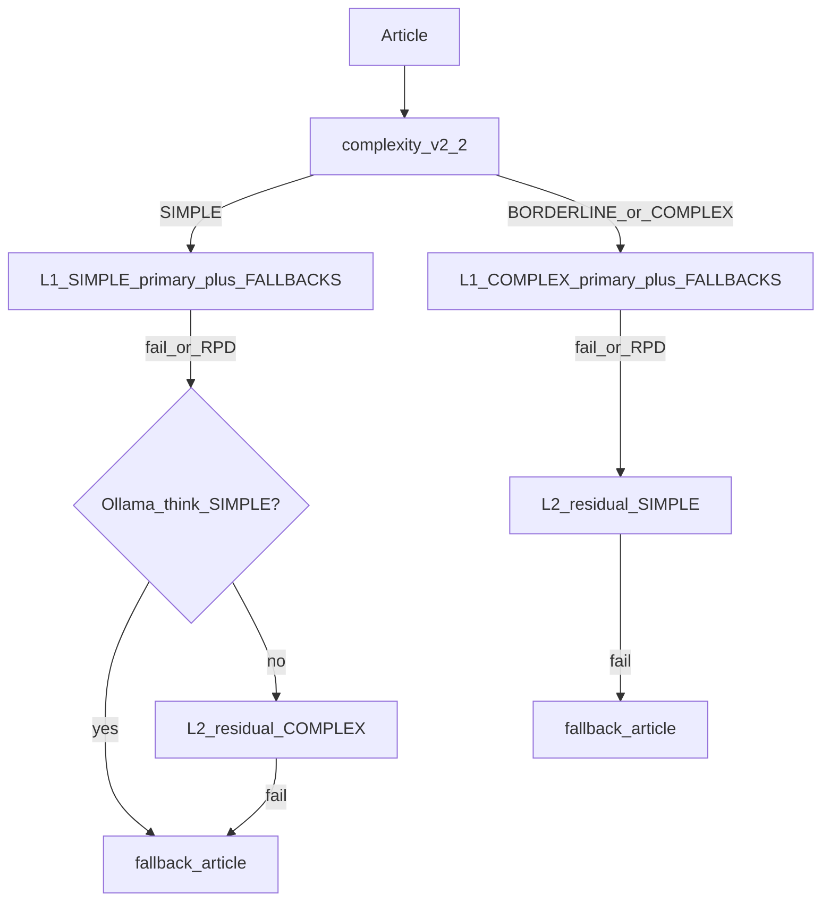

# Audit — LLM env: locale/cloud + SIMPLE/COMPLEX + sostituti

**Stato:** COMPLETE (docs shipped `c9ef842`)  
**Data:** 2026-07-19  
**Ruolo:** analyst + architect pipeline LLM  
**SoT lane:** [`../complete/sot_llm_multi_model_fallback.md`](../complete/sot_llm_multi_model_fallback.md)  
**Restore:** Profilo F core `54c8038`; VRAM unload `2996625`  
**Skills:** `llm-json-extraction`, `radar-quota-ledger`, `radar-docker-ops`  
**Codice chiave:** `radar/backend/app/core/llm_lanes.py`, `classification/client.py`, `openai_compat_payload.py`, `ollama_lifecycle.py`

---

## 1) Executive summary

**Gap vs requisito:** quasi nullo sul target ops (Gemini Flash Lite SIMPLE + DeepSeek COMPLEX + COMPLEX senza secondo sostituto + Ollama solo opt-in). Già supportato da Profilo A + residual cross-lane.

**Ambiguità principale:** `LLM_*_FALLBACKS` = CSV **stesso provider/modelli**, non “LLM di riserva” cross-provider. Il sostituto cross-provider è il **residual** SIMPLE↔COMPLEX.

**Locale:** nessun `LLM_LOCAL_ENABLED`. Opt-in = blocco Profilo F + overlay `docker-compose.ollama-host.yml`. Con tag Ollama-think su SIMPLE, il codice **sopprime residual ed escalate** verso cloud (`_simple_chain` + `uses_ollama_think_protocol`) — isolamento intenzionale `54c8038`.

**Raccomandazione vincolante:** **S3 ibrido** (primary → `*_FALLBACKS` same-provider → residual cross-lane → fallback article). Niente nuovo routing. Niente flag locale. Target finale = Profilo A con `*_FALLBACKS=` vuoti. Codice strutturale **non** necessario; residual Ollama-down = fuori scope (default: no).

---

## 2) Matrice casistiche 1–8

| # | Topologia | Solo-env? | Gap | Ricetta minima | Quota / down |
|---|-----------|-----------|-----|----------------|--------------|
| 1 | SIMPLE Gemini free + COMPLEX DeepSeek paid | **Sì** (Profilo A) | Docs: “fallback DeepSeek” = residual, non `FALLBACKS` | `SIMPLE=gemini/flash-lite` + RPM/RPD; `COMPLEX=deepseek/v4-flash`; `*_FALLBACKS=` | RPD/cooldown Gemini → DeepSeek residual; RPM attesa stessa lane; DeepSeek down → residual Gemini |
| 2 | SIMPLE+COMPLEX paid (stesso o mix) | **Sì** (B/C/D/E o mix) | Nessuno codice | Due blocchi `LLM_*_PROVIDER/MODEL/KEY/BASE_URL` | Residual se identity diversa; se uguale → una catena |
| 3 | SIMPLE locale + COMPLEX cloud | **Sì** (Profilo F) | Docs allineati: **no residual** SIMPLE→cloud | F + overlay ollama-host | Ollama down su SIMPLE → **fallback article**. COMPLEX/BORDERLINE restano cloud |
| 4 | Dual-local | **Sì** (overview Sc.1/4) | VRAM risk ops | Due model tag Ollama + overlay | Residual debole se stesso host down |
| 5 | SIMPLE cloud + COMPLEX locale | **Sì** (overview Sc.3) | VRAM unload gated su SIMPLE think | Gemini SIMPLE + Ollama COMPLEX + overlay | Residual attivo (SIMPLE non-Ollama); COMPLEX down → residual Gemini |
| 6 | Una lane effettiva | **Sì** | Nessuno | COMPLEX ≡ SIMPLE o COMPLEX unavailable | Dedupe identity |
| 7 | Fallback dedicati vs residual | **Parziale** | `*_FALLBACKS` ≠ cross-provider | `FALLBACKS=` + residual = target; CSV solo same-provider | L1 CSV → L2 residual → L3 article |
| 8 | Locale off / cloud-only | **Sì** | Nessuno | A/B attivi; F commentato; **no** overlay | Nessun tentativo `:11434` |

---

## 3) Analisi A–F

### A — AS-IS vs requisito

**A1 — Solo `.env` (+ overlay) oggi (verde):** topologie 1, 2, 3, 4, 5, 6, 8. Profili A–F in `radar/.env.example`. Overlay solo per F/local: `radar/docker-compose.ollama-host.yml`.

**A2 — Ambiguity (risolta in docs):**

| Concetto | Semantica codice |
|----------|------------------|
| `LLM_*_FALLBACKS` | CSV modelli **stesso** `PROVIDER` (`_provider_refs`) |
| Residual | Append refs altra lane se identity ≠ (`_simple_chain` / `_complex_chain`) |
| `FALLBACKS=` (chiave presente, vuota) | Sopprime legacy `GEMINI_MODEL_FALLBACKS` (C-04 in `llm_lanes.py`) |
| Escalate ValidationError | Cloud SIMPLE/BORDERLINE → 1× COMPLEX; **Ollama-think: no escalate, no residual** |

**A3 — “2 sostituti dedicati”:** **parziale**. Same-provider via `*_FALLBACKS`. Cross-provider (Gemini→DeepSeek) via **residual** se l’altra lane è quel provider. Nuovo modello env **non** richiesto per target A.

### B — Design env (minimo, riuso)

**Nessun `LLM_LOCAL_ENABLED`.** Località = `BASE_URL` + model prefix think + overlay.

| Knob | Ruolo |
|------|--------|
| `LLM_SIMPLE_*` / `LLM_COMPLEX_*` | Primary per lane |
| `LLM_*_FALLBACKS` | L1 same-provider model CSV; `=` vuoto = nessun L1 |
| Residual automatico | L2 cross-lane se identity ≠ e non Ollama-think SIMPLE |
| Overlay compose | Opt-in bridge host Ollama |
| `OLLAMA_*` | Lifecycle VRAM se SIMPLE è think-local |

**Fallback assente fail-safe:** chiave presente `LLM_*_FALLBACKS=` (vuota).  
**Convenzione ops:** un solo blocco profilo attivo in `.env`.

### C — Strategia failover (vincolante S3)

```text
L1 primary + *_FALLBACKS (same provider)
  → L2 residual altra lane (se identity ≠ e non Ollama-think SIMPLE)
    → L3 get_fallback_article
```

**Target ordine:**

- SIMPLE article: `gemini-3.1-flash-lite` → residual `deepseek-v4-flash` → article  
- COMPLEX article: `deepseek-v4-flash` → residual Gemini → article  

**Non deve succedere:** thrash RPM cross-lane; escalate/residual Ollama→cloud (vietato); unload VRAM su cloud-only.

### D — Provider & low-cost

| PROVIDER | Adapter |
|----------|---------|
| `gemini` | `google-genai` SDK |
| `deepseek` / `openai` / `glm` / `grok` | httpx OpenAI-compat (`deepseek.py`) |
| `claude` | stub |

**Kimi / gateway:** `PROVIDER=openai` + `BASE_URL` + `MODEL` + `API_KEY` (non aggiungere token all’enum).

**Alternative paid low-cost** (VERIFY_LIVE prima di promuoverle):

1. GLM-4-Flash (Profilo D)  
2. Qwen Flash via OpenAI-compat gateway  
3. MiniMax M2.x via gateway  

DeepSeek `deepseek-v4-flash` resta default paid (~$0.14/$0.28 per 1M, SoT).

**Gemini Flash Lite free:** `LLM_SIMPLE_RPM/TPM/RPD` tipici VERIFY Studio: RPM≤12, TPM 250K, RPD ~500. Soft-trim = `LLM_SIMPLE.rpd` se >0.

### E — Locale opt-in

- Profilo F commentato + overlay esplicito → cloud-only pulito  
- `OLLAMA_AUTO_UNLOAD` se SIMPLE model è think-local  
- COMPLEX-only cloud non tocca Ollama se SIMPLE non punta a `:11434` e non si monta overlay  

### F — Verdetto implementativo

| Domanda | Verdetto |
|---------|----------|
| F1 Serve codice? | **No strutturale** — solo docs |
| F2 Solo docs? | **Sì** — `.env.example`, runbook, SoT, overview |
| F3 Waves | W1 docs (questo audit) → W2 codice Ollama residual **cancellato** (default no) → W3 smoke |
| F4 Fuori scope | UI picker, Fase C pgvector, sidebar, SDK `openai`/`ollama` |

---

## 4) Target finale — esempio `.env` (senza segreti)

```text
LLM_ROUTING_MODE=complexity
LLM_ROUTING_SHADOW=false

# SIMPLE = Gemini 3.1 Flash Lite (free Studio) — VERIFY_IN_STUDIO
LLM_SIMPLE_PROVIDER=gemini
LLM_SIMPLE_MODEL=gemini-3.1-flash-lite
LLM_SIMPLE_API_KEY=                 # o GEMINI_API_KEY legacy
LLM_SIMPLE_BASE_URL=                # VUOTO (non OpenAI-compat)
LLM_SIMPLE_RPM=12
LLM_SIMPLE_TPM=250000
LLM_SIMPLE_RPD=500
LLM_SIMPLE_FALLBACKS=               # VUOTO: sostituto = residual COMPLEX (DeepSeek)
LLM_SIMPLE_REASONING_EFFORT=

# COMPLEX = DeepSeek paid — nessun secondo sostituto dedicato
LLM_COMPLEX_PROVIDER=deepseek
LLM_COMPLEX_MODEL=deepseek-v4-flash
LLM_COMPLEX_API_KEY=                # o DEEPSEEK_API_KEY
LLM_COMPLEX_BASE_URL=https://api.deepseek.com
LLM_COMPLEX_FALLBACKS=              # VUOTO = nessun L1; residual = Gemini se DeepSeek down
LLM_COMPLEX_RPM=0
LLM_COMPLEX_RPD=0
LLM_COMPLEX_REASONING_EFFORT=high
LLM_COMPLEX_BUDGET_USD_DAY=5

# Locale: Profilo F COMMENTATO; non usare overlay ollama-host
```

---

## 5) Failover a 3 livelli (S3)



---

## 6) Piano implementativo (eseguito)

| Wave | Contenuto | Stato |
|------|-----------|-------|
| W1 | Audit + `.env.example` ricette + runbook/SoT/overview allineati | **done** |
| W2 | Residual Ollama hard-fail in `client.py` | **cancelled** (default product: isolamento) |
| W3 | Smoke ops: ricette docs; cloud-only senza `:11434` | **done** (verifica docs/grep) |

**Accettazione:**

- [x] Audit in `plan-audit/complete/`  
- [x] Docs senza “residual cloud se Ollama down” contraddittorio  
- [x] Ops può realizzare target A solo editando `.env`  
- [x] W2 codice non aperto  

---

## 7) Domande aperte (non bloccanti)

1. Residual cloud su Ollama-down (hard-fail only) — solo con decisione esplicita futura.  
2. Soft-cap `LLM_COMPLEX_BUDGET_USD_DAY` tipico (es. 5) — ops locale.  
3. VERIFY_LIVE GLM/Qwen/MiniMax prima di un Profilo G in `.env.example`.

---

## Riferimenti codice

| Concern | Path |
|---------|------|
| Lane loader / FALLBACKS C-04 | `radar/backend/app/core/llm_lanes.py` |
| Chain + residual + Ollama gate | `radar/backend/app/classification/client.py` (`_simple_chain`, `_complex_chain`) |
| Ollama think detect | `radar/backend/app/classification/openai_compat_payload.py` (`uses_ollama_think_protocol`) |
| VRAM unload | `radar/backend/app/classification/ollama_lifecycle.py` |
| Overlay host | `radar/docker-compose.ollama-host.yml` |
