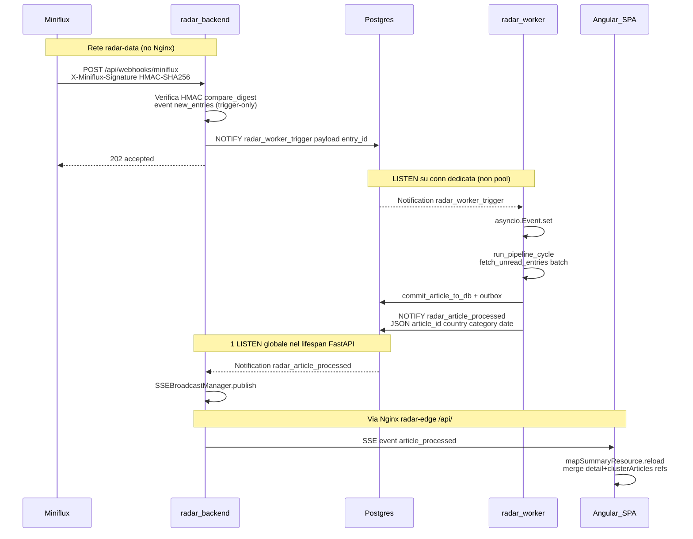
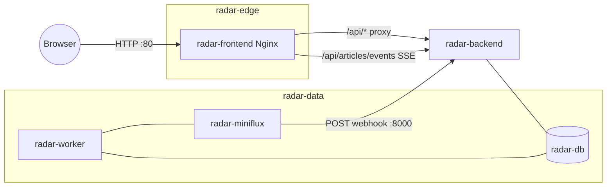

# Master Plan di Implementazione — Fase B: Ingestione Real-Time e Soft Refresh (SSE / Webhooks)

**Progetto:** Radar Informativo Globale (Intelligence Dashboard)  
**Documento:** `plan-audit/complete/master_plan_impl_phase_B.md`  
**Stato:** Definitivo — blueprint esecutivo completo (nessun placeholder)  
**Fonti consolidate:** `implementation_plan_phase_B.md`, `analisi_dettagliata_fase_B.md`, `radar_overview_and_upgrades.md` §B, ispezione codice AS-IS (2026-07-18)

---

## Vincoli ECC non negoziabili (preambolo)

1. **No ORM / SQLAlchemy** — solo SQL puro via `asyncpg`.
2. **Sidebar freeze** — zero modifiche a `radar/frontend/src/app/components/radar-sidebar/**`. Soft-refresh solo via Signals (`state.service.ts`, `app.ts`).
3. **No pool starvation** — ogni `LISTEN` usa una connessione `asyncpg.connect(DATABASE_URL)` dedicata, mai `pool.acquire()`.
4. **HMAC webhook** — verifica `X-Miniflux-Signature` con HMAC-SHA256 sul raw body e `hmac.compare_digest`.
5. **No dipendenze nuove** — SSE con `StreamingResponse` + `asyncio.Queue` (niente `sse-starlette`).
6. **No TODO / placeholder** nel codice di produzione derivato da questo piano.

---

## 1. ARCHITETTURA DETTAGLIATA E DIAGRAMMA DI FLUSSO

### 1.1 Stato AS-IS (gap)

| Layer | Oggi | Target Fase B |
|-------|------|---------------|
| Ingest trigger | Poll `asyncio.sleep(WORKER_POLL_INTERVAL_SECONDS)` (default 900) in `worker.run_pipeline_loop` | Webhook Miniflux → `NOTIFY radar_worker_trigger` → `asyncio.Event` + eager drain-until-empty all'avvio/post-wake (settle `WORKER_REFRESH_SETTLE_SECONDS`, default 15s su boot/timeout) + timeout poll 900s safety net |
| IPC API ↔ worker | Nessuno (solo DB condiviso) | Canali PostgreSQL `LISTEN`/`NOTIFY` |
| Push FE | Solo pull REST + `rxResource` su filtri | SSE `GET /api/articles/events` → soft-refresh Signals |
| Nginx `/api/` | `proxy_read_timeout 30s`, buffering default on | Location dedicata SSE: timeout lunghi, `proxy_buffering off` |
| Config | Nessun `MINIFLUX_WEBHOOK_SECRET` | Secret obbligatorio (fail-closed se vuoto) |
| Pool API | `init_pool` `max_size=10` | 1 sola LISTEN dedicata (mai per-client) |

**Pattern già presenti da riusare:**

- Connessione dedicata `WorkerState.lock_conn = await asyncpg.connect(DATABASE_URL)` (leadership advisory lock).
- Mutazioni in-place + array replace in `StateService.toggleReadStatus` (preserva reference carosello).
- Dual-list: mappa ← `state.detailArticles()`; sidebar ← `App.clusterArticles()` (stesse ref oggetto).

### 1.2 Flusso end-to-end (Mermaid)



### 1.3 Topologia di rete Compose



- **Webhook URL Miniflux (UI Settings → Integrations):** `http://radar-backend:8000/api/webhooks/miniflux`
- **SSE browser:** same-origin `EventSource('/api/articles/events')` → Nginx → backend.

### 1.4 SSEBroadcastManager e LISTEN unica globale

**Problema:** N client SSE × 1 `LISTEN` ciascuno = starvation del pool (`max_size=10` in `init_pool`).

**Soluzione:** una sola connessione dedicata nel lifespan di FastAPI ascolta `radar_article_processed` e fa da multiplexer in-process:

```
Postgres NOTIFY
      |
      v
listen_conn (asyncpg.connect, 1 sola)
      |
      |  add_listener callback
      v
SSEBroadcastManager.publish(payload_str)
      |
      +-- queue_client_1.put_nowait
      +-- queue_client_2.put_nowait
      +-- queue_client_N.put_nowait
              |
              v
     StreamingResponse generator
     (ping ogni 30s + eventi)
```

| Metodo | Comportamento |
|--------|---------------|
| `subscribe() -> asyncio.Queue` | Registra coda per-client (maxsize bounded, es. 32) |
| `unsubscribe(q)` | Rimuove coda |
| `publish(payload: str)` | Fan-out a tutte le code; se piena → drop oldest poi retry (log warning, non bloccare il listener) |
| Lifespan start | `connect` + `add_listener` |
| Lifespan stop | `close` listen_conn; `close_all` sulle code client |

Il worker ha una **seconda** connessione dedicata (`listen_conn`, distinta da `lock_conn`) su `radar_worker_trigger` che chiama `wake_event.set()`.

### 1.5 Semantica eventi e payload

**Canale `radar_worker_trigger`**

- Payload: stringa `entry_id` (informativa). Il worker **non** elabora il payload: esegue sempre `run_pipeline_cycle` completo (batch unread). Dedup implicita + self-healing via poll timeout.

**Canale `radar_article_processed`**

- Emesso **dopo** `commit_article_to_db` riuscito in `process_single_entry` (articolo già SELECT-abile da API). Non attendere outbox vault completed.
- Payload JSON:

```json
{
  "article_id": 12345,
  "country_code": "IT",
  "primary_category": "Energia",
  "published_at": "2026-07-18"
}
```

**SSE verso browser**

- Event name: `article_processed`
- Data: stesso JSON
- Commenti keep-alive: `: ping\n\n` ogni 30s di inattività

**Evento Miniflux inbound**

- Tipo reale **`new_entries`** (non lo sketch legacy `entry.created` in `radar_overview_and_upgrades.md`).
- Pattern **trigger-only**: solo HMAC + NOTIFY; nessuna classificazione in `main.py`.

---

## 2. DIBATTITO SU SICUREZZA, PRESTAZIONI E RETE

### 2.1 Sicurezza HMAC webhook

Miniflux firma il **raw body** con HMAC-SHA256 e mette l'hex digest in `X-Miniflux-Signature`.

Regole:

1. Leggere `await request.body()` (bytes grezzi) come unica fonte per la firma.
2. `expected = hmac.new(secret.encode("utf-8"), raw_body, hashlib.sha256).hexdigest()`
3. Confrontare con `hmac.compare_digest(expected, signature_header)` (timing-safe).
4. Se `MINIFLUX_WEBHOOK_SECRET` è vuoto/assente → **fail-closed**: `401` a ogni POST (niente NOTIFY).
5. Firma assente o mismatch → `401`. Non loggare il secret.

Disaccoppiamento payload: anche con 10 webhook ravvicinati, il worker fa un solo cycle e svuota la coda unread. Se un webhook si perde, `asyncio.wait_for(wake_event.wait(), timeout=WORKER_POLL_INTERVAL_SECONDS)` garantisce il poll di sicurezza.

### 2.2 Proxy Nginx e timeout SSE

**Gap critico attuale** (`radar/frontend/nginx.conf` location `/api/`):

- `proxy_read_timeout 30s` — chiude lo stream SSE dopo 30s.
- Buffering default **on** — ritarda/blocca i chunk `text/event-stream`.

Mitigazioni obbligatorie:

1. Header FastAPI: `X-Accel-Buffering: no`, `Cache-Control: no-cache`, `Content-Type: text/event-stream`.
2. Location Nginx dedicata `location = /api/articles/events` con `proxy_buffering off`, `proxy_read_timeout 3600s`, `proxy_send_timeout 3600s`, `chunked_transfer_encoding on`.
3. Ping SSE ogni **30s** (`yield b": ping\n\n"`) per tenere vivo il TCP attraverso firewall/load balancer.

### 2.3 Limiti connessioni browser HTTP/1.1

Su HTTP/1.1 i browser tipicamente limitano a **~6** connessioni persistenti per origine. Una dashboard a schermata singola con **una** `EventSource` è sostenibile. Non introdurre WebSocket/Redis in Fase B.

Dev (`ng serve` + `proxy.conf.json`): path `/api/articles/events` passa dal proxy Angular verso `localhost:8000`.

### 2.4 Race UI ottimistica vs soft-refresh

Durante `toggleReadStatus` / `toggleSavedStatus` una PATCH è in volo mentre SSE può triggerare un reload nazione.

Mitigazione obbligatoria:

- Non sostituire alla cieca `detailArticles` con oggetti nuovi da API.
- Merge per `id`: riusare la reference esistente; **preservare** `is_read`/`is_saved` locali se `pendingReadIds` / `pendingSaveIds` ha mutazione in-flight.
- Specchio delle **stesse** reference in `App.clusterArticles` e `selectedArticle`.
- Nuovo articolo → push nuovo oggetto; id rimossi → drop.

### 2.5 Fingerprint mappa e spiderfy

`RadarMapComponent.geometryFingerprint` include id/categoria/coords (detail) o count (summary). Un nuovo articolo **cambia** fingerprint → rebuild cluster + unspiderfy. Se la sidebar nazione è aperta, `App` deve ri-invocare `scheduleCategorySpiderfy` dopo il merge.

CORS: webhook server-to-server (no browser); SSE same-origin via Nginx. I metodi CORS browser restano `GET`/`PATCH`/`OPTIONS`.

---

## 3. ROADMAP DI ESECUZIONE PASSO-PASSO (FASI 1–5)

### Sotto-Fase 1 — Webhook di ingestione in FastAPI e Pub/Sub di innesco

**Obiettivo:** Endpoint sicuro che accetta push Miniflux e pubblica `NOTIFY radar_worker_trigger` senza elaborare articoli nell'API.

**File coinvolti:**

- `radar/backend/app/core/config.py`
- `radar/backend/app/main.py`
- `radar/.env.example`

#### Blueprint — `config.py`

```python
# Accanto alle altre costanti MINIFLUX_*
MINIFLUX_WEBHOOK_SECRET = _env_str("MINIFLUX_WEBHOOK_SECRET", "") or ""
```

#### Blueprint — verifica HMAC + endpoint in `main.py`

```python
from __future__ import annotations

import hashlib
import hmac
import json
import logging
from typing import Any

from fastapi import Header, HTTPException, Request

from app.core.config import MINIFLUX_WEBHOOK_SECRET

logger = logging.getLogger("radar.main")


def verify_miniflux_signature(raw_body: bytes, signature_header: str | None) -> bool:
    """Verifica HMAC-SHA256 Miniflux (hex) con confronto a tempo costante."""
    if not MINIFLUX_WEBHOOK_SECRET:
        return False
    if not signature_header:
        return False
    expected = hmac.new(
        MINIFLUX_WEBHOOK_SECRET.encode("utf-8"),
        raw_body,
        hashlib.sha256,
    ).hexdigest()
    return hmac.compare_digest(expected, signature_header.strip())


@app.post("/api/webhooks/miniflux", status_code=202)
async def miniflux_webhook(
    request: Request,
    x_miniflux_signature: str | None = Header(default=None, alias="X-Miniflux-Signature"),
    x_miniflux_event_type: str | None = Header(default=None, alias="X-Miniflux-Event-Type"),
) -> dict[str, str]:
    """Trigger-only: HMAC + NOTIFY. Nessuna classificazione / commit qui."""
    if state.db_pool is None:
        raise HTTPException(status_code=503, detail="database_unavailable")

    raw_body = await request.body()
    if not verify_miniflux_signature(raw_body, x_miniflux_signature):
        logger.warning("Webhook Miniflux rifiutato: firma assente o non valida.")
        raise HTTPException(status_code=401, detail="invalid_signature")

    try:
        payload: dict[str, Any] = json.loads(raw_body.decode("utf-8"))
    except (UnicodeDecodeError, json.JSONDecodeError) as exc:
        raise HTTPException(status_code=400, detail="invalid_json") from exc

    event_type = (x_miniflux_event_type or payload.get("event_type") or "").strip()
    if event_type != "new_entries":
        return {"status": "ignored", "event_type": event_type or "unknown"}

    entry_id = "0"
    entries = payload.get("entries")
    if isinstance(entries, list) and entries:
        first = entries[0]
        if isinstance(first, dict) and first.get("id") is not None:
            entry_id = str(first["id"])

    async with state.db_pool.acquire() as conn:
        await conn.execute("SELECT pg_notify($1, $2)", "radar_worker_trigger", entry_id)

    logger.info("Webhook new_entries accettato; NOTIFY radar_worker_trigger id=%s", entry_id)
    return {"status": "accepted"}
```

#### Blueprint — `.env.example`

```bash
# Secret webhook Miniflux (Settings → Integrations → Webhook). Obbligatorio per accettare POST.
# URL da configurare in Miniflux: http://radar-backend:8000/api/webhooks/miniflux
MINIFLUX_WEBHOOK_SECRET=
```

---

### Sotto-Fase 2 — Risveglio asincrono del worker leader

**Obiettivo:** Il leader ascolta `radar_worker_trigger` su connessione dedicata; il loop usa `asyncio.Event` + timeout = poll interval (retrocompatibile).

**File coinvolti:**

- `radar/backend/app/worker.py`

#### Blueprint — estensione `WorkerState` e listener

```python
class WorkerState:
    def __init__(self) -> None:
        # ... campi esistenti ...
        self.lock_conn: Optional[asyncpg.Connection] = None
        self.lock_held: bool = False
        self.heartbeat_task: Optional[asyncio.Task] = None
        # Fase B
        self.listen_conn: Optional[asyncpg.Connection] = None
        self.wake_event: asyncio.Event = asyncio.Event()
        self._trigger_callback: Any = None


async def start_postgres_trigger_listener(state: WorkerState) -> None:
    """LISTEN dedicato su radar_worker_trigger (mai dal pool)."""
    assert state.listen_conn is None
    state.wake_event = asyncio.Event()
    state.listen_conn = await asyncpg.connect(DATABASE_URL)

    def _callback(_conn: asyncpg.Connection, _pid: int, _channel: str, _payload: str) -> None:
        state.wake_event.set()

    state._trigger_callback = _callback
    await state.listen_conn.add_listener("radar_worker_trigger", _callback)
    logger.info("LISTEN attivo sul canale radar_worker_trigger.")


async def stop_postgres_trigger_listener(state: WorkerState) -> None:
    if state.listen_conn is None:
        return
    try:
        if state._trigger_callback is not None:
            await state.listen_conn.remove_listener(
                "radar_worker_trigger",
                state._trigger_callback,
            )
    except Exception as err:
        logger.debug("remove_listener: %s", err)
    try:
        await state.listen_conn.close()
    except Exception as err:
        logger.warning("Chiusura listen_conn: %s", err)
    state.listen_conn = None
    state._trigger_callback = None
```

#### Blueprint — `run_pipeline_loop` con wait_for

```python
async def run_pipeline_loop(state: WorkerState) -> None:
    logger.info(
        "Demone pipeline avviato (poll=%ss, queue_depth=%s, entry_concurrency=%s, wake=LISTEN).",
        WORKER_POLL_INTERVAL_SECONDS,
        WORKER_QUEUE_DEPTH,
        WORKER_ENTRY_CONCURRENCY,
    )

    try:
        await state.miniflux_client.refresh_all_feeds()
    except asyncio.CancelledError:
        raise
    except Exception as refresh_err:
        logger.warning("Refresh forzato fallito all'avvio: %s", refresh_err)

    while True:
        try:
            await run_pipeline_cycle(state)
        except asyncio.CancelledError:
            raise
        except Exception as cycle_err:
            logger.error(
                "Errore critico durante l'esecuzione del ciclo pipeline: %s",
                cycle_err,
                exc_info=True,
            )

        state.wake_event.clear()
        logger.info(
            "Attesa wake NOTIFY o timeout poll (%ss)...",
            WORKER_POLL_INTERVAL_SECONDS,
        )
        try:
            await asyncio.wait_for(
                state.wake_event.wait(),
                timeout=float(WORKER_POLL_INTERVAL_SECONDS),
            )
            logger.info("Risveglio da radar_worker_trigger.")
        except asyncio.TimeoutError:
            logger.info("Timeout poll di sicurezza: avvio ciclo periodico.")
```

#### Blueprint — NOTIFY dopo commit in `process_single_entry`

Subito dopo `article_id = await commit_article_to_db(...)`. Emmettere solo sul path di successo commit (non su early-return duplicati pre-classificazione):

```python
import json

notify_payload = json.dumps(
    {
        "article_id": article_id,
        "country_code": extracted_article.country_code,
        "primary_category": extracted_article.primary_category,
        "published_at": extracted_article.published_at,
    },
    separators=(",", ":"),
)
await conn.execute(
    "SELECT pg_notify($1, $2)",
    "radar_article_processed",
    notify_payload,
)
```

#### Blueprint — bootstrap / shutdown

Dopo acquisizione leadership in `run_worker`:

```python
await start_postgres_trigger_listener(state)
```

In `shutdown_worker_resources`, prima di chiudere il pool:

```python
await stop_postgres_trigger_listener(state)
```

---

### Sotto-Fase 3 — Pub/Sub articoli elaborati e canale SSE FastAPI

**Obiettivo:** Multiplexer LISTEN → broadcast SSE; endpoint `/api/articles/events`; fix Nginx.

**File coinvolti:**

- `radar/backend/app/main.py`
- `radar/frontend/nginx.conf`

#### Blueprint — `SSEBroadcastManager` (variante single-loop)

```python
from __future__ import annotations

import asyncio
import logging
from typing import AsyncIterator

logger = logging.getLogger("radar.sse")


class SSEBroadcastManager:
    """Fan-out in-process: 1 publisher, N code client SSE (event-loop singolo)."""

    def __init__(self, *, queue_maxsize: int = 32) -> None:
        self._queue_maxsize = queue_maxsize
        self._subscribers: set[asyncio.Queue[str | None]] = set()

    def subscribe(self) -> asyncio.Queue[str | None]:
        q: asyncio.Queue[str | None] = asyncio.Queue(maxsize=self._queue_maxsize)
        self._subscribers.add(q)
        return q

    def unsubscribe(self, q: asyncio.Queue[str | None]) -> None:
        self._subscribers.discard(q)

    def publish(self, payload: str) -> None:
        for q in list(self._subscribers):
            try:
                q.put_nowait(payload)
            except asyncio.QueueFull:
                try:
                    q.get_nowait()
                except asyncio.QueueEmpty:
                    pass
                try:
                    q.put_nowait(payload)
                except asyncio.QueueFull:
                    logger.warning("SSE client queue piena: evento scartato.")

    def close_all(self) -> None:
        for q in list(self._subscribers):
            try:
                q.put_nowait(None)
            except asyncio.QueueFull:
                pass
        self._subscribers.clear()
```

#### Blueprint — listener lifespan + AppState

```python
import asyncio
import asyncpg
from contextlib import asynccontextmanager
from fastapi.responses import StreamingResponse

class AppState:
    def __init__(self) -> None:
        self.db_pool: Optional[Any] = None
        self.sse: SSEBroadcastManager = SSEBroadcastManager()
        self.listen_conn: Optional[asyncpg.Connection] = None
        self.listen_ready: asyncio.Event = asyncio.Event()
        self._article_notify_callback: Any = None


state = AppState()


async def backend_article_listener() -> None:
    """Una LISTEN globale su radar_article_processed → SSEBroadcastManager."""
    conn = await asyncpg.connect(DATABASE_URL)
    state.listen_conn = conn

    def _on_notify(
        _conn: asyncpg.Connection,
        _pid: int,
        _channel: str,
        payload: str,
    ) -> None:
        state.sse.publish(payload)

    state._article_notify_callback = _on_notify
    await conn.add_listener("radar_article_processed", _on_notify)
    state.listen_ready.set()
    logger.info("LISTEN backend attivo su radar_article_processed.")
    try:
        while True:
            await asyncio.sleep(3600)
    except asyncio.CancelledError:
        raise
    finally:
        try:
            await conn.close()
        except Exception as err:
            logger.debug("Chiusura listen_conn API: %s", err)
        state.listen_conn = None


@asynccontextmanager
async def lifespan(app: FastAPI) -> AsyncGenerator[None, None]:
    setup_logging()
    listener_task: asyncio.Task | None = None
    try:
        state.db_pool = await init_pool(DATABASE_URL)
        await bootstrap_database(state.db_pool)
        listener_task = asyncio.create_task(
            backend_article_listener(),
            name="radar-backend-article-listener",
        )
        await asyncio.wait_for(state.listen_ready.wait(), timeout=30.0)
        logger.info("Bootstrap API + LISTEN SSE completato.")
    except Exception as init_err:
        logger.critical("Errore critico all'avvio del lifespan: %s", init_err, exc_info=True)
        if listener_task is not None:
            listener_task.cancel()
            try:
                await listener_task
            except asyncio.CancelledError:
                pass
        if state.db_pool is not None:
            await state.db_pool.close()
            state.db_pool = None
        raise

    yield

    logger.info("Arresto del server FastAPI in corso...")
    state.sse.close_all()
    if listener_task is not None:
        listener_task.cancel()
        try:
            await listener_task
        except asyncio.CancelledError:
            pass
    if state.db_pool is not None:
        await state.db_pool.close()
        state.db_pool = None
    logger.info("Radar Backend arrestato.")
```

#### Blueprint — endpoint SSE

```python
SSE_PING_INTERVAL_SECONDS = 30.0


@app.get("/api/articles/events")
async def articles_events() -> StreamingResponse:
    async def event_generator() -> AsyncIterator[bytes]:
        queue = state.sse.subscribe()
        try:
            while True:
                try:
                    item = await asyncio.wait_for(
                        queue.get(),
                        timeout=SSE_PING_INTERVAL_SECONDS,
                    )
                except asyncio.TimeoutError:
                    yield b": ping\n\n"
                    continue
                if item is None:
                    break
                data = item.replace("\n", " ").replace("\r", " ")
                yield f"event: article_processed\ndata: {data}\n\n".encode("utf-8")
        finally:
            state.sse.unsubscribe(queue)

    return StreamingResponse(
        event_generator(),
        media_type="text/event-stream",
        headers={
            "Cache-Control": "no-cache",
            "Connection": "keep-alive",
            "X-Accel-Buffering": "no",
        },
    )
```

#### Blueprint — `nginx.conf` (location SSE **prima** di `/api/`)

```nginx
    # SSE long-lived: buffering off + timeout lunghi (Fase B)
    location = /api/articles/events {
        resolver 127.0.0.11 valid=10s;
        set $backend_upstream http://radar-backend:8000;
        proxy_pass $backend_upstream$request_uri;
        proxy_http_version 1.1;
        proxy_set_header Host $host;
        proxy_set_header X-Real-IP $remote_addr;
        proxy_set_header X-Forwarded-For $proxy_add_x_forwarded_for;
        proxy_set_header X-Forwarded-Proto $scheme;
        proxy_set_header Connection "";
        proxy_buffering off;
        proxy_cache off;
        chunked_transfer_encoding on;
        proxy_read_timeout 3600s;
        proxy_send_timeout 3600s;
        proxy_connect_timeout 10s;
    }

    location /api/ {
        # ... invariato (timeout 30s OK per REST) ...
    }
```

---

### Sotto-Fase 4 — Client SSE Angular e Soft Refresh reattivo

**Obiettivo:** `EventSource` in `StateService`; merge ref-safe; `effect` in `App` per `clusterArticles` + re-spiderfy. **Zero tocchi a `radar-sidebar/**`.**

**File coinvolti:**

- `radar/frontend/src/app/services/state.service.ts`
- `radar/frontend/src/app/app.ts`

#### Blueprint — tipi e Signal evento

```typescript
export interface ArticleProcessedEvent {
  article_id: number;
  country_code: string;
  primary_category: string;
  published_at: string;
}
```

In `StateService`:

```typescript
import {
  Injectable,
  inject,
  signal,
  computed,
  NgZone,
  DestroyRef,
} from '@angular/core';
import { MOCK_MODE } from './mock-mode.token';

private readonly zone = inject(NgZone);
private readonly destroyRef = inject(DestroyRef);
private readonly mockMode = inject(MOCK_MODE);
private eventSource: EventSource | null = null;

private readonly pendingReadIds = new Set<number>();
private readonly pendingSaveIds = new Set<number>();

/** Ultimo evento SSE (null = nessuno). Consumato da App effect. */
readonly lastProcessedArticleEvent = signal<ArticleProcessedEvent | null>(null);

constructor() {
  if (!this.mockMode) {
    this.initRealTimeConnection();
  }
  this.destroyRef.onDestroy(() => this.closeRealTimeConnection());
}

private initRealTimeConnection(): void {
  this.zone.runOutsideAngular(() => {
    const es = new EventSource('/api/articles/events');
    this.eventSource = es;
    es.addEventListener('article_processed', (evt: Event) => {
      const msg = evt as MessageEvent<string>;
      let data: ArticleProcessedEvent;
      try {
        data = JSON.parse(msg.data) as ArticleProcessedEvent;
      } catch {
        console.error('[StateService] SSE payload non JSON:', msg.data);
        return;
      }
      this.zone.run(() => {
        this.lastProcessedArticleEvent.set(data);
        this.mapSummaryResource.reload();
        this.savedSummaryResource.reload();
      });
    });
    es.onerror = () => {
      console.warn('[StateService] SSE connection error (browser will retry).');
    };
  });
}

private closeRealTimeConnection(): void {
  if (this.eventSource) {
    this.eventSource.close();
    this.eventSource = null;
  }
}
```

In `toggleReadStatus` / `toggleSavedStatus`: `pendingReadIds.add(articleId)` (o `pendingSaveIds`) all'inizio; `delete` in finalize della subscribe PATCH (sia next che error).

#### Blueprint — merge ref-safe

```typescript
/**
 * Soft-merge lista nazione/salvati: preserva reference Article esistenti
 * e flag ottimistici se mutazione in-flight (sidebar freeze / no flicker).
 */
mergeDetailArticlesFromServer(serverArticles: Article[]): Article[] {
  const prev = this.detailArticles();
  const prevById = new Map(prev.map((a) => [a.id, a]));
  const merged: Article[] = [];

  for (const incoming of serverArticles) {
    const existing = prevById.get(incoming.id);
    if (!existing) {
      merged.push(incoming);
      continue;
    }
    const pendingRead = this.pendingReadIds.has(incoming.id);
    const pendingSave = this.pendingSaveIds.has(incoming.id);

    existing.title = incoming.title;
    existing.summary = incoming.summary;
    existing.primary_category = incoming.primary_category;
    existing.sentiment = incoming.sentiment;
    existing.relevance_level = incoming.relevance_level;
    existing.country_code = incoming.country_code;
    existing.latitude = incoming.latitude;
    existing.longitude = incoming.longitude;
    existing.published_at = incoming.published_at;
    existing.source_url = incoming.source_url;
    existing.feed_title = incoming.feed_title;
    if (!pendingRead) {
      existing.is_read = incoming.is_read;
    }
    if (!pendingSave) {
      existing.is_saved = incoming.is_saved;
    }
    merged.push(existing);
  }

  this.detailArticles.set(merged);
  return merged;
}

async softReloadCountryArticles(countryCode: string): Promise<Article[]> {
  const f = this.filters();
  const all = await firstValueFrom(
    this.articleService.getAllArticlesForCountry(f.date, countryCode.toUpperCase()),
  );
  const filtered = all.filter((art) => this.matchesClientFilters(art, f));
  return this.mergeDetailArticlesFromServer(filtered);
}

async softReloadSavedCountryArticles(countryCode: string): Promise<Article[]> {
  const f = this.filters();
  const all = await firstValueFrom(
    this.articleService.getAllSavedArticlesForCountry(countryCode.toUpperCase()),
  );
  const filtered = all.filter((art) => this.matchesClientFilters(art, f));
  return this.mergeDetailArticlesFromServer(filtered);
}
```

`loadCountryArticles` / `loadSavedCountryArticles` restano per **open iniziale** (set pieno accettabile).

#### Blueprint — `app.ts` effect

```typescript
import { Component, computed, effect, inject, signal, viewChild, HostListener } from '@angular/core';

export class App {
  readonly state = inject(StateService);
  // ... signals esistenti ...

  constructor() {
    effect(() => {
      const evt = this.state.lastProcessedArticleEvent();
      if (!evt) return;
      void this.handleProcessedArticle(evt);
    });
  }

  private async handleProcessedArticle(evt: {
    article_id: number;
    country_code: string;
    primary_category: string;
    published_at: string;
  }): Promise<void> {
    if (!this.isSidebarOpen()) {
      return;
    }
    const focus = this.focusCountryCode();
    if (!focus || focus.toUpperCase() !== evt.country_code.toUpperCase()) {
      return;
    }

    const gen = this.nationOpenGeneration;
    try {
      await (
        this.state.sidebarMode() === 'saved'
          ? this.state.softReloadSavedCountryArticles(focus)
          : this.state.softReloadCountryArticles(focus)
      );
      if (gen !== this.nationOpenGeneration) return;

      const detail = this.state.detailArticles();
      const byId = new Map(detail.map((a) => [a.id, a]));
      const prevCluster = this.clusterArticles();
      const categoryFilter =
        prevCluster.length > 0 &&
        prevCluster.every((a) => a.primary_category === prevCluster[0].primary_category)
          ? prevCluster[0].primary_category
          : null;

      let nextCluster = categoryFilter
        ? detail.filter((a) => a.primary_category === categoryFilter)
        : detail;
      if (nextCluster.length === 0) nextCluster = detail;

      this.clusterArticles.set(nextCluster.map((a) => byId.get(a.id) ?? a));

      const sel = this.selectedArticle();
      if (sel) {
        const updated = byId.get(sel.id);
        if (updated) this.selectedArticle.set(updated);
      }

      const cat =
        this.selectedArticle()?.primary_category ??
        nextCluster[0]?.primary_category ??
        evt.primary_category;
      this.scheduleCategorySpiderfy(focus, cat as PrimaryCategory);
    } catch {
      // Soft-refresh fallito: non chiudere sidebar
    }
  }
}
```

Vincoli: non modificare `radar-sidebar/**`; non introdurre `app-article-list`; gate `MOCK_MODE` senza EventSource.

---

### Sotto-Fase 5 — Asset documentali e standard ECC

**Obiettivo:** Allineare README, `.env.example`, regole backend, skill API contract.

**File coinvolti:** vedi Sezione 5.

---

## 4. VERIFICA E TESTING SUITE (SCRIPT COMPRESI)

### 4.1 Script Python offline — simulazione webhook Miniflux

Salvare come `radar/backend/app/scripts/simulate_miniflux_webhook.py`:

```python
#!/usr/bin/env python3
"""Simula POST webhook Miniflux con header X-Miniflux-Signature (HMAC-SHA256).

Uso:
  set MINIFLUX_WEBHOOK_SECRET=test_secret_phase_b
  set WEBHOOK_URL=http://127.0.0.1:8000/api/webhooks/miniflux
  python -m app.scripts.simulate_miniflux_webhook
"""

from __future__ import annotations

import hashlib
import hmac
import json
import os
import sys
import urllib.error
import urllib.request


def main() -> int:
    secret = os.environ.get("MINIFLUX_WEBHOOK_SECRET", "test_secret_phase_b")
    url = os.environ.get(
        "WEBHOOK_URL",
        "http://127.0.0.1:8000/api/webhooks/miniflux",
    )

    payload = {
        "event_type": "new_entries",
        "entries": [
            {
                "id": 900001,
                "title": "Phase B webhook simulation",
                "url": "https://example.test/phase-b-sim",
            }
        ],
    }
    raw = json.dumps(payload, separators=(",", ":")).encode("utf-8")
    signature = hmac.new(secret.encode("utf-8"), raw, hashlib.sha256).hexdigest()

    req = urllib.request.Request(
        url,
        data=raw,
        method="POST",
        headers={
            "Content-Type": "application/json",
            "User-Agent": "Miniflux/2.3.2-phase-b-sim",
            "X-Miniflux-Signature": signature,
            "X-Miniflux-Event-Type": "new_entries",
        },
    )

    try:
        with urllib.request.urlopen(req, timeout=15) as resp:
            body = resp.read().decode("utf-8")
            print(f"HTTP {resp.status}")
            print(body)
            return 0 if resp.status in (200, 202) else 1
    except urllib.error.HTTPError as err:
        print(f"HTTP {err.code}", file=sys.stderr)
        print(err.read().decode("utf-8", errors="replace"), file=sys.stderr)
        return 1
    except urllib.error.URLError as err:
        print(f"URL error: {err}", file=sys.stderr)
        return 1


if __name__ == "__main__":
    raise SystemExit(main())
```

| Caso | Atteso |
|------|--------|
| Secret corretto + `new_entries` | HTTP 202, log NOTIFY, worker wake |
| Secret errato | HTTP 401, nessun NOTIFY |
| Secret env vuoto sul backend | HTTP 401 fail-closed |
| `save_entry` | HTTP 202 ignored, nessun wake obbligatorio |

### 4.2 Diagnostica SSE con curl non-buffered

```bash
# Diretto sul backend
curl -N -sS -H "Accept: text/event-stream" http://127.0.0.1:8000/api/articles/events

# Via Nginx (stack Compose, host :80)
curl -N -sS -H "Accept: text/event-stream" http://127.0.0.1/api/articles/events
```

**Atteso entro 30s:** linee `: ping`

**Atteso dopo NOTIFY:**

```text
event: article_processed
data: {"article_id":1,"country_code":"IT","primary_category":"Energia","published_at":"2026-07-18"}
```

NOTIFY manuale:

```bash
docker compose exec radar-db psql -U radar_user -d radar_db -c "SELECT pg_notify('radar_article_processed', '{\"article_id\":1,\"country_code\":\"IT\",\"primary_category\":\"Energia\",\"published_at\":\"2026-07-18\"}');"
```

Wake worker:

```bash
docker compose exec radar-db psql -U radar_user -d radar_db -c "SELECT pg_notify('radar_worker_trigger', '0');"
```

### 4.3 Procedura E2E manuale (DB → mappa Angular)

1. `docker compose up -d --build` (include rebuild frontend per nginx SSE).
2. Impostare in `.env` e Miniflux UI lo stesso `MINIFLUX_WEBHOOK_SECRET`; URL webhook `http://radar-backend:8000/api/webhooks/miniflux`.
3. Aprire `http://localhost/` (una sola tab).
4. Terminale A: `curl -N http://localhost/api/articles/events` — verificare ping.
5. Terminale B: `simulate_miniflux_webhook` oppure feed unread reale + webhook.
6. Log attesi: backend accepted; worker “Risveglio da radar_worker_trigger”.
7. Mappa **senza F5**: pin/count aggiornati (`mapSummaryResource.reload`).
8. Nazione aperta: nuova card senza distruggere sidebar; re-spiderfy.
9. Toggle Salva/Letto durante SSE: assenza di flicker (pending sets).
10. Negativo: firma errata → 401; SSE resta vivo con ping.

### 4.4 Smoke test automatici consigliati

**Backend (pytest):**

- `test_verify_miniflux_signature_accepts_valid_hmac`
- `test_verify_miniflux_signature_rejects_mismatch`
- `test_webhook_returns_401_when_secret_empty`
- `test_sse_broadcast_manager_fanout`

**Frontend (Vitest):**

- `mergeDetailArticlesFromServer` preserva `===` reference per id esistenti
- Con `pendingReadIds`, `is_read` locale non sovrascritto dal merge

---

## 5. REGISTRO DELLE REGOLE ECC AGGIORNATE

### 5.1 `radar/.ecc/rules/backend.md`

Aggiungere:

```markdown
## Regola: LISTEN/NOTIFY PostgreSQL — connessioni dedicate (Fase B)

> **DIVIETO:** Usare `async with pool.acquire() as conn` per `LISTEN` di lunga durata.
> Sottrarrebbe slot permanenti al pool (`max_size` tipico 10) e causerebbe starvation.

**OBBLIGATORIO:**
- Worker: connessione dedicata `await asyncpg.connect(DATABASE_URL)` per `LISTEN radar_worker_trigger` (distinta da `lock_conn` leadership).
- API FastAPI: **una sola** connessione dedicata nel `lifespan` per `LISTEN radar_article_processed`, con fan-out in-process (`SSEBroadcastManager`) verso i client SSE.
- `NOTIFY` di breve durata può usare connessioni del pool (`pg_notify`).

**VIETATO:**
- Un `LISTEN` per ogni client SSE.
- Tenere `LISTEN` su connessioni ottenute dal pool HTTP request-scoped.
```

Aggiornare l'esempio di `run_pipeline_loop` per mostrare `asyncio.wait_for(wake_event.wait(), timeout=WORKER_POLL_INTERVAL_SECONDS)` al posto del solo `asyncio.sleep`.

### 5.2 `radar/.ecc/skills/radar-api-contract.md` (+ mirror `.agents/skills/radar-api-contract/SKILL.md`)

Estendere la tabella contratto:

```markdown
| Ingresso webhook | `POST /api/webhooks/miniflux` | Body JSON Miniflux; header `X-Miniflux-Signature` (HMAC-SHA256 hex sul raw body); event utile `new_entries`. Risposta `202` accepted / `401` firma / `ignored` altri eventi. **Trigger-only** → `NOTIFY radar_worker_trigger`. Nessuna classificazione in `main.py`. |
| SSE real-time | `GET /api/articles/events` | `text/event-stream`; event `article_processed` + data JSON `{article_id,country_code,primary_category,published_at}`; commenti `: ping` ogni 30s; header `X-Accel-Buffering: no`. |
```

Anti-pattern da aggiungere:

```markdown
- Fare LISTEN PostgreSQL dal pool asyncpg o per-client SSE
- Ingerire/classificare articoli dentro l'handler webhook (viola API-only)
- Soft-refresh FE che sostituisce tutte le reference `Article` del carosello (viola sidebar freeze UX)
- Omettere verifica HMAC o usare `==` invece di `hmac.compare_digest`
```

Aggiornare frontmatter `description` / `version` a `1.2.0` includendo webhook + SSE.

### 5.3 `README.md` principale

1. Diagramma Mermaid “Flusso Logico”: freccia `MF -->|webhook POST| API`, `API -->|SSE events| FE`, nota wake NOTIFY del worker.
2. Tabella servizi — `radar-worker`: “Polling Miniflux **+ wake NOTIFY** + LLM + commit/outbox”.
3. Variabile:

```markdown
| `MINIFLUX_WEBHOOK_SECRET` | Secret HMAC (Miniflux → Settings → Integrations → Webhook). URL: `http://radar-backend:8000/api/webhooks/miniflux` |
```

4. Link: `plan-audit/complete/master_plan_impl_phase_B.md`.

### 5.4 Checklist ops Miniflux post-deploy

1. Copiare il secret Miniflux in `radar/.env` → `MINIFLUX_WEBHOOK_SECRET=...`
2. Webhook URL = `http://radar-backend:8000/api/webhooks/miniflux`
3. `docker compose up -d` (ricarica env backend)
4. Verificare con `simulate_miniflux_webhook.py`

---

## Appendice A — Matrice file di implementazione futura

| File | Fase | Azione |
|------|------|--------|
| `radar/backend/app/core/config.py` | 1 | `MINIFLUX_WEBHOOK_SECRET` |
| `radar/backend/app/main.py` | 1, 3 | Webhook + SSE manager + LISTEN lifespan |
| `radar/backend/app/worker.py` | 2 | LISTEN trigger, Event wait, NOTIFY processed |
| `radar/backend/app/scripts/simulate_miniflux_webhook.py` | 4 test | Script HMAC |
| `radar/frontend/nginx.conf` | 3 | Location SSE |
| `radar/frontend/src/app/services/state.service.ts` | 4 | EventSource, merge, reload |
| `radar/frontend/src/app/app.ts` | 4 | effect soft-refresh + spiderfy |
| `radar/.env.example` | 1, 5 | Secret + commenti URL |
| `README.md` | 5 | Diagramma + env |
| `radar/.ecc/rules/backend.md` | 5 | Regola LISTEN dedicate |
| `radar/.ecc/skills/radar-api-contract.md` | 5 | Contratto webhook/SSE |
| `.agents/skills/radar-api-contract/SKILL.md` | 5 | Sync SoT |

**Esplicitamente esclusi:** `radar/frontend/src/app/components/radar-sidebar/**`.

---

## Appendice B — Compatibilità fasi successive

| Fase roadmap | Interazione con B |
|--------------|-------------------|
| **C (pgvector dedup)** | Dedup nel worker post-wake; scarto pre-commit → nessun `NOTIFY radar_article_processed` |
| **H (geospatial graph)** | Soft-refresh Signals aggiorna archi senza reload pagina |
| **Outbox** | Mark-read Miniflux solo post-vault `completed`; SSE dopo commit DB è intenzionale |

---

## Appendice C — Criteri di accettazione Fase B (GATE)

1. Webhook HMAC valido → worker wake entro secondi (non solo poll 900s).
2. Webhook HMAC invalido → 401, zero NOTIFY.
3. `curl -N /api/articles/events` mostra ping ≤30s e eventi dopo commit.
4. Nginx non bufferizza SSE (evento visibile via `:80` senza delay anomalo).
5. Mappa aggiorna pin/count senza F5.
6. Sidebar aperta sulla nazione target: nuove card senza refactor sidebar; merge refs; re-spiderfy ok.
7. Toggle read/save in contemporanea a SSE: nessun flicker sistematico.
8. Documentazione ECC/README/`.env.example` allineate.
9. Nessun `LISTEN` sul pool; nessuna dipendenza `sse-starlette`.

---

*Fine del Master Plan Fase B — documento definitivo per l'implementazione.*
