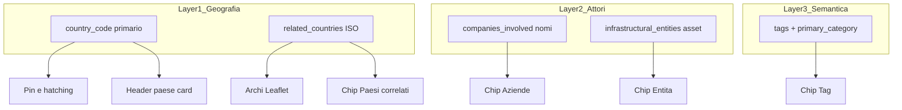
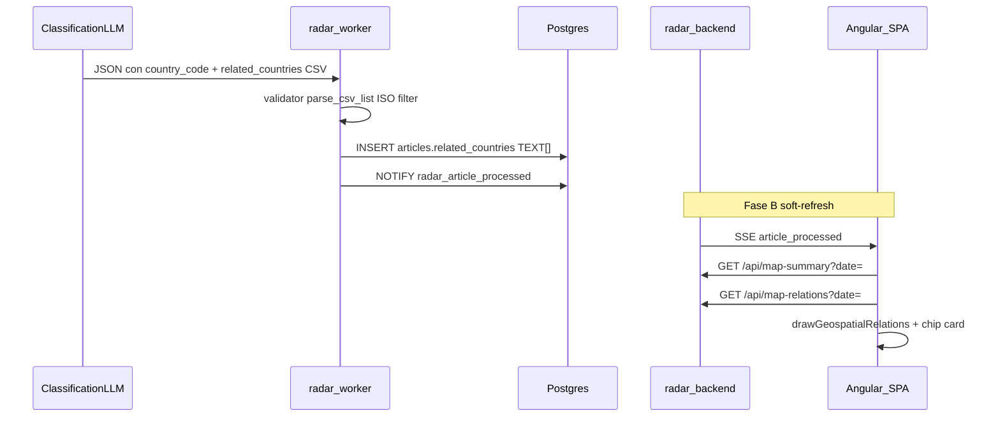

# Master Plan di Implementazione — Fase H: Grafo Geospaziale e Coerenza Relazioni

**Progetto:** Radar Informativo Globale (Intelligence Dashboard)  
**Documento:** `plan-audit/active/master_plan_impl_phase_H_geospatial_graph.md`  
**Stato:** Definitivo — blueprint esecutivo (piano only; **nessuna implementazione codice finché non esplicitamente richiesta**)  
**Data:** 2026-07-18  
**Fonti:** `radar_overview_and_upgrades.md` §H (+ §G), Phase B soft-refresh, ispezione codice AS-IS, skills `radar-api-contract` / `llm-json-extraction` / `radar-sidebar-freeze` / `spatial-data-mocking`, ECC `angular-map-expert` / rules / agents

---

## Spiegazione prodotto (linguaggio naturale)

**Oggi:** ogni notizia appartiene a un solo paese. Se la storia coinvolge Italia e Cina, l’altro paese non compare come collegamento sulla mappa né come etichetta chiara in scheda.

**Dopo Fase H:**
1. Sulla mappa del giorno compaiono **linee curve** tra paesi collegati dalla stessa notizia (colore = categoria; spessore = quante notizie quel giorno).
2. Nel carosello, sezione **“Paesi correlati”** con i paesi secondari (etichette solo informative).
3. Dietro le quinte l’LLM continua a scegliere un **paese primario** e può aggiungere fino a 5 ISO secondari (`related_countries`).

**Non in v1:** frecce direzionali tipizzate, grafo aziende, click sulle chip per navigare, rifacimento del carosello.

---

## Vincoli ECC non negoziabili (preambolo)

1. **No ORM / SQLAlchemy** — solo SQL puro via `asyncpg`.
2. **Pydantic CSV `str`** — `related_countries` come `companies_involved` / `tags` / `infrastructural_entities` (non `List[str]` nello schema LLM).
3. **Leaflet UMD** — `window.L` + `angular.json` `scripts[]`; niente ESM side-effect.
4. **Sidebar freeze** — eccezione mirata documentata: solo sezione chip `related_countries` (+ stile `.related-chip`). Vietato refactor carousel / `article-list`.
5. **Soft-refresh Fase B** — `mapRelationsResource.reload()` insieme a `mapSummaryResource` su SSE `article_processed`.
6. **No dipendenze npm nuove in v1** — curve Bézier via punti interpolati + `L.polyline` (non `@elfalem/leaflet-curve` finché non serve).
7. **No TODO / placeholder** nel codice di produzione.
8. **Docs + ECC in scope del GATE** — ogni cambio contratto/schema deve aggiornare SoT `.md`, skills, mirror ECC e rules/agents elencati in §9. Nessuna feature “solo codice”.

---

## 0. Decisione ottimale (analisi contestuale)

### 0.1 AS-IS

| Layer | Stato |
|-------|--------|
| Geografia | Un solo `articles.country_code` (pin, hatching, path vault) |
| Attori | `companies_involved` / `infrastructural_entities` — nomi, non ISO |
| Semantica | `tags` + `primary_category` |
| Multi-paese | Solo segnale heuristic `multi_country` in `complexity.py` (lane LLM) — **non persistito** |
| Carosello | Chip display-only entità/aziende/tag; paese = header |
| Mappa | Layer groups, colori categoria, fingerprint geometria, SSE soft-refresh |
| Sketch overview §H | `unnest(infrastructural_entities)` come target country — **errato vs schema** |

### 0.2 Alternative scartate (v1)

- **Edge diretti tipizzati (source→target + tipo)** — prompt fragile, schema nested, fuori pattern CSV.
- **Euristica aziende condivise stesso giorno** — false positive; aziende senza geo.
- **Solo FE + mock** — debito pipeline immediato.
- **Overload tags/entities come paesi** — contamina semantica; niente validazione ISO.

### 0.3 Decisione v1 (vincolante)

**Campo `related_countries`:** CSV ISO Alpha-2 secondari lato LLM → `TEXT[]` in DB → `string[]` in FE.

- Archi mappa: undirected `LEAST(primary, related) ↔ GREATEST(...)` aggregati per `published_at × primary_category`.
- Colore arco = categoria; weight = `min(6, 1 + volume * 0.5)`.
- Fuori scope v1: company→country, direzione tipizzata, Fase G wiki-link completi (solo YAML `related_countries` in frontmatter).

### 0.4 Modello a 3 layer (coerenza)



**Regola:** non mettere ISO in Layer 2/3; non usare nomi paese italiani in `related_countries`.

---

## 1. Architettura end-to-end



### Shape API

`GET /api/map-relations?date=YYYY-MM-DD` (+ optional `sentiment`, `relevance_level` come map-summary):

```json
[
  {
    "source_country": "AZ",
    "target_country": "IT",
    "primary_category": "Energia",
    "volume": 2
  }
]
```

`GET /api/articles` items: campo aggiuntivo `"related_countries": ["CN","US"]`.

---

## 2. Backend — acquisizione e persistenza

### 2.1 Migration `011_articles_related_countries.sql`

```sql
ALTER TABLE articles
  ADD COLUMN IF NOT EXISTS related_countries TEXT[] NOT NULL DEFAULT '{}';

COMMENT ON COLUMN articles.related_countries IS
  'ISO Alpha-2 secondari (escluso country_code e XX); vuoto = nessun arco';
```

### 2.2 Prompt (`classification/prompts.py`)

Estendere §REQUISITI GEOGRAFICI:

- `related_countries`: CSV ISO di nazioni **secondarie** (partner, target, teatro bilaterale).
- Se assenti: esattamente `Nessuno`.
- Non duplicare `country_code`; non includere `XX`; massimo 5 codici.
- Esempio: trattato IT–CN con primario IT → `"CN"`.

### 2.3 Validator (`classification/validator.py`)

- Campo `related_countries: str` sullo schema strict.
- Normalize: se arriva `list` → join CSV; `parse_csv_list`; upper; allowlist ISO; drop primary/`XX`/dup; max 5.
- Codici invalidi: scartati in soft-normalize (non fail hard sull’intero articolo se gli altri campi sono ok).

### 2.4 Commit (`commit/db_commit.py`)

- Persistere lista normalizzata come `TEXT[]` (stesso pattern di `infrastructural_entities`).

### 2.5 Vault (`commit/factory.py`)

- Frontmatter YAML: `related_countries: [CN, US]` (lista).
- Nessun obbligo wiki-link `[[CN]]` in v1 (hook per Fase G).

### 2.6 Query (`api/articles_query.py`)

`build_map_relations_query(pub_date, sentiments?, relevance?)`:

```sql
SELECT
  LEAST(a.country_code, r.related) AS source_country,
  GREATEST(a.country_code, r.related) AS target_country,
  a.primary_category,
  COUNT(*)::int AS volume
FROM articles a
CROSS JOIN LATERAL unnest(a.related_countries) AS r(related)
WHERE a.published_at = $1
  AND a.country_code <> 'XX'
  AND r.related <> 'XX'
  AND r.related <> a.country_code
  -- + filtri sentiment/relevance come map-summary
GROUP BY 1, 2, 3
ORDER BY volume DESC, source_country, target_country;
```

Includere `related_countries` in `build_articles_page_query` SELECT.

### 2.7 Endpoint (`main.py`)

- `GET /api/map-relations` — API-only; stessi query params di map-summary (`date` required).
- Articoli: serializzare `related_countries` come list.

### 2.8 Backfill

- Storico: default `{}`. Archi solo su nuovi ingest o requeue volontario (`radar-requeue-ops`).

---

## 3. Frontend — stato, mappa, mock

### 3.1 Modelli

- `Article.related_countries: string[]` + `article.dto.ts` guard.
- `MapRelationRow` in `models/map-relation.model.ts` (o accanto a map-summary).

### 3.2 Servizi

- `ArticleService.getMapRelations({ date, sentiment? })`.
- `ArticleMockService`: 2–3 articoli bilaterali + `getMapRelations` derivato da mock.
- `StateService.mapRelationsResource` (params allineati a map-summary); SSE → `reload()` insieme a summary.

### 3.3 Mappa (`radar-map.component.ts`)

| Comportamento | Regola |
|---------------|--------|
| Layer | `relationsLayerGroup` sibling di `summaryMarkerGroup` |
| Visibilità | Visibile day-view zoom ≥ 5; **nascosto** zoom &lt; 5 e nation-open |
| Centroidi | Cache ISO→LatLng da GeoJSON `getBounds().getCenter()` + override mainland US/RU; fallback summary weighted |
| Disegno | Polyline multi-punto (Bezier Q campionata) + `className: relational-arc-flow` |
| Colore | `CATEGORY_CSS_VARS` |
| Weight | `Math.min(6, 1 + volume * 0.5)` |
| Fingerprint | Include `source\|target\|cat\|vol` |
| Tooltip | `IT ↔ CN · Energia · n=3` (no click → sidebar) |

### 3.4 CSS (`radar-map.component.scss`)

```scss
.relational-arc-flow {
  stroke-dasharray: 8, 12;
  animation: relational-dash 20s linear infinite;
}
@keyframes relational-dash {
  to { stroke-dashoffset: -1000; }
}
```

---

## 4. Carosello — eccezione freeze mirata

### 4.1 UI

Una `.badge-section` (template **single** + **carousel**), dopo Aziende e prima di Tag:

- Label: `🌐 Paesi correlati`
- `p-chip` `radar-chip related-chip`
- Testo: `getCountryName(iso)`
- Display-only; `*ngIf` su `.length`

### 4.2 Anti-pattern carosello

- Mini-grafo in card, chip clickable→flyTo, relazioni azienda–paese inventate, logica stato in sidebar.

---

## 5. File codice interessati (checklist implementativa — non eseguire ora)

**Backend**

- `radar/backend/migrations/011_articles_related_countries.sql` (nuovo)
- `radar/backend/app/classification/prompts.py`
- `radar/backend/app/classification/validator.py`
- `radar/backend/app/commit/db_commit.py`
- `radar/backend/app/commit/factory.py`
- `radar/backend/app/api/articles_query.py`
- `radar/backend/app/main.py`
- `radar/backend/app/tests/` (validator, query, API)

**Frontend**

- `models/article.model.ts`, `article.dto.ts`
- `models/map-relation.model.ts` (nuovo)
- `services/article.service.ts`, `article-mock.service.ts`, `state.service.ts`
- `components/radar-map/radar-map.component.ts` / `.scss` / `.spec.ts`
- `components/radar-sidebar/radar-sidebar.component.html` / `.scss` (eccezione)
- `app.ts` / `app.html` se serve passare relations alla mappa

---

## 6. Piano di test

### 6.1 Backend (pytest)

- Validator: CSV ok; drop primary; drop XX; clamp 5; array→CSV; `Nessuno`→`[]`; invalid discarded.
- Query: undirected dedup; filtro data; volume; no XX.
- API: shape map-relations; articles includono array.
- Commit: round-trip TEXT[].

### 6.2 Frontend (CI)

- DTO guard con/senza campo.
- Mock `getMapRelations` non vuoto.
- Map: draw/clear/hide zoom & nation-open.
- Sidebar: chip se array non vuoto.

### 6.3 Manuali

1. MOCK_MODE: zoom ≥ 5 → archi; zoom-out → spariscono; nation-open → nascosti; card mostra Paesi correlati.
2. Live/seed: articolo bilaterale → arco + chip.
3. SSE: soft-refresh aggiorna archi senza flicker su solo `is_read`.
4. Regression: altezza carousel, Salva, read.
5. `related` vuoto / solo XX → nessun arco.

### 6.4 Comandi

```bash
cd radar && python -m pytest -m "not live" -q
cd radar/frontend && npm run typecheck && npm run test:ci && npm run build:ci
curl -s "http://localhost/api/map-relations?date=YYYY-MM-DD"
```

### 6.5 Gate docs/ECC (obbligatorio prima di GATE VERDE)

```bash
# Da root monorepo — dopo edit alle skills SoT
python radar/.ecc/scripts/sync_skills.py --write
python radar/.ecc/scripts/sync_skills.py --check
# → exit 0 (nessun drift SoT ↔ mirror)
```

Checklist manuale docs: ogni riga di §9.1–§9.3 spuntata; overview §H non contiene più lo sketch `unnest(infrastructural_entities)`.

---

## 7. Fasi di implementazione (ordine — bloccate finché non richiesto)

| Fase | Contenuto | Exit |
|------|-----------|------|
| **H0** | Questo master plan + STATUS/README | **DONE** (documento attivo) |
| **H0b** | Allineamento docs `.md` + ECC (durante o subito dopo H1–H5; gate in H6) | Checklist §9 completa + `sync_skills --check` |
| **H1** | Migration + prompt + validator + db_commit + tests | pytest validator/commit green |
| **H2** | Query + GET map-relations + articles field + skill API | curl/pytest API green |
| **H3** | FE DTO/mock/StateService + SSE reload | typecheck + mock |
| **H4** | Layer archi + CSS + centroidi + fingerprint + map tests | test:ci map |
| **H5** | Chip carosello + docs freeze | diff sidebar minimo |
| **H6** | Docs/ECC final sync + GATE | pytest + test:ci + checklist §6 + §9 |

---

## 8. Fuori scope

- Fase C `pgvector` (indipendente; roadmap parallela).
- Fase G wiki-link Obsidian completi.
- Edge tipizzati / company HQ country.
- Click chip → flyTo.
- `leaflet-curve` npm (solo se polyline insufficiente).
- **Implementazione codice** in questa sessione di pianificazione.

---

## 9. Aggiornamento documentazione `.md` e infrastruttura ECC

Questa sezione è **parte del deliverable Fase H**, non un afterthought. Ogni cambio di contratto (campo LLM, colonna DB, endpoint, UX mappa/carosello) deve riflettersi nei SoT sotto elencati. Ordine consigliato in implementazione: codice a piccoli slice → aggiornare i `.md` dello stesso slice → `sync_skills.py --write` → verificare rules/agents/CLAUDE.

### 9.1 Documentazione prodotto / monorepo (`.md`)

| File | Cosa aggiornare per Fase H |
|------|----------------------------|
| [`radar_overview_and_upgrades.md`](../../radar_overview_and_upgrades.md) §H | **Sostituire** lo sketch errato (`unnest(infrastructural_entities)`, `L.curve` come fatto compiuto) con il contratto reale: `related_countries`, `GET /api/map-relations`, polyline senza nuova dep, centroidi GeoJSON, chip carosello, soft-refresh. Aggiornare §G solo se si documenta il hook YAML `related_countries` in vault (senza wiki-link obbligatori). |
| [`README.md`](../../README.md) | Cenni API Phase 5+/H se elenca endpoint; eventuale riga “map-relations / paesi correlati” nella panoramica feature (solo se già elenca map-summary / saved). |
| [`docs/01_getting_started.md`](../../docs/01_getting_started.md) | Solo se smoke/curl di onboarding citano map-summary: aggiungere esempio `GET /api/map-relations?date=`. Altrimenti leave-as-is. |
| [`docs/02_architecture_and_backend.md`](../../docs/02_architecture_and_backend.md) | Schema `articles.related_countries TEXT[]`; campo Pydantic CSV; endpoint `GET /api/map-relations`; nota mono-country primario + secondari; migrazione `011`. |
| [`docs/03_frontend_and_ui.md`](../../docs/03_frontend_and_ui.md) | Layer archi day-view; visibilità zoom/nation-open; `mapRelationsResource`; soft-refresh; **eccezione freeze** chip Paesi correlati; mock relations. |
| [`docs/04_ecc_framework.md`](../../docs/04_ecc_framework.md) | Se elenca skill map / freeze: nota eccezione H; reminder `sync_skills.py` dopo edit SoT (già presente — verificare che resti coerente). |
| [`radar/docs/runbook.md`](../../radar/docs/runbook.md) | Smoke post-deploy: aggiungere `GET /api/map-relations?date=…` accanto a map-summary / saved-summary. |
| [`radar/ops/README.md`](../../radar/ops/README.md) | Solo se elenca checklist API smoke; allineare a runbook. |
| [`plan-audit/STATUS.md`](../STATUS.md) | Fase H = ACTIVE (piano); residuo “NEXT” non più solo C — H in corso di pianificazione/implementazione quando avviata; C resta in roadmap. |
| [`plan-audit/active/README.md`](./README.md) | Puntare a questo master plan. |
| [`plan-audit/complete/`](../complete/) | **Non** spostare questo file finché GATE H non è verde. |

**Non toccare** (salvo drift scoperto): report remediation storici, prompt `prompts/done/`, stub `archive/`.

### 9.2 Skills Cursor SoT (`.agents/skills/`) — editare qui, poi mirror

| Skill SoT | Delta Fase H |
|-----------|----------------|
| [`.agents/skills/radar-api-contract/SKILL.md`](../../.agents/skills/radar-api-contract/SKILL.md) | Tabella contratto: aggiungere `GET /api/map-relations?date=`; shape edge; `related_countries` su articles; bump `version`; when_to_use include map-relations. Soft-refresh: reload anche relations. |
| [`.agents/skills/llm-json-extraction/SKILL.md`](../../.agents/skills/llm-json-extraction/SKILL.md) | Nuovo campo CSV `related_countries`; regole ISO / no primary / no XX / max 5 / `Nessuno`; allineamento prompt+validator+Gemini response schema; FE `string[]`. |
| [`.agents/skills/radar-sidebar-freeze/SKILL.md`](../../.agents/skills/radar-sidebar-freeze/SKILL.md) | **Seconda eccezione mirata** (oltre Salva): sezione chip `related_countries` (html/scss; ts solo binding). Verifica `git diff --stat` sidebar. Bump version. |
| [`.agents/skills/spatial-data-mocking/SKILL.md`](../../.agents/skills/spatial-data-mocking/SKILL.md) | Checklist: mock con `related_countries`; day-view archi visibili zoom ≥ 5; nascosti hatching/nation-open; chip in card (osservazione). |
| [`.agents/skills/radar-requeue-ops/SKILL.md`](../../.agents/skills/radar-requeue-ops/SKILL.md) | Nota: requeue **non** backfill magic — riestrae `related_countries` solo se LLM/prompt aggiornati; archivi pre-H restano `{}` se non requeued. |
| [`.agents/skills/radar-quota-ledger/SKILL.md`](../../.agents/skills/radar-quota-ledger/SKILL.md) | **Nessun cambio** (quote invariate). |
| [`.agents/skills/radar-docker-ops/SKILL.md`](../../.agents/skills/radar-docker-ops/SKILL.md) | **Nessun cambio** salvo menzione smoke curl map-relations se elenca smoke API. |
| [`.agents/skills/radar-geojson-assets/SKILL.md`](../../.agents/skills/radar-geojson-assets/SKILL.md) | Nota opzionale: centroidi archi da bounds GeoJSON locale (no CDN). |
| [`.agents/skills/angular-developer/SKILL.md`](../../.agents/skills/angular-developer/SKILL.md) | **Nessun cambio obbligatorio** (generico Angular). |

Dopo ogni edit SoT:

```bash
python radar/.ecc/scripts/sync_skills.py --write
python radar/.ecc/scripts/sync_skills.py --check
```

Mirror risultanti (overwrite, non editare a mano):

- `radar/.ecc/skills/radar-api-contract.md`
- `radar/.ecc/skills/llm-json-extraction.md`
- `radar/.ecc/skills/radar-sidebar-freeze.md`
- `radar/.ecc/skills/spatial-data-mocking.md`
- (+ altri solo se toccati)

### 9.3 ECC core — rules, agents, CLAUDE, Cursor pointers

| File | Delta Fase H |
|------|----------------|
| [`radar/.ecc/CLAUDE.md`](../../radar/.ecc/CLAUDE.md) | Vincoli post-restore: migrazione `011`; campo CSV `related_countries`; endpoint map-relations; FE archi + soft-refresh; **freeze: eccezione Salva + chip related_countries**; tree migrations fino a `011`; skill map aggiornata. |
| [`.agents/AGENTS.md`](../../.agents/AGENTS.md) | Stesso freeze dual-exception; cenni Phase H se elenca Phase B/5; stack API. |
| [`radar/.ecc/rules/backend.md`](../../radar/.ecc/rules/backend.md) | Sezione API Phase 5+: aggiungere map-relations; colonna `related_countries`; no ORM. |
| [`radar/.ecc/rules/frontend.md`](../../radar/.ecc/rules/frontend.md) | Regola clustering/map-summary: layer relations; visibilità; fingerprint; MOCK_MODE getMapRelations; freeze exception chip. |
| [`radar/.ecc/rules/testing.md`](../../radar/.ecc/rules/testing.md) | Test map-relations / validator related; nota: spec sidebar ammesse **solo** per chip related (come Salva), non refactor. |
| [`radar/.ecc/rules/docker.md`](../../radar/.ecc/rules/docker.md) | **Nessun cambio** previsto (no nuovi servizi). |
| [`radar/.ecc/agents/angular-map-expert.md`](../../radar/.ecc/agents/angular-map-expert.md) | Freeze exception H; pattern `relationsLayerGroup`; no leaflet-curve v1; mock related; esempi DTO con `related_countries`. |
| [`radar/.ecc/agents/pipeline-engineer.md`](../../radar/.ecc/agents/pipeline-engineer.md) | Schema snippet: `related_countries: str` CSV; prompt geography secondari. |
| [`radar/.ecc/agents/geo-data-architect.md`](../../radar/.ecc/agents/geo-data-architect.md) | Colonna `related_countries TEXT[]`; query unnest + LEAST/GREATEST; indici solo se necessari. |
| [`radar/.ecc/settings.json`](../../radar/.ecc/settings.json) | **Nessun cambio** salvo nuove path deny (non previste). |
| [`radar/.ecc/hooks/pre-tool-use.py`](../../radar/.ecc/hooks/pre-tool-use.py) / [`post-tool-use.py`](../../radar/.ecc/hooks/post-tool-use.py) | **Nessun cambio** previsto. |
| [`.cursor/rules/radar-frontend.mdc`](../../.cursor/rules/radar-frontend.mdc) | Pointer a `frontend.md` — se il pointer menziona freeze “solo Salva”, aggiornare a “Salva + chip related_countries”. |
| [`.cursor/rules/radar-backend.mdc`](../../.cursor/rules/radar-backend.mdc) | Solo se elenca endpoint Phase 5 (pointer → backend.md). |
| [`.cursor/rules/radar-testing.mdc`](../../.cursor/rules/radar-testing.mdc) / [`radar-docker.mdc`](../../.cursor/rules/radar-docker.mdc) | Leave-as-is se solo pointer. |
| [`.cursor/commands/radar-smoke.md`](../../.cursor/commands/radar-smoke.md) | Aggiungere curl `map-relations` allo smoke se elenca map-summary. |
| [`.cursor/commands/radar-verify.md`](../../.cursor/commands/radar-verify.md) / [`radar-lint.md`](../../.cursor/commands/radar-lint.md) | Opzionale: step `sync_skills.py --check` in verify. |

### 9.4 Procedura operativa allineamento docs/ECC (durante implementazione)

```text
1. Modificare codice slice (es. H2 API)
2. Aggiornare SoT skill correlata (.agents/skills/.../SKILL.md)
3. Aggiornare docs/0x_*.md + overview §H (se contratto utente-facing)
4. Aggiornare rules/agents/CLAUDE/AGENTS se vincolo operativo
5. python radar/.ecc/scripts/sync_skills.py --write && --check
6. Verificare che .cursor/rules/*.mdc pointer non contraddicano freeze/API
7. Solo a GATE: spuntare checklist §9.1–§9.3 + STATUS → complete/
```

### 9.5 Anti-pattern docs/ECC

- Editare **solo** `radar/.ecc/skills/*.md` (mirror) senza SoT → drift; `sync_skills --check` fallisce.
- Lasciare overview §H con SQL `unnest(infrastructural_entities)` dopo ship.
- Documentare `leaflet-curve` come dipendenza se v1 usa polyline.
- Dichiarare freeze “assoluto zero tocchi sidebar” dopo aver aggiunto i chip (contraddizione) — aggiornare sempre la skill freeze.
- Dimenticare runbook smoke curl (ops ciechi post-deploy).

---

## 10. GATE VERDE (criteri chiusura Fase H)

1. Migration `011` applicata; articoli nuovi possono avere `related_countries`.
2. `GET /api/map-relations?date=` restituisce edge aggregati corretti.
3. Day-view: archi animati colorati; nascosti in hatching e nation-open.
4. Carosello: sezione Paesi correlati quando array non vuoto.
5. Soft-refresh SSE aggiorna archi.
6. Suite `pytest -m "not live"` e `npm run test:ci` / `typecheck` / `build:ci` green.
7. **Docs + ECC:** checklist §9.1–§9.3 completa; `sync_skills.py --check` exit 0; overview §H corretto.
8. Piano spostato da `plan-audit/active/` → `plan-audit/complete/`; STATUS aggiornato.
