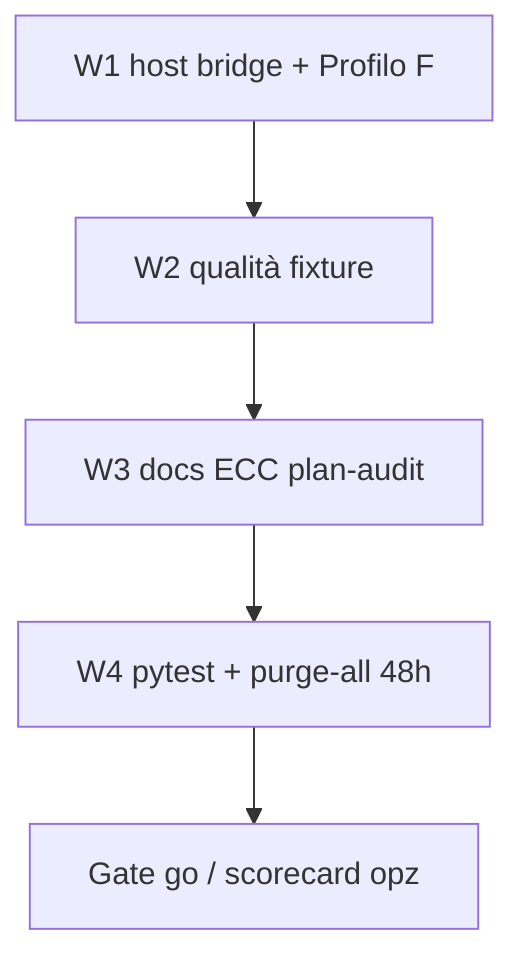

# Piano di Implementazione — Fase A: LLM locale AMD / Ollama

**Progetto:** Radar Informativo Globale (Intelligence Dashboard)  
**Documento:** `plan-audit/complete/plan_impl_fase_A_local_amd_ollama.md`  
**Stato:** COMPLETE (ops) — **Profilo F core + VRAM unload shipped**; residuo **opz.** = scorecard fixture formale (non bloccante)  
**Data:** 2026-07-19  
**Prompt origine:** [`../prompts/done/plan_prompt_fase_A_local_amd_ollama.md`](../prompts/done/plan_prompt_fase_A_local_amd_ollama.md)  
**Blueprint:** [`../../radar_overview_and_upgrades.md`](../../radar_overview_and_upgrades.md) §3.A  
**SoT lane:** [`../complete/sot_llm_multi_model_fallback.md`](../complete/sot_llm_multi_model_fallback.md)

---

## Reality shipped (ops 2026-07-19)

| Tema | Valore |
|------|--------|
| Overlay | `radar/docker-compose.ollama-host.yml` |
| Tag ops | **`gemma4-radar`** — Modelfile host `FROM gemma4:12b` + `PARAMETER num_ctx 8192` (non in git) |
| Base pull | `gemma4:12b` |
| Payload | `think=true`; `options.num_ctx`/`num_predict` = **8192**; no `response_format` su Ollama think |
| Escalate | **Nessun** SIMPLE Ollama → DeepSeek (correction fino a `_MAX_ATTEMPTS_LOCAL=6`) |
| Qualità | `normalize_llm_json_dict` (CSV list, alias EN, protagonista US–Iran, coerenza categoria/tag/aziende/relevance) |
| Concurrency tip | `WORKER_ENTRY/DB/GEMINI_CONCURRENCY=1`; host `OLLAMA_NUM_PARALLEL=1` |
| Timeout tip | `LLM_SIMPLE_TIMEOUT=180` (o `600` se VRAM lenta) |
| VRAM | Unload fine-ciclo via `/api/generate` `keep_alive=0` + `OLLAMA_*` env — **shipped** |

---

## Decisioni vincolanti (confermate)

1. **Runtime:** Ollama **host** già OK (`gemma4:12b` / `gemma4-radar` su GPU AMD, override ROCm già fatti). Niente container ROCm di default.
2. **Integrazione:** solo **HTTP OpenAI-compat** (`PROVIDER=openai` + `BASE_URL=…/v1` via httpx). **Vietato** `ollama.chat` / package `ollama`.
3. **Routing default:** Scenario 2 / **Profilo F Local-Hybrid** — SIMPLE locale + COMPLEX DeepSeek cloud.
4. **Re-ingest verifica:** script ufficiale `radar/backend/app/scripts/requeue_articles.py` con `--purge-all` + restart worker (finestra ingest worker ≈ **48h**).
5. **Portabilità:** il contratto Radar↔Ollama è **OS-agnostico** (HTTP `/v1` + tag modello). Prerequisito ovunque: Ollama installato sull’host (o raggiungibile), modello pullato, Docker che raggiunge l’host. GPU/accelerazione dipendono dall’OS (vedi §3.1).



### Wave checklist

| Wave | Contenuto | Stato |
|------|-----------|-------|
| W1 | Overlay `ollama-host` + Profilo F env + smoke | **done** |
| W2 | Qualità locale (normalize + no-escalate + think JSON) + residual Ollama-down | **done** (code); scorecard 9/10 fixture **opzionale** |
| W3 | Docs / SoT / STATUS / skills + ECC sync | **done** (refresh docs 2026-07-19 post-ship) |
| W4 | pytest + up ordinato + requeue `--purge-all` 48h | **done** |
| Follow-up | `keep_alive` busy + unload VRAM fine-ciclo | **done** |

---

## 1. Verdetto AS-IS

**Già basta (shipped)**

- Client OpenAI-compat (`deepseek.py` + `openai_compat_payload` / `_response`); lane env; residual/cooldown/quota; schema + normalize post-`54c8038`.
- Host: Ollama + `gemma4-radar` GPU; overlay Compose.
- Ops requeue: skill `radar-requeue-ops`, runbook, mirror ECC.

**Manca (follow-up opzionale)**

- Scorecard fixture formale 9/10 (opzionale, non bloccante ops).
- Lifecycle VRAM / `keep_alive` unload: **shipped** (`ollama_lifecycle.py` + worker debounce + `ops/verify-ollama-vram.sh`).

---

## 2. Matrice P0 / P1 / P2

| ID | Sev | Problema |
|----|-----|----------|
| P0-1 | P0 | Worker non raggiunge host `:11434` senza overlay |
| P0-2 | P0 | Qualità JSON locale non misurata |
| P0-3 | P0 | Overview stale (`gemma4:14b`) + nessun Profilo F |
| P1-1 | P1 | Timeout Ollama-down prima del residual |
| P1-2 | P1 | Drift skill SoT vs mirror `.ecc/skills` |
| P1-3 | P1 | Requeue senza dry-run / N eccessivo |
| P2-1 | P2 | Tentazione SDK `ollama.chat` |
| P2-2 | P2 | Container ROCm documentato come se fosse default |

---

## 3. Decisioni tecniche (sintesi)

| Tema | Scelta |
|------|--------|
| BASE_URL | `http://host.docker.internal:11434/v1` |
| Overlay | `radar/docker-compose.ollama-host.yml` — solo `extra_hosts` su `radar-worker` |
| SIMPLE | `openai` / `gemma4-radar` (o `gemma4:12b`) / effort `high` (think) / RPM·TPM·RPD=`0` / TIMEOUT=`180`–`600` / API_KEY=`ollama` |
| COMPLEX | DeepSeek Profilo B (`deepseek-v4-flash`, effort `high`) |
| SDK ollama | Vietato |
| Soft-trim | Non attivo (SIMPLE.rpd=0); hibernation non da locale |
| depends_on Ollama | No (fail-soft hybrid) |

### 3.1 Compatibilità OS (Linux / Windows / macOS)

**Sì, in sostanza basta Ollama + il modello che ti interessa** — Radar non parla ROCm/Metal/CUDA direttamente: chiama solo `BASE_URL/v1/chat/completions` con `PROVIDER=openai`.

| Piattaforma | Ollama + modello | Stack Radar (Docker) | GPU tipica | Note |
|-------------|------------------|----------------------|------------|------|
| **Linux** | Sì | Compose + `extra_hosts: host.docker.internal:host-gateway` | AMD ROCm / NVIDIA / CPU | Path default di questa macchina (RX 6750 XT) |
| **Windows** | Sì (Ollama nativo o in WSL) | Docker Desktop → `host.docker.internal` di solito già ok | NVIDIA / CPU (AMD ROCm su Win limitato) | Stesso Profilo F; verificare che Ollama ascolti e sia raggiungibile dal container |
| **macOS** | Sì | Docker Desktop → `host.docker.internal` | Apple Silicon Metal / CPU | Stesso contratto; tag modello devono esistere su Ollama Mac |
| **iOS / iPadOS** | No come host server | Non è target di deploy del compose Radar | — | Non confondere con macOS: telefono/tablet non ospitano Ollama+Docker Radar |

**Invarianti cross-OS**

- Tag modello = quello reale in `ollama list` (es. `gemma4:12b`), non un nome inventato.
- API key lane non vuota (dummy `ollama`).
- Worker in Docker **non** usa `localhost:11434` dell’host senza bridge (`host.docker.internal` o IP gateway).
- Qualità/velocità: GPU host se Ollama la usa; altrimenti CPU (lento ma funziona).
- VRAM/RAM: scegli un modello che entra nella macchina (12 GB VRAM ≠ stesso budget su Mac 8 GB unificato).

### Best practice (ops)

1. **Dry-run sempre** prima di `requeue` / `--purge-all`.
2. **Preferire `compose up -d`** a `restart` parallelo di tutto lo stack (race DB); OK `restart radar-worker` singolo post-requeue.
3. **Ollama host up** prima del worker; health: `curl -s http://127.0.0.1:11434/api/tags`.
4. **Non esporre 11434 su LAN**; lasciare bind loopback se già così.
5. **`OLLAMA_NUM_PARALLEL=1`** (o lasciare default conservativo) su 12 GB VRAM.
6. **Un solo consumatore GPU:** non avviare container `ollama:rocm` in parallelo all’host.
7. **Log gate:** `route lane=`, `openai-compat/openai ok`, `Ciclo … 0 errori`.
8. **KPI post-batch:** %XX, ValidationError, escalate SIMPLE→COMPLEX, share lane, p50 latency.
9. **Rollback:** ripristinare Profilo B in `.env`, up worker senza overlay ollama-host.
10. **Segreti:** solo `.env` locale; Profilo F in `.env.example` commentato senza key reali.
11. **Sync ECC:** edit SoT `.agents/skills/*/SKILL.md` poi `python radar/.ecc/scripts/sync_skills.py --write` (mai mirror→SoT).
12. **N requeue:** per prova da zero 48h usare N alto (es. **100–200**, max script 500) con `--purge-all`; lo script pagina ≤50/entry; il worker filtra comunque `published_after` ≈ 48h.

---

## 4. Piano a wave (espanso)

### W1 — Bridge host + Profilo F smoke

1. Creare `radar/docker-compose.ollama-host.yml`:
   ```yaml
   services:
     radar-worker:
       extra_hosts:
         - "host.docker.internal:host-gateway"
   ```
2. In `.env` (non commit): attivare Profilo F (SIMPLE→host Ollama; COMPLEX→DeepSeek).
3. VERIFY host: `ollama list` / `ollama ps` / `curl 127.0.0.1:11434/api/tags`.
4. `docker compose -f docker-compose.yml -f docker-compose.ollama-host.yml up -d radar-worker`
5. Smoke da container: `chat/completions` verso `host.docker.internal:11434/v1` + 1 classify.

**Gate W1:** HTTP 200 JSON; log `openai-compat/openai`; VRAM tipica &lt;11 GB.

### W2 — Qualità + fail-soft

1. 10 fixture (politica, soft-news, multilaterale, paper, sport/legal, energia, off-topic XX): ≥**9/10** schema-valid; no campo reasoning; anti-XX soft-news.
2. Stop Ollama breve → articolo SIMPLE deve arrivare a residual COMPLEX (dopo retry); worker non muore.
3. Se gemma fallisce JSON IT: A/B `qwen3:14b` (solo se necessario).

**Gate W2:** schema gate + residual dimostrato.

### W3 — Documentazione, plan-audit, ECC

Aggiornare in coerenza (stesso messaggio: host-first, API httpx, Profilo F, no SDK):

| Area | File |
|------|------|
| Blueprint | `radar_overview_and_upgrades.md` §3.A — tag `gemma4:12b`; path host; container ROCm = appendice |
| Env | `radar/.env.example` — Profilo F commentato |
| Hub product | monorepo `README.md` (se cita profili A–E) + `radar/ops/README.md` — pointer Profilo F / overlay host |
| Getting started / arch | `radar/docs/01_getting_started.md`, `02_architecture_and_backend.md` (se presenti e citano lane) |
| Runbook | `radar/docs/runbook.md` — sezione **Local-Hybrid (Fase A)** + prereq Ollama host + overlay + link requeue 48h |
| SoT LLM | `plan-audit/complete/sot_llm_multi_model_fallback.md` — Profilo F + dialect openai→Ollama |
| STATUS | `plan-audit/STATUS.md` — Fase A wave status; spostare prompt active→done a gate |
| Prompt | archiviare `plan-audit/prompts/active/plan_prompt_fase_A_local_amd_ollama.md` in `prompts/done/` a completamento |
| Skills SoT | `llm-json-extraction`, `radar-docker-ops`, `radar-requeue-ops` (nota Profilo F / 48h gate) |
| ECC mirror | `python radar/.ecc/scripts/sync_skills.py --write` poi `--check` clean |
| ECC tree/note | `radar/.ecc/CLAUDE.md` — Profili A–F; overlay `ollama-host`; vietato `ollama.chat` |
| Docker rules | `radar/.ecc/rules/docker.md` — nota overlay host-gateway (se manca) |

**Gate W3:** `sync_skills.py --check` OK; docs non contraddicono host-first.

### W4 — Test generali + riavvio + re-elaborazione 48h

#### 4a. Test automatici (pre-requeue)

```bash
cd radar && python -m pytest -m "not live" -q
python -m pytest backend/app/tests/test_openai_compat_dialect.py -q
```

Eventuale smoke FE fuori scope Fase A (non blocca). Non aggiungere suite live che chiama Ollama in CI senza marker `live`.

#### 4b. Stack Docker (procedura ordinata)

```bash
cd radar
curl -sf http://127.0.0.1:11434/api/tags >/dev/null

docker compose -f docker-compose.yml -f docker-compose.ollama-host.yml up -d

docker compose exec -T radar-backend curl -sf http://localhost:8000/health/live
docker compose ps
```

#### 4c. Eliminazione articoli + re-elaborazione Miniflux ~48h

Usare **solo** lo script ufficiale (skill `radar-requeue-ops`). `--purge-all` = wipe vault `.md` + DELETE tutte le `articles` (+ outbox correlate) + unread ultime N su Miniflux + clear cooldown. Il worker processa unread con `published_after` ≈ **48h**.

```bash
cd radar

docker compose -f docker-compose.yml -f docker-compose.ollama-host.yml \
  exec -T radar-worker python -m app.scripts.requeue_articles 200 --purge-all --dry-run

docker compose -f docker-compose.yml -f docker-compose.ollama-host.yml \
  exec -T radar-worker python -m app.scripts.requeue_articles 200 --purge-all

docker compose -f docker-compose.yml -f docker-compose.ollama-host.yml restart radar-worker

docker compose logs -f radar-worker
# Attesi: route lane=SIMPLE … openai / gemma4:12b; COMPLEX … deepseek; Ciclo … 0 errori
```

**Best practice W4**

- Confermare dry-run (`candidates=…`, `would_purge_all_articles=…`) prima dello write.
- Se feed Miniflux è povero, N alto non crea magia: elabora solo unread in finestra 48h.
- Non lanciare due requeue in parallelo.
- Post-run: query KPI (esempi):

```bash
docker compose exec -T radar-db psql -U radar_user -d radar_db -c \
  "SELECT COUNT(*) FILTER (WHERE country_code='XX')*100.0/NULLIF(COUNT(*),0) AS pct_xx,
          COUNT(*) AS n
   FROM articles WHERE published_at >= NOW() - INTERVAL '48 hours';"

docker compose exec -T radar-db psql -U radar_user -d radar_db -c \
  "SELECT purpose, status, COUNT(*) FROM llm_request_ledger
   WHERE created_at >= NOW() - INTERVAL '2 hours'
   GROUP BY 1,2 ORDER BY 1,2;"
```

**Gate W4 (go)**

- pytest `not live` verde (o regressioni note documentate).
- Purge-all dry-run → write → restart OK.
- Almeno un ciclo worker con **0 errori**; mix log SIMPLE(local) + COMPLEX(cloud) coerente col volume.
- %XX e ValidationError non peggiori in modo patologico vs baseline post-`f7cf83d` (KPI secondario).
- Mappa/API rispondono (`/health/live`; spot-check FE opzionale).

---

## 5. File target (checklist implementativa)

**Runtime / env**

- `radar/docker-compose.ollama-host.yml`
- `radar/.env` (locale ops, non commit) Profilo F + `OLLAMA_*`
- `radar/.env.example` Profilo F + knobs VRAM commentati
- `radar/backend/app/classification/ollama_lifecycle.py` — unload nativo
- `radar/backend/app/classification/openai_compat_payload.py` — `keep_alive` busy
- `radar/backend/app/worker.py` — debounce unload fine-ciclo + shutdown

**Docs / audit**

- `radar_overview_and_upgrades.md` §3.A
- `radar/docs/runbook.md`, `radar/ops/README.md`, README hub / `docs/01`/`02`
- `plan-audit/complete/sot_llm_multi_model_fallback.md` Profilo F + VRAM
- `plan-audit/STATUS.md` (VRAM shipped; residuo scorecard opz.)

**ECC**

- SoT skills: `llm-json-extraction`, `radar-docker-ops`, `radar-requeue-ops`
- Mirror via `sync_skills.py --write` / `--check`
- `radar/.ecc/CLAUDE.md` (tree `ollama_lifecycle.py`) + `rules/docker.md`

**Test / ops**

- Riuso `app.scripts.requeue_articles` (gate 48h)
- `radar/ops/verify-ollama-vram.sh` (checklist VRAM / log)
- pytest: `test_openai_compat_dialect.py`, `test_ollama_lifecycle.py`, hook in `test_worker_shutdown.py`

---

## 6. Fuori scope

- Container `radar-ollama` ROCm come default
- Package/SDK `ollama` / `ollama.chat`
- Fase C pgvector / `nomic-embed-text`
- Fase D air-gap mappe; sidebar freeze
- Nuovo provider oltre `openai`+BASE_URL
- Scenario 4 dual-local default
- CI live contro GPU host (solo marker `live` manuale)

---

## 7. Rischi e rollback

| Rischio | Mitigazione |
|---------|-------------|
| `host.docker.internal` unresolved | Overlay `host-gateway`; VERIFY curl da worker |
| Purge-all cancella vault/DB | Dry-run; backup ops opzionale prima (`ops/backup-postgres.sh`) |
| Batch 48h lungo / VRAM | NUM_PARALLEL=1; timeout 180; COMPLEX cloud assorbe hard cases |
| Ollama down mid-batch | Residual DeepSeek; cooldown; non depends_on hard |
| Drift docs/ECC | W3 sync_skills --check nel gate |

**Rollback completo**

1. `.env` → Profilo B (DeepSeek-only).
2. `docker compose up -d radar-worker` **senza** `-f docker-compose.ollama-host.yml`.
3. Ollama host può restare acceso inutilizzato.
4. Se serve ripopolare mappa: altro requeue dopo rollback (cloud-only).
