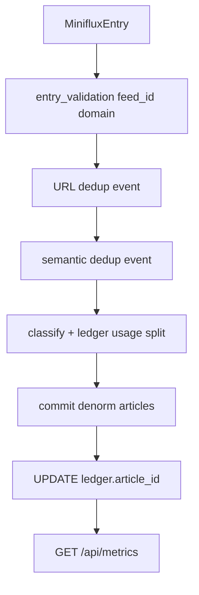

# Piano impl — Fase Metrics 013 (FinOps / diagnostica)

> **Stato: ACTIVE / BACKLOG IMPLEMENTAZIONE** (documenti pronti 2026-07-22; codice non ancora shipped)  
> **Branch:** `feature/upgrades`  
> **Prompt Agent (impl):** [`../prompts/active/agent_prompt_fase_metrics_013.md`](../prompts/active/agent_prompt_fase_metrics_013.md)  
> **Piano Cursor (origine):** `.cursor/plans/metrics_schema_013_*.plan.md`  
> **Prerequisito:** Fase C `012` **GATE VERDE** — [`../complete/plan_impl_fase_C_semantic_dedup.md`](../complete/plan_impl_fase_C_semantic_dedup.md)  
> **Ops LLM attuale:** SIMPLE = `gemini-3.5-flash-lite`, L1 fallback = `gemini-3.1-flash-lite`, COMPLEX = DeepSeek (Profilo A hybrid)

---

## 1. Obiettivo prodotto

Fondazione dati per metriche FinOps e diagnostica pipeline: denormalizzare su `articles` ciò che oggi vive solo nel ledger/eventi; arricchire `llm_request_ledger` e `article_dedup_events`; esporre **API aggregati read-only** per una futura UI.

**In scope:** migrazione `013`, strumentazione worker/commit/quota/client, `GET /api/metrics/*`, pytest + script verify, GATE live su articoli reali, docs/ECC.

**Fuori scope:** UI FinOps / toolbar; `article_type` LLM (schema Pydantic); tabella `feeds` normalizzata; backfill storico massivo; Wave 2 mappa; tocchi `radar-sidebar/**`.

---

## 2. Check metriche (necessità) — secondo passaggio

Criterio: **MUST** = indispensabile per aggregati FE futuri senza join fragili; **DEFER** = valore basso o rischio schema LLM.

| ID | Metrica | Verdetto | Motivo |
|----|---------|----------|--------|
| M1 | Tipologia geopolitica (`primary_category`) | **già OK** | Non aggiungere colonna; usare AS-IS |
| M2 | `article_type` editoriale (breaking/…) | **DEFER** | Richiede schema LLM strict — fase dedicata |
| M3 | `feed_title` | **già OK** | Presente day-1 su `articles` |
| M4 | `feed_id` + `feed_domain` | **MUST** | Chiave aggregazione per-feed; oggi solo title |
| M5 | Lane / model / provider / `was_escalated` denorm su `articles` | **MUST** | Query “chi ha classificato” senza scrape ledger |
| M6 | `article_id` + `miniflux_entry_id` su ledger | **MUST** | Join FinOps articolo↔costo; correlazione pre-insert |
| M7 | Token split prompt/completion/cache + `execution_time_ms` + http/error | **MUST** | FinOps fine; NULL se provider non espone (mai inventare `0`) |
| M8 | Eventi URL dedup in `article_dedup_events` | **MUST** | Oggi solo semantic; gap keep/skip senza traccia |
| M9 | `dedup_kind` / `action_taken` + denorm su articolo persistito | **MUST** | Allinea keep/replace/insert per report |
| M10 | `clean_text_chars/words`, `embedding_time_ms`, `pipeline_latency_ms` | **MUST** | Diagnostica throughput / costi nascosti |
| M11 | `geo_resolution_method` | **MUST light** | Euristica post-LLM (centroide vs extracted); no LLM extra |
| M12 | `embedding_time_ms` su `article_embeddings` | **MUST light** | Basso costo; allinea timer worker |
| M13 | Tabella `feeds` normalizzata | **DEFER** | Denorm `feed_id`+title+domain basta |
| M14 | Backfill storico completo | **DEFER** | Nullable ok; opz. host da `source_url` solo se cheap |
| M15 | UI FinOps / toolbar | **DEFER** | Post-contratto API |

**Esito check:** nessuna MUST aggiuntiva oltre alla lista; nessuna MUST da rimuovere. Schema 013 sotto resta vincolante.



---

## 3. Decisioni chiuse

1. Scope = fondazione dati + API aggregati read-only. Nessuna UI.
2. `article_type` LLM = **OUT** di 013. Nessun tocco a `GeopoliticalArticleSchema`.
3. Denormalizzare su `articles` i campi “ultima classificazione vincente”.
4. Ledger: `article_id` (nullable FK) + `miniflux_entry_id` (nullable) per correlazione pre-commit.
5. URL dedup → anche `article_dedup_events` (`dedup_kind='url_exact'`).
6. Migrazione `013_metrics_and_feed_tracking.sql` dopo `012`.
7. Token unknown → **NULL**, mai `0` inventato.
8. `main.py` API-only; ingest solo in `radar-worker`; asyncpg; no package `openai`.

---

## 4. Schema 013 (DDL target)

File: `radar/backend/migrations/013_metrics_and_feed_tracking.sql`

### 4.1 `articles`

```sql
ALTER TABLE articles
  ADD COLUMN IF NOT EXISTS feed_id INT,
  ADD COLUMN IF NOT EXISTS feed_domain VARCHAR(255),
  -- feed_title GIÀ presente
  ADD COLUMN IF NOT EXISTS classification_lane VARCHAR(16),
  ADD COLUMN IF NOT EXISTS classified_by_model VARCHAR(64),
  ADD COLUMN IF NOT EXISTS classified_by_provider VARCHAR(32),
  ADD COLUMN IF NOT EXISTS was_escalated BOOLEAN NOT NULL DEFAULT FALSE,
  ADD COLUMN IF NOT EXISTS dedup_kind VARCHAR(32),
  ADD COLUMN IF NOT EXISTS dedup_match_article_id INT REFERENCES articles(id) ON DELETE SET NULL,
  ADD COLUMN IF NOT EXISTS dedup_action VARCHAR(32),
  ADD COLUMN IF NOT EXISTS clean_text_chars INT,
  ADD COLUMN IF NOT EXISTS clean_text_words INT,
  ADD COLUMN IF NOT EXISTS embedding_time_ms INT,
  ADD COLUMN IF NOT EXISTS pipeline_latency_ms INT,
  ADD COLUMN IF NOT EXISTS geo_resolution_method VARCHAR(32);

CREATE INDEX IF NOT EXISTS idx_articles_feed_id ON articles(feed_id);
CREATE INDEX IF NOT EXISTS idx_articles_classification_lane ON articles(classification_lane);
CREATE INDEX IF NOT EXISTS idx_articles_dedup_kind ON articles(dedup_kind);
```

Note: `kept_existing_skip` **non** crea riga articolo (solo evento). `geo_resolution_method` enum SoT: `llm_extracted` | `centroid_fallback` | `unchanged` (euristica post-LLM vs centroide paese; **non** usare alias tipo `extracted_coordinates` / `country_centroid`).

### 4.2 `article_dedup_events`

```sql
ALTER TABLE article_dedup_events
  ADD COLUMN IF NOT EXISTS dedup_kind VARCHAR(32) NOT NULL DEFAULT 'semantic_vector',
  ADD COLUMN IF NOT EXISTS action_taken VARCHAR(32),
  ADD COLUMN IF NOT EXISTS feed_id INT,
  ADD COLUMN IF NOT EXISTS incoming_miniflux_entry_id INT;

ALTER TABLE article_dedup_events ALTER COLUMN cosine_distance DROP NOT NULL;
```

### 4.3 `llm_request_ledger`

```sql
ALTER TABLE llm_request_ledger
  ADD COLUMN IF NOT EXISTS article_id INT REFERENCES articles(id) ON DELETE SET NULL,
  ADD COLUMN IF NOT EXISTS miniflux_entry_id INT,
  ADD COLUMN IF NOT EXISTS prompt_tokens INT,
  ADD COLUMN IF NOT EXISTS completion_tokens INT,
  ADD COLUMN IF NOT EXISTS cached_prompt_tokens INT,
  ADD COLUMN IF NOT EXISTS execution_time_ms INT,
  ADD COLUMN IF NOT EXISTS http_status INT,
  ADD COLUMN IF NOT EXISTS error_code VARCHAR(64);

CREATE INDEX IF NOT EXISTS idx_llm_ledger_article ON llm_request_ledger(article_id);
CREATE INDEX IF NOT EXISTS idx_llm_ledger_feed_window
  ON llm_request_ledger(created_at, lane, purpose);
```

### 4.4 `article_embeddings`

```sql
ALTER TABLE article_embeddings
  ADD COLUMN IF NOT EXISTS embedding_time_ms INT;
```

---

## 5. Strumentazione (punti di innesto)

| Area | File | Lavoro |
|------|------|--------|
| Feed | `radar/backend/app/extraction/entry_validation.py` | `ValidatedMinifluxEntry`: `feed_id`, `feed_domain` da `feed.id` / host `site_url`\|`feed_url` |
| Meta classify | `radar/backend/app/classification/client.py` | **Breaking:** `classify_article` → dataclass `ClassificationResult` (`article` + meta lane/model/provider/escalated/usage/timing/http/error); aggiornare tutti i call site |
| Quota | `radar/backend/app/classification/quota.py` | `complete`/`fail` colonne FinOps; reserve con `miniflux_entry_id`; **non** settare `article_id` a classify-time |
| Quality | `radar/backend/app/classification/quality_compare.py` | Stesso helper usage split + passare `miniflux_entry_id` al reserve |
| Worker | `radar/backend/app/worker.py` | Timer pipeline/embed; URL→`record_dedup_event` (SELECT `a.id` nel ramo dup); post-commit link `article_id`; pass denorm a commit/replace; geo enum SoT |
| Commit | `radar/backend/app/commit/db_commit.py` | INSERT/UPDATE denorm metrics; `embedding_time_ms` anche su `article_embeddings` |
| Semantic | `radar/backend/app/extraction/semantic_dedup.py` | Estendere `record_dedup_event` (`cosine_distance: float \| None`, kind/action/feed/entry) + denorm insert/replace |
| API | `radar/backend/app/main.py` | `GET /api/metrics/summary`, `/by-feed`, `/dedup` |
| Script GATE | `radar/backend/app/scripts/verify_metrics_013.py` | NULL-rate, join, eventi, coerenza API |

Correlazione ledger: `miniflux_entry_id` noto pre-classify → post-INSERT/replace `UPDATE llm_request_ledger SET article_id=$1 WHERE miniflux_entry_id=$2 AND article_id IS NULL` (tutte le righe dello stesso entry: retry/L1/residual/`quality:compare`).

**Review delta (2026-07-22):** vedi correzioni C1–C8 in [`../prompts/active/agent_prompt_fase_metrics_013.md`](../prompts/active/agent_prompt_fase_metrics_013.md) — ClassificationResult breaking, article_id solo post-commit, URL event con `a.id`, geo enum SoT, test blast radius.

---

## 6. API (contratto FE futura, senza dashboard)

- `GET /api/metrics/summary?from=&to=` — token/costo per lane/purpose/provider/model
- `GET /api/metrics/by-feed?from=&to=` — per `feed_id` (+ title/domain)
- `GET /api/metrics/dedup?from=&to=` — count per `dedup_kind` / `action_taken`

Documentare DTO in:

- `docs/02_architecture_and_backend.md`
- `radar/docs/runbook.md`
- `radar/.ecc/skills/radar-api-contract.md` (+ mirror `.agents/skills/radar-api-contract/SKILL.md` se sync)

---

## 7. Wave implementazione

| Wave | Contenuto | Exit |
|------|-----------|------|
| **W0** | Questo piano + prompt Agent + STATUS | **DONE** 2026-07-22 |
| **W1** | Migrazione `013_…` | SQL applicata in Compose |
| **W2** | Strumentazione entry/client/quota/worker/commit/dedup | Campi popolati su path commit |
| **W3** | API metrics + pytest + `verify_metrics_013.py` | Test `-m "not live"` verdi |
| **W4** | Docker rebuild, live 15 articoli + URL requeue, docs/ECC, GATE, commit | Soglia PASS sotto |

---

## 8. GATE post-sviluppo (obbligatorio)

Obiettivo: dati **giusti, popolati, allineati, compatibili** con API.

### 8.1 Test automatici

- `pytest -m "not live"`: commit denorm, quota FinOps, entry feed_id/domain, metrics API, worker URL-event (mock)
- `python -m app.scripts.verify_metrics_013` (asserts SQL + opz. API)

### 8.2 Docker

```bash
cd radar
docker compose up -d --build
# health live/ready; conferma colonna 013 su radar-db
```

Preferire `up -d --build` a restart parallelo cieco (skill `radar-docker-ops`).

### 8.3 Live articles (volume minimo)

| Scenario | N | Come | Assert |
|----------|---|------|--------|
| Classify SIMPLE ok | **12–15** | `requeue_articles 15` (no `--purge-all`) | `feed_id`/`domain` NOT NULL; lane/model/provider valorizzati; `pipeline_latency_ms` > 0; ledger `article_id` linkato; token split o NULL coerente |
| Mix lane (COMPLEX/residual) | nel batch | log | denorm = modello **vincente** |
| URL exact dup | **≥2** | secondo requeue stessi entry | `dedup_kind='url_exact'`, `action_taken='kept_existing'`, `cosine_distance` NULL |
| Semantic keep/replace | opportunistico ≥1 | batch 15–20; se 0 hit → pytest only + nota GATE | evento `semantic_vector` (+ denorm su replace) |
| API cross-check | — | curl/httpx su finestra smoke | totali = SUM SQL (tolleranza 0) |

**Protocollo ops:**

1. `docker compose exec -T radar-worker python -m app.scripts.requeue_articles 15 --dry-run`
2. stesso senza `--dry-run`
3. ciclo worker
4. `verify_metrics_013` live
5. SQL: NULL-rate `feed_id` / `classified_by_model` / ledger.`article_id` su pezzi post-013 &lt; ~5%
6. Nessun secret in commit; **non** stageare `radar/.env`

**Soglia PASS:** pytest verde; Docker healthy + 013; ≥12 articoli nuovi con denorm+ledger link; ≥1 evento URL; API = SQL; docs/ECC aggiornati.

---

## 9. Rischi

- Corsa ledger↔`article_id`: usare `miniflux_entry_id` come chiave pre-insert.
- Replace in-place: aggiornare denorm sullo stesso `article_id`; eventi append-only.
- Provider senza cache tokens: NULL, non zero finti.
- RPD SIMPLE esausta → residual DeepSeek: denorm deve riflettere il modello che ha **completato** la classify.

---

## 10. Checklist chiusura (da compilare a GATE)

- [ ] `013_metrics_and_feed_tracking.sql` applicata
- [ ] pytest `-m "not live"` PASS
- [ ] `verify_metrics_013` live PASS
- [ ] ≥12 articoli denorm+ledger OK
- [ ] ≥1 URL dedup event
- [ ] API summary/by-feed/dedup allineate a SQL
- [ ] docs + ECC + runbook + api-contract aggiornati
- [ ] commit dettagliato (no `.env`)
- [ ] Spostare questo file in `plan-audit/complete/` + prompt in `prompts/done/`
- [ ] Aggiornare `STATUS.md`

---

## 11. Riferimenti codice AS-IS

- `radar/backend/migrations/012_pgvector_article_embeddings.sql`
- `radar/backend/app/extraction/entry_validation.py` — oggi solo `feed_title`
- `radar/backend/app/classification/client.py`, `quota.py`, `quality_compare.py`
- `radar/backend/app/worker.py`, `commit/db_commit.py`
- `radar/backend/app/extraction/semantic_dedup.py` — `record_dedup_event`
- `radar/backend/app/scripts/requeue_articles.py`
- Skills: `radar-quota-ledger`, `radar-docker-ops`, `radar-requeue-ops`, `radar-api-contract`, `llm-json-extraction`
