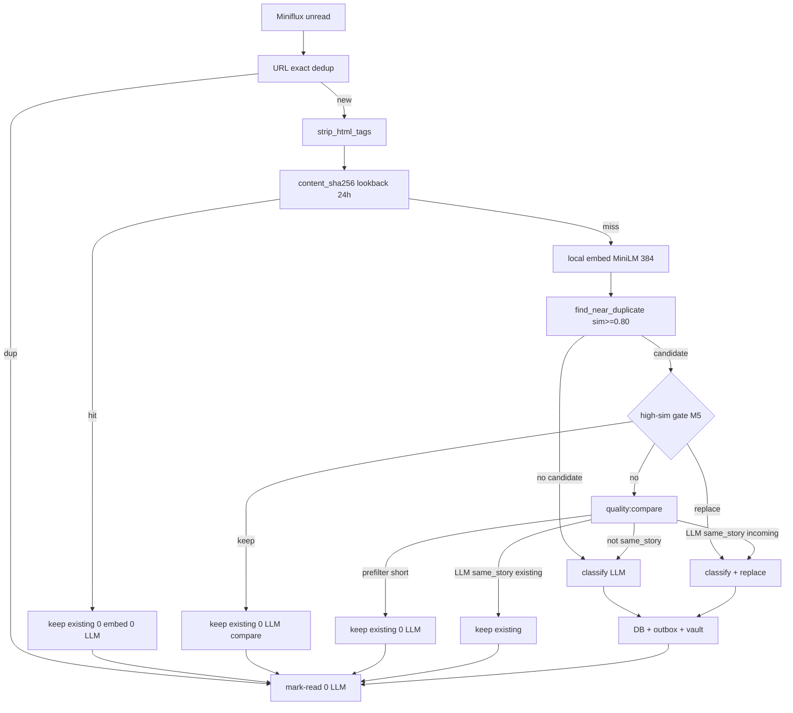

# Piano impl — FinOps LLM: Token Saving & Prompt Caching (Zero Regression)

> **Stato: COMPLETE / GATE VERDE (condizionato)** (2026-07-22; Wave A M1–M6 completata; campione N=272 elaborazioni post-cutover; M7 in backlog)  
> **Branch:** `feature/upgrades`  
> **Prompt Agent (orchestratore):** [`../prompts/done/agent_prompt_llm_finops_token_caching.md`](../prompts/done/agent_prompt_llm_finops_token_caching.md)  
> **Verifica / GATE live (twin):** [`plan_impl_llm_finops_token_caching_verification.md`](plan_impl_llm_finops_token_caching_verification.md) — **GATE VERDE (condizionato)**  
> **Origine Cursor:** `.cursor/plans/llm_finops_review_3c526d6a.plan.md`  
> **Prerequisiti GATE:** Fase C semantic dedup + Metrics 013 + BORDERLINE effort split  
> — [`../complete/plan_impl_fase_C_semantic_dedup.md`](../complete/plan_impl_fase_C_semantic_dedup.md)  
> — [`../complete/plan_impl_fase_metrics_013.md`](../complete/plan_impl_fase_metrics_013.md)  
> — [`../complete/plan_impl_borderline_effort_split.md`](../complete/plan_impl_borderline_effort_split.md)  
> **Skills:** `llm-json-extraction`, `radar-quota-ledger`, `radar-api-contract`, `radar-docker-ops`, `radar-requeue-ops`

---

## 1. Obiettivo prodotto

Ottimizzare le richieste API LLM del modulo Radar per **ridurre costo e volume token** (input, output, chiamate ridondanti) e **massimizzare cache hit** dei provider supportati (DeepSeek prefix cache, OpenAI automatic caching, Gemini implicit caching, Ollama KV reuse), **senza regressioni** su:

- accuratezza estrazione geopolitica (`GeopoliticalArticleSchema`)
- dedup URL / semantica / quality-replace (Fase C)
- invarianti pipeline (QuotaLedger, correction/escalate, `content[:4000]`, SYSTEM_PROMPT no-CoT)
- tasso ValidationError / fallback article

**Target economico realistico** (dopo baseline, non prima): **-30% / -60% costo effettivo** sulle lane cloud tipiche (Profilo B DeepSeek). Non promettere −70% cieco.

**In scope Wave A:** M1 parse cache DeepSeek, M2 baseline, M4 metrics cache-rate, M3 suffix de-dupe, M5 bypass high-sim, M6 content hash, protocollo verifica 100–150 articoli (twin).

**In scope wave successive:** M7 boilerplate RSS coda-only, M9/M10 ops FinOps.

**Fuori scope (decisioni chiuse):**
- Always-keep su sim ≥ 0.95 (rompe quality-replace)
- Explicit Gemini `client.caches.create` (solo analisi successiva se baseline lo chiede)
- Riscrittura ampia del SYSTEM “per caching” (ammesso solo +2–4 frasi formato wire in M3)
- Cap output ciechi 896/256 **e M8 in HOLD** (qualità prima del costo output)
- Abbassare soglia semantica globale sotto 0.80
- UI FinOps dedicata; package `openai`; tocchi `radar-sidebar/**`; cambio field names schema Pydantic

---

## 2. Stato AS-IS — ciclo di vita richieste



### 2.1 Dove si spendono soldi

| Percorso | Provider | Payload | File |
|---|---|---|---|
| **classify** | Gemini e/o OpenAI-compat | `SYSTEM_PROMPT` + `build_user_prompt` + `content[:4000]` + **suffix tassonomia ~200–250 tok** (solo OpenAI-compat) | `client.py`, `deepseek.py`, `prompts.py` |
| **quality:compare** | lane COMPLEX, effort `none` | 2× testo balanced (max ~4500 char) + system corto | `quality_compare.py` |
| **correction / escalate** | fino a 4 attempt (6 Ollama) | stesso prefisso + CORREZIONE | `ClassificationClient` |
| **embedding** | CPU locale MiniLM | titolo + clean_content | **0$ API** |
| **thinking** | DeepSeek effort≠none / Ollama think | token reasoning billati | `openai_compat_payload.py` (`max_tokens` 8192) |

### 2.2 Cosa già risparmia (non reinventare)

- URL exact dedup pre-LLM
- Semantic near-dup + **prefilter** `len_inc < 0.7 * len_exist` → 0 LLM
- Soft-trim RPD catena SIMPLE
- QuotaLedger reserve/complete/fail
- Truncation `content[:4000]`
- Gemini JSON + `response_schema`; OpenAI-compat `response_format=json_object` (eccetto Ollama think)
- Cooldown 24h hard-fail
- Metriche 013: `prompt_tokens`, `completion_tokens`, `cached_prompt_tokens`, `clean_text_*`, dedup events, `GET /api/metrics/*`

### 2.3 Gap critici di osservabilità (pre–Wave A; risolti da M1/M4)

1. ~~**DeepSeek cache non parsata**~~ → **M1 DONE:** `extract_usage_tokens` preferisce `prompt_cache_hit_tokens`, fallback `prompt_tokens_details.cached_tokens`; unknown → NULL (mai inventare `0`).
2. ~~`/api/metrics/summary` senza cache rate~~ → **M4 DONE:** espone `cache_hit_rate_pct` (+ `content_hash_count` in `dedup`).
3. Nessun p50/p95 `completion_tokens` esposto in API → ancora vero; M8 HOLD (no blind cap). Calibrare via SQL ledger.

### 2.4 Errori del memo Gemini da non ripetere

| Claim Gemini | Realtà | Impatto |
|---|---|---|
| Soglia ≥ 0.85 | Default codice **0.80** | Ricalibrare diagrammi su 0.80 / 0.95 |
| Ogni near-dup fa LLM | Prefilter già skippa | Risparmio sovrastimato |
| Cache hit ~0% | Non misurabile oggi (gap parse DeepSeek) | Non promettere +70–90% senza M1+M2 |
| Spostare tassonomia nel SYSTEM | Già presente; problema = suffix duplicato | Win = rimuovere ridondanza |
| Explicit Gemini cache | Overkill vs implicit | Fuori P0 |
| Cap 896 / 256 | Troppo stretti | **M8 HOLD** |

---

## 3. Prompt Caching per provider

| Provider | Meccanismo | Regola pratica | Sconto tipico | Azione Radar |
|---|---|---|---|---|
| **DeepSeek** | Disk prefix automatico | Prefisso identico da token 0; campi `prompt_cache_hit_tokens` | ~90–98% su cached | Parsare hit; togliere statico dopo articolo |
| **OpenAI** | Automatic ≥1024 tok | Statico all’inizio; `cached_tokens` | ~50%+ | Layout già ok se system stabile |
| **Gemini 2.5+** | Implicit | Prefisso comune; min ~2048+; `cached_content_token_count` | ~75% | `system_instruction` già separato; no explicit P0 |
| **Ollama** | KV VRAM | System fisso + `num_ctx`; lifecycle unload | 0$ API | Non abbassare think `num_predict` |

**Regola d’oro:** statico all’inizio (system + breve prefisso user) → dinamico in coda → **zero** blocco statico lungo dopo l’articolo.

---

## 4. Decisioni chiuse

1. **Sempre-keep high-sim = SCARTATO.** Bypass solo con winner euristico (M5).
2. **M3 suffix de-dupe = IN SCOPE Wave A.** Non riscrivere il SYSTEM per caching; togliere duplicato; +2–4 frasi formato wire nel SYSTEM.
3. **M5 + M6 = IN SCOPE Wave A** (confermati utente 2026-07-22).
4. **M7 boilerplate = wave successiva** (dopo GATE Wave A sul twin verification).
5. **M8 cap output = HOLD.** Tetti attuali restano (Gemini 2048 / Gemma 4096 / compat none 2048 / think 8192 / compare 1024).
6. **Explicit Gemini cache = fuori scope** finché baseline non dimostra bisogno.
7. Token unknown → **NULL**, mai inventare `0` (invariante Metrics 013).
8. `main.py` API-only; ingest solo `radar-worker`; asyncpg; no package `openai`.
9. SYSTEM_PROMPT resta SoT in `prompts.py`; sync skill C-07 dopo edit.
10. **Chiusura Wave A** richiede twin [`plan_impl_llm_finops_token_caching_verification.md`](plan_impl_llm_finops_token_caching_verification.md) (pytest + live **100–150** articoli).

---

## 5. Catalogo leve (M1–M11)

### P0 / Wave A — Fondamenta + zero chiamate evidenti

#### M1 — Parsare cache DeepSeek / OpenAI-compat

- **File:** `radar/backend/app/classification/client.py` (`extract_usage_tokens`) + test
- **Modifica:** se presente `prompt_cache_hit_tokens` → `cached_prompt_tokens`; else fallback `prompt_tokens_details.cached_tokens`; Gemini resta `cached_content_token_count`
- **Motivo / pro:** FinOps vero; abilita decisioni data-driven
- **Rischio:** nessuno funzionale

#### M2 — Baseline SQL (readonly, 7–30 giorni)

Query su `llm_request_ledger` / `articles` / `article_dedup_events` — dettaglio SQL e salvataggio numeri nel twin §2.

- avg/p50/p95 `prompt_tokens`, `completion_tokens`, `cached_prompt_tokens` per purpose×provider×model×lane×status
- rate `quality:compare` vs `classify:*`
- ValidationError / fail rate (proxy)
- distribuzione `action_taken` dedup
- avg `clean_text_chars` per feed

#### M3 — De-duplicare suffix OpenAI-compat (**IN SCOPE**)

##### AS-IS in `deepseek.classify_json`

```text
system = SYSTEM_PROMPT
user   = build_user_prompt(... content[:4000])
       + SUFFIX LUNGO (~20 righe tassonomia/coerenza DUPLICATE)
       + opz. CORREZIONE OBBLIGATORIA          # TENERE
       + opz. THINKING MODE (Ollama)           # TENERE
```

Il suffix ripete regole già nel SYSTEM. Aggiunge vincoli **wire** più espliciti (flat lat/lon, CSV never arrays, no markdown/reasoning).

`quality:compare` e Gemini classify **non** usano questo suffix.

##### Checklist modifica

1. `deepseek.py` — micro-suffisso JSON-only al posto del blocco ~179–203
2. `prompts.py` — +2–4 frasi formato wire (senza riduplicare categorie/esempi)
3. `test_prompt_contract.py` + test assembly user message
4. Sync skill `llm-json-extraction` C-07 se SYSTEM cambia
5. **Non toccare:** `openai_compat_payload.py`, correction/escalate, quality_compare, soglie dedup

##### Rischi / mitigazioni / rollback

Vedi tabella rischi storica + **rollback suffix** se ValidationError sale (dettaglio soglie nel twin §4–§5).

#### M4 — Metrics API cache hit + breakdown

- Estendere `GET /api/metrics/summary` e/o nuovo `/api/metrics/llm`
- `cache_hit_rate_pct = sum(cached_prompt_tokens)/sum(prompt_tokens)*100`
- Split purpose / provider / day
- File: `radar/backend/app/main.py` (+ skill `radar-api-contract`)

#### M5 — Bypass high-sim con winner euristico (**IN SCOPE Wave A**)

```text
IF distance <= 0.05 (sim >= 0.95)
 AND clean_words >= 70
 AND title_token_jaccard(incoming, existing) >= 0.90:
    IF len_inc > len_exist * SEMANTIC_QUALITY_REPLACE_HINT_RATIO (default 1.25)
       → winner=incoming → classify+replace (skip quality:compare)
    ELSE
       → winner=existing → mark-read (0 LLM)
ELSE → quality:compare AS-IS
```

**“Molto più lungo”:** `SEMANTIC_QUALITY_REPLACE_HINT_RATIO` default **1.25** (+25% caratteri). Riusare env esistente.

- Env: `SEMANTIC_DEDUP_DIRECT_DISTANCE`, `_MIN_WORDS`, `_TITLE_SIM`, `SEMANTIC_DEDUP_DIRECT_SHADOW`
- Audit: `kept_existing_direct_vector` / `replaced_direct_vector`
- File: `worker.py`, `semantic_dedup.py`, `config.py`

#### M6 — Content hash pre-embed (**IN SCOPE Wave A**)

**Cosa risolve:** due feed con **stesso testo** e **URL diversi** (URL-dedup non vede; embed+compare costa).

**Come:**

1. Dopo `strip_html_tags`, normalizza `title + "\n" + body` (lowercase, collapse whitespace)
2. `content_sha256 = SHA-256(normalized)`
3. Lookup su `articles.content_sha256` con `created_at` nelle ultime **24h** (stesso lookback semantico tipico)
4. Se hit → `winner=existing`, mark-read, **0 embed + 0 LLM**, audit `action_taken=kept_existing_content_hash`
5. Se miss → procede embed / near-dup / classify; al commit persiste lo hash

- Migrazione leggera (es. `014_articles_content_sha256.sql`): colonna `content_sha256 CHAR(64) NULL` + indice `(content_sha256, created_at)` o parziale
- Env opz.: `CONTENT_HASH_DEDUP_ENABLED` (default true), lookback ore
- **Non** sostituisce semantic near-dup (0.80–0.95): copre solo uguaglianza byte-normalizzata

---

### Wave successiva — Input dinamico

#### M7 — Boilerplate RSS coda-only (**NON Wave A**)

**Non è** “togliere keyword a caso” su tutto l’articolo e **non** è NLP.

Flusso:

```text
strip_html_tags → testo piano
strip_rss_boilerplate → solo CODA (ultimi 3 paragrafi OPPURE dopo 60% lunghezza)
```

Sulla coda, regex **line-oriented** su frasi promo tipiche feed (es. inizio riga `Leggi anche`, `Riproduzione riservata`, `Iscriviti alla newsletter`, `Follow us on`). Match → rimuovi quella riga/blocco coda. Il corpo centrale non viene scandagliato (una citazione mid-article resta).

Allowlist boilerplate editoriale/promo, non keyword geopolitiche. Golden tests obbligatori prima del merge M7.

#### M8 — Cap output (**HOLD**)

Tetti attuali invariati. Rivalutare solo con go utente post-baseline p95 (vedi twin).

---

### P3 — Ops continuo

#### M9 — `LLM_BORDERLINE_REASONING_EFFORT=none` in ops (se non già)

#### M10 — VIEW/API FinOps day×provider×lane×purpose

#### M11 — Explicit Gemini cache — solo analisi successiva se necessario

---

## 6. Mappa file

| ID | File |
|---|---|
| M1 | `classification/client.py`, tests |
| M2 | SQL ops / script readonly (twin) |
| M3 | `deepseek.py`, `prompts.py`, `test_prompt_contract.py`, skill snapshot |
| M4/M10 | `main.py` metrics |
| M5 | `worker.py`, `semantic_dedup.py`, `config.py` |
| M6 | `worker.py`, `commit/db_commit.py`, migration `014_*content_sha256*`, tests |
| M7 | `extraction/parser.py`, tests (wave dopo) |
| M8 | HOLD |
| M9 | `.env` ops only |
| Verify | twin + eventuale `scripts/verify_llm_finops_wave_a.py` |

---

## 7. Ordine di esecuzione Wave A

```text
1. M1 parse DeepSeek cache
2. M2 baseline SQL (numeri nel twin / sezione Baseline)
3. M4 metrics cache rate
4. M3 suffix de-dupe (+ frasi formato SYSTEM)
5. M5 direct bypass high-sim
6. M6 content hash (migrazione + worker + commit)
7. Verifica twin: pytest + live 100–150 articoli → GATE
8. M7 boilerplate — SOLO dopo GATE Wave A
9. M8 HOLD
10. M9/M10 ops FinOps
```

---

## 8. GATE zero-regression (sintesi)

Sintesi qui; **protocollo completo, SQL, soglie, campione 100–150, rollback:**  
→ [`plan_impl_llm_finops_token_caching_verification.md`](plan_impl_llm_finops_token_caching_verification.md)

### 8.1 Gate funzionali (checklist corta)

- Contract tests SYSTEM_PROMPT verdi
- Pytest M1/M3/M5/M6 verdi
- Nessun aumento materiale ValidationError / fallback / fail vs baseline M2
- Replace path M5 ancora presente su incoming ≥ +25% lunghezza
- Hash-keep path presente su duplicati byte-identici
- Post M1+M3: `cached_prompt_tokens` popolabili; `prompt_tokens` medi classify OpenAI-compat ↓
- Campione live **≥100** (target **150**) classify-path OK secondo twin

### 8.2 Rollback rapido

| Sintomo | Azione |
|---|---|
| ValidationError ↑ post-M3 | Ripristinare suffix lungo in `deepseek.py` |
| Falsi keep M5 | `SEMANTIC_DEDUP_DIRECT_SHADOW=true` o disable env |
| Falsi keep M6 | `CONTENT_HASH_DEDUP_ENABLED=false` |

**GATE chiusura fase:** twin GREEN + pytest `-m "not live"` + docs `STATUS.md`; poi piano/prompt → `complete/` / `prompts/done/`.

---

## 9. Risultato atteso vs obiettivo

| Leva | Tipo risparmio | Impatto |
|---|---|---|
| M3 | −200–250 tok input non cachato/call + prefix migliore | alto DeepSeek/OpenAI |
| M1+M4 | cache misurabile/governabile | moltiplicatore |
| M5 | 0× quality:compare su quasi-identici | alto multi-feed |
| M6 | 0 embed + 0 LLM su copia-incolla cross-URL | alto su ripubblicazioni |
| M7 | −input dinamico coda | medio (dopo GATE) |
| M8 | HOLD | evita rischio qualità |

---

## 10. Riferimenti

- Twin verifica: [`plan_impl_llm_finops_token_caching_verification.md`](plan_impl_llm_finops_token_caching_verification.md)
- SoT LLM: [`../complete/sot_llm_multi_model_fallback.md`](../complete/sot_llm_multi_model_fallback.md)
- DeepSeek Context Caching: https://api-docs.deepseek.com/guides/kv_cache
- OpenAI Prompt Caching: https://developers.openai.com/api/docs/guides/prompt-caching
- Gemini implicit caching: docs Google AI (min token per modello)

---

## Baseline eseguita

> Compilata in fase impl (M2) il 2026-07-22.

| Campo | Valore |
|---|---|
| Finestra | 7 giorni (NOW() - 7d) |
| prompt_tokens p50/p95 classify DeepSeek | p50: 3746 / p95: 3908 (avg: 3537) |
| prompt_tokens p50/p95 classify Gemini | p50: 2519 / p95: 3308 (avg: 2621) |
| completion_tokens p50/p95 DeepSeek | p50: ~888 / p95: 1855 |
| completion_tokens p50/p95 Gemini | p50: 274 / p95: 324 |
| cached_prompt_tokens sum / rate | sum: 1,339,648 / rate: 54.01% (90.78% su DeepSeek complex) |
| fail / ValidationError proxy | failed: 150 / 3243 totali (4.62% — 132 generic, 14 CancelledError, 2 ConnectError, 2 DeepSeekError) |
| articles.was_escalated | 0 / 1186 (0.00%) |
| quality:compare count | 18 chiamate |
| dedup events | url_exact: 231, semantic_vector kept: 25, semantic_vector replaced: 5 |

