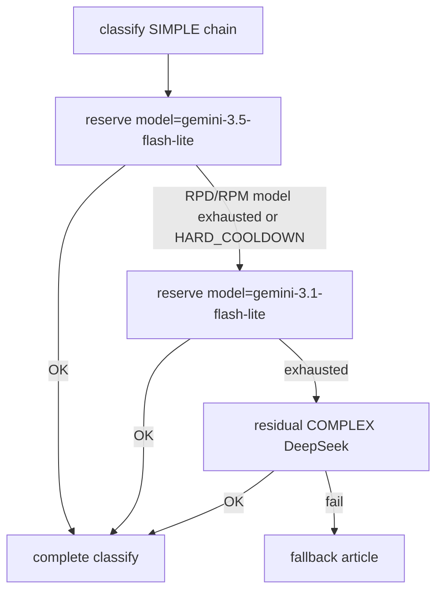

# Piano impl — Quote per-modello (lane SIMPLE/COMPLEX + FALLBACKS)

> **Stato: COMPLETE / GATE VERDE** (2026-07-22) — commit `9848f5b` + docs R8 `docs/02` allineato  
> **Branch:** `feature/upgrades`  
> **Prompt Agent:** [`../prompts/done/agent_prompt_per_model_quota.md`](../prompts/done/agent_prompt_per_model_quota.md)  
> **SoT correlato:** [`sot_llm_multi_model_fallback.md`](sot_llm_multi_model_fallback.md) (C8 per-model **Implementato**)  
> **Prerequisito ops:** Metrics 013 GATE VERDE; Profilo A: primary `gemini-3.5-flash-lite`, L1 `gemini-3.1-flash-lite`

---

## 1. Obiettivo prodotto

Allineare il ledger quote al comportamento atteso dall’utente e a Google AI Studio:

1. Esaurita la quota del **modello corrente** → passare al **fallback** L1 (`*_FALLBACKS`), non bloccare l’intera lane.
2. Primary e fallback hanno **contatori indipendenti**; possono avere **tetti diversi**.
3. Locale / API a pagamento: **`RPM/TPM/RPD = 0` = unmanaged** (nessun tetto) — default semplice, già concetto Radar.
4. Ops **facilitata**: un default di lane + override opzionale per modello (CSV), senza knobs oscuri.

**Fuori scope:** UI FinOps; budget USD per-model (resta per-lane); cambiare model ID Profilo A; sidebar / mappa.

---

## 2. UX ops (scelta chiusa — best practice)

### 2.1 Default di lane (facile)

```bash
LLM_SIMPLE_RPM=12      # 0 = unmanaged
LLM_SIMPLE_TPM=250000  # 0 = unmanaged
LLM_SIMPLE_RPD=500     # 0 = unmanaged (paid/local tipico)
```

Stessi knobs per `LLM_COMPLEX_*`.  
**Ogni modello** della catena `LLM_SIMPLE.models` (primary + FALLBACKS) eredita questi valori **come default**, ma i **contatori ledger sono per `model`**.

Esempio Profilo A (Studio: entrambi Flash Lite ~15/250K/500):

- Default lane `RPD=500` → 3.5 ha pool 500, 3.1 ha pool 500 **separati**.
- Se 3.1 è a 453/500 e 3.5 a 6/500 in Studio, Radar deve ancora consentire reserve su **3.5** (non sommare i due).

### 2.2 Override per modello (quando i tetti differiscono)

```bash
# model:rpm:tpm:rpd  — omesso = usa default lane; 0 su una dimensione = unmanaged per quel modello
LLM_SIMPLE_MODEL_LIMITS=gemini-3.5-flash-lite:12:250000:500,gemini-3.1-flash-lite:12:250000:450
LLM_COMPLEX_MODEL_LIMITS=
```

Regole parse:

- CSV di `model:rpm:tpm:rpd` (interi ≥0).
- Model non in mappa → default lane.
- Dimensione `0` → unmanaged **solo quella dimensione** per quel model.
- Chiave env presente ma vuota → nessun override (solo default).

### 2.3 Paid / locale (senza quote)

```bash
LLM_SIMPLE_RPM=0
LLM_SIMPLE_TPM=0
LLM_SIMPLE_RPD=0
LLM_SIMPLE_MODEL_LIMITS=   # lasciare vuoto
```

Soft-trim worker **off**. Nessun `QuotaDailyExceeded` da RPD. Cascade L1 resta per errori/cooldown, non per RPD finti.

---

## 3. Gap AS-IS

| Componente | Oggi | Problema |
|------------|------|----------|
| `QuotaLedger._try_reserve_once` | Count per `lane` | 3.5 bloccato se 3.1 ha riempito il 500 di lane |
| Soft-trim `_ledger_simple_rpd_used` | Somma lane SIMPLE | Ibverna/bypass basato su pool condiviso |
| Cascade client | OK su `hard_cooldown` → next model | Non raggiunge il fallback se reserve fallisce subito per lane RPD |
| Docs recenti | “RPD lane-shared by design” | Descriveva AS-IS; **non** è più il contratto desiderato |

Nessuna migrazione DB: `llm_request_ledger.model` già popolato.

---

## 4. Design tecnico



### 4.1 QuotaLedger

- RPM/TPM/RPD: filtro `AND model = $model` (model non-vuoto).
- Tetti da `limits_for_model(lane_cfg, model)`.
- `model IS NULL` legacy: **non** conteggiare nei bucket per-model (evita gonfiare i pool nuovi).
- Budget USD: resta **per-lane** (paid singolo provider tipico).
- Messaggi errore: includere `model=...`.

### 4.2 Soft-trim worker

- Hibernate ciclo solo se **nessun** modello managed della catena `LLM_SIMPLE.models` ha RPD residuo.
- Se almeno un model ha RPD residuo → ciclo prosegue (proverà quel model / salterà i cooldown).
- Se tutti i SIMPLE managed esauriti ma residual COMPLEX distinto → bypass hibernate (come oggi).
- `LLM_SIMPLE.rpd==0` e nessun override RPD>0 → soft-trim off.

### 4.3 Cooldown

Invariato (`provider+model`). RPD esaurita su A → cooldown A → B in chain.

---

## 5. Wave implementazione

| Wave | Contenuto |
|------|-----------|
| **W0** | Questo piano + prompt Agent + STATUS (**DONE** con questo file) |
| **W1** | `llm_lanes.py` parse `MODEL_LIMITS` + `limits_for_model`; `.env.example` |
| **W2** | `quota.py` contatori per-model |
| **W3** | `worker.py` soft-trim catena |
| **W4** | pytest + script verify opz. `verify_per_model_quota.py` |
| **W5** | Docs/ECC/SoT (ritirare “lane-shared by design”) |
| **W6** | **GATE live** (sotto) + commit |

---

## 6. GATE live / scripting (obbligatorio)

Scenario reale (Studio tipico al momento del piano):

- `gemini-3.1-flash-lite` ≈ quota RPD **alta / quasi piena**
- `gemini-3.5-flash-lite` ≈ **300–350** RPD ancora disponibili (o comunque residuo significativo)

### 6.1 Pre-check

```sql
SELECT model, status, COUNT(*)
FROM llm_request_ledger
WHERE created_at::date = CURRENT_DATE
GROUP BY 1,2 ORDER BY 3 DESC;
```

Confermare env: primary=3.5, FALLBACKS=3.1, `LLM_SIMPLE_RPD=500` (o override CSV). **Non** bumpare RPD di lane per “sbloccare” 3.5 — il fix codice deve bastare.

### 6.2 Unit

`pytest -m "not live"` — caso chiave: RPD=1 per model A e B stessa lane → dopo esaurimento A, B ancora reservable.

### 6.3 Rebuild

`docker compose up -d --build` (worker almeno).

### 6.4 Requeue giornata (parziale o full-day)

Skill `radar-requeue-ops`:

1. Contare articoli/created oggi → N (cap 500; batch se enorme).
2. `requeue_articles N --dry-run` poi senza dry-run (**no** `--purge-all` a meno di richiesta esplicita wipe totale).
3. Restart/recreate worker; attendere elaborazione.
4. Verificare log: **nessun** soft-trim spurio che impedisca 3.5; OK `gemini-3.5-flash-lite` anche se 3.1 è in cooldown/RPD alto.
5. Se 3.5 esaurisce → log RPD su 3.5 → tentativo 3.1 o residual COMPLEX.

### 6.5 Assert post

- Ledger oggi: incrementi su `gemini-3.5-flash-lite` **senza** richiedere bump lane.
- Embeddings popolati; metriche 013 ancora verdi (`verify_metrics_013`).
- Dedup URL/semantic senza regressioni.
- Zero Traceback; errori spiegati.
- Confrontare conteggi Radar per-model vs aspettativa Studio (ordine di grandezza).

### 6.6 Scripting suggerito

Nuovo o estensione: `python -m app.scripts.verify_per_model_quota` (opz. nel worker):

- Per ogni model in `LLM_SIMPLE.models` con rpd>0: used/cap/residual.
- Fail se primary ha residuale ledger ma soft-trim ha ibernato (regressione).

---

## 7. Checklist GATE

- [x] Contatori per-model in reserve
- [x] Override `MODEL_LIMITS` + default lane + `0` unmanaged
- [x] Soft-trim catena
- [x] pytest verde incluso caso A esausto → B ok
- [x] Live: 3.5 classifica con 3.1 alto/esausto
- [x] Requeue 24h (vault+unread) senza errori bloccanti
- [x] Docs/ECC/SoT aggiornati (no “shared by design” come contratto) — incluso `docs/02`
- [x] Commit dettagliato; plan → `complete/`; prompt → `done/`

---

## 8. Riferimenti codice

- `radar/backend/app/classification/quota.py`
- `radar/backend/app/classification/client.py`
- `radar/backend/app/core/llm_lanes.py`
- `radar/backend/app/worker.py` (soft-trim + riduzione lotto)
- `radar/backend/app/scripts/requeue_articles.py`
- Skills: `radar-quota-ledger`, `radar-requeue-ops`, `radar-docker-ops`

---

## 9. Review orchestratore (2026-07-22) — delta obbligatorio

Piano orchestratore **~90% allineato**. Correzioni da applicare in impl:

| ID | Issue | Correzione |
|----|--------|------------|
| R1 | Spacing `_last_reserve_mono` proposto per `(lane, model)` | **NO** — tenere spacing **per-lane** (protegge stessa API key Gemini). Solo i **contatori ledger** RPM/TPM/RPD sono per-model. |
| R2 | Soft-trim: solo hibernate | Aggiornare anche **riduzione lotto** (`entries[:remaining]`) usando residuo **max** (o somma dei residuali) della catena SIMPLE managed, non `simple_rpd - processed_lane`. |
| R3 | “unmanaged ⇒ residual True” ambiguo | Soft-trim **off** se nessun model managed (`rpd>0`) in catena. Se mix managed+unmanaged: hibernate solo quando tutti i **managed** sono esausti (unmanaged non “salva” da solo se lane default è managed — in pratica override `rpd=0` su un fallback rende quel model sempre eleggibile → ciclo non iberna: OK e da documentare). |
| R4 | Parse `MODEL_LIMITS` | **Fail-fast** su voce malformata (startup / load_lanes raise), non silent skip. |
| R5 | Budget USD | Esplicitare: resta **per-lane** (non in scope per-model). |
| R6 | quality:compare | Coperto automaticamente da quota.py per-model (COMPLEX model). |
| R7 | GATE | **Vietato** bump `LLM_SIMPLE_RPD` di lane per dimostrare 3.5; dry-run requeue; N≈created_today; `verify_metrics_013` + `verify_per_model_quota`. |
| R8 | Docs extra | Anche `docs/02_architecture_and_backend.md` e `.agents/AGENTS.md` se citano RPD lane-shared. |

Prompt Agent aggiornato con R1–R8: [`../prompts/done/agent_prompt_per_model_quota.md`](../prompts/done/agent_prompt_per_model_quota.md).

