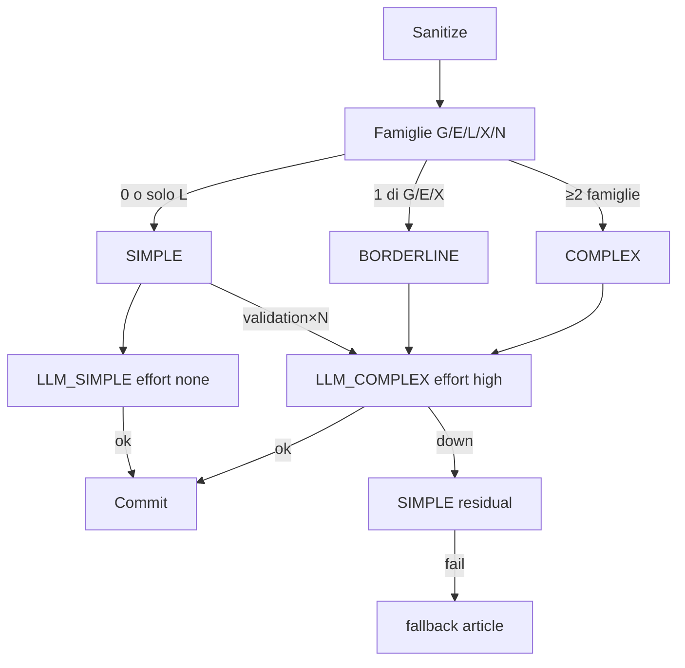
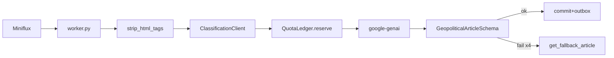

# Source of Truth — LLM Multi-Model Fallback

> **Stato:** SoT design A+B + **Fase C implementata** + **lane env v2.2** + **heuristic complexity v2.2** + **OpenAI-compat dialect / provider aliases** (`openai`|`glm`|`grok`, 2026-07-16).  
> **Skills:** `llm-json-extraction`, `radar-quota-ledger`.  
> **Sostituisce come riferimento operativo:** stub in `archive/llm-stubs/`.  
> **Canvas:** non presenti in questo monorepo (riferimenti storici rimossi).  
> **Prompt storico:** [`../prompts/done/audit_prompt_llm_multi_model_fallback_research.md`](../prompts/done/audit_prompt_llm_multi_model_fallback_research.md) (SoT = questo file).  
> **Remediation:** `../remediation/audit_remediation_llm_multi_model_fallback.md`.  
> **Indice cartelle:** [`../README.md`](../README.md).

---

## 0. Executive summary

| Domanda | Verdetto |
|---------|----------|
| Cascata Gemini free ha senso? | **Sì** — ops tipico: Lite bulk; Flash pieni solo se RPD Studio ≥~500 |
| Paid DeepSeek ha senso? | **Sì** — `deepseek-v4-flash` + `reasoning_effort=high` (~$0.001/art.), non Max |
| Routing per complessità? | **Sì, a tre fasce** (SIMPLE / BORDERLINE / COMPLEX). Complessità = **rischio estrazione schema** (G/E/X), non lunghezza sola |
| Provider/model per lane? | **Env** — `LLM_SIMPLE_*` (solo SIMPLE) + `LLM_COMPLEX_*` (**BORDERLINE + COMPLEX** + escalate). Adapter: `gemini` \| `deepseek` \| `openai` \| `glm` \| `grok` \| `claude` (stub) |
| Free o paid come “path primario”? | **Vietato** — SLO mix + quorum famiglie + shadow ≥3g |
| Cooldown 24h? | **SQL durable** `(provider, model, until_ts, reason)` |
| Fase C? | **DONE** — vedi remediation; default codice `LLM_ROUTING_MODE=off` |

**Catena ops attuale (2026-07-17) — Profilo A hybrid tipico locale**

```text
LLM_ROUTING_MODE=complexity
LLM_ROUTING_SHADOW=false
# SIMPLE bulk free (Studio VERIFY)
LLM_SIMPLE_PROVIDER=gemini
LLM_SIMPLE_MODEL=gemini-3.1-flash-lite
LLM_SIMPLE_RPM=12          # Studio 15 — cap ops ≤12
LLM_SIMPLE_TPM=250000      # Studio 250K
LLM_SIMPLE_RPD=500         # Studio 500
LLM_SIMPLE_FALLBACKS=      # VUOTO — residual = COMPLEX
# BORDERLINE + COMPLEX + escalate (paid)
LLM_COMPLEX_PROVIDER=deepseek
LLM_COMPLEX_MODEL=deepseek-v4-flash
LLM_COMPLEX_REASONING_EFFORT=high
LLM_COMPLEX_RPM=0          # unmanaged paid
```

### Limiti e cambio modello (normativa operativa)

| Evento | Comportamento | Non fare |
|--------|---------------|----------|
| RPM o TPM lane pieni | `QuotaLedger.reserve` **attende** sulla **stessa** lane | Non passare all’altra lane “per sbrigarsi” |
| RPD lane esaurita (ledger) | `QuotaDailyExceeded` → cooldown modello → **residual cross-lane** | Non ibernare il ciclo se l’altra lane è distinta e disponibile |
| 429 daily / free_tier (provider) | `HARD_COOLDOWN` → stessa logica residual | Trattare come retry RPM breve |
| Soft-trim `LLM_SIMPLE.rpd` | Se residual COMPLEX distinto: **bypass ibernazione** (failover per-articolo) | Hibernare tutto lo stack quando DeepSeek può elaborare |

Entrambi i modelli (SIMPLE + COMPLEX) restano configurati e disponibili; il cambio avviene solo su esaurimento/cooldown, non su attesa RPM/TPM.

Alt Gemma 4 31B: `gemma-4-31b-it` RPM=30 TPM=16000 RPD=14400 (contesto stretto; body già `[:4000]`).

```text
# Swap COMPLEX → Google senza codice:
#   LLM_COMPLEX_PROVIDER=gemini
#   LLM_COMPLEX_MODEL=gemini-3.5-flash
# OpenAI / GLM / Grok: PROVIDER=openai|glm|grok + MODEL + API_KEY + BASE_URL
# Ricette Profili B–E in radar/.env.example
```

---

## 1. Analisi complessiva della fase

### 1.1 Cosa è stato fatto

| Step | Contenuto | Esito |
|------|-----------|-------|
| Fase A Google | Pricing/rate-limits/models ufficiali + VERIFY_IN_STUDIO | Shortlist Flash 3.5 / 2.5 / 3.1-Lite |
| Fase A esterni free | Groq, Cerebras, OpenRouter, GitHub, … | Nessuno batte Gemini su 1M+~1500 RPD+TPM insieme |
| Fase A paid-cheap | DeepSeek V4 Flash High vs Max + AA Index | High scelto (37 vs Gemma 29; Max overkill) |
| Design B lineare | Cascata + cooldown 24h | Base valida ma insufficiente da sola |
| Design B complexity | Lane SIMPLE/COMPLEX + T=40 | **Respinto** dalla verifica anti-skew |
| Verifica anti-skew | Corpus vault 2492 + failure modes F1–F6 | Design **v2.1** (tre fasce, quorum) |
| Consolidamento | Questo file | Unica SoT + correzioni §2 |

### 1.2 Allineamento al sistema Radar (AS-IS)

| Componente | Path | Vincolo per Fase C |
|------------|------|--------------------|
| Config modello | `core/config.py` | **TO-BE fatto:** Gemini + DeepSeek + routing + `LLM_SIMPLE_*` / `LLM_COMPLEX_*` |
| Client | `classification/client.py` | Lane chain + escalate; `content[:4000]`; `_MAX_ATTEMPTS=4`; QuotaLedger; fallback |
| Parser | `extraction/parser.py` | Score complessità **dopo** `strip_html_tags` |
| Schema | `validator.py` | `GeopoliticalArticleSchema` strict — **immutabile** |
| Worker | `worker.py` | sanitize → classify → commit/outbox; soft-trim RPD |
| Ledger | `quota.py` + migrations | `reserve(model=)` già esiste; cooldown = tabella nuova |
| API | `main.py` | API-only — **non** spostare ingest |

### 1.3 Evidenza empirica (vault, 2026-07-16)

Probe su **2492** articoli post-classificazione (`radar/vault/**/*.md`):

| Metrica | Valore | Lettura |
|---------|-------:|---------|
| `country_code=XX` | **24.8%** | ~1/4 geo “undetermined” con Gemini-only — **non tutti sono errori** (pezzi davvero internazionali) |
| Top `US` | **45.9%** | Bulk mono-paese → deve restare free se euristica sana |
| Multi-nazione solo titolo | **~4.6%** | Titolo-only → free-primary di fatto (F1) |
| Body vault p50/p90 | 851 / 1854 | Vault = riassunti → **non** calibrare lunghezza qui |

**Implicazione:** calibrare shadow su **content Miniflux live**, non sul vault. Usare XX come KPI *secondario*; primari = share lane, escalate rate, ValidationError/100.

### 1.4 Cosa funzionava / cosa no nella v1

| Elemento | Valutazione |
|----------|-------------|
| Cascata qualità-prima Gemini | Solida |
| DeepSeek High (non Max) | Solida |
| Cooldown SQL 24h | Solida |
| Binario `score ≥ 40` | **Fragile** → F1/F2 |
| “~70–90% free” come obiettivo | **Skew verso free-primary**; contraddice XX~25% |
| Score mid-band + quorum sovrapposti | Ambiguo (corretto in §2) |
| “Alzare char su COMPLEX” | Conflitto con invariante `[:4000]` (corretto in §2) |

---

## 2. Correzioni applicate in questa revisione (v2.1)

| # | Problema | Correzione |
|---|----------|------------|
| C1 | Precedenza lane ambigua (0 famiglie vs mid-band score) | **Lane = quorum famiglie** (0/1/≥2). Score solo log + override soft futuro |
| C2 | `G∧E` ridondante con “≥2 famiglie” | Rimosso |
| C3 | `T_high=55` morto (max 1 famiglia ≈30 punti) | Lane non dipende da T_high oggi; env tenuto per soft-signal futuri; **non** usare come driver v1 |
| C4 | `force linear` vs `force off` | Unificato: **`LLM_ROUTING_MODE=off` + WARNING** (o fail startup se `strict`) |
| C5 | “Alzare budget char” su DeepSeek | **Vietato in v1** — stesso `content[:4000]` su tutte le lane |
| C6 | Escalate BORDERLINE al *primo* ValidationError | **Dopo 1 correction fallita** (evita pagare glitch JSON transienti) |
| C7 | XX=fallimento assoluto | XX KPI secondario; pezzi internazionali legittimi restano XX |
| C8 | `LLM_RPD` globale vs Lite~1000 | v1: globale **1400**; soft-trim non deve spingere Lite oltre RPD Studio VERIFY; fase 2: cap per-model |
| C9 | Groq in shortlist esterna | **Fuori catena v1** (TPM 6–30K stretto); opzionale fase 2 |
| C10 | Documenti multipli divergenti | Questo file = SoT unica |

---

## 3. Ricerca modelli (Fase A — sintesi)

### 3.1 Fonti (check 2026-07-16)

- [Google pricing](https://ai.google.dev/gemini-api/docs/pricing) · [rate-limits](https://ai.google.dev/gemini-api/docs/rate-limits) · [models](https://ai.google.dev/gemini-api/docs/models)
- [Gemini 3.5 Flash](https://ai.google.dev/gemini-api/docs/models/gemini-3.5-flash) · [structured output](https://ai.google.dev/gemini-api/docs/structured-output)
- [DeepSeek pricing](https://api-docs.deepseek.com/quick_start/pricing) · [thinking](https://api-docs.deepseek.com/guides/thinking_mode) · [JSON](https://api-docs.deepseek.com/guides/json_mode)
- [Artificial Analysis](https://artificialanalysis.ai/) · Groq/OpenRouter docs per esclusione free esterni

Quote RPM/RPD Google: **VERIFY_IN_STUDIO** sul progetto della `GOOGLE_API_KEY` (non hardcodare community).

### 3.2 Google — shortlist

| Rank | model_id | Ruolo | Note |
|------|----------|-------|------|
| 1 | `gemini-3.5-flash` | Primary free | Free, stable, 1M, structured, qualità max free |
| 2 | `gemini-2.5-flash` | Secondary | Free, stable, Flash pieno |
| 3 | `gemini-3.1-flash-lite` | Tertiary | Throughput; AA **25 &lt; Gemma 29** → mai primary |
| L | `gemma-4-31b-it` | Legacy opt-in | 256K OK; ops HTTP 500 → fuori default |
| OUT | `gemini-2.0-*` | — | Shut down 2026-06-01 |
| OUT | Pro free tipico | — | RPD ≪1000 |

**Env consigliati (Profilo A / Gemini free, VERIFY_IN_STUDIO):**  
`LLM_SIMPLE_RPM` / `LLM_SIMPLE_RPD` (non i legacy `LLM_RPM`/`LLM_RPD` se i campi lane sono già settati).  
Esempio di partenza storico: RPM≈10, RPD≈1000–1400 — **ricalibrare in AI Studio**.

**Quote:** per **project**, non per API key; limiti tipicamente **per model variation** → switch modello può dare RPD fresco lo stesso giorno (VERIFY).

### 3.3 Esterni free — esito

| Provider | Fit | Motivo OUT / bordo |
|----------|-----|-------------------|
| Groq Llama-4 Scout | Bordo | 30 RPM / 1K RPD / 30K TPM — tight vs articoli lunghi |
| Cerebras free | OUT | RPM 5; context free spesso 8K |
| OpenRouter `:free` | OUT volume | 50 RPD (1000 solo dopo $10 lifetime) |
| GitHub Models | OUT | RPD 50–150; cap token/request |

### 3.4 DeepSeek V4 Flash High

| Campo | Valore |
|-------|--------|
| Model | `deepseek-v4-flash` |
| Effort | **`high`** (mai `max` di default) |
| Context | 1M |
| Concurrency | 2500 |
| Pricing /1M | cache hit $0.0028 / miss $0.14 / out $0.28 |
| Structured | `json_object` + Pydantic Radar (scartare `reasoning_content`) |
| AA Index | High **~37** · Max **40** · Gemma 31B **29** · Gemini 3.5 Flash **~55** · Flash-Lite **25** |
| Costo Radar | ~$0.001/art. → ~$0.5–3/giorno se *tutto* paid; con mix 25% COMPLEX ≈ **~$0.25–0.75/giorno** |

High vs Max: stesso $/token; Max più verboso (reasoning) → costo↑ per +3 Index. **Scelta: High.**

---

## 4. Design routing (anti-skew) — algoritmo live **v2.2**

> Storico: design iniziale “v2.1” (BORDERLINE=catena SIMPLE; L sola→BORDERLINE) è **superseded**.
> Codice live = heuristic + chain **v2.2** sotto.

### 4.1 Definizione di “complesso”

**Non** IQ del pezzo. **Sì** rischio di fallire lo schema Radar:

`country_code` (XX / paese sbagliato) · lat/lon · `companies_involved` · category/tags · title/summary IT.

Misura: dopo `strip_html_tags`, su title+body sanitizzato **intero**.  
Call LLM: sempre `content[:4000]` (tutte le lane).

### 4.2 Failure modes da non reintrodurre

| ID | Nome | Effetto |
|----|------|---------|
| F1 | Free-primary | COMPLEX &lt;15% → DeepSeek accessorio; XX non migliora |
| F2 | Paid-primary | COMPLEX &gt;50% → credito = default |
| F3 | Single-signal | Un feature domina lo skew |
| F4 | Silent paid-off | Key assente → tutto Gemini senza alert |
| F5 | Escalation-only | Paid solo post-fail raro |
| F6 | Vault overfitting | Soglie lunghezze calibrate su riassunti |

### 4.3 Famiglie di segnale

| Famiglia | Attivazione (codice live) | Campo a rischio |
|----------|---------------------------|-----------------|
| **G** Geo | ≥2 nazioni lexicon EN/IT **oppure** `geo_marker` con `body_len ≥ 1500` | country_code, lat/lon |
| **E** Entità | ≥3 org suffix (`Inc\|Ltd\|LLC\|GmbH\|SpA\|AG\|Corp\|PLC\|SA`) | companies_involved |
| **L** Lunghezza | `len(body) ≥ 6000` (+30 log se ≥12000) | trim 4000 |
| **X** Lingua | ratio non-latino ≥0.15 su sample 4k | title/summary IT |
| **N** Negative | title&lt;40 ∧ body&lt;800 ∧ nessuna famiglia positiva | forza SIMPLE |

Punti (solo logging): L +20/+30 · G +25 · E +15 · X +20 · N −15.

Implementazione: lexicon paesi; ISO allowlist; no `langdetect` in v1.

### 4.4 Algoritmo lane (deterministico) — heuristic **v2.2**

Complessità = **rischio estrazione schema** (geo ambigua, multi-entità, script), **non** IQ e **non** lunghezza sola.

```text
families = {G,E,L,X} attive  # N gestito a parte
strong = families ∩ {G,E,X}

# G: ≥2 country names → sempre; geo_marker da solo solo se body_len ≥ 1500
if N and not families:
    lane = SIMPLE
elif families == {L}:
    lane = SIMPLE          # L sola non eleva (v2.2)
elif len(families) >= 2:
    lane = COMPLEX         # L conta solo in combo
elif len(strong) == 1:
    lane = BORDERLINE
else:
    lane = SIMPLE
```

| Lane | Catena (via env) | Escalation validation |
|------|------------------|------------------------|
| **SIMPLE** | `LLM_SIMPLE_*` (tipico `effort=none`; **Profilo F** = think/`high`) | Cloud/Gemini: dopo `_MAX_ATTEMPTS` → **1×** `LLM_COMPLEX_*`. **Ollama think** (`uses_ollama_think_protocol`): correction fino a `_MAX_ATTEMPTS_LOCAL` (6); **nessun** escalate a COMPLEX |
| **BORDERLINE** | **`LLM_COMPLEX_*`** (tipico `effort=high`) — v2.2 | Dopo **1 correction fallita** resta su COMPLEX (già high); escalate legacy se identity diversa |
| **COMPLEX** | `LLM_COMPLEX_*` → residuale SIMPLE | Se COMPLEX down / no key → SIMPLE; poi fallback article |

Provider ammessi: `gemini` \| `deepseek` \| `openai` \| `glm` \| `grok` \| `claude` (claude stub).
OpenAI-compat (`deepseek`/`openai`/`glm`/`grok`) via httpx: dialect `deepseek` = thinking payload;
dialect `openai` = stock chat/completions (niente campi DeepSeek-only). Effort da lane (`LLM_*_REASONING_EFFORT`).

### 4.5 SLO mix (anti “path primario”)

| KPI | Banda | Fuori banda |
|-----|-------|-------------|
| Share COMPLEX (pre-call) | monitor | Con ops DeepSeek none/high tipicamente &lt;20% (G+L rari) |
| Share BORDERLINE | monitor | Ora costa come COMPLEX (high); L-sola non gonfia più questa fascia |
| Escalate / giorno | monitor | Spike → G debole o JSON fragile |
| XX su lane SIMPLE | trend vs baseline | Se peggiora → rafforzare G |
| USD DeepSeek / giorno | ≤ budget soft-cap | Soft-cap in `QuotaLedger` (`0` = off) |

**Gate go-live:** shadow ≥**3 giorni** su Miniflux live (`LLM_ROUTING_SHADOW=true`: logga lane, call ancora Gemini-only) con COMPLEX share in 20–40%. Poi `SHADOW=false`.

### 4.6 Guardrail

| Regola | Comportamento |
|--------|----------------|
| `LLM_COMPLEX_PROVIDER=deepseek` senza key | WARNING + COMPLEX usa SIMPLE; `LLM_ROUTING_STRICT=1` → fail startup |
| Crediti / 402 | Cooldown DeepSeek + log `complex_lane deepseek cooldown` |
| No length-only → COMPLEX | Solo L → **SIMPLE** (v2.2; non BORDERLINE) |
| No length-only → BORDERLINE | Idem — L sola non è rischio schema |
| geo_marker corto | Ignorato se `body_len < 1500` (anti FP pitch HN) |
| No title-only | G dal body |
| Stesso truncate | `[:4000]` ovunque in v1 |

### 4.7 Flusso unificato + cooldown

```text
sanitize → heuristic(families) → lane → chain_for(lane) filtrata da cooldown/key/budget
for model in chain:
  reserve(model)          # SEMPRE prima del provider
  call → validate
  short_429 → wait Retry-After; stesso modello (NO cooldown 24h)
  ValidationError → correction / escalate per regola lane
  hard_fail (RPD day, 402, 5xx×N, NOT_FOUND, context×2) → cooldown 24h; next
exhausted → get_fallback_article
```

**Cooldown 24h sì:** RPD daily esausto, 402/crediti, 5xx×N, NOT_FOUND, context overflow dopo re-trim.  
**No:** 429 breve, ValidationError, timeout isolato.

Persistenza: SQL `llm_model_cooldown(provider, model, until_ts, reason)` — **Opzione A**.  
Chiave: `provider`+`model` (+ opz. effort). Cooldown condiviso tra tutte le lane.



---

## 5. Config env (SoT ops)

Limiti e provider sono **per lane** (`LLM_SIMPLE_*` / `LLM_COMPLEX_*`).  
Legacy `LLM_RPM` / `DEEPSEEK_*` / `OPENAI_API_KEY` / `GLM_*` / `GROK_*` / `XAI_*` = fill-gap se il campo lane è assente — **non** un tetto globale.

### Provider e dialect (OpenAI-compat)

| `PROVIDER` | Adapter | Default `BASE_URL` | Payload dialect |
|------------|---------|-------------------|-----------------|
| `gemini` | `google-genai` SDK | — | n/a |
| `deepseek` | httpx `/chat/completions` | `https://api.deepseek.com` | **deepseek** (`thinking` + `reasoning_effort`) |
| `openai` | httpx `/chat/completions` | `https://api.openai.com/v1` | **openai** (stock; **niente** `thinking`) |
| `glm` | httpx `/chat/completions` | `https://open.bigmodel.cn/api/paas/v4` | **openai** |
| `grok` | httpx `/chat/completions` | `https://api.x.ai/v1` | **openai** |
| `claude` | stub | `https://api.anthropic.com` | n/a — Messages API non implementata; proxy OpenAI-compat via `PROVIDER=openai` + `BASE_URL` |

Package `openai` / `anthropic` **vietati**. Implementazione: `classification/deepseek.py` (`api_dialect` + `build_chat_completions_payload`).

### Profilo B — DeepSeek-only (ops tipico / `.env.example` attivo)

```text
LLM_ROUTING_MODE=complexity          # off | complexity  (default codice: off)
LLM_ROUTING_SHADOW=false             # true = log lane, call sempre SIMPLE
LLM_ROUTING_STRICT=0
LLM_COMPLEXITY_ESCALATE_ON_VALIDATION=1
LLM_MODEL_COOLDOWN_HOURS=24

# SIMPLE = Flash non-thinking; COMPLEX = stesso modello, effort high
LLM_SIMPLE_PROVIDER=deepseek
LLM_SIMPLE_MODEL=deepseek-v4-flash
LLM_SIMPLE_REASONING_EFFORT=none
LLM_SIMPLE_RPM=0                     # paid: 0 = unmanaged
LLM_SIMPLE_TPM=0
LLM_SIMPLE_RPD=0                     # soft-trim worker off se 0
LLM_SIMPLE_BUDGET_USD_DAY=0

LLM_COMPLEX_PROVIDER=deepseek
LLM_COMPLEX_MODEL=deepseek-v4-flash
LLM_COMPLEX_REASONING_EFFORT=high
LLM_COMPLEX_RPM=0
LLM_COMPLEX_TPM=0
LLM_COMPLEX_RPD=0
LLM_COMPLEX_BUDGET_USD_DAY=0

DEEPSEEK_API_KEY=...                 # non commitare
DEEPSEEK_BUDGET_USD_DAY=0            # legacy alias → COMPLEX budget se lane unset
```

### Profilo A — Hybrid free Gemini + paid DeepSeek (commentato in `.env.example`)

```text
# Free Gemini → RPM/RPD > 0 (VERIFY_IN_STUDIO); paid DeepSeek → RPM/RPD=0 + BUDGET
LLM_SIMPLE_PROVIDER=gemini
LLM_SIMPLE_MODEL=gemini-3.1-flash-lite
LLM_SIMPLE_RPM=10                    # VERIFY_IN_STUDIO
LLM_SIMPLE_RPD=1000                  # VERIFY_IN_STUDIO — soft-trim usa questo se > 0
LLM_COMPLEX_PROVIDER=deepseek
LLM_COMPLEX_MODEL=deepseek-v4-flash
LLM_COMPLEX_RPM=0
LLM_COMPLEX_RPD=0
LLM_COMPLEX_BUDGET_USD_DAY=5         # soft-cap USD/giorno (esempio)
```

### Profili C / D / E — OpenAI / GLM / Grok (commentati in `.env.example`)

Swap **solo env** (stesso pattern lane). Dialect sempre `openai` (no campi DeepSeek-only).

```text
# C — OpenAI
LLM_SIMPLE_PROVIDER=openai
LLM_SIMPLE_MODEL=gpt-4.1-mini
LLM_SIMPLE_BASE_URL=https://api.openai.com/v1
LLM_SIMPLE_REASONING_EFFORT=none
LLM_COMPLEX_PROVIDER=openai
LLM_COMPLEX_MODEL=gpt-4.1
LLM_COMPLEX_REASONING_EFFORT=high
# key: LLM_*_API_KEY o legacy OPENAI_API_KEY; budget via *_BUDGET_USD_DAY

# D — GLM (Zhipu)
LLM_SIMPLE_PROVIDER=glm
LLM_SIMPLE_MODEL=glm-4-flash
LLM_SIMPLE_BASE_URL=https://open.bigmodel.cn/api/paas/v4
# key: LLM_*_API_KEY o GLM_API_KEY / ZHIPU_API_KEY

# E — Grok (xAI)
LLM_SIMPLE_PROVIDER=grok
LLM_SIMPLE_MODEL=grok-3-mini
LLM_SIMPLE_BASE_URL=https://api.x.ai/v1
# key: LLM_*_API_KEY o GROK_API_KEY / XAI_API_KEY
```

### Profilo F — Local-Hybrid (Ollama host SIMPLE + DeepSeek COMPLEX)

Commentato in `.env.example`. Scenario 2 / Fase A: lane SIMPLE verso Ollama sull’**host** via OpenAI-compat httpx; COMPLEX tipico DeepSeek cloud. **Shipped** `54c8038`.

**Invarianti**

- `PROVIDER=openai` + `BASE_URL=http://host.docker.internal:11434/v1`.
- Dialect lane = **openai** (stock vs DeepSeek). Su tag reasoner locali (`gemma4*`, `qwen3*`, …) il payload abilita comunque **`think=true`** + `options.num_ctx/num_predict=8192` (moduli `openai_compat_payload` / `openai_compat_response`; client storico `deepseek.py` / alias `OpenAICompatClient`). Nessun `response_format=json_object` su Ollama think.
- Package / SDK `ollama` e chiamate `ollama.chat` **vietati**.
- Overlay Compose: `docker-compose.ollama-host.yml` (`extra_hosts: host.docker.internal:host-gateway` su `radar-worker`).
- Modello ops tipico: **`gemma4-radar`** (Modelfile `FROM gemma4:12b` + `PARAMETER num_ctx 8192`) oppure base `gemma4:12b`; **`LLM_SIMPLE_REASONING_EFFORT=high`**; API key dummy non vuota (es. `ollama`); RPM/TPM/RPD SIMPLE = `0`.
- **Escalate:** SIMPLE Ollama **non** scala a DeepSeek su ValidationError; solo correction locale. COMPLEX/BORDERLINE restano DeepSeek; residual cloud se Ollama down.
- Pre-validate: `normalize_llm_json_dict` (liste→CSV, alias categoria/sentiment, protagonista paese, coerenza tag/aziende/relevance).
- Host Ollama: preferire **`OLLAMA_NUM_PARALLEL=1`**; worker `WORKER_*_CONCURRENCY=1` consigliato su 12 GB VRAM.
- **Future:** unload VRAM / `keep_alive=0` a fine ciclo idle (non ancora in codice).

```text
# F — Local-Hybrid (prereq: Ollama host + overlay ollama-host)
LLM_SIMPLE_PROVIDER=openai
LLM_SIMPLE_MODEL=gemma4-radar
LLM_SIMPLE_API_KEY=ollama
LLM_SIMPLE_BASE_URL=http://host.docker.internal:11434/v1
LLM_SIMPLE_RPM=0
LLM_SIMPLE_TPM=0
LLM_SIMPLE_RPD=0
LLM_SIMPLE_TIMEOUT=180
LLM_SIMPLE_REASONING_EFFORT=high
LLM_COMPLEX_PROVIDER=deepseek
LLM_COMPLEX_MODEL=deepseek-v4-flash
LLM_COMPLEX_REASONING_EFFORT=high
# COMPLEX key: LLM_COMPLEX_API_KEY o DEEPSEEK_API_KEY
# Ops tip: WORKER_ENTRY_CONCURRENCY=1 WORKER_DB_CONCURRENCY=1 WORKER_GEMINI_CONCURRENCY=1
```

Ops: `docker compose -f docker-compose.yml -f docker-compose.ollama-host.yml up -d radar-worker`.  
Runbook: `radar/docs/runbook.md` § Local-Hybrid. Rollback → Profilo B senza overlay.

Legacy opzionale (solo fill-gap): `GEMINI_*`, `LLM_RPM`/`LLM_TPM`/`LLM_RPD`, `DEEPSEEK_*`, `OPENAI_API_KEY`, `GLM_API_KEY`/`ZHIPU_API_KEY`, `GROK_API_KEY`/`XAI_API_KEY`.  
`off` / `shadow` = solo catena SIMPLE.  
Default codice senza env: `LLM_ROUTING_MODE=off`, `LLM_ROUTING_SHADOW=true` (boot sicuro).  
Periodicità ciclo: `WORKER_POLL_INTERVAL_SECONDS` (default **900**).  
Env `T_LOW`/`T_HIGH` **non** richiesti (lane = heuristic famiglie v2.2).  
Ops: edit `.env` → `docker compose up -d --build radar-worker` (o restart) → log `route lane=` / `openai-compat/<dialect> ok`.

---

## 6. Quote ledger (invarianti)

1. `reserve(model=…, lane=…, provider=…)` prima di **ogni** tentativo (anche switch lane/escalate).  
2. `complete` / `fail` sulla stessa `reservation_id`.  
3. Limiti **per lane**: `LLM_SIMPLE_RPM/TPM/RPD` e `LLM_COMPLEX_*` (`0` = dimensione unmanaged su quella lane).  
4. Legacy `LLM_RPM` / `DEEPSEEK_RPM` = **alias fill-gap**, non tetto globale shared.  
5. Soft-trim worker: solo `LLM_SIMPLE.rpd` se `> 0` (indipendente dal provider della lane SIMPLE).  
6. Free tier → RPM/RPD `> 0`; paid → RPM/RPD `= 0` + `*_BUDGET_USD_DAY` / 402.  
7. Residual cross-lane SIMPLE↔COMPLEX se identity diversa (fattura `ref.quota_lane`).  
8. Retry-After breve ≠ cooldown 24h.  
9. System prompt + schema Pydantic **immutabili**.

---

## 7. Impatto atteso

| Metrica | Attesa |
|---------|--------|
| Latenza p50 (Profilo B DeepSeek none) | Tipicamente bassa (non-thinking) |
| Latenza p95 COMPLEX / BORDERLINE | +0.5–3s (`effort=high`) — ok worker async |
| Costo @ 25% COMPLEX / 1500 art (paid DeepSeek) | **~$0.25–0.75/giorno** |
| Mix | COMPLEX 20–40%, BORDERLINE 15–35% (osservabile con shadow 3g) |
| Qualità | Meno ValidationError / meno XX “sbagliati” su pezzi multi-paese |

---

## 8. Allowlist Fase C + test

### 8.1 File toccabili

- `radar/backend/app/core/config.py`
- `radar/backend/app/core/llm_lanes.py` — provider set + dialect + defaults BASE_URL
- `radar/backend/app/classification/complexity.py` (**nuovo**)
- `radar/backend/app/classification/client.py` — router + dual provider
- `radar/backend/app/classification/deepseek.py` — OpenAI-compat httpx + `api_dialect`
- `radar/backend/app/classification/quota.py` — solo se budget/per-model
- `radar/backend/migrations/00N_llm_model_cooldown.sql`
- `radar/backend/app/tests/test_*.py` (incluso `test_openai_compat_dialect.py`)
- `radar/.env.example`, `radar/docs/runbook.md`
- Report post-ship: `plan-audit/remediation/audit_remediation_llm_multi_model_fallback.md`

**Vietato:** sidebar; rimuovere QuotaLedger; hardcodare key; cambiare prompt/schema senza necessità; DeepSeek Max default; commit `.env`; package `openai`/`anthropic`.

### 8.2 Test minimi

- 0 famiglie → SIMPLE  
- solo G (corto multi-paese ≥2 country) → BORDERLINE  
- G+E o ≥2 → COMPLEX  
- solo L lungo mono-US → **SIMPLE** (v2.2; non BORDERLINE/COMPLEX)  
- geo_marker su body corto (&lt;1500) → **non** G  
- titolo mono + body multi → G dal body  
- `_chain_for(BORDERLINE)` → refs `LLM_COMPLEX` effort high  
- BORDERLINE escalate rules; SIMPLE cloud escalate dopo N fail; **Ollama think: no escalate**  
- `complexity` + no key → off+WARN o fail se strict  
- 402 → cooldown; 429 short → no cooldown  
- Shadow: lane loggata, catena sempre SIMPLE  
- `LLM_COMPLEX_MODEL` passato a OpenAI-compat `classify_json(model=)` (+ effort lane; dialect da provider)  
- dialect `openai` → payload **senza** `thinking`; dialect `deepseek` → thinking on/off da effort  
- `load_lane` per `openai` / `glm` / `grok` → BASE_URL default + `api_dialect=openai`

### 8.3 Gate

```powershell
cd "c:\Users\lucag\Documents\Dashboard finance\radar"
$env:PYTHONPATH = "backend"
python -m pytest -m "not live" -q
python -m pytest backend/app/tests/test_classification.py backend/app/tests/test_quota_concurrency.py -q
```

Poi: `docker compose up -d --build radar-worker` · VERIFY_IN_STUDIO · shadow 3g.

---

## 9. Considerazioni residue (non bloccanti Fase C)

| Tema | Nota | Quando |
|------|------|--------|
| Soft-signal / T_high | Se lexicon G under-trigger, aggiungere punti soft senza nuova famiglia | Post-shadow |
| Cap escalate/giorno | Se BORDERLINE spende troppo | Soft-cap env |
| Groq tertiary | Solo se TPM VERIFY regge prompt Radar | Fase 2 |
| RPD per-model ledger | Evita di sforare Lite~1000 | Fase 2 |
| XX labeling | Distinguere XX “corretto” vs “fallimento” (difficile) | Analytics |
| Content &gt;4000 | Eventuale densify/summary pre-call — **non** alzare truncate alla cieca | Fase 2+ |

---

## 10. Checklist best practise

- [x] Complessità = rischio schema, non IQ  
- [x] Multi-feature + quorum (no single-signal)  
- [x] BORDERLINE anti lock-in free/paid  
- [x] SLO mix 20–40% COMPLEX  
- [x] Fail-loud / visible se paid down  
- [x] Stesso `[:4000]` / stesso schema  
- [x] QuotaLedger reserve prima di ogni call  
- [x] Cooldown SQL 24h  
- [x] High non Max  
- [ ] Shadow 3g Miniflux live (gate go-live)  
- [ ] VERIFY_IN_STUDIO RPM/RPD shortlist  

---

## 11. Raccomandazione finale

Adottare design **complexity + lane env v2.2** (implementato; vedi remediation):

1. Cascata provider/model **per lane** via env (`LLM_SIMPLE_*` / `LLM_COMPLEX_*`).  
2. DeepSeek Flash via **httpx** (no package `openai`): SIMPLE tipico `effort=none`; BORDERLINE/COMPLEX tipico `high`.  
3. Lane = heuristic v2.2: L-sola→SIMPLE; 1 di {G,E,X}→BORDERLINE→**catena COMPLEX**; ≥2→COMPLEX.  
4. Shadow opzionale per calibrazione; KPI mix monitorati (non forzare 20–40% se feed corti).  
5. Cooldown SQL `009`; ledger per `purpose=classify:{simple|complex}`.  
6. Soft-cap budget USD se `BUDGET_USD_DAY` > 0; RPM/TPM/RPD tipicamente `0` su paid.

---

## 12. Gap analysis AS-IS → TO-BE & Fase C blueprint

### 12.1 Pipeline AS-IS (non rompere)



| Pezzo | Path | Stato post-Fase C / v2.2 |
|-------|------|-------------------------|
| Client | `classification/client.py` | Cascade + lane + escalate + dual provider + residual |
| Quota | `classification/quota.py` | `reserve(model=, lane=, provider=)`; limiti **per-lane** (`LLM_SIMPLE_*` / `LLM_COMPLEX_*`; `0` = unmanaged); legacy fill-gap |
| Config | `core/config.py` + `llm_lanes.py` | Lane env + provider aliases (`gemini`/`deepseek`/`openai`/`glm`/`grok`/`claude`) |
| Worker | `worker.py` | Soft-trim = `LLM_SIMPLE.rpd` se `> 0`; heuristic nel client |
| Schema/prompt | `validator.py`, `prompts.py` | **Immutabili** |
| Cooldown | `cooldown.py` + `009_…sql` | Durable 24h |
| OpenAI-compat | `deepseek.py` | httpx; `api_dialect` deepseek\|openai; `model=` + effort da lane |
| FE/API | DTO articles/map | Nessun `model_id` — out of scope |

### 12.2 Decisione ECC: OpenAI-compat via httpx

`radar/.ecc/rules/backend.md` vieta package `openai` / `anthropic` / `langchain`.  
**Locked:** `httpx` async → `/chat/completions` (DeepSeek default URL; OpenAI/GLM/Grok via `BASE_URL` + dialect). Package `openai` resta VIETATO. Skills aggiornate di conseguenza.

### 12.3 Extension points

| File | Funzione / area | Cambio |
|------|-----------------|--------|
| `core/config.py` | LLM section | Chain, DeepSeek, routing, `LLM_SIMPLE_*` / `LLM_COMPLEX_*`, cooldown |
| `classification/complexity.py` | **nuovo** | Famiglie G/E/L/X/N → lane **v2.2** (L-sola→SIMPLE; G marker body≥1500) |
| `classification/cooldown.py` | **nuovo** | SQL + memory fallback test |
| `classification/deepseek.py` | **nuovo** | httpx; thinking none\|high via `LLM_*_REASONING_EFFORT` |
| `classification/client.py` | `classify_article` | Outer loop; BORDERLINE→COMPLEX chain; escalate; shadow |
| `migrations/009_llm_model_cooldown.sql` | **nuovo** | PK (provider, model) |
| `tests/test_complexity.py` | **nuovo** | Quorum lane |
| `tests/test_cooldown.py` | **nuovo** | set/skip/expire |
| `tests/test_classification.py` | esteso | cascade / escalate / shadow |
| `.env.example`, `docs/runbook.md`, ECC/skills | docs | Ops dual-provider + per-lane limits |
| `app/scripts/requeue_articles.py` | ops | Requeue Miniflux read→unread + purge DB/vault (E2E) |

### 12.4 TO-BE (runtime)

```text
sanitize → families → lane (v2.2)
if SHADOW or mode=off: log lane; chain = simple_chain (LLM_SIMPLE_*)
else: chain = chain_for(lane)
  # SIMPLE → LLM_SIMPLE_*; BORDERLINE|COMPLEX → LLM_COMPLEX_* (+ residual SIMPLE)
for ref in filter_cooldown(chain):
  for attempt in validation_loop:
    reserve(model=ref.model, lane=ref.quota_lane, provider=ref.provider)
    call provider:
      gemini → google-genai
      deepseek|openai|glm|grok → httpx chat/completions (dialect da provider)
      claude → stub / ConfigError
    …
```

### 12.5 Attenzioni ops

- RPD ledger globale 1400 vs Lite tipico ~1000 (VERIFY_IN_STUDIO).  
- Budget USD paid: env presente; 402 → cooldown SQL.  
- Mai alzare `content[:4000]`.  
- Default codice: `LLM_ROUTING_SHADOW=true` / `MODE=off` finché mix calibrato; ops live può forzare `SHADOW=false`.  
- Swap COMPLEX→Google: solo `LLM_COMPLEX_PROVIDER=gemini` + `LLM_COMPLEX_MODEL=…`.  
- Swap OpenAI/GLM/Grok: `PROVIDER` + `MODEL` + `API_KEY` + `BASE_URL` + budget; ricette Profili C/D/E in `.env.example`.  
- Local-Hybrid (Profilo F): `PROVIDER=openai` + Ollama `BASE_URL=…/v1` + overlay `docker-compose.ollama-host.yml`; **vietato** `ollama.chat` / package `ollama`.  
- `claude` nativo = fuori scope; usare gateway OpenAI-compat se serve.

---

## Appendice A — Archivio ricerca

Vedi `../archive/llm-stubs/audit_llm_model_research.SUPERSEDED.md` (redirect). Rank: §3.2.

## Appendice B — File correlati

| File | Ruolo |
|------|--------|
| **Questo file** | SoT Fase A+B + blueprint C |
| `../archive/llm-stubs/*.SUPERSEDED.md` | Stub superseduti |
| `../prompts/done/audit_prompt_llm_multi_model_fallback_research.md` | Prompt storico (research) |
| `../remediation/audit_remediation_llm_multi_model_fallback.md` | Report post-ship |
| Canvas `.canvas.tsx` | Non presenti in questo monorepo |
