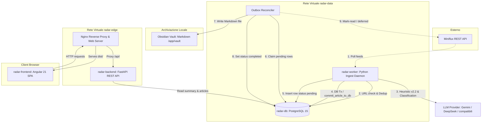
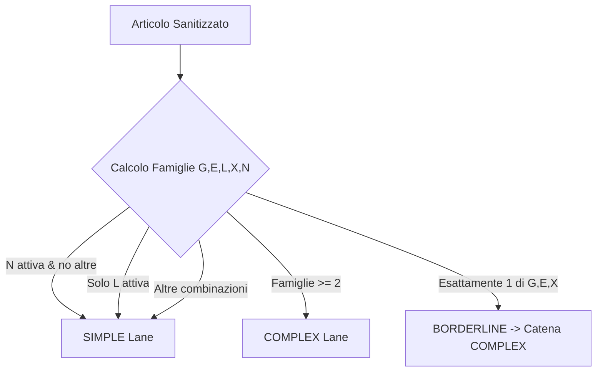
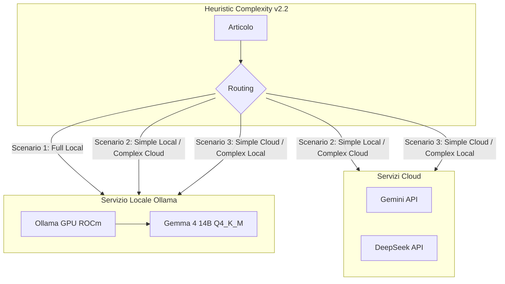
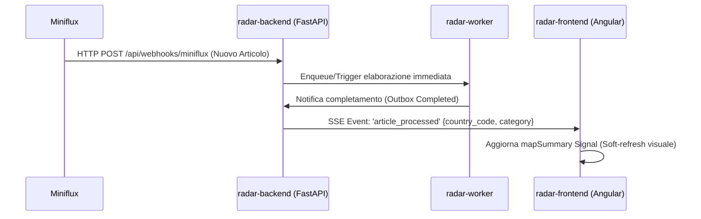

# Quadro Generale e Possibili Upgrade — Radar Informativo Globale

Questo documento offre una panoramica tecnica e architetturale dettagliata del sistema **Radar Informativo Globale** (Intelligence Dashboard), analizzando lo stato dello sviluppo (Phase 0–6 completate con **GATE VERDE** e test Final Release Gate superati) e definendo i **blueprint implementativi dettagliati** per i futuri upgrade del sistema.

---

## 1. Cos'è il Sistema (Panoramica Architetturale)

**Radar Informativo Globale** è un'applicazione web self-hosted, containerizzata e plug-and-play progettata per l'analisi e il monitoraggio geopolitico e strategico in stile "Palantir". Il sistema aggrega feed di notizie, le analizza semanticamente per estrarre informazioni strutturate e le mappa visivamente su un'interfaccia interattiva a scopi decisionali.

### Flusso Logico ed Interazione dei Componenti

Il diagramma seguente illustra l'architettura logica e l'interazione tra i moduli di ingestione, classificazione, persistenza e frontend:



---

## 2. Cosa è Stato Sviluppato (Stato Corrente AS-IS)

L'intero sistema è stato rilasciato in produzione superando con successo i requisiti del Final Release Gate (F1–F4). Di seguito viene analizzato il funzionamento in dettaglio di ciascuna componente.

### A. Backend (`radar/backend/`)

* **Separazione API/Worker:**
  * **FastAPI (`main.py`):** Processo leggero focalizzato a servire gli endpoint REST e i probe di monitoraggio. Non effettua attività di ingestione o chiamate LLM.
  * **Worker Daemon (`worker.py`):** Demone asincrono assecondato da un *advisory lock* PostgreSQL a livello di sessione per garantire lo scenario single-leader ed evitare la concorrenza tra più istanze. Gestisce la coda interna bounded di entry di Miniflux con semafori dedicati per le fasi di `PARSE` (concurrency 8), `DB` (concurrency 4) e `GEMINI` (concurrency 2).
* **Outbox Pattern per il Vault Obsidian:**
  L'ingestione e la scrittura nel Vault Obsidian sono disaccoppiate tramite l'Outbox Pattern.
  1. Durante la transazione DB, l'articolo viene salvato nella tabella `articles` e inserita una riga in `article_outbox` in stato `pending`.
  2. Un riconciliatore acquisisce la riga (`status = 'writing'`), valida il checksum SHA-256 del payload, scrive il file Markdown in `/app/vault` tramite scrittura atomica thread-safe e aggiorna lo stato a `completed`.
  3. Solo a questo punto l'articolo viene marcato come letto su Miniflux. In caso di fallimento della marcatura, la riga rimane non segnata (`miniflux_marked_at IS NULL`) e viene ritentata senza duplicare le chiamate LLM o la scrittura su disco.

### B. Database Schema (`radar-db`)

Il database PostgreSQL utilizza driver `asyncpg` asincroni puri senza ORM per massimizzare la velocità delle query e l'efficienza. Lo schema è composto da 7 tabelle principali con indici ottimizzati:

| Tabella | Colonne Principali | Ruolo / Indici |
|---------|--------------------|----------------|
| `articles` | `id`, `title`, `summary`, `published_at`, `source_url`, `country_code`, `latitude`, `longitude`, `primary_category`, `sentiment`, `relevance_level`, `is_read`, `is_saved`, `infrastructural_entities`, `feed_title` | Contiene gli articoli analizzati. Indici su `published_at DESC`, `(published_at, latitude, longitude)`, `(country_code, published_at DESC)`, e un indice parziale `WHERE is_saved` per il Vault. |
| `companies` | `id`, `name` | Anagrafica aziende. |
| `tags` | `id`, `name` | Anagrafica tag. |
| `article_companies` | `article_id`, `company_id` | Tabella junction articoli-aziende. |
| `article_tags` | `article_id`, `tag_id` | Tabella junction articoli-tag. |
| `article_outbox` | `id`, `article_id`, `target_path`, `payload`, `payload_checksum`, `status`, `attempt_count`, `last_error`, `miniflux_entry_id`, `miniflux_marked_at` | Coda outbox transazionale. Indice su `(status, updated_at ASC)`. |
| `llm_request_ledger` | `id`, `created_at`, `reserved_tokens`, `actual_tokens`, `status`, `model`, `purpose` | Tracciamento consumo token e quote LLM (durable quota ledger). |
| `llm_model_cooldown` | `provider`, `model`, `until_ts`, `reason`, `updated_at` | Tabella di cooldown per modelli malfunzionanti. Chiave primaria composta `(provider, model)`. |
| `worker_heartbeat` | `id`, `updated_at`, `status`, `leader_pid`, `detail` | Heartbeat singleton (id=1) scritto dal leader per verificare lo stato di readiness. |

### C. LLM Multi-Provider & Heuristic Complexity Routing v2.2

La configurazione del motore LLM supporta canali (Lanes) indipendenti per la classificazione:
* **SIMPLE Lane (`LLM_SIMPLE_*`):** Destinata a pezzi semplici, tipicamente appoggiata a modelli di base ed economici (es. `gemini-3.1-flash-lite`, `deepseek-v4-flash` con `effort=none`).
* **COMPLEX Lane (`LLM_COMPLEX_*`):** Destinata ad articoli complessi o escalation, tipicamente associata ad alta capacità di reasoning (es. `deepseek-v4-flash` con `effort=high`, `gemini-3.5-flash`).

L'algoritmo **Heuristic Complexity v2.2** determina la lane corretta analizzando il testo sanitizzato (titolo + body):

1. **Definizione delle Famiglie di Segnale:**
   * **G (Geo):** Presenza di $\ge 2$ nomi di paesi nel testo, oppure marker geografico specifico (es. *border*, *multilateral*, *NATO*) a condizione che il corpo sia lungo $\ge 1500$ caratteri.
   * **E (Entità):** Presenza di $\ge 3$ aziende identificate tramite suffissi societari standard (*Inc, Ltd, LLC, GmbH, SpA, AG*).
   * **L (Lunghezza):** Lunghezza del corpo $\ge 6000$ caratteri.
   * **X (Lingua):** Frazione di caratteri non-latini (cirillico, cinese, arabo) $\ge 15\%$ sui primi 4000 caratteri.
   * **N (Negativa):** Titolo $< 40$ caratteri, corpo $< 800$ caratteri e nessuna delle famiglie precedenti positiva (forza il pezzo alla lane SIMPLE).
2. **Algoritmo di Decisione:**
   * Se famiglia $N$ attiva e nessuna altra: `lane = SIMPLE`.
   * Se l'unica famiglia attiva è $L$: `lane = SIMPLE` (la sola lunghezza non rappresenta un rischio di rottura dello schema).
   * Se sono attive $\ge 2$ famiglie qualsiasi tra $\{G, E, L, X\}$: `lane = COMPLEX`.
   * Se è attiva esattamente 1 famiglia forte tra $\{G, E, X\}$: `lane = BORDERLINE` (che esegue la catena `LLM_COMPLEX` con effort high).
   * Altrimenti: `lane = SIMPLE`.



* **Gestione degli Errori e Cooldown 24h:**
  Se un provider restituisce un errore di tipo `HARD_COOLDOWN` (crediti esauriti 402, modello non trovato 404, rate limit giornaliero RPD esaurito, o 5xx persistente), il sistema inserisce il modello in `llm_model_cooldown` per 24 ore ed effettua un failover automatico (*residual cross-lane*) verso l'altro canale se configurato su provider/modelli distinti.

### D. Frontend (`radar/frontend/`)

* **Reattività Signals-first:**
  * `StateService` centralizza lo stato. Utilizza `rxResource` di Angular 21 per governare le risorse asincrone `mapSummaryResource` (day-view) e `savedSummaryResource` (articoli salvati nel Vault) basandosi sui filtri di ricerca.
  * Gli articoli visualizzati per nazione vengono paginati in modo incrementale dal server via keyset (`next_cursor`), evitando il caricamento in memoria dell'intero database.
* **Leaflet Safe per ESBuild:**
  * A causa delle incompatibilità UMD prodotte dai bundler moderni con `@angular/build:application` (ESBuild), Leaflet e il plugin `leaflet.markercluster` vengono caricati globalmente como script statici in `angular.json` e agganciati al componente mappa tramite `const L = (window as any).L`.
* **Visualizzazione Grafica Avanzata:**
  * **Hatching SVG:** Mappa corografica con tratteggi SVG dinamici calcolati client-side per evidenziare sovrapposizioni di categorie geopolitiche.
  * **Pin Conic-Gradient:** Un pin per nazione che visualizza la distribuzione percentuale delle 10 categorie in tempo reale.
  * **Spiderfy Custom:** I marker degli articoli all'interno del dettaglio nazione si dividono a raggiera mostrando l'icona emoji associata alla categoria dell'articolo attivo nel carosello.

---

## 3. Sviluppi Futuri e Upgrade (Blueprint Tecnici)

Di seguito vengono definiti i piani operativi per l'estensione del sistema. Ogni upgrade è corredato di dettagli architetturali, modifiche al codice e configurazioni.

---

### A. Configurazione Locale AMD GPU (Radeon RX 6750 XT 12GB) + LLM Lanes

L'obiettivo è abilitare l'elaborazione locale a costo zero sfruttando l'hardware a disposizione (GPU AMD Radeon RX 6750 XT 12GB su sistema Linux). Il modello di riferimento locale per questa configurazione è **Gemma 4 14B** (es. `gemma4:14b-instruct-q4_K_M` in Ollama). Un modello da 14B in quantizzazione 4-bit occupa circa 9.0–9.5 GB di VRAM, inserendosi perfettamente nel buffer di 12 GB della Radeon RX 6750 XT e lasciando circa 2–3 GB per il sistema operativo ed il contesto di elaborazione.

L'operatore può scegliere liberamente la topologia di deployment del modello locale e del routing delle chiamate LLM. Di seguito vengono analizzate le casistiche generali di configurazione.

#### 1. Architettura dei Canali e Servizio Locale

Ollama viene containerizzato con supporto ROCm nativo per l'accelerazione GPU AMD e configurato nella rete `radar-data` per dialogare con il worker. La flessibilità architetturale permette di distribuire il carico su quattro scenari principali:



#### 2. Modifiche a `docker-compose.yml`

Aggiungere il servizio `radar-ollama` integrando i driver video dell'host:

```yaml
  radar-ollama:
    image: ollama/ollama:rocm
    container_name: radar-ollama
    volumes:
      - ./data/ollama:/root/.ollama
    devices:
      - "/dev/kfd:/dev/kfd"
      - "/dev/dri:/dev/dri"
    environment:
      - HCC_AMDGPU_TARGET=gfx1030  # Architettura RDNA2 (RX 6700/6750 XT)
      - OLLAMA_NUM_PARALLEL=2
    networks:
      - radar-data
    restart: unless-stopped
```

#### 3. Generalizzazione Scenari di Deployment & Configurazione `.env`

Di seguito sono riportati i quattro profili operativi configurabili tramite il file `.env`.

##### Scenario 1: Modello Locale Unico per Entrambe le Lane (Full Local)
Ottimale per ambienti completamente isolati (*air-gapped*) o per azzerare i costi API cloud. Gemma 4 14B viene interrogato sia per gli articoli semplici che complessi. Il differenziale di accuratezza viene gestito tramite il payload o istruzioni differenziate (ad esempio, con la lane `COMPLEX` che può sfruttare temperature inferiori o vincoli di contesto più ampi).
* *Nota sulla VRAM:* Essendo caricato un solo modello, la VRAM occupata è stabile a ~9.5 GB.

```text
LLM_ROUTING_MODE=complexity
LLM_ROUTING_SHADOW=false

# SIMPLE Lane (Gemma 4 14B locale)
LLM_SIMPLE_PROVIDER=openai
LLM_SIMPLE_MODEL=gemma4:14b-instruct-q4_K_M
LLM_SIMPLE_API_KEY=local_dummy_key
LLM_SIMPLE_BASE_URL=http://radar-ollama:11434/v1
LLM_SIMPLE_RPM=0
LLM_SIMPLE_TPM=0
LLM_SIMPLE_RPD=0
LLM_SIMPLE_TIMEOUT=90
LLM_SIMPLE_REASONING_EFFORT=none

# COMPLEX Lane (Stesso modello Gemma 4 14B locale)
LLM_COMPLEX_PROVIDER=openai
LLM_COMPLEX_MODEL=gemma4:14b-instruct-q4_K_M
LLM_COMPLEX_API_KEY=local_dummy_key
LLM_COMPLEX_BASE_URL=http://radar-ollama:11434/v1
LLM_COMPLEX_RPM=0
LLM_COMPLEX_TPM=0
LLM_COMPLEX_RPD=0
LLM_COMPLEX_TIMEOUT=120
LLM_COMPLEX_REASONING_EFFORT=high
```

##### Scenario 2: Modello Locale per SIMPLE + Cloud per COMPLEX (Local-Hybrid Primary)
Configurazione standard consigliata. Il modello locale gestisce il bulk del traffico a costo zero (SIMPLE lane), mentre gli articoli che presentano rischi di estrazione dello schema (multi-paese, multi-entità) vengono scalati alle API Cloud (DeepSeek/Gemini) per garantire la massima fedeltà del JSON strict.

```text
LLM_ROUTING_MODE=complexity
LLM_ROUTING_SHADOW=false

# SIMPLE Lane (Gemma 4 14B locale)
LLM_SIMPLE_PROVIDER=openai
LLM_SIMPLE_MODEL=gemma4:14b-instruct-q4_K_M
LLM_SIMPLE_API_KEY=local_dummy_key
LLM_SIMPLE_BASE_URL=http://radar-ollama:11434/v1
LLM_SIMPLE_RPM=0
LLM_SIMPLE_TIMEOUT=90

# COMPLEX Lane (Cloud DeepSeek / Gemini)
LLM_COMPLEX_PROVIDER=deepseek
LLM_COMPLEX_MODEL=deepseek-v4-flash
LLM_COMPLEX_API_KEY=TUA_DEEPSEEK_API_KEY
LLM_COMPLEX_BASE_URL=https://api.deepseek.com
LLM_COMPLEX_REASONING_EFFORT=high
```

##### Scenario 3: Cloud per SIMPLE + Modello Locale per COMPLEX (Cloud-Hybrid Secondary)
Utile quando si vuole sfruttare la rapidità e il tier gratuito di Gemini (es. `gemini-3.1-flash-lite`) per il filtraggio e l'estrazione veloce di notizie generiche, riservando la GPU locale a modelli complessi ad alta densità per elaborazioni batch isolate sulla lane `COMPLEX`, preservando i budget delle API a consumo su testi pesanti.

```text
LLM_ROUTING_MODE=complexity
LLM_ROUTING_SHADOW=false

# SIMPLE Lane (Gemini Studio Free Tier)
LLM_SIMPLE_PROVIDER=gemini
LLM_SIMPLE_MODEL=gemini-3.1-flash-lite
LLM_SIMPLE_API_KEY=TUA_GEMINI_API_KEY
LLM_SIMPLE_RPM=10
LLM_SIMPLE_RPD=1000

# COMPLEX Lane (Gemma 4 14B locale)
LLM_COMPLEX_PROVIDER=openai
LLM_COMPLEX_MODEL=gemma4:14b-instruct-q4_K_M
LLM_COMPLEX_API_KEY=local_dummy_key
LLM_COMPLEX_BASE_URL=http://radar-ollama:11434/v1
LLM_COMPLEX_RPM=0
LLM_COMPLEX_TIMEOUT=120
LLM_COMPLEX_REASONING_EFFORT=high
```

##### Scenario 4: Modelli Locali Distinti per Lane (Dual Local Models)
L'operatore carica due modelli separati su Ollama (es. `qwen2.5:3b-instruct` per la lane SIMPLE e `gemma4:14b-instruct-q4_K_M` per la lane COMPLEX).
* *⚠️ Attenzione critica sulla VRAM:* L'esecuzione simultanea di due modelli supera facilmente la soglia fisica di 12 GB. Quando la GPU si satura, Ollama esegue un fallback parziale sulla RAM dell'host (*CPU offloading*), rallentando drasticamente la velocità di generazione dei token (da ~40 token/s a <5 token/s). Per evitare questo comportamento degradato, si suggerisce di impostare i tempi di timeout a livello di container ed evitare l'uso di questo scenario su GPU con meno di 16–24 GB di VRAM.

```text
LLM_ROUTING_MODE=complexity
LLM_ROUTING_SHADOW=false

# SIMPLE Lane (Modello leggero locale 3B)
LLM_SIMPLE_PROVIDER=openai
LLM_SIMPLE_MODEL=qwen2.5:3b-instruct
LLM_SIMPLE_API_KEY=local_dummy_key
LLM_SIMPLE_BASE_URL=http://radar-ollama:11434/v1
LLM_SIMPLE_RPM=0
LLM_SIMPLE_TIMEOUT=45

# COMPLEX Lane (Gemma 4 14B locale)
LLM_COMPLEX_PROVIDER=openai
LLM_COMPLEX_MODEL=gemma4:14b-instruct-q4_K_M
LLM_COMPLEX_API_KEY=local_dummy_key
LLM_COMPLEX_BASE_URL=http://radar-ollama:11434/v1
LLM_COMPLEX_RPM=0
LLM_COMPLEX_TIMEOUT=120
```

---

### B. Ingestione Real-Time e Soft Refresh Frontend (SSE / Webhooks)

Sostituire il meccanismo di polling asincrono periodico del worker con un'ingestione real-time reattiva. Miniflux invierà un webhook a FastAPI non appena un articolo viene inserito; a sua volta, il backend notificherà il frontend tramite Server-Sent Events (SSE) per aggiornare la mappa senza ricaricare la pagina.

#### 1. Flusso di Messaggistica Real-Time



#### 2. Implementazione del Webhook in FastAPI (`main.py`)

Creazione di una rotta protetta per ricevere la segnalazione di Miniflux:

```python
from fastapi import Header, BackgroundTasks

@app.post("/api/webhooks/miniflux")
async def miniflux_webhook(
    payload: dict,
    x_miniflux_signature: str = Header(None),
    background_tasks: BackgroundTasks = None
):
    # Validazione opzionale della signature per sicurezza
    # Accoda la richiesta di elaborazione al worker
    if payload.get("event_type") == "entry.created":
        entry_id = payload["event_data"]["entry"]["id"]
        background_tasks.add_task(trigger_worker_ingest, entry_id)
    return {"status": "accepted"}
```

#### 3. Implementazione dell'Endpoint SSE in FastAPI (`main.py`)

Utilizzo di `EventSource` per mantenere canali di notifica aperti con i client Angular:

```python
import asyncio
from sse_starlette.sse import EventPublisher, EventSourceResponse

# Coda globale in-memory per le notifiche SSE
sse_publisher = EventPublisher()

@app.get("/api/articles/events")
async def sse_events():
    async def event_generator():
        async for event in sse_publisher.subscribe():
            yield {"event": "article_processed", "data": event}
    return EventSourceResponse(event_generator())
```

#### 4. Frontend Angular: Integrazione in `state.service.ts`

Aggancio a `EventSource` all'avvio dell'applicazione per aggiornare reattivamente i Signals del `rxResource`:

```typescript
import { Injectable, NgZone } from '@angular/core';

@Injectable({ providedIn: 'root' })
export class RealTimeStateService {
  private eventSource?: EventSource;

  constructor(private zone: NgZone) {
    this.initRealTimeConnection();
  }

  private initRealTimeConnection(): void {
    this.eventSource = new EventSource('/api/articles/events');
    this.eventSource.addEventListener('article_processed', (event: any) => {
      this.zone.run(() => {
        const data = JSON.parse(event.data);
        console.log('Nuovo articolo elaborato in tempo reale:', data);
        // Forza l'aggiornamento parziale delle risorse del StateService
        // Ricarica la mapSummaryResource preservando lo stato corrente
        this.mapSummaryResource.reload();
      });
    });
  }
}
```

---

### C. Deduplicazione Semantica tramite Embeddings (`pgvector`)

Invece di limitarsi a una deduplica basata sull'URL esatto (inadeguata se feed diversi pubblicano lo stesso articolo con domini o parametri UTM differenti), l'introduzione di `pgvector` consente di calcolare un embedding del titolo o del sommario per rilevare la similarità semantica prima di invocare il processo di classificazione LLM.

#### 1. Modifiche al Database: Script di Migrazione (`011_pgvector_dedup.sql`)

```sql
-- Abilita l'estensione pgvector nel database PostgreSQL
CREATE EXTENSION IF NOT EXISTS vector;

-- Tabella per ospitare gli embedding calcolati
CREATE TABLE IF NOT EXISTS article_embeddings (
    article_id INTEGER NOT NULL PRIMARY KEY REFERENCES articles(id) ON DELETE CASCADE,
    embedding vector(384) NOT NULL, -- Dimensione tipica per modelli leggeri come all-MiniLM-L6-v2
    created_at TIMESTAMPTZ NOT NULL DEFAULT NOW()
);

-- Indice HNSW per la ricerca di similarità coseno veloce
CREATE INDEX ON article_embeddings USING hnsw (embedding vector_cosine_ops);
```

#### 2. Modifiche al Worker (`worker.py` / `dedup.py`)

Prima di inoltrare il testo dell'articolo all'LLM, viene calcolato l'embedding locale e confrontato con quelli storici delle ultime 48 ore tramite distanza coseno.

* **Modello locale suggerito:** `all-MiniLM-L6-v2` o `bge-small-en-v1.5` gestito localmente in Python tramite la libreria `sentence-transformers` (consumo minimo CPU/VRAM) o tramite chiamata embeddings di Ollama.

```python
import numpy as np
from sentence_transformers import SentenceTransformer

# Inizializzazione modello locale
embed_model = SentenceTransformer("all-MiniLM-L6-v2")

async def get_semantic_duplicate(
    conn: asyncpg.Connection,
    title: str,
    threshold: float = 0.85
) -> int | None:
    """Verifica la similarità semantica del titolo contro il DB.
    
    Ritorna l'id dell'articolo simile se la similarità supera la soglia, altrimenti None.
    """
    # Calcolo embedding del titolo
    embedding = embed_model.encode(title).tolist()
    
    # Ricerca coseno in SQL (distanza coseno <= 0.15 equivale a similarità >= 85%)
    row = await conn.fetchrow(
        """
        SELECT article_id, (embedding <=> $1) as distance
        FROM article_embeddings
        WHERE created_at >= NOW() - INTERVAL '48 hours'
        ORDER BY distance ASC
        LIMIT 1
        """,
        embedding
    )
    
    if row and row["distance"] <= (1.0 - threshold):
        return row["article_id"]
    return None
```

#### 3. Logica di Commit nel Database

Quando l'articolo supera i controlli e viene elaborato, il suo embedding viene memorizzato per future dedupliche:

```python
async def commit_embedding(conn: asyncpg.Connection, article_id: int, title: str):
    embedding = embed_model.encode(title).tolist()
    await conn.execute(
        """
        INSERT INTO article_embeddings (article_id, embedding)
        VALUES ($1, $2)
        ON CONFLICT (article_id) DO NOTHING
        """,
        article_id,
        embedding
    )
```

---

### D. Mappe Offline in Ambienti Isolati (Air-Gapped)

Negli scenari operativi privi di connessione Internet (es. reti intranet locali o installazioni fisicamente isolate), il browser non può scaricare le mappe (tiles) geografiche dai server CDN esterni (CartoDB/OpenStreetMap). È necessario integrare un server di tile offline all'interno dello stack Docker.

```mermaid
flowchart TD
  Client[Browser FE] -->|1. Richiesta /tiles/{z}/{x}/{y}.png| Nginx[Nginx Reverse Proxy]
  Nginx -->|2. Inoltro locale| TileServer[radar-tileserver: klokantech/tileserver-gl]
  TileServer -->|3. Query geografica| MBTiles[(world.mbtiles: 3GB)]
```

#### 1. Aggiunta del Tile Server in `docker-compose.yml`

Ospitare un file `.mbtiles` compresso del globo terrestre (scaricato in fase di installazione) e servirlo localmente:

```yaml
  radar-tileserver:
    image: klokantech/tileserver-gl
    container_name: radar-tileserver
    volumes:
      - ./data/tiles:/data
    command: ["--mbtiles", "world.mbtiles", "--port", "8080"]
    networks:
      - radar-data
    restart: unless-stopped
```

#### 2. Configurazione Nginx (`nginx.conf`)

Configurare il proxy locale per servire le immagini della mappa in modo trasparente sulla stessa origine del frontend:

```nginx
location /tiles/ {
    resolver 127.0.0.11 valid=10s;
    set $tiles_upstream http://radar-tileserver:8080;
    proxy_pass $tiles_upstream;
    proxy_cache_valid 200 302 7d;
    expires 7d;
    add_header Cache-Control "public, no-transform";
}
```

#### 3. Configurazione Leaflet (`radar-map.component.ts`)

Configurare il caricamento delle tiles dal percorso relativo `/tiles/` locale dell'applicazione:

```diff
-const tileLayerUrl = 'https://{s}.basemaps.cartocdn.com/dark_all/{z}/{x}/{y}{r}.png';
+const tileLayerUrl = '/tiles/styles/dark-matter/{z}/{x}/{y}.png';
```

---

### G. Obsidian Vault: Collegamenti Bidirezionali (Wiki-Links)

Per sfruttare appieno la visualizzazione a grafo e l'interconnessione concettuale all'interno di Obsidian, la generazione del Markdown deve incorporare la sintassi Wiki-Link (`[[Entità]]`) per le aziende coinvolte e i tag geografici o categoriali.

#### 1. Blueprint per `factory.py` (`generate_markdown_content`)

Modificare la generazione del testo in modo da racchiudere le entità estratte in doppie parentesi quadre:

```python
def generate_markdown_content(article: GeopoliticalArticleSchema) -> str:
    tags_list = parse_csv_list(article.tags)
    companies_list = parse_csv_list(article.companies_involved)
    entities_list = parse_csv_list(article.infrastructural_entities)

    summary = _truncate_text(article.summary, MAX_SUMMARY_CHARS, "summary")

    # Genera collegamenti bidirezionali sulle aziende
    if companies_list:
        companies_wiki = ", ".join(f"[[{c.strip()}]]" for c in companies_list if c.strip())
    else:
        companies_wiki = "Nessuna"

    # Genera collegamenti bidirezionali sugli asset fisici
    if entities_list:
        entities_markdown = "\n".join(f"- [[{entity.strip()}]]" for entity in entities_list if entity.strip())
    else:
        entities_markdown = "- Nessun asset fisico specifico menzionato."

    entities_markdown = _truncate_text(entities_markdown, MAX_ENTITIES_FIELD_CHARS, "entità")

    # Iniezione dei metadata di raccordo in fondo al file
    wiki_footer = (
        f"\n\n---\n"
        f"**Raccordo Relazionale:**\n"
        f"- Nazione: [[{article.country_code}]]\n"
        f"- Categoria Geopolitica: [[{article.primary_category}]]\n"
        f"- Aziende: {companies_wiki}\n"
    )

    body = (
        f"# Riassunto\n\n{summary}\n\n"
        f"# Entità Infrastrutturali\n\n{entities_markdown}"
        f"{wiki_footer}"
    )

    if len(body) > MAX_MARKDOWN_BODY_CHARS:
        body = _truncate_text(body, MAX_MARKDOWN_BODY_CHARS, "corpo Markdown")

    frontmatter_yaml = _dump_frontmatter({
        "title": article.title,
        "location": [article.latitude, article.longitude],
        "country": article.country_code,
        "category": article.primary_category,
        "tags": tags_list,
        "companies": companies_list,
        "sentiment": article.sentiment,
        "relevance": article.relevance_level,
        "published": article.published_at,
        "source": article.source_url,
    })

    return f"---\n{frontmatter_yaml}\n---\n\n{body}"
```

---

### H. Visualizzazione a Grafo Geospaziale (Relazioni sulla Mappa)

Questo modulo permette di tracciare visivamente le relazioni bilaterali e multilaterali (es. un trattato commerciale tra Italia e Cina, o un attacco informatico russo verso gli Stati Uniti) disegnando archi di connessione dinamici tra i centroidi dei rispettivi paesi direttamente sulla mappa Leaflet.

```text
                     [Arco Curvo Dinamico]
        (Paese A: Centroide) ~~~~~~~~~~~~~~> (Paese B: Centroide)
                 [Colore = Categoria Geopolitica]
                 [Spessore = Volume Articoli del Giorno]
```

#### 1. Modello Dati e Migrazione del Database (`011_articles_related_countries.sql`)

Nel database, la colonna `related_countries TEXT[]` contiene l'elenco dei codici ISO Alpha-2 dei paesi secondari coinvolti nell'articolo:

```sql
ALTER TABLE articles
  ADD COLUMN IF NOT EXISTS related_countries TEXT[] NOT NULL DEFAULT '{}';

COMMENT ON COLUMN articles.related_countries IS
  'ISO Alpha-2 secondari (escluso country_code e XX); vuoto = nessun arco';
```

Il prompt del LLM ed il validatore normalizzano e filtrano i codici per assicurare che:
- Non sia duplicato il codice primario (`country_code`).
- Sia esclusa la sigla fittizia `XX` o codici non appartenenti allo standard ISO Alpha-2.
- Siano limitati a un massimo di 5 paesi secondari per articolo.

#### 2. Query di Estrazione Relazioni (`articles_query.py`)

A livello di database, la query estrae le relazioni bilaterali aggregando gli articoli del giorno per categoria e coppia di paesi. Le coppie sono ordinate alfabeticamente (`LEAST` e `GREATEST`) per garantire archi non orientati univoci:

```sql
SELECT
  LEAST(a.country_code, r.related) AS source_country,
  GREATEST(a.country_code, r.related) AS target_country,
  a.primary_category,
  COUNT(*)::int AS volume
FROM articles a
CROSS JOIN LATERAL unnest(a.related_countries) AS r(related)
WHERE a.published_at = $1
  AND a.country_code <> 'XX'
  AND r.related <> 'XX'
  AND r.related <> a.country_code
GROUP BY 1, 2, 3
ORDER BY volume DESC, source_country, target_country;
```

#### 3. Endpoint API (`GET /api/map-relations`)

L'endpoint `GET /api/map-relations?date=YYYY-MM-DD` restituisce un payload JSON strutturato:

```json
[
  {
    "source_country": "AZ",
    "target_country": "IT",
    "primary_category": "Energia",
    "volume": 2
  }
]
```

#### 4. Integrazione Frontend in Leaflet (`radar-map.component.ts`)

Il frontend recupera le relazioni tramite `ArticleService` e le inserisce in `StateService.mapRelationsResource`. Al riceversi di un SSE `article_processed`, viene eseguito un soft-refresh della risorsa.
Le relazioni sono disegnate sotto forma di polilinee con interpolazione quadratica di Bezier per generare una curva fluida:

```typescript
private drawGeospatialRelations(relations: MapRelationRow[]): void {
  if (!this.relationsLayerGroup || !this.L) return;
  this.relationsLayerGroup.clearLayers();

  for (const r of relations) {
    const p0 = this.getCountryCentroid(r.source_country);
    const p2 = this.getCountryCentroid(r.target_country);
    if (!p0 || !p2) continue;

    // Generazione punti curva Bezier quadratica
    const points: Leaflet.LatLng[] = [];
    const steps = 30;
    const lat0 = p0.lat;
    const lng0 = p0.lng;
    const lat2 = p2.lat;
    const lng2 = p2.lng;

    const midLat = (lat0 + lat2) / 2;
    const midLng = (lng0 + lng2) / 2;

    const dLat = lat2 - lat0;
    const dLng = lng2 - lng0;

    // Deviazione perpendicolare proporzionale alla distanza
    const curvature = 0.2;
    const p1Lat = midLat - dLng * curvature;
    const p1Lng = midLng + dLat * curvature;

    for (let i = 0; i <= steps; i++) {
      const t = i / steps;
      const lat = (1 - t) * (1 - t) * lat0 + 2 * (1 - t) * t * p1Lat + t * t * lat2;
      const lng = (1 - t) * (1 - t) * lng0 + 2 * (1 - t) * t * p1Lng + t * t * lng2;
      points.push(this.L.latLng(lat, lng));
    }

    const colorVar = this.CATEGORY_CSS_VARS[r.primary_category] || '--color-text-accent';
    const docStyle = getComputedStyle(document.documentElement);
    const color = docStyle.getPropertyValue(colorVar).trim() || '#58a6ff';
    const weight = Math.min(6, 1 + r.volume * 0.5);

    const polyline = this.L.polyline(points, {
      color,
      weight,
      opacity: 0.8,
      className: 'relational-arc-flow',
      interactive: true,
    });

    const tooltipText = `${r.source_country} ↔ ${r.target_country} · ${r.primary_category} · n=${r.volume}`;
    polyline.bindTooltip(tooltipText, { sticky: true });

    this.relationsLayerGroup.addLayer(polyline);
  }
}
```

La visibilità degli archi è governata a seconda dello stato di zoom:
- Visibili in modalità "Day View" a livelli di zoom `>= 5`.
- Nascosti a livelli di zoom `< 5` o quando si apre il dettaglio di una singola nazione.

#### 5. Visualizzazione nel Carosello e Sidebar

Le card degli articoli includono una sezione dedicata "🌐 Paesi correlati" posizionata dopo "Aziende" e prima di "Tag", che visualizza i codici ISO normalizzati traducendoli nei nomi reali in lingua italiana (utilizzando `Intl.DisplayNames`) tramite chip display-only `.related-chip`:

```html
<div class="badge-section" *ngIf="article()?.related_countries?.length">
  <span class="badge-label">🌐 Paesi correlati</span>
  <div class="badge-list">
    <p-chip
      *ngFor="let iso of article()?.related_countries"
      [label]="getCountryName(iso)"
      styleClass="radar-chip related-chip">
    </p-chip>
  </div>
</div>
```

#### 6. Styling CSS dell'Arco Animato (`radar-map.component.scss`)

Il movimento tratteggiato dell'arco viene realizzato tramite animazione delle proprietà SVG `stroke-dasharray` e `stroke-dashoffset` per creare un flusso continuo:

```scss
.relational-arc-flow {
  stroke-dasharray: 8, 12;
  animation: relational-dash 20s linear infinite;
}

@keyframes relational-dash {
  to {
    stroke-dashoffset: -1000;
  }
}
```
