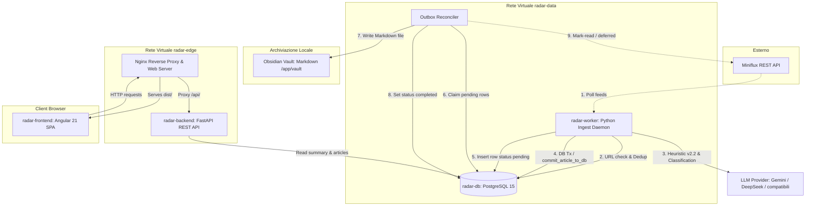
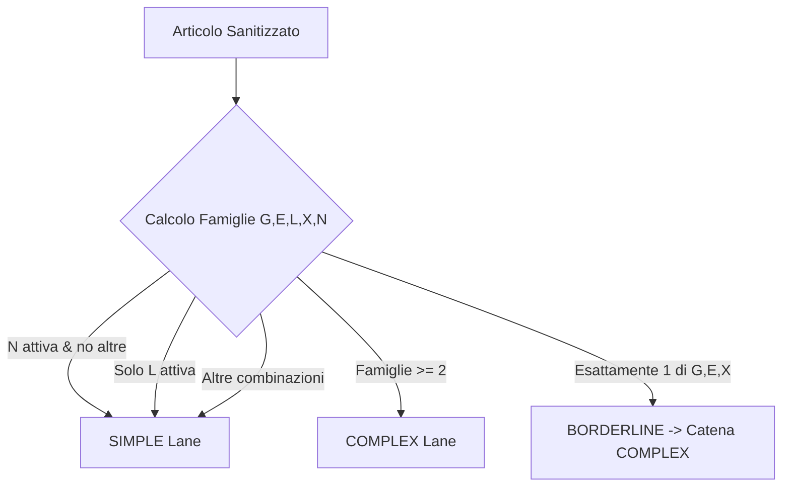
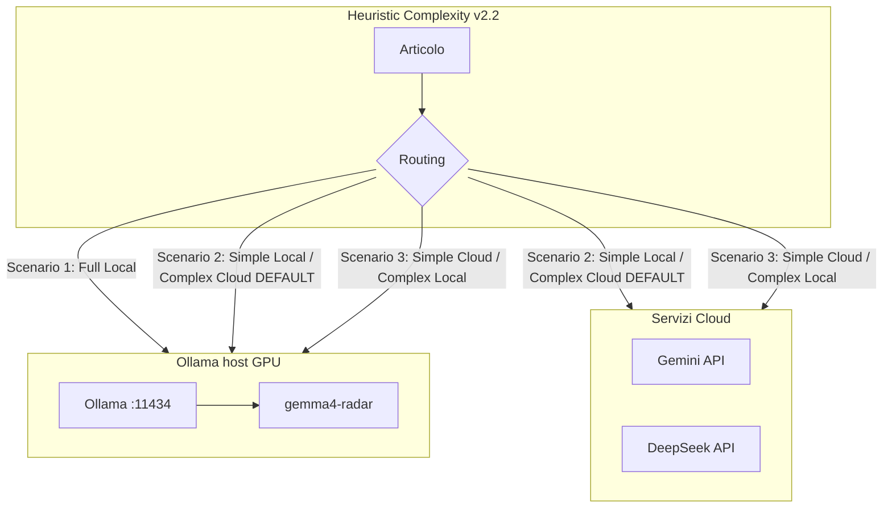
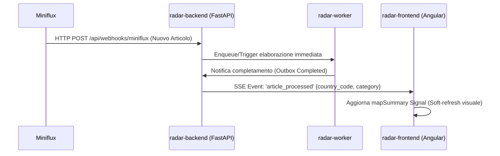
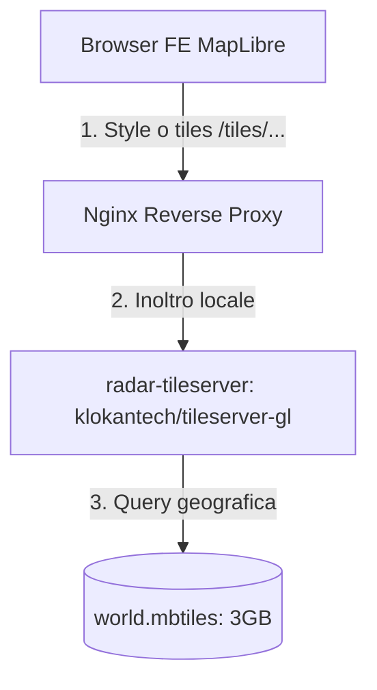
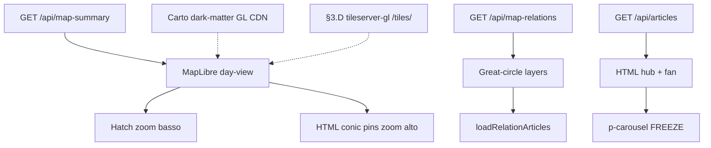

# Quadro Generale e Possibili Upgrade — Radar Informativo Globale

Questo documento offre una panoramica tecnica e architetturale dettagliata del sistema **Radar Informativo Globale** (Intelligence Dashboard), analizzando lo stato dello sviluppo (Phase 0–6 completate con **GATE VERDE** e test Final Release Gate superati) e definendo i **blueprint implementativi dettagliati** per i futuri upgrade del sistema.

---

## 1. Cos'è il Sistema (Panoramica Architetturale)

**Radar Informativo Globale** è un'applicazione web self-hosted, containerizzata e plug-and-play progettata per l'analisi e il monitoraggio geopolitico e strategico in stile "Palantir". Il sistema aggrega feed di notizie, le analizza semanticamente per estrarre informazioni strutturate e le mappa visivamente su un'interfaccia interattiva a scopi decisionali.

### Flusso Logico ed Interazione dei Componenti

Il diagramma seguente illustra l'architettura logica e l'interazione tra i moduli di ingestione, classificazione, persistenza e frontend:



---

## 2. Cosa è Stato Sviluppato (Stato Corrente AS-IS)

L'intero sistema è stato rilasciato in produzione superando con successo i requisiti del Final Release Gate (F1–F4). Di seguito viene analizzato il funzionamento in dettaglio di ciascuna componente.

### A. Backend (`radar/backend/`)

* **Separazione API/Worker:**
  * **FastAPI (`main.py`):** Processo leggero focalizzato a servire gli endpoint REST e i probe di monitoraggio. Non effettua attività di ingestione o chiamate LLM.
  * **Worker Daemon (`worker.py`):** Demone asincrono assecondato da un *advisory lock* PostgreSQL a livello di sessione per garantire lo scenario single-leader ed evitare la concorrenza tra più istanze. Gestisce la coda interna bounded di entry di Miniflux con semafori dedicati per le fasi di `PARSE` (concurrency 8), `DB` (concurrency 4) e `GEMINI` (concurrency 2).
* **Outbox Pattern per il Vault Obsidian:**
  L'ingestione e la scrittura nel Vault Obsidian sono disaccoppiate tramite l'Outbox Pattern.
  1. Durante la transazione DB, l'articolo viene salvato nella tabella `articles` e inserita una riga in `article_outbox` in stato `pending`.
  2. Un riconciliatore acquisisce la riga (`status = 'writing'`), valida il checksum SHA-256 del payload, scrive il file Markdown in `/app/vault` tramite scrittura atomica thread-safe e aggiorna lo stato a `completed`.
  3. Solo a questo punto l'articolo viene marcato come letto su Miniflux. In caso di fallimento della marcatura, la riga rimane non segnata (`miniflux_marked_at IS NULL`) e viene ritentata senza duplicare le chiamate LLM o la scrittura su disco.

### B. Database Schema (`radar-db`)

Il database PostgreSQL utilizza driver `asyncpg` asincroni puri senza ORM per massimizzare la velocità delle query e l'efficienza. Lo schema è composto da 7 tabelle principali con indici ottimizzati:

| Tabella | Colonne Principali | Ruolo / Indici |
|---------|--------------------|----------------|
| `articles` | `id`, `title`, `summary`, `published_at`, `source_url`, `country_code`, `latitude`, `longitude`, `primary_category`, `sentiment`, `relevance_level`, `is_read`, `is_saved`, `infrastructural_entities`, `feed_title` | Contiene gli articoli analizzati. Indici su `published_at DESC`, `(published_at, latitude, longitude)`, `(country_code, published_at DESC)`, e un indice parziale `WHERE is_saved` per il Vault. |
| `companies` | `id`, `name` | Anagrafica aziende. |
| `tags` | `id`, `name` | Anagrafica tag. |
| `article_companies` | `article_id`, `company_id` | Tabella junction articoli-aziende. |
| `article_tags` | `article_id`, `tag_id` | Tabella junction articoli-tag. |
| `article_outbox` | `id`, `article_id`, `target_path`, `payload`, `payload_checksum`, `status`, `attempt_count`, `last_error`, `miniflux_entry_id`, `miniflux_marked_at` | Coda outbox transazionale. Indice su `(status, updated_at ASC)`. |
| `llm_request_ledger` | `id`, `created_at`, `reserved_tokens`, `actual_tokens`, `status`, `model`, `purpose` | Tracciamento consumo token e quote LLM (durable quota ledger). |
| `llm_model_cooldown` | `provider`, `model`, `until_ts`, `reason`, `updated_at` | Tabella di cooldown per modelli malfunzionanti. Chiave primaria composta `(provider, model)`. |
| `worker_heartbeat` | `id`, `updated_at`, `status`, `leader_pid`, `detail` | Heartbeat singleton (id=1) scritto dal leader per verificare lo stato di readiness. |

### C. LLM Multi-Provider & Heuristic Complexity Routing v2.2

La configurazione del motore LLM supporta canali (Lanes) indipendenti per la classificazione:
* **SIMPLE Lane (`LLM_SIMPLE_*`):** Destinata a pezzi semplici, tipicamente appoggiata a modelli di base ed economici (es. Profilo A: `gemini-3.5-flash-lite` con L1 `gemini-3.1-flash-lite`; altri: `deepseek-v4-flash` con `effort=none`).
* **COMPLEX Lane (`LLM_COMPLEX_*`):** Destinata ad articoli complessi o escalation, tipicamente associata ad alta capacità di reasoning (es. `deepseek-v4-flash` con `effort=high`, `gemini-3.5-flash`).

L'algoritmo **Heuristic Complexity v2.2** determina la lane corretta analizzando il testo sanitizzato (titolo + body):

1. **Definizione delle Famiglie di Segnale:**
   * **G (Geo):** Presenza di $\ge 2$ nomi di paesi nel testo, oppure marker geografico specifico (es. *border*, *multilateral*, *NATO*) a condizione che il corpo sia lungo $\ge 1500$ caratteri.
   * **E (Entità):** Presenza di $\ge 3$ aziende identificate tramite suffissi societari standard (*Inc, Ltd, LLC, GmbH, SpA, AG*).
   * **L (Lunghezza):** Lunghezza del corpo $\ge 6000$ caratteri.
   * **X (Lingua):** Frazione di caratteri non-latini (cirillico, cinese, arabo) $\ge 15\%$ sui primi 4000 caratteri.
   * **N (Negativa):** Titolo $< 40$ caratteri, corpo $< 800$ caratteri e nessuna delle famiglie precedenti positiva (forza il pezzo alla lane SIMPLE).
2. **Algoritmo di Decisione:**
   * Se famiglia $N$ attiva e nessuna altra: `lane = SIMPLE`.
   * Se l'unica famiglia attiva è $L$: `lane = SIMPLE` (la sola lunghezza non rappresenta un rischio di rottura dello schema).
   * Se sono attive $\ge 2$ famiglie qualsiasi tra $\{G, E, L, X\}$: `lane = COMPLEX`.
   * Se è attiva esattamente 1 famiglia forte tra $\{G, E, X\}$: `lane = BORDERLINE` (che esegue la catena `LLM_COMPLEX` con effort da `LLM_BORDERLINE_REASONING_EFFORT`, default `high`, target ops `none`).
   * Altrimenti: `lane = SIMPLE`.



* **Gestione degli Errori e Cooldown 24h:**
  Se un provider restituisce un errore di tipo `HARD_COOLDOWN` (crediti esauriti 402, modello non trovato 404, rate limit giornaliero RPD esaurito, o 5xx persistente), il sistema inserisce il modello in `llm_model_cooldown` per 24 ore ed effettua un failover automatico (*residual cross-lane*) verso l'altro canale se configurato su provider/modelli distinti.

### D. Frontend (`radar/frontend/`)

* **MapLibre 3D-primary (Fase I):**
  * Renderer default WebGL via `maplibre-gl` (globe; contingency mercator+pitch). Facade `app-radar-map` + host `maplibre/`; Leaflet AS-IS congelato in `leaflet/` (`MAP_RENDERER=leaflet` ops).
  * Hatching / pin conic HTML / archi great-circle / hub+spiderfy custom (no MarkerCluster sul path 3D). `map.resize()` al posto di Leaflet `invalidateSize`.
  * Follow-up globo raffinato: §3.J / [`plan_impl_map_globe_projection.md`](plan-audit/active/plan_impl_map_globe_projection.md).
* **Reattività Signals-first:**
  * `StateService` centralizza lo stato. Utilizza `rxResource` di Angular 21 per governare le risorse asincrone `mapSummaryResource` (day-view) e `savedSummaryResource` (articoli salvati nel Vault) basandosi sui filtri di ricerca.
  * Gli articoli visualizzati per nazione vengono paginati in modo incrementale dal server via keyset (`next_cursor`), evitando il caricamento in memoria dell'intero database.
* **Leaflet legacy (dormiente):**
  * Path 2D conservato per rollback / futuro switch UX. Caricato solo se `MAP_RENDERER=leaflet` (`window.__RADAR_MAP_RENDERER__` o `localStorage radar.mapRenderer`). Script globali `angular.json` `scripts[]` + `window.L` restano per quel host.
* **Visualizzazione Grafica Avanzata:**
  * **Hatching (MapLibre):** fasce soft O→E (1 colore × tipologia da `map-summary`); mainland US/RU; isole significative ≥0.5% area largest; clip terra∩strip via `polygon-clipping` (no fill in mare). Helper `maplibre/country-category-fills.ts`. Leaflet legacy: SVG combo.
  * **Pin Conic-Gradient:** un pin per nazione (HTML Marker) con distribuzione % delle **15** categorie.
  * **Spiderfy Custom:** hub + fan emoji per categoria attiva nel carosello (parity path MapLibre senza MarkerCluster).

---

## 3. Upgrade e Blueprint Tecnici

Sezioni sotto = blueprint (architettura + ricette). Stato prodotto aggiornato **2026-07-21**:

| Sezione | Tema | Stato |
|---------|------|--------|
| **A** | LLM locale AMD / Ollama (Profilo F) | **DONE** — core `54c8038`, VRAM `2996625`; scorecard fixture **opz.** |
| **B** | Real-time webhook / SSE / soft-refresh | **DONE / GATE VERDE** (2026-07-18) |
| **C** | Dedup semantica `pgvector` | **DONE / GATE VERDE** — SoT [`plan-audit/complete/plan_impl_fase_C_semantic_dedup.md`](plan-audit/complete/plan_impl_fase_C_semantic_dedup.md) |
| **D** | Mappe offline air-gapped | **Futuro** — target FE = MapLibre `style` → `/tiles/` (non solo Leaflet PNG) |
| **G** | Obsidian wiki-links bidirezionali | **DONE / GATE VERDE** (2026-07-27) — `[[wiki-link]]` + hub `_meta/` (Radar→Vault; no sync Obsidian→DB) |
| **H** | Grafo geospaziale / archi mappa | **DONE / GATE VERDE** (2026-07-18) |
| **I** | Mappa 3D-primary MapLibre (parity; Leaflet dormiente) | **DONE** (2026-07-20) — SoT [`plan-audit/active/plan_impl_map_3d_globe.md`](plan-audit/active/plan_impl_map_3d_globe.md); follow-up hatching isole/anti-bleed **GATE VERDE** 2026-07-21 ([`plan_impl_map_category_fills_islands.md`](plan-audit/complete/plan_impl_map_category_fills_islands.md)) |
| **J** | Upgrade proiezione globo vero (follow-up I) | **Futuro** — SoT [`plan-audit/active/plan_impl_map_globe_projection.md`](plan-audit/active/plan_impl_map_globe_projection.md) |

Quadro vivo: [`plan-audit/STATUS.md`](plan-audit/STATUS.md). Topologie lane env: [`plan-audit/complete/audit_llm_lane_env_generalization.md`](plan-audit/complete/audit_llm_lane_env_generalization.md).

---

### A. Configurazione Locale AMD GPU (Radeon RX 6750 XT 12GB) + LLM Lanes

> **Stato: DONE (2026-07-19).** Profilo F Local-Hybrid shipped; unload VRAM idle shipped. Residuo non bloccante: scorecard fixture formale opzionale. Ops corrente tipico può essere **Profilo A** (Gemini Flash Lite + DeepSeek) o **F** (Ollama + DeepSeek) — solo `.env` (+ overlay ollama-host per F).

L'obiettivo (raggiunto) è abilitare l'elaborazione locale a costo zero sulla GPU AMD Radeon RX 6750 XT (Navi 22 / **gfx1030**, 12 GB VRAM).

**Modello di riferimento (tag Ollama reali):** base `gemma4:12b` (~7.6 GB); **ops Profilo F tipico = `gemma4-radar`** (Modelfile `FROM gemma4:12b` + `PARAMETER num_ctx 8192`, lascia headroom VRAM su 12 GB).  
**Nota naming:** non esiste un tag Ollama `gemma4:14b` / `gemma4:14b-instruct-q4_K_M`; le workstation tag pubbliche sono `gemma4:12b`, `gemma4:26b` (~18 GB, troppo grande per full-GPU su 12 GB), `gemma4:31b`. Alternative ≤12 GB: `qwen3:14b` (~9.3 GB).

**Integrazione vincolante:** nessun SDK `ollama` / `ollama.chat`. Il worker parla a Ollama solo via **HTTP OpenAI-compat** già nel client (`PROVIDER=openai` + `BASE_URL=…/v1` via httpx; dialect stock; package `openai` vietato). Client: `think=true`, `num_ctx/num_predict=8192`, `normalize_llm_json_dict`, **no SIMPLE→DeepSeek escalate/residual**. **VRAM lifecycle:** `keep_alive` busy sulle classify; unload nativo `keep_alive=0` a fine ciclo idle (`ollama_lifecycle.py`, env `OLLAMA_*`). Piano: [`plan-audit/complete/plan_impl_fase_A_local_amd_ollama.md`](plan-audit/complete/plan_impl_fase_A_local_amd_ollama.md) (**Profilo F** Local-Hybrid, core `54c8038` + unload VRAM `2996625`).

**Portabilità OS:** il contratto è lo stesso su **Linux, Windows e macOS** — installare Ollama, fare `ollama pull` del modello desiderato, puntare `LLM_SIMPLE_BASE_URL` (o COMPLEX) a `http://host.docker.internal:11434/v1` (o DNS container se usi `radar-ollama`). L’accelerazione GPU è responsabilità di Ollama sull’host (ROCm su Linux AMD, Metal su Apple Silicon, CUDA/altrove dove supportato; altrimenti CPU). **iOS/iPadOS non sono un host** per lo stack Docker Radar + Ollama server.

#### 1. Path primario (questa macchina): Ollama host + bridge Docker

Su host con Ollama già installato, modello pullato e override GPU/ROCm già validati:

1. Ollama ascolta su `127.0.0.1:11434` (non esporre su LAN di default).
2. Overlay Compose `docker-compose.ollama-host.yml` aggiunge a `radar-worker`:
   `extra_hosts: ["host.docker.internal:host-gateway"]`.
3. Lane SIMPLE: `BASE_URL=http://host.docker.internal:11434/v1`, `MODEL=gemma4-radar` (o `gemma4:12b`), API key dummy non vuota (es. `ollama`).
4. FE **non** vede Ollama (solo `radar-data` / host-gateway dal worker).
5. `OLLAMA_NUM_PARALLEL=1` consigliato su 12 GB; un solo consumatore GPU (non avviare in parallelo un container `ollama:rocm`).



#### 2. Path portabile (opzionale): container `radar-ollama` ROCm

Per macchine senza Ollama host, o per stack riproducibile in `radar-data`, si può aggiungere un overlay/servizio `radar-ollama` con image **pinnata** (es. `ollama/ollama:0.32.1-rocm`, mai solo `latest` / floating `rocm` senza pin), devices `/dev/kfd`+`/dev/dri`, `HCC_AMDGPU_TARGET=gfx1030`, volume `./data/ollama`, **senza** pubblicare `11434` sull’host, DNS `http://radar-ollama:11434/v1`. Su questa macchina il path host resta il default: non far girare host Ollama e container ROCm insieme sulla stessa GPU.

Esempio servizio (appendice — non default ops):

```yaml
  radar-ollama:
    image: ollama/ollama:0.32.1-rocm  # pin versionato; VERIFY-ON-HOST
    container_name: radar-ollama
    volumes:
      - ./data/ollama:/root/.ollama
    devices:
      - "/dev/kfd:/dev/kfd"
      - "/dev/dri:/dev/dri"
    environment:
      - HCC_AMDGPU_TARGET=gfx1030
      - OLLAMA_NUM_PARALLEL=1
    networks:
      - radar-data
    restart: unless-stopped
    # no ports: — solo rete interna
```

#### 3. Scenari di deployment & configurazione `.env`

Quattro topologie; **Profilo F / Scenario 2 = path locale shipped** (opt-in). URL sotto = path host; per path container sostituire con `http://radar-ollama:11434/v1`.

##### Scenario 1: Full Local (entrambe le lane)
Air-gap / costo cloud zero. Stesso modello locale su SIMPLE e COMPLEX (effort `none` vs `high`). Residual cross-lane debole se Ollama è down (stesso endpoint).

```text
LLM_ROUTING_MODE=complexity
LLM_ROUTING_SHADOW=false

LLM_SIMPLE_PROVIDER=openai
LLM_SIMPLE_MODEL=gemma4-radar
LLM_SIMPLE_API_KEY=ollama
LLM_SIMPLE_BASE_URL=http://host.docker.internal:11434/v1
LLM_SIMPLE_RPM=0
LLM_SIMPLE_TPM=0
LLM_SIMPLE_RPD=0
LLM_SIMPLE_TIMEOUT=180
LLM_SIMPLE_REASONING_EFFORT=none

LLM_COMPLEX_PROVIDER=openai
LLM_COMPLEX_MODEL=gemma4:12b
LLM_COMPLEX_API_KEY=ollama
LLM_COMPLEX_BASE_URL=http://host.docker.internal:11434/v1
LLM_COMPLEX_RPM=0
LLM_COMPLEX_TPM=0
LLM_COMPLEX_RPD=0
LLM_COMPLEX_TIMEOUT=180
LLM_COMPLEX_REASONING_EFFORT=high
```

##### Scenario 2: Local SIMPLE + Cloud COMPLEX (Local-Hybrid — DEFAULT / Profilo F)
Bulk a costo zero su GPU; multilaterali / schema-risky su DeepSeek (o Gemini). **Nessun residual/escalate** SIMPLE Ollama-think → cloud (`54c8038`): se Ollama down sugli articoli SIMPLE → fallback article; BORDERLINE/COMPLEX restano sulla lane cloud.

```text
LLM_ROUTING_MODE=complexity
LLM_ROUTING_SHADOW=false

LLM_SIMPLE_PROVIDER=openai
LLM_SIMPLE_MODEL=gemma4-radar
LLM_SIMPLE_API_KEY=ollama
LLM_SIMPLE_BASE_URL=http://host.docker.internal:11434/v1
LLM_SIMPLE_RPM=0
LLM_SIMPLE_TPM=0
LLM_SIMPLE_RPD=0
LLM_SIMPLE_TIMEOUT=180
LLM_SIMPLE_REASONING_EFFORT=none

LLM_COMPLEX_PROVIDER=deepseek
LLM_COMPLEX_MODEL=deepseek-v4-flash
LLM_COMPLEX_API_KEY=TUA_DEEPSEEK_API_KEY
LLM_COMPLEX_BASE_URL=https://api.deepseek.com
LLM_COMPLEX_REASONING_EFFORT=high
```

##### Scenario 3: Cloud SIMPLE + Local COMPLEX
Gemini Flash Lite (o equivalente) sul bulk; GPU riservata ai pezzi COMPLEX.

```text
LLM_ROUTING_MODE=complexity
LLM_ROUTING_SHADOW=false

LLM_SIMPLE_PROVIDER=gemini
LLM_SIMPLE_MODEL=gemini-3.5-flash-lite
LLM_SIMPLE_FALLBACKS=gemini-3.1-flash-lite
LLM_SIMPLE_API_KEY=TUA_GEMINI_API_KEY
LLM_SIMPLE_RPM=12
LLM_SIMPLE_TPM=250000
LLM_SIMPLE_RPD=500

LLM_COMPLEX_PROVIDER=openai
LLM_COMPLEX_MODEL=gemma4:12b
LLM_COMPLEX_API_KEY=ollama
LLM_COMPLEX_BASE_URL=http://host.docker.internal:11434/v1
LLM_COMPLEX_RPM=0
LLM_COMPLEX_TIMEOUT=180
LLM_COMPLEX_REASONING_EFFORT=high
```

##### Scenario 4: Dual local (due modelli) — non default su 12 GB
Es. piccolo modello SIMPLE + `gemma4:12b` COMPLEX. Rischio VRAM / CPU offload (latenza &lt;5 tok/s). Evitare come default sotto 16–24 GB VRAM.

```text
LLM_ROUTING_MODE=complexity
LLM_ROUTING_SHADOW=false

LLM_SIMPLE_PROVIDER=openai
LLM_SIMPLE_MODEL=qwen2.5:3b-instruct
LLM_SIMPLE_API_KEY=ollama
LLM_SIMPLE_BASE_URL=http://host.docker.internal:11434/v1
LLM_SIMPLE_RPM=0
LLM_SIMPLE_TIMEOUT=45

LLM_COMPLEX_PROVIDER=openai
LLM_COMPLEX_MODEL=gemma4:12b
LLM_COMPLEX_API_KEY=ollama
LLM_COMPLEX_BASE_URL=http://host.docker.internal:11434/v1
LLM_COMPLEX_RPM=0
LLM_COMPLEX_TIMEOUT=180
```

---

### B. Ingestione Real-Time e Soft Refresh Frontend (SSE / Webhooks)

> **Stato: DONE / GATE VERDE (2026-07-18).** SoT: [`plan-audit/complete/master_plan_impl_phase_B.md`](plan-audit/complete/master_plan_impl_phase_B.md). La sezione resta come blueprint storico; non ripartire da zero.

Sostituire il meccanismo di polling asincrono periodico del worker con un'ingestione real-time reattiva. Miniflux invierà un webhook a FastAPI non appena un articolo viene inserito; a sua volta, il backend notificherà il frontend tramite Server-Sent Events (SSE) per aggiornare la mappa senza ricaricare la pagina.

#### 1. Flusso di Messaggistica Real-Time



#### 2. Implementazione del Webhook in FastAPI (`main.py`)

Creazione di una rotta protetta per ricevere la segnalazione di Miniflux:

```python
from fastapi import Header, BackgroundTasks

@app.post("/api/webhooks/miniflux")
async def miniflux_webhook(
    payload: dict,
    x_miniflux_signature: str = Header(None),
    background_tasks: BackgroundTasks = None
):
    # Validazione opzionale della signature per sicurezza
    # Accoda la richiesta di elaborazione al worker
    if payload.get("event_type") == "entry.created":
        entry_id = payload["event_data"]["entry"]["id"]
        background_tasks.add_task(trigger_worker_ingest, entry_id)
    return {"status": "accepted"}
```

#### 3. Implementazione dell'Endpoint SSE in FastAPI (`main.py`)

Utilizzo di `EventSource` per mantenere canali di notifica aperti con i client Angular:

```python
import asyncio
from sse_starlette.sse import EventPublisher, EventSourceResponse

# Coda globale in-memory per le notifiche SSE
sse_publisher = EventPublisher()

@app.get("/api/articles/events")
async def sse_events():
    async def event_generator():
        async for event in sse_publisher.subscribe():
            yield {"event": "article_processed", "data": event}
    return EventSourceResponse(event_generator())
```

#### 4. Frontend Angular: Integrazione in `state.service.ts`

Aggancio a `EventSource` all'avvio dell'applicazione per aggiornare reattivamente i Signals del `rxResource`:

```typescript
import { Injectable, NgZone } from '@angular/core';

@Injectable({ providedIn: 'root' })
export class RealTimeStateService {
  private eventSource?: EventSource;

  constructor(private zone: NgZone) {
    this.initRealTimeConnection();
  }

  private initRealTimeConnection(): void {
    this.eventSource = new EventSource('/api/articles/events');
    this.eventSource.addEventListener('article_processed', (event: any) => {
      this.zone.run(() => {
        const data = JSON.parse(event.data);
        console.log('Nuovo articolo elaborato in tempo reale:', data);
        // Forza l'aggiornamento parziale delle risorse del StateService
        // Ricarica la mapSummaryResource preservando lo stato corrente
        this.mapSummaryResource.reload();
      });
    });
  }
}
```

---

### C. Deduplicazione Semantica tramite Embeddings (`pgvector`)

> **Stato: DONE / GATE VERDE.** SoT: [`plan-audit/complete/plan_impl_fase_C_semantic_dedup.md`](plan-audit/complete/plan_impl_fase_C_semantic_dedup.md). Migrazione `012_pgvector_article_embeddings.sql`.

Invece di limitarsi a una deduplica basata sull'URL esatto (inadeguata se feed diversi pubblicano lo stesso articolo con domini o parametri UTM differenti), l'introduzione di `pgvector` consente di calcolare un embedding del titolo o del sommario per rilevare la similarità semantica prima di invocare il processo di classificazione LLM.

#### 1. Modifiche al Database: Script di Migrazione (`012_pgvector_article_embeddings.sql`)

> **Design shipped (SoT completo):** near-dup → **quality:compare** su lane **COMPLEX** (`reasoning_effort=none`) → keep oppure **replace in-place** (stesso `article_id`). Vedi [`plan-audit/complete/plan_impl_fase_C_semantic_dedup.md`](plan-audit/complete/plan_impl_fase_C_semantic_dedup.md).

```sql
-- Abilita l'estensione pgvector nel database PostgreSQL
CREATE EXTENSION IF NOT EXISTS vector;

-- Tabella per ospitare gli embedding calcolati
CREATE TABLE IF NOT EXISTS article_embeddings (
    article_id INTEGER NOT NULL PRIMARY KEY REFERENCES articles(id) ON DELETE CASCADE,
    embedding vector(384) NOT NULL, -- Dimensione tipica per modelli leggeri come all-MiniLM-L6-v2
    created_at TIMESTAMPTZ NOT NULL DEFAULT NOW()
);

-- Indice HNSW per la ricerca di similarità coseno veloce
CREATE INDEX ON article_embeddings USING hnsw (embedding vector_cosine_ops);
```

#### 2. Modifiche al Worker (`worker.py` / `dedup.py`)

Prima di inoltrare il testo dell'articolo all'LLM, viene calcolato l'embedding locale e confrontato con quelli storici delle ultime 48 ore tramite distanza coseno.

* **Modello locale suggerito:** `all-MiniLM-L6-v2` o `bge-small-en-v1.5` gestito localmente in Python tramite la libreria `sentence-transformers` (consumo minimo CPU/VRAM) o tramite chiamata embeddings di Ollama.

```python
import numpy as np
from sentence_transformers import SentenceTransformer

# Inizializzazione modello locale
embed_model = SentenceTransformer("all-MiniLM-L6-v2")

async def get_semantic_duplicate(
    conn: asyncpg.Connection,
    title: str,
    threshold: float = 0.80
) -> int | None:
    """Verifica la similarità semantica del titolo contro il DB.
    
    Ritorna l'id dell'articolo simile se la similarità supera la soglia, altrimenti None.
    """
    # Calcolo embedding del titolo
    embedding = embed_model.encode(title).tolist()
    
    # Ricerca coseno in SQL (distanza coseno <= 0.20 equivale a similarità >= 80%)
    row = await conn.fetchrow(
        """
        SELECT article_id, (embedding <=> $1) as distance
        FROM article_embeddings
        WHERE created_at >= NOW() - INTERVAL '48 hours'
        ORDER BY distance ASC
        LIMIT 1
        """,
        embedding
    )
    
    if row and row["distance"] <= (1.0 - threshold):
        return row["article_id"]
    return None
```

#### 3. Logica di Commit nel Database

Quando l'articolo supera i controlli e viene elaborato, il suo embedding viene memorizzato per future dedupliche:

```python
async def commit_embedding(conn: asyncpg.Connection, article_id: int, title: str):
    embedding = embed_model.encode(title).tolist()
    await conn.execute(
        """
        INSERT INTO article_embeddings (article_id, embedding)
        VALUES ($1, $2)
        ON CONFLICT (article_id) DO NOTHING
        """,
        article_id,
        embedding
    )
```

---

### D. Mappe Offline in Ambienti Isolati (Air-Gapped)

> **Stato: Futuro** — non iniziata. **Target FE aggiornato (Fase I):** consumatore primario = **MapLibre** (`style` / tiles via `/tiles/`), non più solo Leaflet PNG.

Negli scenari operativi privi di connessione Internet (es. reti intranet locali o installazioni fisicamente isolate), il browser non può scaricare le mappe (tiles) geografiche dai server CDN esterni (CartoDB/OpenStreetMap). È necessario integrare un server di tile offline all'interno dello stack Docker.



#### Ordine rispetto a Fase I / J

- **D non è in wave I** (I usa CDN Carto dark-matter GL style).
- Può partire **dopo I** (CDN→locale su globe o 2.5D) **oppure in parallelo a J**; evitare D+J+rewrite insieme.
- Style offline + globe aumenta GPU/IO: in air-gap validare budget con checklist in [`plan_impl_map_globe_projection.md`](plan-audit/active/plan_impl_map_globe_projection.md).
- Path Leaflet dormiente: se `MAP_RENDERER=leaflet`, URL raster `/tiles/.../{z}/{x}/{y}.png` come blueprint storico sotto; **non** è il path primario.
- Tileserver dovrebbe poter servire sia style MapLibre sia raster per legacy Leaflet.

#### 1. Aggiunta del Tile Server in `docker-compose.yml`

Ospitare un file `.mbtiles` compresso del globo terrestre (scaricato in fase di installazione) e servirlo localmente:

```yaml
  radar-tileserver:
    image: klokantech/tileserver-gl
    container_name: radar-tileserver
    volumes:
      - ./data/tiles:/data
    command: ["--mbtiles", "world.mbtiles", "--port", "8080"]
    networks:
      - radar-data
    restart: unless-stopped
```

#### 2. Configurazione Nginx (`nginx.conf`)

```nginx
location /tiles/ {
    resolver 127.0.0.11 valid=10s;
    set $tiles_upstream http://radar-tileserver:8080;
    proxy_pass $tiles_upstream;
    proxy_cache_valid 200 302 7d;
    expires 7d;
    add_header Cache-Control "public, no-transform";
}
```

#### 3. Configurazione MapLibre (path primario)

Puntare lo style MapLibre al tileserver locale (esempio):

```diff
- style: 'https://basemaps.cartocdn.com/gl/dark-matter-gl-style/style.json'
+ style: '/tiles/styles/dark-matter/style.json'
```

#### 4. Configurazione Leaflet legacy (solo se `MAP_RENDERER=leaflet`)

```diff
-const tileLayerUrl = 'https://{s}.basemaps.cartocdn.com/dark_all/{z}/{x}/{y}{r}.png';
+const tileLayerUrl = '/tiles/styles/dark-matter/{z}/{x}/{y}.png';
```

---

### G. Obsidian Vault: Collegamenti Bidirezionali (Wiki-Links)

> **Stato: DONE / GATE VERDE (2026-07-27).** Radar → Vault unidirezionale. “Bidirezionale” = backlink/grafo Obsidian (`[[A]]` ↔ backlinks su A), **non** sync editing Obsidian→Postgres.

Obiettivo: aprire `radar/vault` in Obsidian e navigare articoli ↔ paesi ↔ categorie ↔ aziende ↔ asset ↔ tag come grafo concettuale (complementare alla mappa geospaziale Fase H).

#### Contratto implementato

| Pezzo | Path | Ruolo |
|-------|------|--------|
| Sanitize + `[[link]]` | `commit/wikilinks.py` | Unico SoT: reject `[]\|#/\\`, control chars; fallback plain |
| Factory Markdown | `commit/factory.py` | Frontmatter invariato (+ `related_countries`); body con wiki-link + **Raccordo Relazionale** |
| Hub stub | `commit/hubs.py` | `_meta/{countries,categories,companies,entities,tags}/`; upsert post-write outbox (best-effort) |
| Init vault | `commit/router.py` | Crea `_meta/*` + seed 15 hub categoria |
| Outbox | `commit/outbox.py` | Dopo write articolo: hub upsert; poi `completed` → mark-read (invariato) |

**Frontmatter** (chiavi fisse): `title`, `location`, `country`, `related_countries`, `category`, `tags`, `companies`, `sentiment`, `relevance`, `published`, `source`.

**Body (esempio):**

```markdown
# Riassunto
...

# Entità Infrastrutturali
- [[Gasdotto TAP]]

---
**Raccordo Relazionale:**
- Nazione: [[IT]]
- Paesi correlati: [[CN]], [[US]]
- Categoria: [[Energia]]
- Aziende: [[Eni]], [[SOCAR]]
- Tag: [[gasdotto]], [[lng]]
```

**Hub note** (es. `_meta/countries/IT.md`): frontmatter `type`/`name`/`iso` + titolo. Tag che collidono con le 15 categorie SoT non creano hub tag duplicato (il link punta alla hub categoria).

**Fuori scope G:** sync Obsidian→DB; note utente editabili in UI Angular; link articolo↔articolo; plugin Dataview obbligatori.

**Futuro (outline — non G):** note utente UI↔Vault↔Obsidian richiederebbe tabella DB + API CRUD + UI (sidebar freeze) + scrittura vault da API + conflitti sync Obsidian→Radar. Pianificare come fase separata.

**Ops:** aprire bind-mount `radar/vault` in Obsidian; Graph/Backlinks; regen via requeue worker (vedi runbook). Test: `test_wikilinks.py`, `test_hubs.py`.

---

### H. Visualizzazione a Grafo Geospaziale (Relazioni sulla Mappa)

> **Stato: DONE / GATE VERDE (2026-07-18).** SoT: [`plan-audit/complete/master_plan_impl_phase_H_geospatial_graph.md`](plan-audit/complete/master_plan_impl_phase_H_geospatial_graph.md) + archi UI [`plan_archi_hatching_multicolor.md`](plan-audit/complete/plan_archi_hatching_multicolor.md). Blueprint storico sotto; non ripartire da zero.

Questo modulo permette di tracciare visivamente le relazioni bilaterali e multilaterali (es. un trattato commerciale tra Italia e Cina, o un attacco informatico russo verso gli Stati Uniti) disegnando archi di connessione dinamici tra i centroidi dei rispettivi paesi direttamente sulla mappa Leaflet.

```text
                     [Arco Curvo Dinamico]
        (Paese A: Centroide) ~~~~~~~~~~~~~~> (Paese B: Centroide)
                 [Colore = Categoria Geopolitica]
                 [Spessore = Volume Articoli del Giorno]
```

#### 1. Modello Dati e Migrazione del Database (`011_articles_related_countries.sql`)

Nel database, la colonna `related_countries TEXT[]` contiene l'elenco dei codici ISO Alpha-2 dei paesi secondari coinvolti nell'articolo:

```sql
ALTER TABLE articles
  ADD COLUMN IF NOT EXISTS related_countries TEXT[] NOT NULL DEFAULT '{}';

COMMENT ON COLUMN articles.related_countries IS
  'ISO Alpha-2 secondari (escluso country_code e XX); vuoto = nessun arco';
```

Il prompt del LLM ed il validatore normalizzano e filtrano i codici per assicurare che:
- Non sia duplicato il codice primario (`country_code`).
- Sia esclusa la sigla fittizia `XX` o codici non appartenenti allo standard ISO Alpha-2.
- Siano limitati a un massimo di 5 paesi secondari per articolo.

#### 2. Query di Estrazione Relazioni (`articles_query.py`)

A livello di database, la query estrae le relazioni bilaterali aggregando gli articoli del giorno per categoria e coppia di paesi. Le coppie sono ordinate alfabeticamente (`LEAST` e `GREATEST`) per garantire archi non orientati univoci:

```sql
SELECT
  LEAST(a.country_code, r.related) AS source_country,
  GREATEST(a.country_code, r.related) AS target_country,
  a.primary_category,
  COUNT(*)::int AS volume
FROM articles a
CROSS JOIN LATERAL unnest(a.related_countries) AS r(related)
WHERE a.published_at = $1
  AND a.country_code <> 'XX'
  AND r.related <> 'XX'
  AND r.related <> a.country_code
GROUP BY 1, 2, 3
ORDER BY volume DESC, source_country, target_country;
```

#### 3. Endpoint API (`GET /api/map-relations`)

L'endpoint `GET /api/map-relations?date=YYYY-MM-DD` restituisce un payload JSON strutturato:

```json
[
  {
    "source_country": "AZ",
    "target_country": "IT",
    "primary_category": "Energia",
    "volume": 2
  }
]
```

#### 4. Integrazione Frontend in Leaflet (`radar-map.component.ts`) — **AS-IS (GATE)**

Il frontend recupera le relazioni tramite `ArticleService` → `StateService.mapRelationsResource` (+ soft-refresh SSE). Disegno:

- **Zoom latch hatching (enter/exit via soglia 4 + isteresi 0.4):** una Bézier / great-circle **multicolore** aggregata per coppia (`aggregateRelations` + segmenti ∝ volume).
- **Zoom latch pin:** **MapLibre** = stessa macro multicolore **continua** (no fan/dash). **Leaflet legacy** = una linea **per categoria**, tratteggio **geometrico** (`addGeometricDashedPolyline`, no `dashArray`), fan parallelo se multi-categoria.
- **Pane (Leaflet):** `relationsPane` z **550** (canvas renderer) sopra confini/label (`labelsPane` z 450, `pointer-events: none`), sotto i marker (600).
- **Hover/click:** hit-area → emit `relationClicked` → `loadRelationArticles(A,B,category?)` apre sidebar/carosello bilaterale (MapLibre/macro: tutte le cat.; pin Leaflet: sola tipologia; entrambi i versi via `related_countries`). Camera preservata.
- **Nation open:** layer relazioni nascosto.

Piano chiuso: [`plan-audit/complete/plan_archi_hatching_multicolor.md`](plan-audit/complete/plan_archi_hatching_multicolor.md). Dettaglio UI: [`docs/03_frontend_and_ui.md`](docs/03_frontend_and_ui.md).

**Residuo opzionale:** chiuso su **MapLibre** (2026-07-20, macro anche ≥5). Resta solo su path **Leaflet legacy** (dash+fan ≥5).

#### 5. Visualizzazione nel Carosello e Sidebar

Le card degli articoli includono una sezione dedicata "🌐 Paesi correlati" (dopo "Aziende", prima di "Tag") con chip display-only `.related-chip` (`Intl.DisplayNames`). **Sidebar freeze:** solo toggle Salva + chip related; niente navigazione da chip.

#### 6. Stile archi (no animazione CSS dash)

Il tratteggio a zoom pin **non** usa `stroke-dasharray` / animazione CSS (sfasa a ogni pan Leaflet). I tratti sono segmenti lat/lng solidi + gap. Macro = linea continua soft.

---

### I. Mappa 3D-primary (MapLibre)

> **Stato: DONE (2026-07-20).** SoT: [`plan-audit/active/plan_impl_map_3d_globe.md`](plan-audit/active/plan_impl_map_3d_globe.md).
> Indipendente da §3.C (`pgvector`). Parity archi su §3.H; tile offline = §3.D (Futuro).
> Decisione prodotto: **3D-primary MapLibre**; Leaflet path **congelato** (`MAP_RENDERER`), non eliminato; switch UX 2D↔3D = futuro (non J).

Sostituisce Leaflet come renderer primario del day-view con MapLibre WebGL (globe projection; contingency mercator+pitch), preservando hatching, pin conic HTML, archi H, hub/spiderfy, saved parity, overlay full-bleed e contratto API Phase 5+.



#### Esito W1

- `maplibre-gl@5.24.0`
- **projection=globe** default; contingency `localStorage radar.mapProjection=mercator` (+ pitch 45)
- Flags: `MAP_RENDERER` (`window.__RADAR_MAP_RENDERER__` / `localStorage radar.mapRenderer`, default **maplibre**)

#### Struttura FE

```text
radar-map/
  radar-map.component.ts     ← facade (stessi Input/Output)
  maplibre/                  ← path ATTIVO
  leaflet/                   ← LEGACY FREEZE
```

#### Knobs

- `MAP_RENDERER=maplibre|leaflet` (default maplibre; leaflet = ops/rollback/futuro switch)
- `radar.mapProjection=globe|mercator`
- Soglia zoom hatch↔pin: `MAP_ZOOM_PIN_THRESHOLD=4` + `MAP_ZOOM_PIN_HYSTERESIS=0.4` (`resolvePinMode` / `pinModeActive` — anti-flicker pan globo)
- Hatching MapLibre: isole ≥0.5% largest + `polygon-clipping` terra∩strip — [`plan_impl_map_category_fills_islands.md`](plan-audit/complete/plan_impl_map_category_fills_islands.md)
- `npm run verify-map-renderer`

#### Riferimento futuro obbligatorio

> Se si vuole raffinare il globo (o v1 era 2.5D): ampliamento in **§3.J** / [`plan_impl_map_globe_projection.md`](plan-audit/active/plan_impl_map_globe_projection.md). Non ripartire da zero: riusare facade MapLibre + parity I.

#### Fuori scope I

Switch UX toolbar 2D↔3D; terrain DEM; §3.D tileserver in questa fase; Fase C; evolvere feature sul path Leaflet; comment-out monolitico.

---

### J. Upgrade globo vero (follow-up di I)

> **Stato: Futuro.** Precondizione: Fase I DONE. SoT dettaglio: [`plan-audit/active/plan_impl_map_globe_projection.md`](plan-audit/active/plan_impl_map_globe_projection.md).

Obiettivo: stabilizzare / raffinare `projection: globe` senza regressione parity (pin/archi/spider/sidebar). Flag `MAP_PROJECTION` / `radar.mapProjection`. Non fare in J: riscrivere State/API; sidebar; implementare §3.D (può essere parallelo o prima — vedi §3.D ordine fasi).

